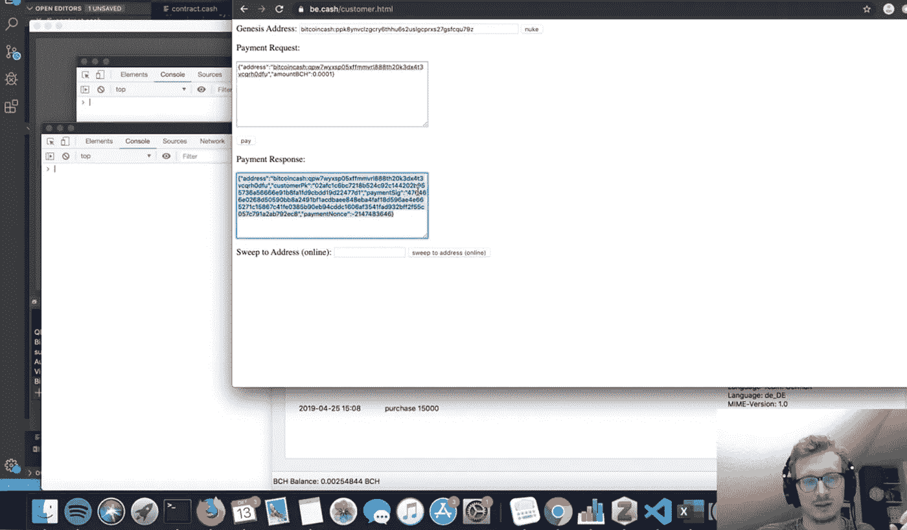

# Be.cash:比特币现金交易离线签约工具

> 原文：<https://medium.com/coinmonks/guide-be-cash-a-tool-for-signing-bitcoin-cash-transactions-offline-70467435ff53?source=collection_archive---------2----------------------->

## Be.cash 是比特币现金开发者 Tobias Ruck 开发的新工具。它为用户提供了离线签署比特币现金交易的能力，无需互联网服务。

能够离线签名和发送交易一直很困难，开发人员已经引入了不同的方法来实现这一目标，例如通过卫星或 SMS 消息发送加密。10 月 13 日，软件开发商 Tobias Ruck 推出了另一种离线签署和发送 BCH 交易的方式，名为 Be.cash

Ruck 在 Youtube 上制作了一个 10 分钟的视频，从商家和顾客两方面解释了 Be.cash 的工作原理。他创建了一个离线钱包，发送者不需要在线就可以创建交易。他在视频中一步一步地解释了整个过程。

Be.cash 由两页组成:一页给[商户](https://be.cash/merchant.html)，另一页给[客户](https://be.cash/customer.html)。

商家需要在**商家地址**字段输入自己的地址，点击 Ruck 的工具的商家页面上的**设置地址**。

**支付金额**字段需要设置为客户支付的金额。完成后，商家点击**发出请求**。

这将创建一个客户需要复制的付款请求。需要在 Be.cash 的客户页面的**付款申请**字段中输入复制的申请。点击**支付**按钮签署交易，即使客户地址为空。

*使用 Be.cash，可以从尚未获得资金的地址签署和创建交易。用户将能够创建交易，即使他的钱包里没有所需的金额。*

点击支付按钮后，该工具创建一个**支付响应**。创建的代码需要被发送回商家，最好是以 QR 码的形式。商家扫描代码或在 Be.cash 的商家页面上的**支付响应**字段中输入代码

点击**兑现**将交易从客户发送到商家。交易发送后，地址上的任何更改都会返回给客户。据开发人员称，这将由应用程序的智能合约来确保。智能合约还确保硬币只能兑换一次。

在他的演示视频中，Tobias Ruck 从一个空钱包中签署了一项交易。然后，他将所需资金存入钱包并确认交易。资金被发送到商家的钱包，减去由广播交易的人支付的交易费。

Be.cash 在社交媒体和在线论坛上获得了积极的回应。Cointext 首席技术官 Vin Armani 对这款新应用的评价如下:

> “如果你能让微处理器智能卡做到这一点，并通过 NFC 或芯片与销售点进行交互，你就拥有了一家十亿美元的公司”。

合同:[https://docs . Google . com/spreadsheets/d/1 gehk 9 w 94j 1 gie w2o-hhxhszbdggvqxlc 9 udotchmruc/edit # GID = 522143879](https://docs.google.com/spreadsheets/d/1gEHk9W94j1gIeW2O-hHxhszBdGgvQXlC9udotCHmRUc/edit#gid=522143879)

[代码库](https://github.com/slpdex/becash)

[商家页面](https://be.cash/merchant.html)

[客户页面](https://be.cash/customer.html)

来源:

1.  [https://news . bitcoin . com/meet-be-cash-an-offline-bit coin-cash-sending-tool/](https://news.bitcoin.com/meet-be-cash-an-offline-bitcoin-cash-sending-tool/)
2.  [https://www.youtube.com/watch?v=0qKhrOAfKlQ&feature = youtu . be](https://www.youtube.com/watch?v=0qKhrOAfKlQ&feature=youtu.be)

> [直接在您的收件箱中获得最佳软件交易](https://coincodecap.com/?utm_source=coinmonks)

