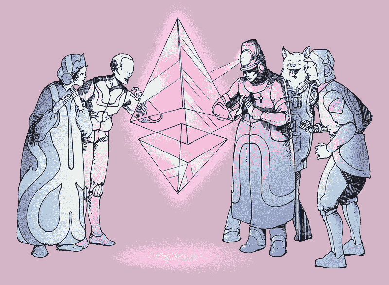

# 使用 Javascript 和 Solidity 创建自己的 NFT 指南-更新后包括视频指南-👾(第二部分，共三部分)

> 原文：<https://medium.com/coinmonks/guide-to-creating-your-own-nft-with-javascript-solidity-part-2-of-3-ceaa1cb2412a?source=collection_archive---------0----------------------->



在第 1 部分 [**【链接】**](https://garygeorge84.medium.com/guide-to-creating-your-own-nft-with-javascript-solidity-part-1-of-3-7909b80fae94) 中，我们介绍了 NFTs 的核心概念以及如何创建自己的合同，现在是时候与您的新合同互动了。

# 与您的合同互动💻

一旦你的合同已经部署，你将需要一些与它互动的方式(如果你需要帮助部署，记得查看 [**【本】**](https://www.youtube.com/watch?v=CgXQC4dbGUE&t=78s&ab_channel=DappUniversity) 视频)。

要进行互动，你需要将你的网站连接到区块链，这并不像听起来那么可怕。要连接你的网站，你需要使用一个名为[**【WEB3JS】**](https://web3js.readthedocs.io/en/v1.5.2/)**的库。**

你现在应该知道，一旦你成功地用[**【Truffle】**](https://www.trufflesuite.com/)编译并迁移了你的合同，你就会有一个 JSON 格式的 ABI 文件。

您将使用 abi.json 文件连接到您的合同，abi 文件包含有关您的合同的每一条信息，其中一条重要信息是它在区块链的地址。

如果不知道地址，就无法进行交互。

# Web3 JS

下面是一个现成的例子，从一个基于 React 的网站使用[**【web 3】**](https://web3js.readthedocs.io/en/v1.5.2/)**连接到您的合同。(再一次如果你感觉真的迷失了参考[](https://www.youtube.com/watch?v=CgXQC4dbGUE&t=78s&ab_channel=DappUniversity)**视频)。****

****我喜欢将[**【web 3 mode】**](https://www.npmjs.com/package/web3modal)与 Web3 JS 结合使用，这使我们能够轻松地将用户的钱包连接到我们的网站。****

*   ****下面是一个使用钩子的 React 项目的代码片段。****
*   ****我已经在重要的地方注释了代码****

```
**import React, { useEffect} from "react";
import Web3 from "web3";
import Web3Modal from "web3modal";
import Contract from "../truffle/abis/NFT.json";const loadWeb3 = async()=>{ //THIS ALLOWS YOU TALK TO BLOCKCHAIN
  const web3Modal = new Web3Modal({
    network: "mainnet", *// optional* cacheProvider: true, *// optional* providerOptions: {}, *// required* });
  const provider = await web3Modal.connect();
  const web3 = new Web3(provider);
  const netId = await web3.eth.net.getId(); //THIS WILL LOAD YOUR CONTRACT FROM BLOCKCHAIN
  const contract = new web3.eth.Contract(
    Contract.abi,
    Contract.networks[netId].address
  ); // FROM HERE YOU CAN NOW QUERY YOUR CONTRACT FOR DATA
  // HERE ARE A FEW EXAMPLES // THE TOKEN ID YOU WANT TO QUERY
  const tokenID = 1; // GET THE AMOUNT OF NFTs MINTED 
  const totalSupply = await contract.methods.totalSupply().call(); // GET THE TOKEN URI
  // THE URI IS THE LINK TO WHERE YOUR JSON DATA LIVES
  const uri = await contract.methods.tokenURI(tokenID).call(); // GET THE OWNER OF A SPECIFIC TOKEN
  const owner = await contract.methods.ownerOf(tokenID).call(); // CHECK IF A SPECIFIC TOKEN IS SOLD
  const sold = await contract.methods.sold(tokenID).call(); // GET PRICE OF A SPECIFIC TOKEN
  const price = await contract.methods.price(tokenID).call();}const ExampleComponent = ()=>{useEffect(()=>{
    loadWeb3();
},[])return (<p>My component</p>)}export default ExampleComponent**
```

# ****IPFS？****

****“IPFS 是一个点对点(p2p)存储网络。内容可以通过位于世界任何地方的对等点访问，对等点可以传递信息、存储信息或两者兼而有之。IPFS 知道如何使用内容地址而不是位置找到你要的东西。”****

****好了，现在你有了与合同交互的代码👆，但目前您没有铸造任何代币，或任何准备铸造的物品。****

****当我想向 ipfs 添加项目时，我喜欢使用[**【ipfs-http-client】**](https://www.npmjs.com/package/ipfs-http-client)，它使用起来非常简单。****

****成功添加一个项目到 IPFS 后，它会返回一个 CID，这个 CID 是你唯一的散列，允许你在 IPFS 上找到你的图片。您可以选择固定您的 CIDs，这将阻止您的上传被垃圾收集并从 IPFS 删除****

****NFTs 的最佳实践是:****

*   ****将您的图像添加到 IPFS****
*   ****创建一个基本的 JSON 文件，其中至少包含 3 个键(名称、描述、图像)****
*   ****图像密钥将是您添加到 IPFS 的项目的完整 URL****
*   ****将您的元数据文件添加到 IPFS****
*   ****固定图像和元数据上传的 cid****
*   ****创建元数据文件的路径(一个常见的误解是创建图像文件路径)****

# ****什么是铸币？****

****“铸造基本上是指将数字艺术转化为以太坊区块链的一部分作为公共账本的**过程。… NFTs 确保您的数字作品的再现。同时也保证了艺术品可以在市场上灵活交易或购买。”******

****您必须铸造您的 NFT，以便能够出售/转让所有权。****

****有关铸造的更多信息，请参见 [**【此处】**](https://101blockchains.com/nft-minting/) 。****

# ****元数据文件📝****

****如上所述，铸造是一个 3 步的过程****

****1-你上传你的图片到 IPFS****

****2-创建一个元数据 JSON 文件并上传到 IPFS****

****3-您锁定了为其中每一个返回的 CID****

****我说过你的元数据文件将包含 3 个密钥，但它实际上可以是你喜欢的那样多，但是你必须有 3 个必需的密钥。****

****这里是一个真实世界有效的元数据文件的例子，我已经在多边形 Mainnet 区块链 NFT 合同。****

```
**{
  "name":"Stupid Schaefer",
  "description":"number 1 of the series 1 low collection",       "image":"https://ipfs.infura.io/ipfs/QmPAMRJhbEKSjf6dwM65wqWmw5Jtmwi4jCS5Y78TUZ7YPW",
  "uid":"0-4-5-29-25-29-59-59-64-86-194-48",
  "timestamp":1629664820425
}**
```

****正如你在上面看到的，我有名字，描述和图片，但是我也有 uid 和时间戳。****

****理解这三个必要关键字的功能很重要，所以这里有一个分解。****

****1- **名称**:这是您的唯一令牌将在[**【Opensea】**](https://opensea.io/)等地方显示的名称****

****2- **描述**:该描述将在[**【Opensea】**](https://opensea.io/)等地方显示给你的唯一令牌****

****3- **图像**:该图像将允许您的代币图像显示在用户的钱包中和诸如 [**【远海】**](https://opensea.io/) 的地方****

****添加的任何更多的键都可以用于您自己的目的，您可以添加的键数量没有限制。****

# ****免费视频[代码演练]****

****我已经录制了一个视频走过样板代码[【链接】](https://www.youtube.com/watch?v=F0xD1DK3pe4&ab_channel=G)。我真的希望这能帮助其他希望进入区块链开发的开发者。****

# ****Crypto Ghoulz****

****为了研究这个话题，我在 polygon network 上创建了自己的区块链网站，允许用户购买 NFT，检查一下，如果你感觉辣，就购买我的 NFT。[https://cryptoghoulz.com](https://cryptoghoulz.com/)。****

****如果您对 Crypto Ghoulz 有任何疑问，请通过 twitter 联系。****

# ****项目代码****

****如果你想在这方面开始你可以找到一个锅炉板回购 [**【这里】**](https://github.com/gary-george/nft-react-boilerplate) 。****

****这是一个很好的项目，可以帮助你真正感受到一切是如何工作的。****

# ****链接****

******视频指南:**[https://youtu.be/F0xD1DK3pe4](https://youtu.be/F0xD1DK3pe4)****

******样板:**https://github.com/gary-george/nft-react-boilerplate****

******Crypto Ghoulz:**https://cryptoghoulz.com/****

******博文:******

******第 1 部分，共 3 部分:**[https://medium . com/coin monks/guide-to-creating-your-own-NFT-with-JavaScript-solidity-Part-1-of-3-7909 b 80 FAE 94](/coinmonks/guide-to-creating-your-own-nft-with-javascript-solidity-part-1-of-3-7909b80fae94)****

******第 2 部分，共 3 部分:**[https://medium . com/coin monks/guide-to-creating-your-own-NFT-with-JavaScript-solidity-Part-2-of-3-CEA a1 CB 2412 a](/coinmonks/guide-to-creating-your-own-nft-with-javascript-solidity-part-2-of-3-ceaa1cb2412a)****

******第 3 部分，共 3 部分:**[https://medium . com/coin monks/guide-to-creating-your-own-NFT-with-JavaScript-solidity-Part-3-of-3-6 da E8 da 7 e3f](/coinmonks/guide-to-creating-your-own-nft-with-javascript-solidity-part-3-of-3-6dae8da7e3f)****

# ****接下来是什么？****

****在第 3 部分中，我们将铸造我们的 NFT，购买它并验证所有权。点击 [**【此处】**](/coinmonks/guide-to-creating-your-own-nft-with-javascript-solidity-part-3-of-3-6dae8da7e3f) 查看第三部分。****

> ****加入 [Coinmonks 电报频道](https://t.me/coincodecap)，了解加密交易和投资。****

******同样，阅读******

*   ****[尤霍德勒 vs 科恩洛 vs 霍德诺特](/coinmonks/youhodler-vs-coinloan-vs-hodlnaut-b1050acde55a) | [Cryptohopper vs 哈斯博特](https://blog.coincodecap.com/cryptohopper-vs-haasbot)****
*   ****[币安 vs 北海巨妖](https://blog.coincodecap.com/binance-vs-kraken) | [美元成本平均交易机器人](https://blog.coincodecap.com/pionex-dca-bot)****
*   ****[如何在印度购买比特币？](/coinmonks/buy-bitcoin-in-india-feb50ddfef94) | [WazirX 评论](/coinmonks/wazirx-review-5c811b074f5b) | [BitMEX 评论](https://blog.coincodecap.com/bitmex-review)****
*   ****[比特币主根](https://blog.coincodecap.com/bitcoin-taproot) | [Bitso 点评](https://blog.coincodecap.com/bitso-review) | [排名前 6 的比特币信用卡](/coinmonks/bitcoin-credit-card-bc8ab6f377c6)****
*   ****[双子座 vs 比特币基地](https://blog.coincodecap.com/gemini-vs-coinbase) | [比特币基地 vs 北海巨妖](https://blog.coincodecap.com/kraken-vs-coinbase)|[coin jar vs coin spot](https://blog.coincodecap.com/coinspot-vs-coinjar)****
*   ****[印度加密交易所](/coinmonks/bitcoin-exchange-in-india-7f1fe79715c9) | [比特币储蓄账户](/coinmonks/bitcoin-savings-account-e65b13f92451) | [Paxful 审核](/coinmonks/paxful-review-4daf2354ab70)****
*   ****[杠杆令牌](/coinmonks/leveraged-token-3f5257808b22) | [最佳加密交易所](/coinmonks/crypto-exchange-dd2f9d6f3769) | [AscendEX 评论](/coinmonks/ascendex-review-53e829cf75fa)****
*   ****[Godex.io 审核](/coinmonks/godex-io-review-7366086519fb) | [邀请审核](/coinmonks/invity-review-70f3030c0502) | [BitForex 审核](https://blog.coincodecap.com/bitforex-review) | [HitBTC 审核](/coinmonks/hitbtc-review-c5143c5d53c2)****
*   ****[Crypto.com 费用](/coinmonks/binance-fees-8588ec17965) | [僵尸加密审查](/coinmonks/botcrypto-review-2021-build-your-own-trading-bot-coincodecap-6b8332d736c7) | [替代品](https://blog.coincodecap.com/crypto-com-alternatives)****
*   ****[有哪些交易信号？](https://blog.coincodecap.com/trading-signal) | [比特斯坦普 vs 比特币基地](https://blog.coincodecap.com/bitstamp-coinbase)****
*   ****[ProfitFarmers 点评](https://blog.coincodecap.com/profitfarmers-review) | [如何使用 Cornix 交易机器人](https://blog.coincodecap.com/cornix-trading-bot)****
*   ****[MXC 交易所评论](/coinmonks/mxc-exchange-review-3af0ec1cba8c) | [Pionex vs 币安](https://blog.coincodecap.com/pionex-vs-binance) | [Pionex 套利机器人](https://blog.coincodecap.com/pionex-arbitrage-bot)****
*   ****[我的密码交易经验](/coinmonks/my-experience-with-crypto-copy-trading-d6feb2ce3ac5) | [《比特币基地评论》](/coinmonks/coinbase-review-6ef4e0f56064)****
*   ****[CoinFLEX 评论](https://blog.coincodecap.com/coinflex-review) | [AEX 交易所评论](https://blog.coincodecap.com/aex-exchange-review) | [UPbit 评论](https://blog.coincodecap.com/upbit-review)****
*   ****[AscendEx 保证金交易](https://blog.coincodecap.com/ascendex-margin-trading) | [Bitfinex 赌注](https://blog.coincodecap.com/bitfinex-staking) | [bitFlyer 点评](https://blog.coincodecap.com/bitflyer-review)****
*   ****[麻雀交换评论](https://blog.coincodecap.com/sparrow-exchange-review) | [纳什交换评论](https://blog.coincodecap.com/nash-exchange-review)****