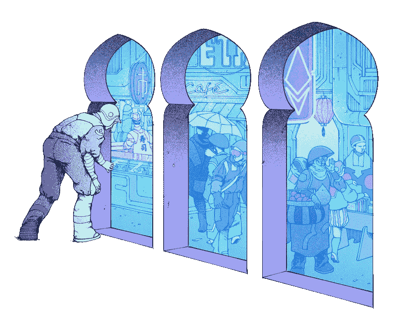

# 使用 Javascript 和 Solidity 创建自己的 NFT 指南-更新后包括视频指南-🌎(第 3 部分，共 3 部分)

> 原文：<https://medium.com/coinmonks/guide-to-creating-your-own-nft-with-javascript-solidity-part-3-of-3-6dae8da7e3f?source=collection_archive---------1----------------------->



在第 2 部分 [**【链接】**](https://garygeorge84.medium.com/guide-to-creating-your-own-nft-with-javascript-solidity-part-2-of-3-ceaa1cb2412a) 中，我们与合同进行了交互，并准备好了要铸造的内容，在这里我们将完成流程并铸造一个 NFT。

# 什么是煤气费？

“燃气费是用户支付的**费用，用于补偿处理和验证以太坊区块链**上的交易所需的计算能量。…更高的气体限制意味着您必须做更多的工作来执行使用 ETH 或智能合同的交易。”

基本上你在区块链做的每一笔交易都是有成本的，成本各不相同，但这是我遇到的一个真实的例子。

我在以太坊主网上铸造 1000 NFTs 的价格将花费我相当于 **3000，**我立刻知道这超出了我对一个简单宠物项目的预算，所以我看了看更远的领域。

现在这已经超出了本文的范围，但是我决定在 Polygon Mainnet 上创建我的 NFT(见 [**【这里】**](https://polygon.technology/) )。我在 Polygon 上铸造所有 NFT 的最终价格是 0.30 英镑，实际上是 30 便士！🚀

所以在做这样的任务时要小心，总是先在[**【test nets】**](https://docs.ethhub.io/using-ethereum/test-networks/)**上做实验。**

# **铸造你的内容**

**好了，你已经设置好了，前端网站已经连接到你的合同，你的资产已经创建并锁定到 IPFS。是时候打造你的 NFT 了。**

**您需要创建一个脚本，然后使用[**【TRUFFLE CLI】**](https://www.trufflesuite.com/docs/truffle/reference/truffle-commands)运行该脚本，下面是我从命令行运行我的 minting 脚本时使用的命令:**

```
truffle exec src/utils/mint.js --network polygon
```

**flag-network polygon 指向我添加到 truffle-config.js 中的多边形网络的网络详细信息。**

**它看起来会像这样:**

```
...polygon: { provider: () => new HDWalletProvider( privateKeys.split(","), `https://polygon-mainnet.infura.io/v3/${process.env.INFURA_PROJECT_ID}`), network_id: 137, confirmations: 2, timeoutBlocks: 200, skipDryRun: true, chainId: 137,},
... 
```

**您需要注册[**【INFURA】**](https://infura.io/)或类似的网站，以便在您想要的网络上获得以太坊节点的**项目 ID** 。**

**下面是一个有效的 mint 脚本示例，您可以从上面的命令调用它:**

```
//THIS IS THE PATH TO YOUR ABI FILE
const NFT = artifacts.require("NFT");module.exports = *async* function (callback) { // THIS IS CHECKING THAT THE SCRIPT CAN FIND YOUR CONTRACT
   const nft = await NFT.deployed(); //THIS WILL MINT AN NFT
   try { await nft.mint(PATH_TO_UR_METADATA_FILE_ON_IPFS); } catch (e) { console.log("failed", e); }}
```

**哇！，这有多简单🦄。**

# **购买 NFT**

**您网站的用户要购买 NFT，首先必须连接他们的钱包，其次他们必须在正确的网络上。**

**如果他们所在的网络没有部署您的合同，他们将会收到一条错误消息。**

**下面的代码片段是 javascript 中的一个函数调用示例，它可以促进令牌所有权的转移(购买 NFT)。**

```
const buyNFT = *async* (account, contract, showModal) => { //THE TOKEN ID TO PURCHASE
  const tokenID = 1;
  const accountAddress = THE_USERS_WALLET_ADDRESS; // ONE THING TO NOTE THE PRICE WILL BE IN WEI 
  // -> 18 DECIMAL PLACES
  // THE BELOW WORKS OUT AT 0.021 Eth
  const price = 21000000000000000; //THE ACTUAL CALL TO THE CONTRACT FOR PURCHASE await contract.methods
  .buy(id)
  .send({ from: accountAddress, value: price })
  .on("receipt", *async* () => {
     console.log(`You've received the NFT with ID: ${id}`);
  }
  .on("error", (error) => {
     console.log(`error in purchase- ${error}`);
  }}
```

# **验证 NFT 所有权**

**太好了，我们到了最后一关。**

**如何验证 NFT 的所有权？事实上我们已经讨论过了。**

**看看我在[**【part 2】**](https://garygeorge84.medium.com/guide-to-creating-your-own-nft-with-javascript-solidity-part-2-of-3-ceaa1cb2412a)分享的代码片段。您需要关注的功能是:**

```
const owner = await contract.methods.ownerOf(tokenID).call();
```

**上面的函数将在区块链的契约上运行，并返回所有者的钱包地址。**

**无论是否被购买，所有的 NFT 都有一个所有者，最初的所有者是合同地址，一旦购买，所有者就被转移到用户的钱包地址。**

# **免费视频[代码演练]**

**我已经录制了一个视频走过样板代码[【链接】](https://www.youtube.com/watch?v=F0xD1DK3pe4&ab_channel=G)。我真的希望这能帮助其他希望进入区块链开发的开发者。**

# **Crypto Ghoulz**

**为了研究这个话题，我在 polygon network 上创建了自己的区块链网站，允许用户购买 NFT，检查一下，如果你感觉辣，就购买我的 NFT。[https://cryptoghoulz.com](https://cryptoghoulz.com)。**

**如果你有任何关于 **Crypto Ghoulz** 的问题，请通过 twitter 联系。**

# **项目代码**

**如果你想在这方面开始你可以找到一个锅炉板回购 [**【这里】**](https://github.com/gary-george/nft-react-boilerplate) 。**

**这是一个很好的项目，可以帮助你真正感受到一切是如何工作的。**

# **链接**

****视频指南:**[https://youtu.be/F0xD1DK3pe4](https://youtu.be/F0xD1DK3pe4)**

****样板:**https://github.com/gary-george/nft-react-boilerplate**

****Crypto Ghoulz:**https://cryptoghoulz.com/**

****博文:****

****第 1 部分，共 3 部分:**[https://medium . com/coin monks/guide-to-creating-your-own-NFT-with-JavaScript-solidity-Part-1-of-3-7909 b 80 FAE 94](/coinmonks/guide-to-creating-your-own-nft-with-javascript-solidity-part-1-of-3-7909b80fae94)**

****第 2 部分，共 3 部分:**[https://medium . com/coin monks/guide-to-creating-your-own-NFT-with-JavaScript-solidity-Part-2-of-3-CEA a1 CB 2412 a](/coinmonks/guide-to-creating-your-own-nft-with-javascript-solidity-part-2-of-3-ceaa1cb2412a)**

****第三部分，共三部分:**[https://medium . com/coin monks/guide-to-creating-your-own-NFT-with-JavaScript-solidity-Part-3-of-3-6 da E8 da 7 E3 f](/coinmonks/guide-to-creating-your-own-nft-with-javascript-solidity-part-3-of-3-6dae8da7e3f)**

# **摘要**

**在这个帖子集中，我们已经经历了创建你自己的合同，铸造和购买的整个过程。我希望这有助于澄清你对神秘的 NFT 世界的一些疑问。**

> **加入 [Coinmonks 电报频道](https://t.me/coincodecap)，了解加密交易和投资。**

****同样，阅读****

*   **[尤霍德勒 vs 科恩洛 vs 霍德诺特](/coinmonks/youhodler-vs-coinloan-vs-hodlnaut-b1050acde55a) | [Cryptohopper vs 哈斯博特](https://blog.coincodecap.com/cryptohopper-vs-haasbot)**
*   **[币安 vs 北海巨妖](https://blog.coincodecap.com/binance-vs-kraken) | [美元成本平均交易机器人](https://blog.coincodecap.com/pionex-dca-bot)**
*   **[如何在印度购买比特币？](/coinmonks/buy-bitcoin-in-india-feb50ddfef94) | [WazirX 评论](/coinmonks/wazirx-review-5c811b074f5b) | [BitMEX 评论](https://blog.coincodecap.com/bitmex-review)**
*   **[比特币主根](https://blog.coincodecap.com/bitcoin-taproot) | [Bitso 点评](https://blog.coincodecap.com/bitso-review) | [排名前 6 的比特币信用卡](/coinmonks/bitcoin-credit-card-bc8ab6f377c6)**
*   **[双子座 vs 比特币基地](https://blog.coincodecap.com/gemini-vs-coinbase) | [比特币基地 vs 北海巨妖](https://blog.coincodecap.com/kraken-vs-coinbase)|[coin jar vs coin spot](https://blog.coincodecap.com/coinspot-vs-coinjar)**
*   **[印度密码交易所](/coinmonks/bitcoin-exchange-in-india-7f1fe79715c9) | [比特币储蓄账户](/coinmonks/bitcoin-savings-account-e65b13f92451) | [Paxful 审核](/coinmonks/paxful-review-4daf2354ab70)**
*   **[杠杆令牌](/coinmonks/leveraged-token-3f5257808b22) | [最佳加密交易所](/coinmonks/crypto-exchange-dd2f9d6f3769) | [AscendEX 评论](/coinmonks/ascendex-review-53e829cf75fa)**
*   **[Godex.io 审核](/coinmonks/godex-io-review-7366086519fb) | [邀请审核](/coinmonks/invity-review-70f3030c0502) | [BitForex 审核](https://blog.coincodecap.com/bitforex-review) | [HitBTC 审核](/coinmonks/hitbtc-review-c5143c5d53c2)**
*   **[Crypto.com 费用](/coinmonks/binance-fees-8588ec17965) | [僵尸密码审查](/coinmonks/botcrypto-review-2021-build-your-own-trading-bot-coincodecap-6b8332d736c7) | [替代品](https://blog.coincodecap.com/crypto-com-alternatives)**
*   **[有哪些交易信号？](https://blog.coincodecap.com/trading-signal) | [比特斯坦普 vs 比特币基地](https://blog.coincodecap.com/bitstamp-coinbase)**
*   **[ProfitFarmers 回顾](https://blog.coincodecap.com/profitfarmers-review) | [如何使用 Cornix Trading Bot](https://blog.coincodecap.com/cornix-trading-bot)**
*   **[MXC 交易所评论](/coinmonks/mxc-exchange-review-3af0ec1cba8c) | [Pionex vs 币安](https://blog.coincodecap.com/pionex-vs-binance) | [Pionex 套利机器人](https://blog.coincodecap.com/pionex-arbitrage-bot)**
*   **[我的密码交易经验](/coinmonks/my-experience-with-crypto-copy-trading-d6feb2ce3ac5) | [比特币基地评论](/coinmonks/coinbase-review-6ef4e0f56064)**
*   **[CoinFLEX 评论](https://blog.coincodecap.com/coinflex-review) | [AEX 交易所评论](https://blog.coincodecap.com/aex-exchange-review) | [UPbit 评论](https://blog.coincodecap.com/upbit-review)**
*   **[AscendEx 保证金交易](https://blog.coincodecap.com/ascendex-margin-trading) | [Bitfinex 赌注](https://blog.coincodecap.com/bitfinex-staking) | [bitFlyer 评论](https://blog.coincodecap.com/bitflyer-review)**
*   **[麻雀交换评论](https://blog.coincodecap.com/sparrow-exchange-review) | [纳什交换评论](https://blog.coincodecap.com/nash-exchange-review)**
*   **[加密货币储蓄账户](/coinmonks/cryptocurrency-savings-accounts-be3bc0feffbf) | [赌注加密](https://blog.coincodecap.com/staking-crypto)**
*   **[BigONE 交易所评论](/coinmonks/bigone-exchange-review-64705d85a1d4) | [CEX。IO 审查](https://blog.coincodecap.com/cex-io-review) | [交换区审查](/coinmonks/swapzone-review-crypto-exchange-data-aggregator-e0ad78e55ed7)**
*   **[最佳比特币保证金交易](/coinmonks/bitcoin-margin-trading-exchange-bcbfcbf7b8e3) | [比特币保证金交易](https://blog.coincodecap.com/bityard-margin-trading)**
*   **[加密保证金交易交易所](/coinmonks/crypto-margin-trading-exchanges-428b1f7ad108) | [赚取比特币](/coinmonks/earn-bitcoin-6e8bd3c592d9) | [Mudrex 投资](https://blog.coincodecap.com/mudrex-invest-review-the-best-way-to-invest-in-crypto)**