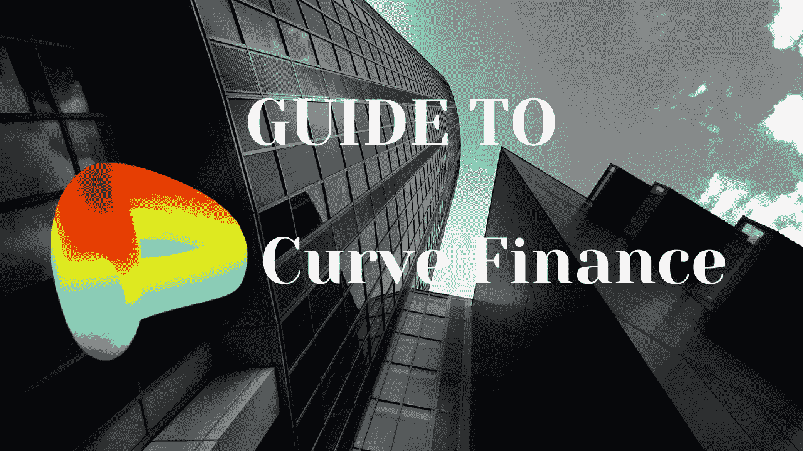

# 曲线金融指南

> 原文：<https://medium.com/coinmonks/guide-to-curve-finance-153f34ce693f?source=collection_archive---------2----------------------->

## 曲线金融是以太坊区块链之上最流行、应用最广泛的去中心化交易所(或 DEX)之一。

Curve 于 2020 年 1 月推出，已迅速成为 DeFi 动态中的核心协议之一，为用户提供了从所持有的加密货币中赚取丰厚回报的能力。定义为流动性聚集者…