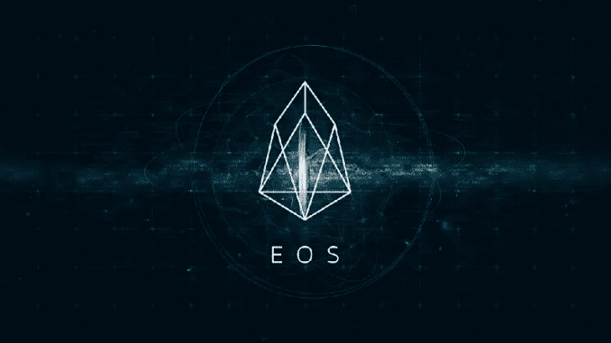
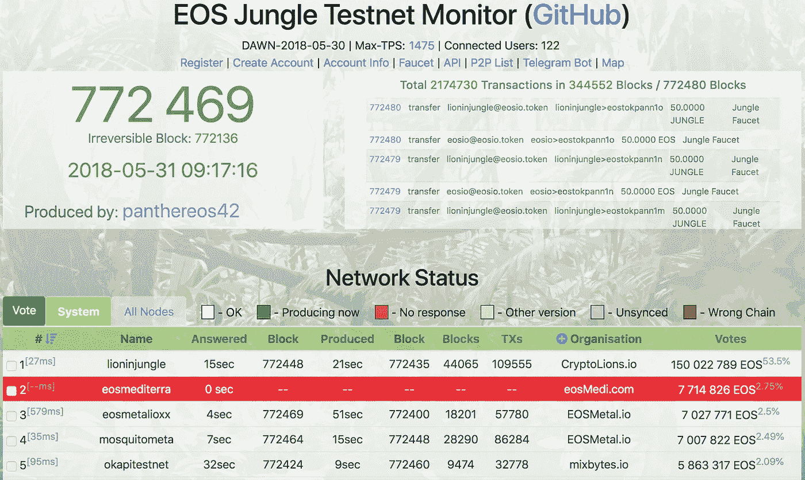
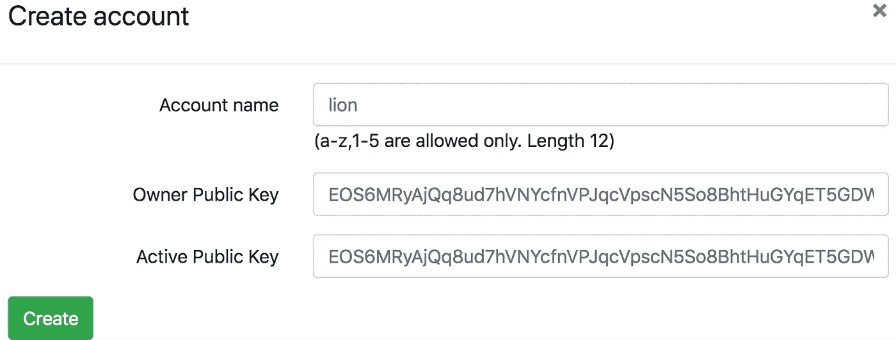
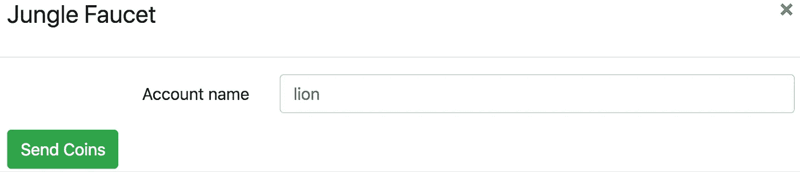
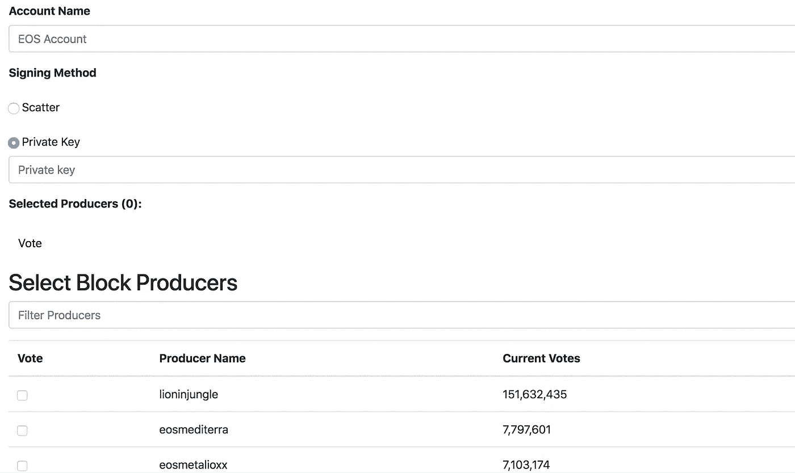

# EOS 投票模拟指南

> 原文：<https://medium.com/coinmonks/guide-to-eos-voting-simulation-4eb7a85bab44?source=collection_archive---------3----------------------->



[source](https://cryptocurrencynews.com/daily-news/eos-news/eosio-1-0-upcoming-eos-launch/)

EOS mainnet 将在几天后推出。您可能想知道投票是如何进行的，以及其背后的机制是什么。在这里，我们将为您介绍几种模拟投票过程的方法，您可以通过设置自己的测试网或在丛林测试网上进行模拟。

*注意:我们将在接下来的几天里为 EOS mainnet 上的用户发布一个更简单的投票指南。*

# 启动您自己的投票模拟链

**1。启动第一个节点**

本教程基于 4.2.0 版，其中一个节点用于 bios，两个节点作为块生产者。首先启动 bios 节点:

```
$ nodeos -e -p eosio --genesis-json path/to/genesis.json --plugin eosio::producer_plugin --plugin eosio::chain_api_plugin
```

**2。将** `**eosio.bios**` **合同部署到** `**eosio**` **账户。**

```
$ cleos set contract eosio build/contracts/eosio.bios
```

**3。创建** `**eosio.token**` **账户并设置** `**eosio.token**` **合同**

```
$ cleos create account eosio eosio.token EOS6sAgFvNDfiZ62UMosK7WULNVCuAotpR2raKzaBpopLevvYYWBo EOS6sAgFvNDfiZ62UMosK7WULNVCuAotpR2raKzaBpopLevvYYWBo$ cleos set contract eosio.token eos/build/contracts/eosio.token
```

**4。创建** `**eosio.msig**` **账户并设置** `**eosio.msig**` **合同**

```
$ cleos create account eosio eosio.msig EOS6sAgFvNDfiZ62UMosK7WULNVCuAotpR2raKzaBpopLevvYYWBo EOS6sAgFvNDfiZ62UMosK7WULNVCuAotpR2raKzaBpopLevvYYWBo$ cleos set contract eosio.msig eos/build/contracts/eosio.msig
```

**5。** **创建和分配令牌**

我们创造并发行了 1，000，000，000.0000 代币，并将其命名为“SYS”。然后发放到`eosio`账户。

```
$ cleos push action eosio.token create '{"issuer":"eosio", "maximum_supply": "1000000000.0000 SYS", "can_freeze": 0, "can_recall": 0, "can_whitelist": 0}' -p eosio.token$ cleos push action eosio.token issue '{"to":"eosio","quantity":"1000000000.0000 SYS","memo":"issue"}' -p eosio
```

检查余额和统计数据

```
$ cleos get currency balance eosio.token eosio$ cleos get currency stats eosio.token 'SYS'
```

**6。** **将** `**eosio.system**` **合同设置为** `**eosio**`

设置`eosio.system`合同后，我们就可以下注我们的账户了。

```
$ cleos set contract eosio eos/build/contracts/eosio.system
```

然后下注代币，扩大网络。`cleos`在账户创建上投入 8 KB 内存，由账户创建者支付。

**7** 。**为 BPs 创建账户:** `**bp1111111111**` **和** `**bp2222222222**`

对于帐户名，我们需要从 a-Z1–5 中选择 12 个字符。

```
$ cleos system newaccount eosio bp1111111111 EOS6sAgFvNDfiZ62UMosK7WULNVCuAotpR2raKzaBpopLevvYYWBo EOS6sAgFvNDfiZ62UMosK7WULNVCuAotpR2raKzaBpopLevvYYWBo --buy-ram-EOS '1000000.0000 SYS' --stake-net '1000000.0000 SYS' --stake-cpu '1000000.0000 SYS'
```

**8。寄存器 BPs**

```
$ cleos system regproducer bp1111111111 EOS6sAgFvNDfiZ62UMosK7WULNVCuAotpR2raKzaBpopLevvYYWBo
```

类似地记录`bp2222222222`。要检查生产者:

```
$ cleos system listproducers
```

要启动两个生产者节点:

```
$ nodeos -e --genesis-json path/to/genesis.json --producer-name bp1111111111 --private-key '[ "EOS6sAgFvNDfiZ62UMosK7WULNVCuAotpR2raKzaBpopLevvYYWBo","5K7EY...Hi8Uy61wU1o" ]' --http-server-address 127.0.0.1:8889 --p2plisten-endpoint 127.0.0.1:9877 --p2p-peer-address bios_node_ip:port --plugin eosio::producer_plugin --plugin eosio::chain_api_plugin --plugin eosio::net_api_plugin
```

**9。创建选民账户:**`**voter1111111**`**`**voter2222222**`**`**voter3333333**`****

```
**$ cleos system newaccount eosio voter1111111 EOS6sAgFvNDfiZ62UMosK7WULNVCuAotpR2raKzaBpopLevvYYWBo EOS6sAgFvNDfiZ62UMosK7WULNVCuAotpR2raKzaBpopLevvYYWBo --buy-ram-EOS '50.0000 SYS' --stake-net '50.0000 SYS' --stake-cpu '50.0000 SYS'**
```

******10。** **向选民发放代币******

****给每个选民转 100，000，000 SYS。****

```
**$ cleos push action eosio.token transfer '["eosio", "voter1111111","100000000.0000 SYS","vote"]' -p eosio**
```

****检查余额****

```
**$ cleos get currency balance eosio.token voter1111111**
```

******11。代表带宽******

```
**$ cleos system delegatebw voter1111111 voter1111111 "50000000.0000 SYS" "50000000.0000 SYS" --transfer**
```

******12。投票******

****当帐户被标桩和生产者被注册时，生产者的投票可以开始。****

```
**$ cleos system voteproducer prods voter1111111 bp1111111111 bp2222222222**
```

****在 15%的可用票数被投票后，砌块生产商将开始生产。在这种情况下，我们需要 1.5 亿张选票。****

*   ******查票:******

```
**$ cleos system listproducers $ cleos get table eosio eosio voters**
```

# ****丛林测试网投票模拟****

****如果我没那么懂技术呢？看看社区开发的一些工具。****

****[http://vote.libertyblock.io/](http://vote.libertyblock.io/)是一个链接到[丛林测试网](http://dev.cryptolions.io/#home)的投票模拟。****

********

****首先我们需要创建账户，去[http://dev.cryptolions.io/#account](http://dev.cryptolions.io/#account)。****

********

****要获得测试 EOS 令牌，请前往[http://dev.cryptolions.io/#faucet](http://dev.cryptolions.io/#faucet)****

********

****成功后，您就可以对[自由块](http://vote.libertyblock.io/)进行投票了****

********

****另一个工具是 eoscanada 开发的`[eosc](https://github.com/eoscanada/eosc.)`。这是一个简单的投票命令行界面。看看[这个工具](https://github.com/eoscanada/eosc)。****

****嘿伙计们，****

****请关注我们，获取更多关于 EOSIO 生态系统的内容丰富的文章。****