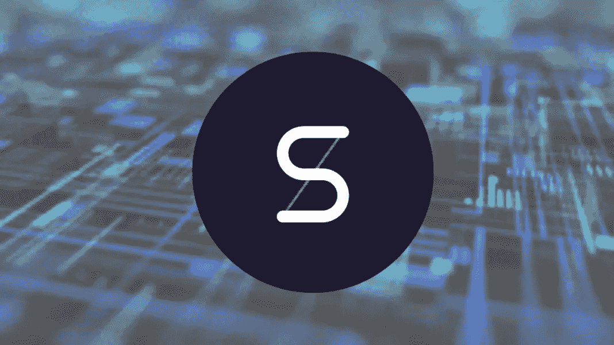

# 合成指南:区块链的衍生物

> 原文：<https://medium.com/coinmonks/guide-to-synthetix-derivatives-on-the-blockchain-841686dbc96c?source=collection_archive---------2----------------------->

## 就锁定在智能合约中的美元和新平台的开发而言，分散融资继续增长。

Pic from [asiacryptotoday.com](https://www.asiacryptotoday.com/synthetix-guide-snx-staking/)

其中最著名也最有趣的无疑是 Synthetix，它和 Maker、Compound、Uniswap 一样，不断地进入前 10。Synthetix 是一个分散的…