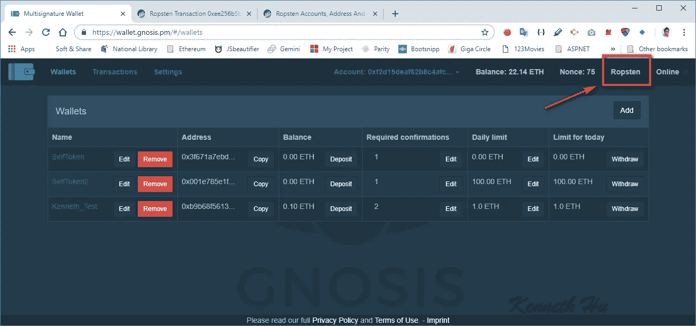
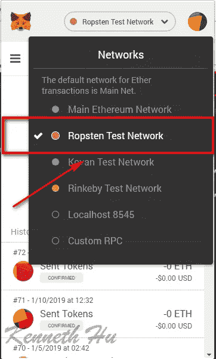
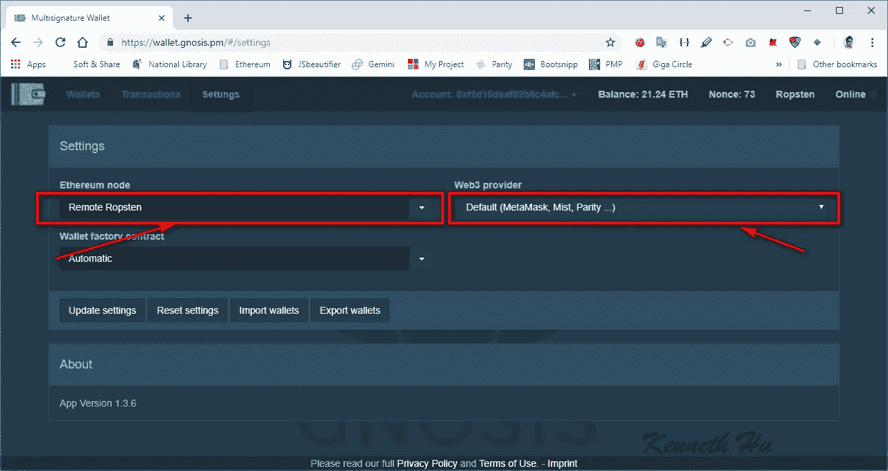
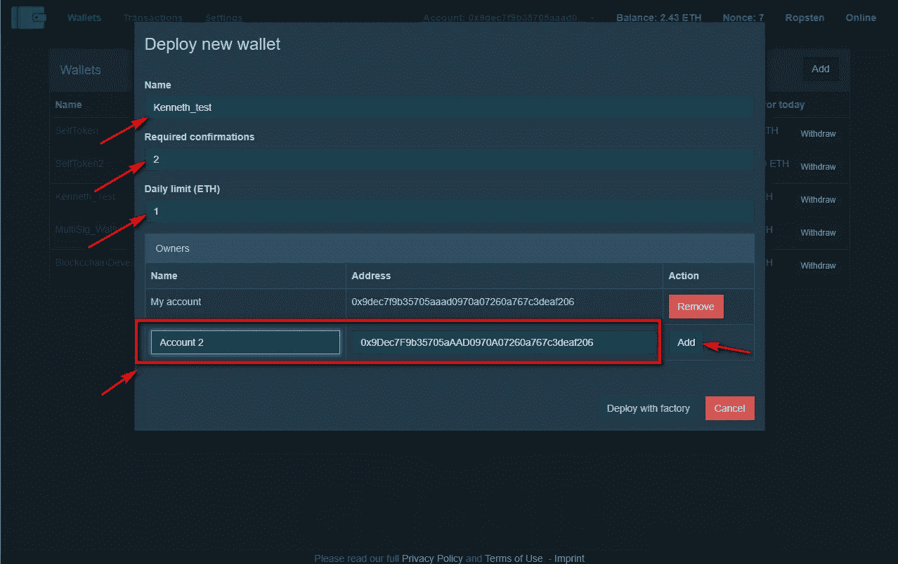
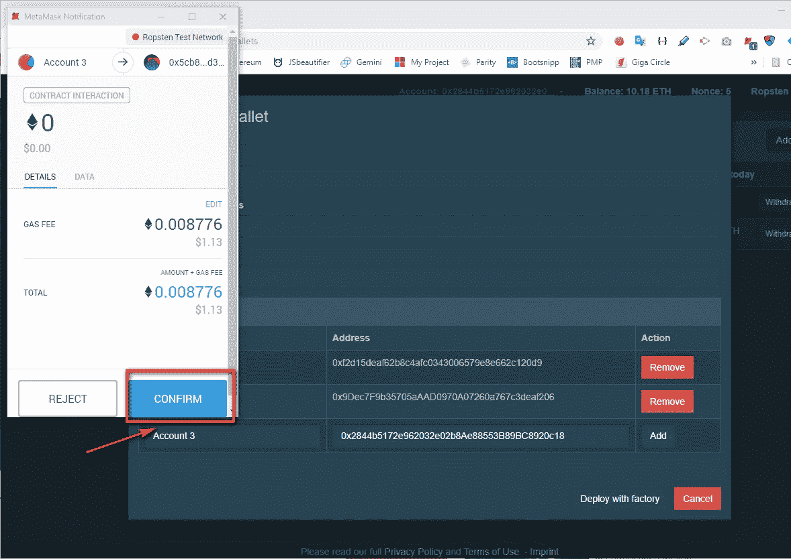
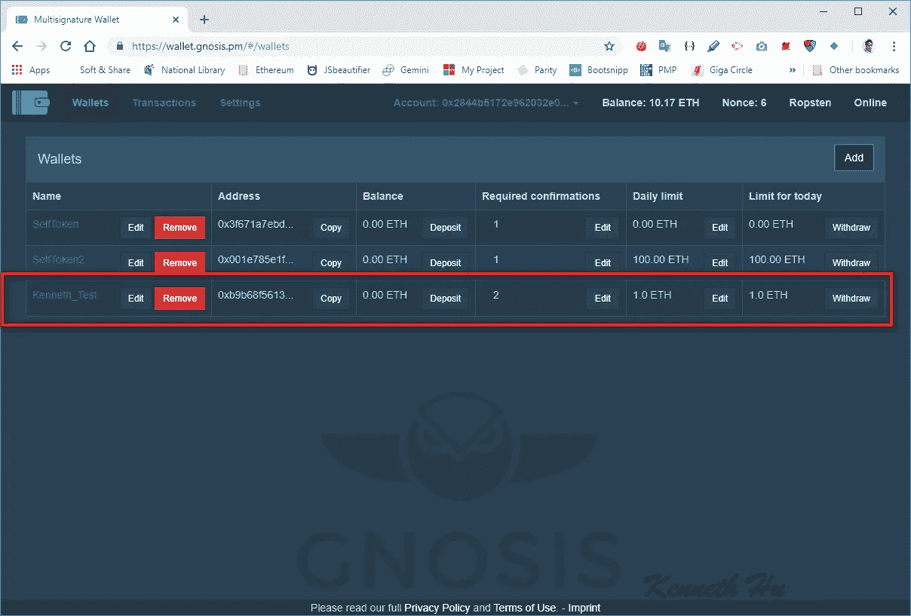
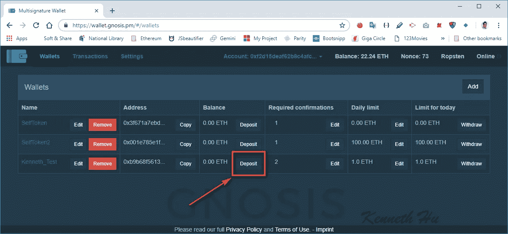
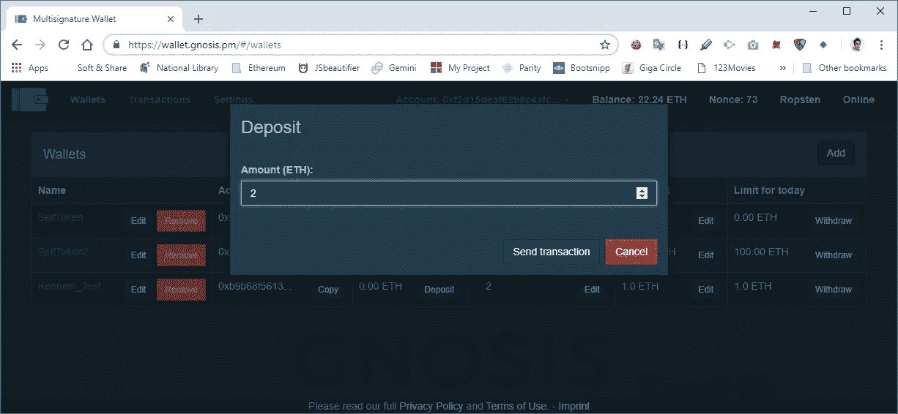
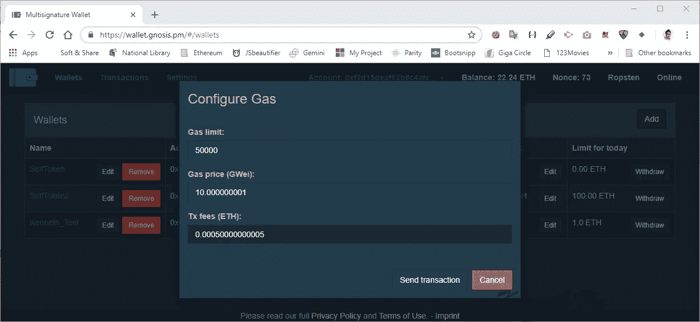
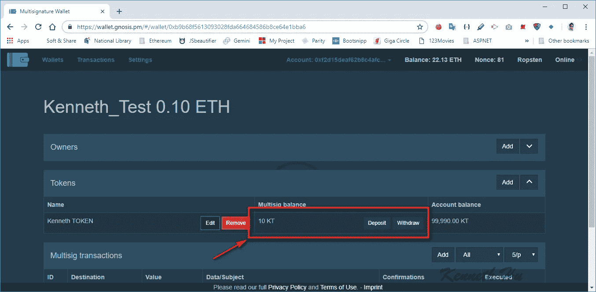

# Gnosis Multisig Wallet-ERC20 令牌使用指南

> 原文：<https://medium.com/coinmonks/guide-to-using-the-gnosis-multisig-wallet-erc20-token-2122f8024265?source=collection_archive---------1----------------------->

本文将介绍如何使用 Gnosis Multisig Wallet 部署自己的多签名钱包，并让它充当一个轻便的钱包。

## 在本指南中，我将使用:

*   Ropsten Testnet 网络
*   位于[https://wallet.gnosis.pm/](https://wallet.gnosis.pm/)的 Gnosis Multisig 用户界面，带有为 Ropsten 网络选择的设置
*   Ropsten Testnet 乙醚
*   元掩码
*   肯尼斯·托肯.地址:[0 XB 6d 15 ad 59 dead 5c 74 cf 62 a6 c 0 e 57774 b 92 a 488](http://0xb6d1D15Ad59DeaD5C74Cf62a6C0e57774b92A488)请在回复中留下你的钱包地址，如果你没有代币，我会给你发代币。

如果你没有安装，请安装 MetaMask，并通过以下链接获取以太网

[MetaMask 安装](/singapore-blockchain-dapps/metamask-metamask-installation-a62865a69d35)

[从以太网 ROPSTEN testnetwork 获取以太网](/singapore-blockchain-dapps/how-to-get-testcoin-from-ethereum-ropsten-testnetwork-1e443d7524b0)

> 另请阅读:[最佳硬件钱包](/coinmonks/the-best-cryptocurrency-hardware-wallets-of-2020-e28b1c124069)

# 连接到元掩码

1.  导航到[https://wallet.gnosis.pm/#/wallets](https://wallet.gnosis.pm/#/wallets)
2.  当打开 gonsis 时，它将连接到元掩码.
3.  检查它是否在 Ropsten 测试网络中。如果不在 Ropsten 测试网络中，在元掩码上切换到 **Ropsten 测试网络**

4.如果您无法更改到 Ropsten 测试网络，请单击“设置”选项卡。在 Web3 Provide 下选择“ **Default (MetaMask，Mist，Parity …)** ”，然后点击“ **Update settings** ”。您可能需要刷新 web 浏览器页面，以使设置生效。

5.选择 Web3 provider 下的“远程节点”，选择以太坊节点下的“**远程 Ropsten”**，点击“**更新设置**”。您可能需要刷新 web 浏览器页面，以使设置生效。

# 步骤:

1.  创建一个钱包并确认谁有多重签名钱包
2.  将乙醚转移到多重签名钱包中
3.  将令牌添加到令牌列表中
4.  将令牌转移到多签名钱包中
5.  从多重签名钱包中转移令牌，但交易会将暂停，等待帐户 2 签名
6.  确认账户 2 在交易中的签名
7.  确认账户 2 的签名，然后转移令牌

# 1.部署新的多重签名钱包

1.1 点击**钱包**右侧的**添加**

**1.2 点击【创建新钱包】**和**下一步**

1.3 输入 N **ame** 、**需确认、**、**每日限额(ETH)** 及业主地址，然后**“工厂调配”**:

*   名称:钱包名称
*   **所需确认:**需要多签名钱包的所有者(签名者)批准的次数(不要与交易确认混淆)。这里我输入 2，意思是至少需要两个人签字才能交易。
*   **每日限额(ETH) :** 在**要求确认**中配置的无需要求确认即可撤销的限额。
*   **添加**:这些是作为钱包变更签名人的所有者地址，特别是取款、确认变更、每日限额和所有权变更。

> **Gnosis Multisig 钱包上的姓名**
> 
> 名称(即钱包名称、所有者名称)存储在本地，而不是 Gnosis 多签名智能合约的链上，因此在计算机重新格式化后重新安装和恢复多签名钱包地址时，名称不在那里也不要感到惊讶。在链上，智能合同仅期望所有者地址、所需的确认/批准和每日限额数字。

1.4 点击“**发送交易**部署 MultiSig 钱包，但需要乙醚支付汽油费。您应该会在右上角看到“部署事务已发送”的消息。

1.5 在 MetaMask 弹出窗口中点击**确认**。

那没花多长时间。一旦交易被确认，我们可以看到钱包显示在钱包标签。如果钱包没有出现，请检查您的交易是否成功。

# 2.将乙醚转移到多重签名钱包中

2.1 点击“存款”

2.2 输入金额，然后点击“发送交易”

2.3 自定义**气限**和**气价(GWei)** ，点击**发送交易**:

2.4 在 MetaMask 弹出窗口中点击**确认**。

2.4 该数额列于余额项下。

# 3.将令牌添加到令牌列表中

3.1 点击**钱包名称**

3.2 点击令牌上的“添加”

3.3 输入令牌地址，然后将显示名称、符号和小数。

# 4.将令牌转移到多签名钱包中

4.1 点击**存款**

4.2 输入金额后点击**发送交易**

4.3 自定义**气限**和**气价(GWei)** ，点击**发送交易。**

4.4 点击 MetaMask 弹出窗口中的**确认**。

4.5 10 代币将显示在多联余额下

# 5.从多重签名钱包转移令牌

5.1 在 MetaMask 中更改到**帐户 2(钱包的所有者)。**

5.2 按下**撤回**，然后在金额(ETH)下输入 10

5.3 点击**发送多笔交易**。

5.4 定制**气体限值**和**气体价格(GWei)** ，点击**发送交易。**

5.5 点击 MetaMask 弹出窗口中的**确认**。

交易确认后，您可以刷新页面。但是，令牌仍将保留在钱包中。这是因为它需要第二个所有者的签名。

# 6.第二个所有者签名交易

6.1 在 MetaMask 中改回**账户 1(钱包的主人)。**

6.2 点击**确认**下的**确认**，然后点击**发送交易**

页（page 的缩写）如果您看到“**撤销确认**”，则表示账户未变更。“**撤销确认**”仅由调用交易的所有者显示

6.3 定制**气限**和**气价(GWei)** ，点击**发送交易。**

6.4 点击 MetaMask 弹出窗口中的**确认**。

交易确认后，所有签署交易的用户都将列在确认列表下。

您可以随时在 [https://etherscan.io](https://etherscan.io) 上查看您的交易地址(或者在这种情况下，在 [ropsten.etherscan.io](http://ropsten.etherscan.io) 上查看)。

账户 2 的交易:

 [## Ropsten 事务 0x 0 B4 cc 60545 CAC B1 DCC fc 98 adafb 607 c 0072d 467 e 47 de 86 ceea 3d 87 FCE 9715237

### 0x 0 B4 cc 60545 CAC B1 dccf c 98 adafb 607 c 0072d 467 e 47 de 86 ceea 3d 87 FCE 9715237 的 Ropsten (ETH)详细交易信息

ropsten.etherscan.io](https://ropsten.etherscan.io/tx/0x0b4cc60545cacb1dccfc98adafb607c0072d467e47de86ceea3d87fce9715237) 

账户 1 的交易:

 [## Ropsten 事务 0x 53 e 7 e 93d 9 FD 0e 6771 a 01 b 85d 24 FB 557400 b 47465315467 a0b 582314806 febf 97

### 0 x 53 e 7 e 93d 9 FD 0e 6771 a 01 b 85d 24 FB 557400 b 47465315467 a0b 582314806 febf 97 的 Ropsten (ETH)详细交易信息

ropsten.etherscan.io](https://ropsten.etherscan.io/tx/0x53e7e93d9fd0e6771a01b85d24fb557400b47465315467a0b582314806febf97) 

MultiSig 钱包的细节:

 [## Ropsten 帐户、地址和合同

### 以太坊区块链浏览器、API 和分析平台

ropsten.etherscan.io](https://ropsten.etherscan.io/address/0xb9b68f5613093028fda664684586b8ce64e1bba6) 

下一步:[Gnosis Multisig Wallet-ETH 使用指南](/singapore-blockchain-dapps/guide-to-using-the-gnosis-multisig-wallet-eth-16b4277dff55)

我这样做是因为我喜欢它，但如果你想让我给自己买杯咖啡，我不会拒绝:o)谢谢^^

# 捐赠:

XEM:ncwzsuf 4 fpx jy 3 l3y 7657 qnvbiuz 5d 54 F4 tnj 64s

乙醚:0 xf 2d 15 deaf 62 b 8 C4 AFC 0343006579 e8e 662 c 120d 9

比特币:332 uiyafsxyvhqcygdgbknlfsf 25 ccnv 9 I

**做拍手，评论，分享！我也欢迎任何出现的商业机会***

# 连接:

[*领英*](https://www.linkedin.com/in/kenneth-hu-1b534664/)

[*电报*](http://bit.ly/2GcnE9x)

[*脸书*](https://www.facebook.com/groups/140517386608407/)

> [直接在您的收件箱中获得最佳软件交易](https://coincodecap.com/?utm_source=coinmonks)

