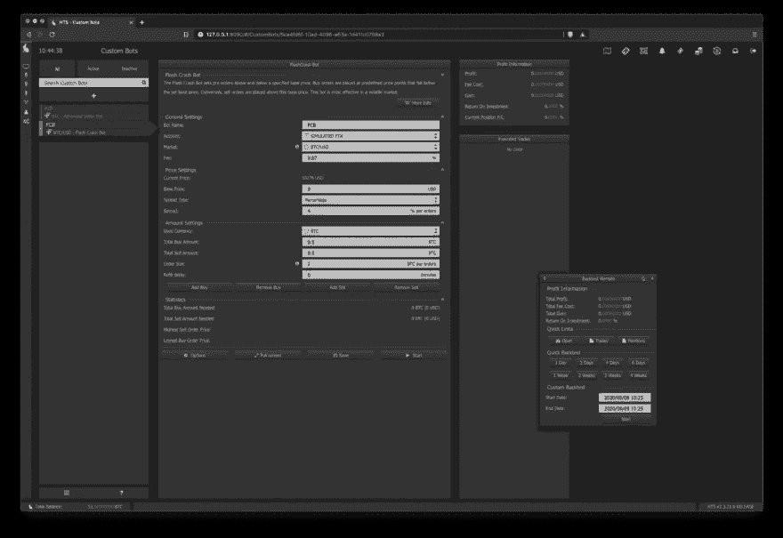
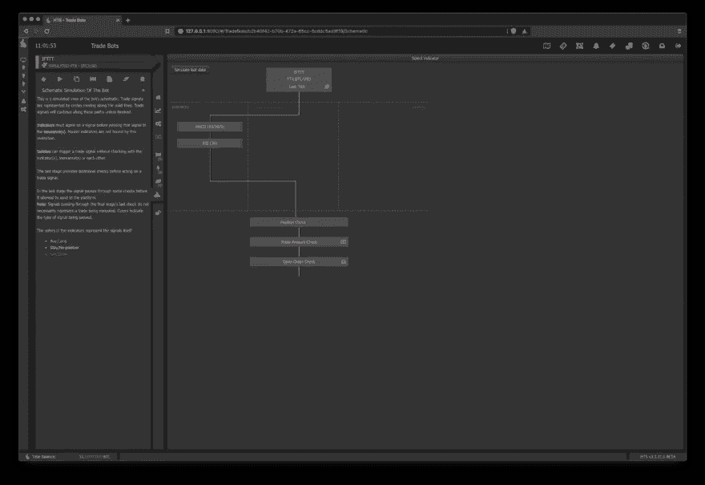
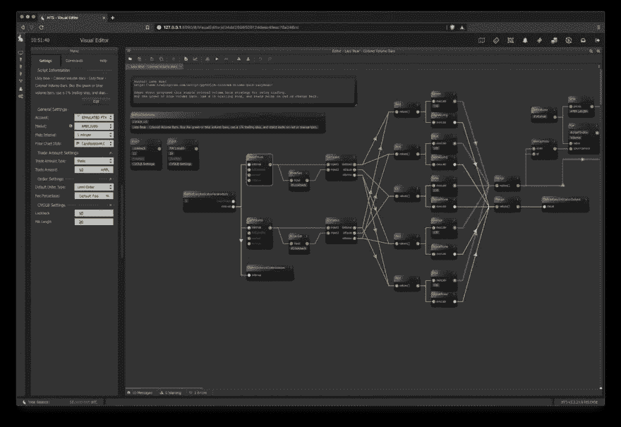
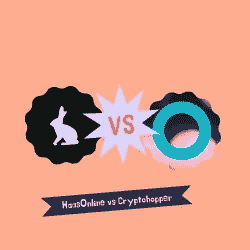
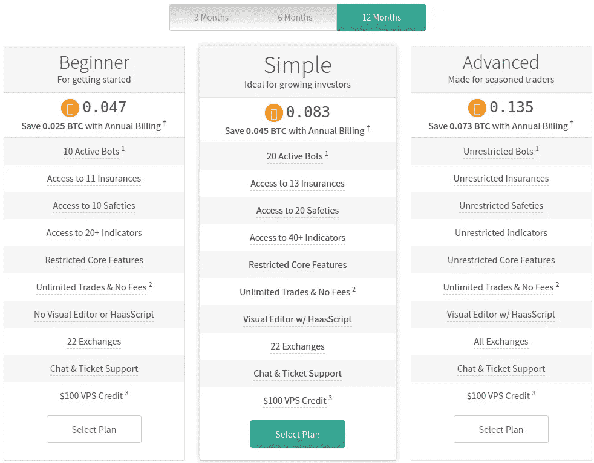

# 哈森在线评论——最佳交易机器人(10%优惠券)

> 原文：<https://medium.com/coinmonks/haasonline-review-d8d1a3400419?source=collection_archive---------1----------------------->

哈森在线是最古老和最著名的加密自动交易公司之一。他们的卓越声誉来自于他们的[交易自动化软件](https://coincodecap.com/category/trading-automation)，该软件自 2014 年以来一直为加密交易员执行交易策略。

## 什么是哈森在线交易服务器？

本质上，HaasOnline 是一家专注于高频交易产品的科技公司。他们目前的旗舰产品 HaasOnline Trade Server 特别受来自外汇等传统市场的经验丰富的交易员的欢迎，他们希望在加密货币市场中最大限度地提高效率和盈利能力。

[HaasOnline Trade Server](https://www.haasonline.com/haasonline-trade-server/?ref=11087) 是一个本地托管的交易服务器，允许您与二十多个现货和杠杆平台集成，并在没有提款许可的情况下使用它们的 API 密钥，以最大限度地提高您的钱包安全性。

此外，HaasOnline 还开发了自己专有的脚本语言， [HaasScript](https://www.haasonline.com/haasscript/?ref=11087) ，类似于 PineScript 等其他强大的语言。您可以创建、测试和完善自动化交易策略，这是加密交易从未实现过的。

## 摘要

*   注重隐私
*   高性能
*   能够运用复杂的交易策略
*   质量交换集成
*   伟大的公司声誉

## 哈森线特征

交易机器人并不是一个新概念，在传统市场已经流行多年。HaasOnline 是第一批向公众提供全功能交易软件的公司之一，这些软件可以在一些最早的加密交易所使用，这种做法现在已经很普遍了。

## 自定义机器人、交易机器人和 HaasScript

他们的软件提供了 15 个定制的机器人，这样你可以选择交易策略，比如刷单，调整基本设置，并部署在一个集成的交易所。

例如，你可能想在 FTX 的横向市场上设置一个刷单机器人，使用本地限价单，目标为 0.8%，止损为 0.4%，交易金额为 0.005 BTC。

他们的定制机器人的一个变种是强大的贸易机器人。他们的框架允许你配置技术指标，在特定的交易所和选定的密码对上产生买卖信号。

如果本地 exchange 订单类型不适合您的策略，您甚至可以创建合成订单模板。

此外，你可以将技术指标与专有安全和保险结合起来，帮助确保你根据交易或价格活动进出头寸。

想激活基于交易量的策略，用 MACD 产生买入信号，确保交易包括费用，并禁止亏损吗？

输入 HaasScript。这是 HaasOnline 对那些正在寻找一种高性能脚本语言的交易者的回答，这种语言可以用来在加密交易所创建高度复杂的交易算法。

它们提供了一个可视化的拖放设计器，这样你就可以不用编码就能生成脚本，如果你喜欢脏的话，还提供了一个智能编辑器。

你可以使用 HaasScript 开发一个对冲美元成本平均策略或使用平均真实范围的 T2 高级网格机器人。HaasScript 的功能几乎没有限制。

## 回溯测试和票据交易

创建一个有弹性的交易机器人的一个关键部分是用不同的市场条件彻底测试你的机器人。HaasOnline 的回溯测试引擎允许您在使用长达 12 个月的历史市场数据测试策略时，从收盘价格或订单价格中进行选择，并且能够支持三年。

观察你的交易机器人如何对纸上交易的实时市场做出反应，将帮助你消除讨厌的逻辑缺陷或实时看到错过的机会。纸上交易是一个无价的工具，因为在测试阶段你不用拿实际资本冒险。您可以选择价格达到或价格突破，而文件交易与您的模拟钱包资金。

回溯测试和纸上交易并不是绝对可靠的，事实上，有些问题和边缘案例我们不会在这篇评论中涉及。您应该知道，实时交易条件可能非常不稳定，并且会由于交易所中断等外部因素而在没有通知的情况下发生变化。

## 市场数据、图表、交易集成

HaasOnline 产品的另一个独特之处是其专用的云基础设施。与许多竞争对手不同，他们利用冗余来源的历史价格数据，从而获得更快、更可靠的市场数据，而不是依赖直接的 exchange API 访问。

[HaasOnline](https://www.haasonline.com/?ref=11087) 在保持其产品的质量交换方面树立了行业标准，他们竭尽全力阻止用户在低质量的平台上交易。他们会主动放弃对那些不维护自己声誉或持续降低 API 性能的交易所的支持，比如现在已经倒闭的 Cobinhood。

还有其他几个强大的功能，如 HaasLabs、指标扫描器、外部投资组合管理等等——您需要自己探索以掌握整个平台。

## 哈斯博特如何工作

*   首先，你需要购买 HaasOnline 交易服务器许可证，并在 HaasOnline 网站上用相同的电子邮件创建一个帐户。
*   接下来，您需要下载基于您的操作系统的 HaasOnline 交易服务器。
*   现在，你需要创建交易机器人并连接加密交易所来执行它们。

**购买哈森在线交易服务器许可**

首先，你需要购买 HaasOnline 交易服务器许可证，并在 HaasOnline 网站上用相同的电子邮件创建一个帐户。

接下来，您需要下载基于您的操作系统的 HaasOnline 交易服务器。

现在，你需要创建交易机器人并连接加密交易所来执行它们。

## 安全性和隐私

## 内部部署

这对于一些交易者来说，既是福也是祸。它提供了最高级别的保护，防止窥探和恶意活动，但需要更高水平的技术能力。

无论是在本地运行还是在虚拟专用服务器上运行，您都可以完全控制您的安装。我们还应该注意到，HaasOnline 计划在未来提供一个基于云的版本。

## 注重隐私

您的交易数据隐私应该是所有提供商的重中之重，然而，这一点还没有得到足够的重视。越来越多的提供商开始出售或让第三方获得你所做的一切。

HaasOnline 仍然是唯一认真对待您的隐私的提供商之一。他们通过不嵌入侵入性分析跟踪来做到这一点，并且由于他们如何设置 HaasOnline 交易服务器基础设施，他们没有机会监控您和您的集成交易所之间的交易活动。

## 非托管贸易机器人

为了帮助您保护您的 exchange [钱包](/coinmonks/hardware-wallets-dfa1211730c6)的安全，HaasOnline Trade Server 不需要取款许可就可以代表您执行交易。

这样做的一个缺点是，如果你正在部署像[套利机器人](https://coincodecap.com/crypto-arbitrage-guide-how-to-make-money-as-a-beginner)这样的策略，你将不得不手动结算你的账户。

让我们将 HaasOnline 的特性和优势与我们之前讨论过的一些其他流行平台进行比较。

# HaasOnline vs Pionex

有一个交易所维护和分发他们自己的交易机器人的运动。在这种情况下，交换是 [Pionex](https://www.pionex.com/offers/#/grid-4?r=BI2UEarX) 。虽然这个概念听起来对交易者来说很理想，但交易所和交易者之间可能存在潜在的利益冲突。让我们探索这些可能的场景。

## 有限的贸易机器人可用性

Pionex 提供了几种流行的交易策略，从网格交易到平均成本交易。然而，一旦你掌握了这些技术，你就没有机会提高自己的交易技巧了。有了 HaasOnline 的专用和中立的交易平台，您可以根据适合您交易风格的指标和其他安全措施制定微调的交易策略。

## 透明度问题

你正在交易的交易所提供的黑箱交易策略的另一个突出问题是一种叫做先跑的技术。在这个特定的用例中，交易所将知道每个交易者的位置或主动策略，并可能利用这些信息来为交易所带来好处。

## 缺乏 exchange 支持

使用由 [Pionex](https://www.pionex.com/offers/#/grid-4?r=BI2UEarX) 提供的交易机器人的最后一个问题是，它们只能在交易所使用和配置。使用一个公平的交易平台，即使你的主要交易平台不可用，你也可以利用市场波动。这也限制了在多个交易所之间套利等行之有效的策略。

# 哈森在线 vs 3Commas

T4 商业银行和哈森在线都没有一个市场，交易者可以通过这个市场获得公开的交易策略。让我们来看看 HaasOnline 和 3Commas 产品之间的一些差异。

## 没有历史回溯测试支持

虽然 3commas 确实提供模拟交易，也称为纸上交易，但它没有内部回溯测试引擎，让你用历史市场数据来测试策略。这个缺失的部分是微调高频交易算法的一个重要方面，允许你在熊市、牛市和横盘时测试你的策略。HaasOnline 强大的回溯测试引擎让您在回溯测试时有更深刻的洞察力。

## 有限贸易 bot 战略

3commas 为其内置的交易机器人提供了一个易于使用的框架，其中包括网格和期权交易等流行策略。如果你不需要对你的交易机器人进行精确控制，这是一个很好的选择，你会受到它们提供的设置的限制。HaasOnline 和 3commas 都缺乏通过公共市场的第三方机器人和信号提供商。

## 隐私和安全

毫不奇怪，公司之间的伙伴关系很常见，它们有助于促进健康的生态系统。然而，一旦一家公司接受外部投资，或者严重依赖它们与之整合的交易所的补贴，水就会变得浑浊，可能会让你付出代价。这当然是指他们与币安的密切关系，并提出了与 Pionex 类似的关切。

# 哈森林 vs 隐漏斗

哈森在线已经是一个成熟的玩家，支持更高级用户的功能， [Cryptohopper](https://www.cryptohopper.com/?atid=15596) 在支持交易策略方面有一些限制。让我们看看 HaasOnline 和 Cryptohopper 产品之间的一些差异。

## 入门级贸易机器人战略

Cryptohopper 擅长为[入门级交易机器人](https://blog.coincodecap.com/five-best-crypto-trading-bots)培育社区和平台。你可以从刚性模板中选择并调整它们的设置，这与 HaasOnline 的自定义和贸易机器人类似。随着 HaasOnline 的 HaasScript 的创新，交易者现在拥有了只有传统市场的交易者才能使用的脚本功能。

## 有限交换集成

众所周知，有经验的交易者要求获得高质量的现货和杠杆平台。Cryptohopper 确实提供了大约十几个最受欢迎的交易所，但是，它们缺少像 ByBit、FTX 和 BitMEX 这样的平台。

## 初级战略设计师

Cryptohopper 为用户创造了一个可视化创建和编辑交易机器人的工具。但是，设计者仅限于技术指标和其他基本设置。相比之下，HaasOnline 提供了一个真正的拖放算法设计器，它使用功能强大的 HaasScript 构建的 600 多个可视块库来生成交易脚本。

## 定价

哈森在线目前不提供免费试用。然而，他们提供打折的 [2 周试用许可](https://www.haasonline.com/pricing/trial/)，可以用来测试完整的软件套件，而不需要这么大的投入。我们还为您提供公共实例设置，以便在我们的软件中测试配置 HaasBot 交易机器人。

**公共服务器:** **凭证:**

*   用户名:showme
*   密码:进化

哈森在线贸易服务器许可价格从 0.047 BTC 开始。如果你是初学者，你应该从初学者计划开始。

## 哈森在线的利弊

让我们来看看 HaasOnline 的优缺点。

**优点**

*   无限策略
*   高性能
*   注重隐私和安全

**缺点**

*   不适合初学者
*   高技术壁垒
*   高价政策

## 结论

HaasOnline 开发了尖端的交易技术，在 crypto fintech 中随处可见这种技术的痕迹。他们的[强大的交易机器人](https://coincodecap.com/best-crypto-trading-bots)、脚本语言和分析工具为交易者提供了最大化利润和提高效率的机会。

对于那些刚刚开始交易的人来说，HaasOnline 的价格和学习曲线可能太陡了，但如果你是来自外汇或传统市场的超级交易者，并且熟悉 Metatrader、Ninjatrader 或 Tradestation 等工具，你会感觉宾至如归。

## 我能免费试用哈斯博特吗？

是啊！HaasOnline 提供公开托管的 HTS 实例，供您测试配置 HaasBot 交易机器人和我们软件的其他方面。

公共服务器:凭据:

*   用户名:showme
*   密码:进化

警告:这些是公共服务器，服务器上的流量可能很高。不要在这些服务器上使用私人凭据或个人信息，因为它们是公开的。

## 哈森在线替代品

1.  [**3commas**](https://3commas.io/?c=tc252152) 是一个在线平台，面向对使用自动化机器人进行[加密货币交易](https://blog.coincodecap.com/tag/trading/)感兴趣的人。对于没有金融技术背景或没有丰富股市经验的人来说，这尤其具有吸引力。阅读 [3Commas review](/coinmonks/3commas-review-an-excellent-crypto-trading-bot-2020-1313a58bec92) 。
2.  [**Bitsgap**](https://bitsgap.com/?ref=2cb1231&utm_source=coincodecap&utm_medium=article&utm_campaign=promo) ，满足您所有交易需求的一站式加密交易平台。它允许用户将他们所有的密码交易账户放在同一个屋檐下，通过一个集成的界面进行交易。阅读 [Bitsgap 审查](/coinmonks/bitsgap-review-a-crypto-trading-bot-that-makes-easy-money-a5d88a336df2)。
3.  [**Quadency**](https://quadency.com/?r=ea20aa360c45d1f5ad47a19a) ，2018 年推出的密码交易自动化平台。它给你带来了一个更聪明的方式来交易和管理你的密码。阅读[四项审查](https://coincodecap.com/quadency-review-a-crypto-trading-automation-platform)。

*原载于 2020 年 9 月 10 日*[*【https://blog.coincodecap.com】*](https://blog.coincodecap.com/haasonline-review)*。*