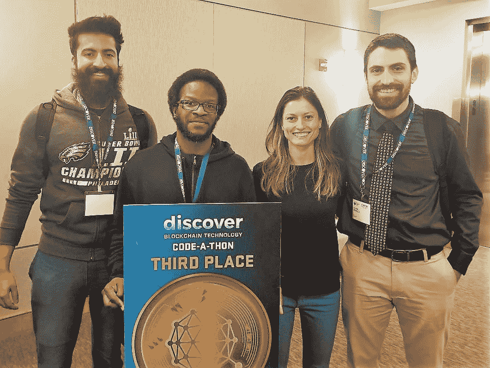
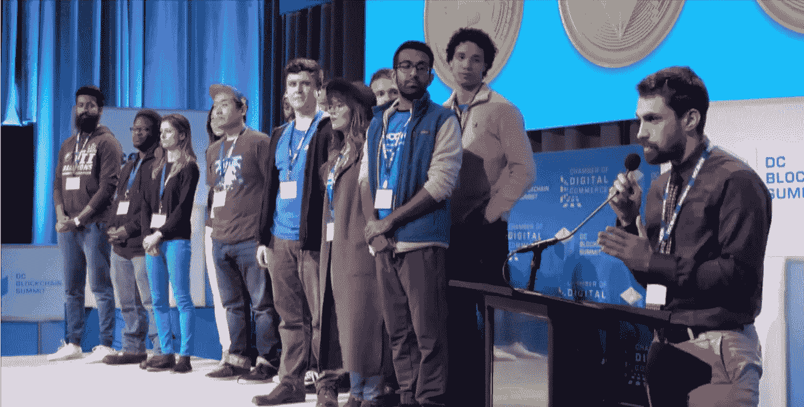

# 黑客马拉松…什么是黑客马拉松？

> 原文：<https://medium.com/coinmonks/hackathon-whats-a-hackathon-4e235774ca2?source=collection_archive---------6----------------------->

Team Openvote

当我得知 DC 的数字商会区块链代码马拉松时，这可能也是我的反应。我已经在区块链沉浸了大约一年——甚至自学了如何编码——但这是我的第一次黑客马拉松(有时被称为代码马拉松，因为，嗯……是的，我会让你的想象力在这里驰骋)。

> **虽然这是我的第一次黑客马拉松，但我积极主动，思想开放，并且很清醒——从我注册的那一刻到我的团队获得第三名的那一刻。我相信这是我成功的秘诀。**

# **铺路**

> 我可能不知道会发生什么，但我知道我必须做好准备。

如果说我从多年的咨询工作中学到了什么，那就是准备的重要性。我知道我必须做什么。

## **我来了！**

我是第三个加入黑客马拉松主要交流平台 Slack channel 的人，仅次于两位活动组织者。

在接下来的几周里，我定期查看频道，但几乎没有什么活动。为了寻找答案，我在网上读到黑客马拉松成功的关键是一个强大而平衡的团队。厉害！除了我仍然没有一个团队…

> 啊哈——我有主意了！我将在更广泛的 Slack 组中创建一个“findteam”频道，其唯一目的是帮助我自己和其他人找到队友。

球开始运动了…

两名参与者写道，他们正在寻找一个团队。我立即给他们俩发了信息，建议我们考虑合作。在简单讨论了我们的技能后，我们意识到我们是很好的搭配。然而，我们还需要一名开发人员。

好吧，回到“寻找团队”频道。我注意到 Sal 的一个帖子，他说他有商业/经济/金融背景，是一名 python 程序员。这是显而易见的！在 Linkedin 上审查了他之后，我向他概述了我团队的技能，然后问他是否愿意加入我们。他答应了！

## **现在怎么办？**

> 我很快把他介绍给团队的其他成员，并提出开始集思广益的必要性。

团队同意了。经过一番构思，团队成员之一 Daniel 提出了我们最终要构建的想法:一个检测选举舞弊的分散式应用程序。我们的目标是恢复选民对我们选举过程的信心。完美！众所周知，这个想法很实际，也是 2016 年大选的不确定性所急需的。

您可以访问我们的 github 库来查看我们到底构建了什么以及如何构建的(参见下面的部分)，但是现在，让我们直接进入黑客马拉松的第一天。

# **第 1 天—设计、构建、测试。冲洗并重复**

早上 8 点，我从酒店乘优步去乔治敦大学。我走进大楼，签到，拿了一件 t 恤，在主房间里坐下。当然，我也会给我的团队发消息，让他们知道我已经到了。我碰巧在一位来自 Coindesk 的女记者旁边占了一个座位…嘿，这太酷了！

没过多久，我的团队就开始陆续抵达。我们互相问候，没有浪费太多时间，就开始谈论我们的想法。然而，我们注意到我们的一名团队成员失踪了。嗯……我们的队友在哪里？

## **障碍开始**

她让我们知道她将加入另一个团队。没什么大不了的，但是现在我们缺一个前端开发者。你知道，就是构建和美化用户界面的人，这样人们就可以真正使用这个应用了。

好吧，我们有个计划。我们会在开麦期间仔细聆听，希望能抓住一些人。一些人去了，但没有一个是合适的。我们正要放弃，就在最后一秒，我们未来的队友走上舞台，说他懂 Javascript 和 HTML。我们所有人的手都立刻举了起来！

## **言归正传**

在接下来的 24 小时里，我们可以称之为家的突破区，我的团队很快就进入了正题。我们开始进一步构思，我主持了关于价值主张、初步特征的讨论，并开始分配任务。

> 协作和开放在这里是绝对关键的。我们刚刚认识彼此，我们都有非常不同的个性和技能。建立融洽和信任至关重要。

几个小时过去了，我们还没有建立任何东西。我们仍然在运行特性和过程。这似乎是从外部引进人才的最佳时机。一个能提供新观点的人。我建议我们联系一下黑客马拉松的导师。团队意见一致——太好了！我跑上楼，找到导师里德，他欣然同意帮助我们。

> 在 Reid 的帮助下，我们将端到端流程串联起来，进一步巩固我们的价值主张，并开始形成我们的电梯间推介。

## **我累了**

快进 13 个小时，现在是凌晨 3 点，我们终于快要完成 dapp 了。我们为第二天的演示进行了简短的排练，并决定在早上 8 点提交最终代码之前睡几个小时。

# **第二天——演讲**

我早上 7 点从床上跳了起来。我知道这将是激动人心的一天，我很兴奋地向代码马拉松的评委、参与者、协调员和志愿者展示了我们不知疲倦地努力建立的成果。

组织者告诉我们，为了节省时间，只能有一个人来做演示。我们选择了丹尼尔，这似乎是公平的，因为他提出了这个想法，并在建设中发挥了关键作用。

## **捍卫民主**

> 女士们先生们，我要宣布一件事。2016 年的选举被操纵了。也可能不是。我们不知道，这就是问题所在。

这是丹尼尔对评委和观众的开场白。说得好！丹尼尔继续做了 3 分钟的演示，而我则在演示。成功了！然后我们开始回答评委的 2 分钟问题。

在所有团队陈述完毕后，每个团队必须回答 5 分钟额外的评委问答。这一次的问题似乎不太技术性，而是侧重于市场适应性和走向市场战略。

问答结束后，评委们离开了房间，仔细考虑他们的决定。

## **我们安置好了！**

大约 30 分钟后，评委们从评议中回来，宣布了三个小组:海森堡计划、寻求庇护和开放投票。Openvote —就是我们！唷，太令人激动了！我们都互相击掌，几乎是瞬间，我们的疲惫被兴高采烈取代。

## **现在进行真正的测试**

在这一点上，我们仍然不知道获胜者的顺序。为了找到答案，我们需要将*再次*呈现给整个 DC 区块链峰会！

前三名的队伍被护送到一个“等候区”，我们在那里等了大约一个小时。我们开玩笑说这是对我们力量的最后考验，我们即将进入饥饿游戏竞技场。

这不完全是饥饿游戏，但令人难以置信的压力。感谢代表 Openvote 发言的 Daniel 和其他两位队长精彩的发言！

寻求庇护继续排名第一，海森堡项目第二，公开投票第三。

Daniel McNally presenting Openvote

# 结束了…让我们睡觉，听取汇报！

## **黑客马拉松最佳实践**

在黑客马拉松之后，我花时间听取汇报并认真思考最佳实践。如果有人问我要黑客马拉松秘制酱，我会告诉他们:

提前组建一个团队——最好是和你认识的人，但陌生人也可以——只要你提前同步。如果你和同一个团队参加了两次以上的黑客马拉松比赛，那就走出你的舒适区，寻找新的队友。

*组建一个平衡的团队*——理想情况下，这大约是两个开发人员(前端和后端)，一个产品经理，可选地，一个精通技术的业务人员。

*预先确定一个想法—* 我真的不能再强调这一点了。24 小时飞逝而过，你不想花其中的 4 个小时绞尽脑汁想出一个主意并试图达成共识。

*自学编码—* 你不需要辞掉你的日常工作，但是对编码有一个适度的理解会让你为团队做出更多的贡献。编码需要时间，通常比预期的要多，并且有一个额外的开发人员来帮助解决问题和进行调试会有很大的帮助。

*了解你的优势*——为你将做出什么贡献以及如何做出贡献制定一个游戏计划。准备好。

*优先考虑功能&构建一个 MVP*——当然，你的产品*可以*展示 3 个以上的功能，但是质疑这些功能是否值得花时间去构建。如果他们是值得拥有的，就让他们走吧。

*与你的团队沟通*——如果你觉得自己无法在截止日期前完成任务，或者可能不具备完成任务的技能，告诉你的团队。这并不总是容易的，但是你的团队会感激你的。

*致力于频繁的状态检查*——不要仅仅因为某人“忙于工作”，就认为他们与团队是一致的。通过定期检查状态来减轻团队的工作量和压力。

照顾好你的身体——做一些对你身体有益的事情，定期休息、伸展身体、到户外散步等等。别忘了努力吃好。否则，接下来的两天你会感觉像被公交车撞了一样。

# **最终想法**

黑客马拉松是一种令人惊叹的学习体验。它们是对勇气、韧性和力量的考验。他们依靠团队合作和协作。黑客马拉松代表了这个世界上所有的美好，以及不同团队将革命性的想法变成现实的力量。

> 饥饿游戏快乐！抱歉，我是说快乐编码！

> [直接在您的收件箱中获得最佳软件交易](https://coincodecap.com/?utm_source=coinmonks)

向 Openvote 团队大喊:丹尼尔·麦克纳利、萨尔·卡迪尔、安德烈·麦格鲁德和我们的导师里德·刘易斯。干得好，队员们！

# 了解有关该项目的更多信息，并访问我们的 github 资源库

查看我们的 github 资源库，更深入地了解我们的解决方案。如果你想参与并帮助我们继续建设这个项目，请告诉我。

 [## sangaman/openvote

### open vote——一个投票机的原型，它使用 OpenTimestamps 来证明其结果

github.com](https://github.com/sangaman/openvote) 

**别忘了在**[**Linkedin**](https://www.linkedin.com/in/rikasukenik/)**和**[**Twitter**](https://twitter.com/rika_sukenik)**上和我连线！**

感谢您的阅读，再见！

如果你喜欢这篇文章，欢迎评论和掌声。