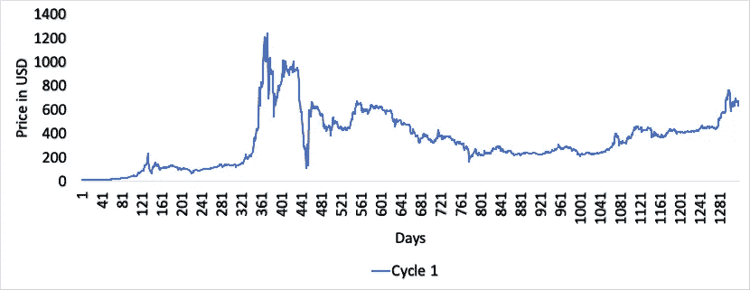
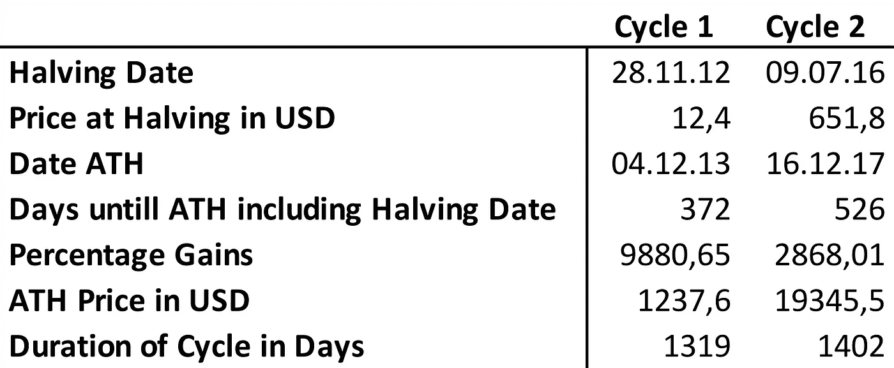
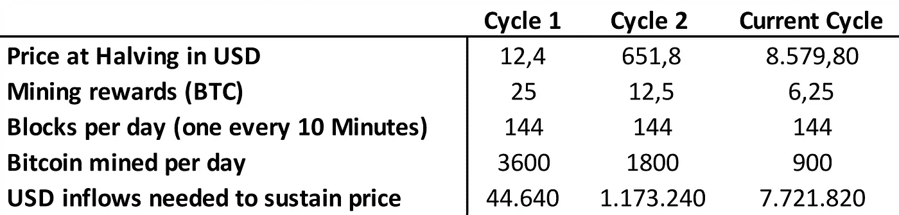
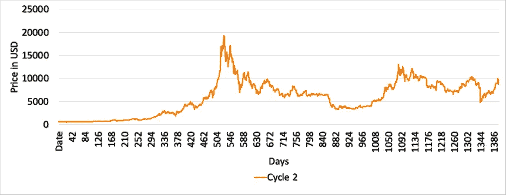
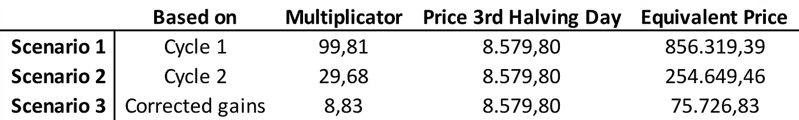
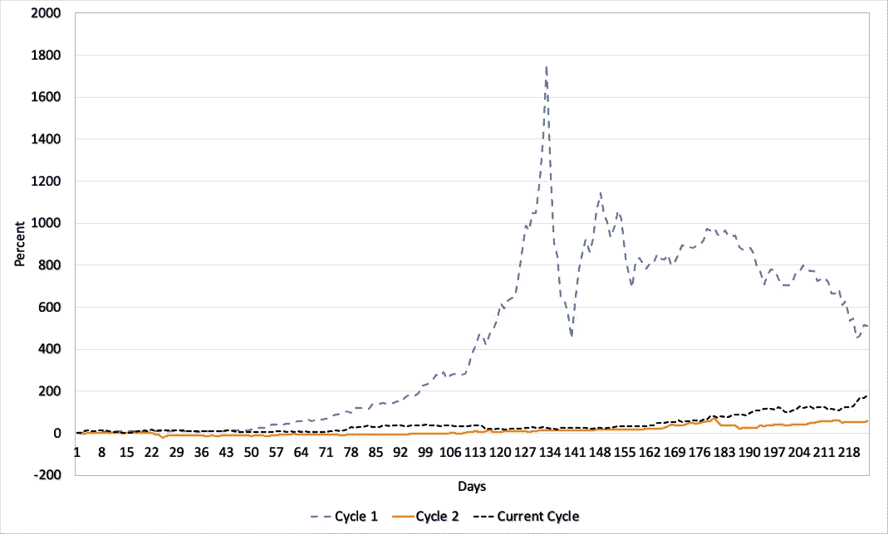
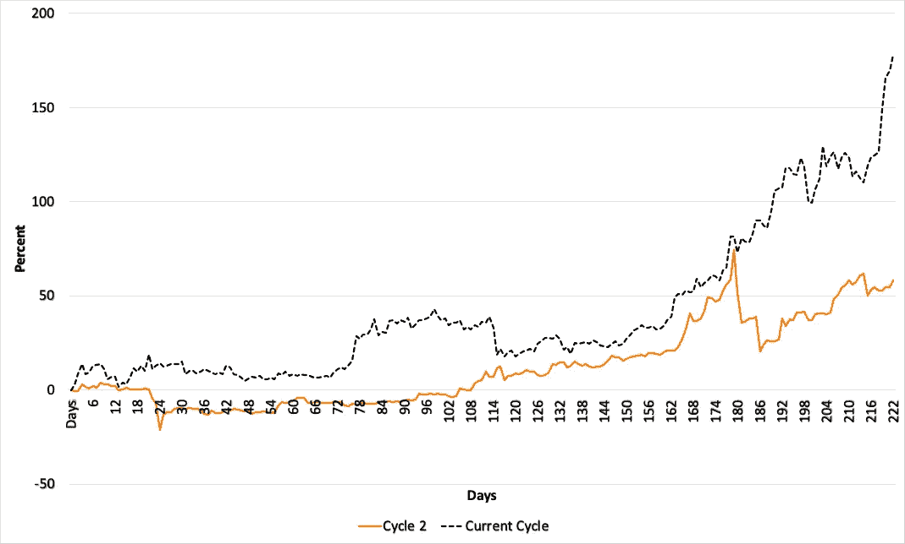
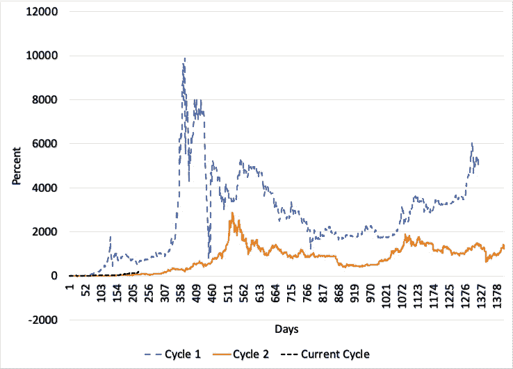
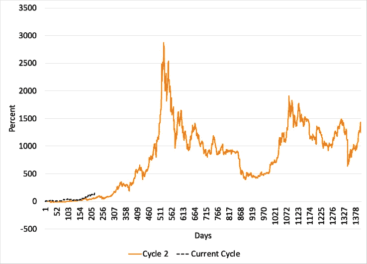

# 周期减半和比特币价格

> 原文：<https://medium.com/coinmonks/halving-cycles-and-the-bitcoin-price-7b95130f74d0?source=collection_archive---------0----------------------->

## 在第三个减半周期中，比特币前景“温和”

比特币减半事件是比特币的一个本质特征。每 [210.000 块](https://www.coindesk.com/bitcoin-halving-explainer)矿工的块奖励减半。大约每四年就有一次集体奖励减半的情况。这些事件都是对比特币的负面供给冲击。考虑到这一点，减半周期是比特币市场周期的一个重要因素，人们预计每次减半后价格都会上涨。近年来，这些负供给冲击的影响引起了广泛关注。特别是随着 [PlanB 于 2019 年 3 月 20 日](/@100trillionUSD/modeling-bitcoins-value-with-scarcity-91fa0fc03e25)发布比特币存量到流量模型。从历史上看，减半事件一直对比特币有利。上一次减半发生在 2020 年 5 月 11 日。那一天，矿工的集体奖励确实减半，从 12.5 BTC 降至 6.25 BTC。我们现在已经进入第三个减半周期的第 223 天(截至 2020 年 12 月 19 日)。这使得与前两个周期的比较变得有趣。在下文中，我将着眼于前两个减半周期的发展，然后将当前周期与这两个周期进行比较，并对价格预测以及我们可以从前两个周期中学到的东西给出一些看法。

第一次减半活动发生在 2012 年 11 月 28 日。周期结束需要 1319 天(包括减半日)。在第一个减半日，集体奖励确实减半，从 50 BTC 降至 25 BTC。仅在 372 天内，比特币就达到了该周期的历史新高(ATH)(见:**图 1；表 1** 。价格从 12.5 美元涨到了 1237.6 美元。这是一个非同寻常的价格上涨 9880，65%。

Graph 1: Bitcoin price development days since 1st block reward halving (Datasource: investing.com)

这个新 ATH 在第一个周期中达到的速度和幅度还没有达到第二个减半周期。第二次减半发生在 2016 年 9 月 7 日。1402 天比第一次稍长(见:**图 2；表 1** 。街区奖励减少到 12.5 BTC。在 526 天后(比第一个减半周期长 154 天)达到了 19.345 美元的新 ATH。

Table 1: Summary Statistics Halving Cycle 1 and Halving Cycle 2 (Datasource: investing.com). Note: I have used the average price in a given day and not the highest price in a given day, so the days for an ATH may differ using peak price in a given day. Overall that makes the calculations a bit more conservative.

相比之下，第一个减半周期对比特币价格的影响更强、更快。比特币在第一个减半周期中的非凡价格发展是否是比特币历史上千载难逢的事件仍有待观察。但随着机构资金对比特币越来越感兴趣，我们可能会大吃一惊。关键是要记住，要达到相同的百分比价格，需要更多的资本流入。当集体奖励减半减少了维持某一价格水平所需的流入量时，更高的价格水平增加了支持某一价格水平所需的流入量。

Table 2: Hypothetical selling pressure by miners at halving day if all block rewards are sold at the price on the halving day and respectively inflows needed to set-off this selling pressure and sustain price.

假设矿工正在出售他们所有的奖励，除此之外，其他一切保持不变，抵消矿工出售压力的金额随着每个周期而增加(见**表 2** )。按照今天 23.400 美元的价格(2020 年 12 月 20 日)，需要 21.060.000 美元的资本流入来吸收采矿奖励的抛售压力(假设所有奖励都已售出)。因此，像第一个减半周期那样实现百分比增长现在变得更加困难。这也是第二个周期没有第一个周期那么极端的潜在原因。

Graph 2: Bitcoin price development days since 2nd block reward halving (Datasource: investing.com)

**表 3** 显示了基于前两个周期发展的比特币价格目标的三种情景。这些是对价格在特定条件下如何发展的假设性计算。在第一个减半周期中，比特币价格上涨了 99，81 倍。如果比特币价格在本周期上涨相同的幅度，新的 ATH 将为 856.319 美元。如前所述，价格上涨在那个周期是非常不寻常的，但是。情景 1 在由[塞斯·金恩斯](https://medium.com/u/433b747183a6?source=post_page-----7b95130f74d0--------------------------------)给出的最佳价格前景范围内。他认为，在这个周期中，比特币的价格在 150.000 美元到 200.000 美元之间，但在看涨的情况下，由于机构投资者进入市场，价格可能会达到 500.000 美元到 1，000.000 美元之间。后者将意味着机构投资者的大量资金流入。

Table 3: ATH calculations based on the previous two Cycles. Scenario 1 and Scenario 2 are equivalents and Scenario 3 is assuming a linear downward trend in gains based on Cycle 1 and Cycle 2\. Prices are in USD (Datasource: investing.com)

在第二个周期，百分比涨幅大幅降低，比特币价格“仅”上涨了 29.68 倍。如果历史重演，场景 2 在这个周期中实现，这意味着价格为 254.650 美元。这个价格非常接近由 [PlanB](https://medium.com/u/bcb63a182704?source=post_page-----7b95130f74d0--------------------------------) 的比特币[股票到流动交叉资产模型](/@100trillionUSD/bitcoin-stock-to-flow-cross-asset-model-50d260feed12)预测的价格，该模型预测 2020 年至 2024 年之间的平均价格为 288.000 美元。PlanB 认为比特币的价格可能会超过这一预测，并在 2020 年 9 月 7 日的[比特币做了什么一集中达到 3 倍的价格。](https://www.youtube.com/watch?v=YMx6SwRyWZ4&feature=emb_title)这将使比特币的价格达到 864，000 美元，惊人地接近场景 1 的预测价格。此外，这一价格低于花旗银行的一份报告，该报告称，到 2021 年 12 月，比特币的价格可能达到 318，000 美元。这也低于古根海姆投资公司首席执行官斯科特·米纳德在最近的声明中提到的价格。根据他们的基本评估，比特币应该价值 40 万美元(不过，他们没有提到时间表)。紧随其后，根据第二个减半周期的乘数计算的价格似乎也不是完全不合理。

然而，从**表 3** 中可以看出，乘数从第一个周期到第二个周期已经减少。如果这种下降是一种趋势呢？如果我们假设乘数下降的趋势是有效的，并且我们认为它是线性的，我们得到乘数 8，83。这将导致 ATH 价格超过 75000 美元。与其他比特币相比，这个数字要低得多，但它仍然是比特币的乐观前景。随着机构资金进入市场，这似乎是一个相当保守的情景。

为了给这些价格预测提供一些视角，看看所有三个减半周期自减半日以来的百分比涨幅是有用的。正如已经提到的，第一个减半周期是非同寻常的，这意味着当前周期的趋势在全周期图中几乎看不到。因此，我只查看显示本周期最近一天发展情况的图表(其他图表包含在附录中，以供进一步参考)。**图表 3** 缩短为自当前周期减半事件以来经过的天数，仅包括周期 2 和当前周期(2020 年 18 月 12 日)。可见，无论是上一个周期还是当前周期，都赶不上第一个周期。与当前周期的第一个周期相比，比特币的百分比涨幅仍然相对较低。要达到 856.319 美元的价格，其价格需要以更高的速度加速上涨。虽然并非不可能，但条件必须非常有利，例如，机构投资者等大量资本必须流入比特币市场。因此，在我看来，这种情况是可能的，但可能性不大。

Graph 3: Percentage change in bitcoin price since the halving event. All three cycles. 223 days into the cycle (halving day included) (Datasource: investing.com)

在**图 3** 中可以看到，在当前周期中，比特币价格已经脱离了第二周期中的百分比涨幅。然而，由于周期 1 在图表中占主导地位，这一趋势并不明显。因此，我在**图 4** 中排除了循环 1。这种趋势在这里变得更加明显。看着这张图表，情况 3，价格线性减速上涨，估值为 75，000 美元，似乎不太可能发生，因为我们已经超越了周期 2。相反，在第 180 天之后，当前周期的价格涨幅似乎已经脱钩。这是否意味着比特币价格将超过情景 2？不，不一定。由于我们仍处于周期的早期，未来几个月必须监测这种脱钩是否会持续，或者本轮牛市是否比第二轮更早开始。但如果这种趋势持续下去，我们最终的价格将会高于第二种情况。

Graph 4: Percentage change in bitcoin price since the halving event. Cycle 2 and the current cycle. 223 days into the cycle (halving day included) (Datasource: investing.com)

那么这给我们留下了什么？我们在推特和媒体上读到的价格预测相差很大。它们可能在五位数甚至更高的六位数范围内。没有人真正知道我们要去哪里。尤其是随着机构投资者进入比特币市场，这很难预测。随着 [MassMutual](https://www.coindesk.com/massmutuals-bitcoin-investment-marks-adoption-milestone-jpmorgan) 和[全球投资公司 Jefferies](https://dailyhodl.com/2020/12/19/51-billion-finance-giant-jefferies-selling-gold-for-bitcoin/) 等巨头进入市场，赋予比特币合法性，比特币成为黄金的合法替代品，我们可能会感到惊讶。基于最近的发展，我认为这个周期的目标价格为 254.650 美元的情景 2 不是不现实的，我们将看到这个周期的新比特币 ATH 在 10 万美元到 30 万美元的范围内，明显倾向于上限。如果有一点是肯定的:当前周期和比特币的前景是看涨的！

更多定期更新请在推特上关注我: [@JanWues](https://twitter.com/JanWues)

披露:上述文章引用了一种观点，仅供参考。它无意成为投资建议。

**附录:**

Graph 5: Percentage change in bitcoin price since the halving event. All three cycles over the whole cycle (Datasource: investing.com)

Graph 6: Percentage change in bitcoin price since the halving event. Cycle 2 and current cycle over the whole cycle (halving day included)

> 加入 Coinmonks [电报频道](https://t.me/coincodecap)和 [Youtube 频道](https://www.youtube.com/c/coinmonks/videos)获取每日[加密新闻](http://coincodecap.com/)

## 另外，阅读

*   [复制交易](/coinmonks/top-10-crypto-copy-trading-platforms-for-beginners-d0c37c7d698c) | [加密税务软件](/coinmonks/crypto-tax-software-ed4b4810e338)
*   [网格交易](https://coincodecap.com/grid-trading) | [加密硬件钱包](/coinmonks/the-best-cryptocurrency-hardware-wallets-of-2020-e28b1c124069)
*   [密码电报信号](http://Top 4 Telegram Channels for Crypto Traders) | [密码交易机器人](/coinmonks/crypto-trading-bot-c2ffce8acb2a)
*   [Pionex 双投](https://coincodecap.com/pionex-dual-investment) | [AdvCash 审核](https://coincodecap.com/advcash-review) | [秉持审核](https://coincodecap.com/uphold-review)
*   [面向开发者的 8 个最佳加密货币 APIs】](https://coincodecap.com/best-cryptocurrency-apis)
*   [支持卡审核](https://coincodecap.com/uphold-card-review) | [信任钱包 vs 元掩码](https://coincodecap.com/trust-wallet-vs-metamask)
*   [赢取注册奖金——10 大最佳加密平台](https://coincodecap.com/earn-sign-up-bonus)
*   [最佳加密交易所](/coinmonks/crypto-exchange-dd2f9d6f3769) | [印度最佳加密交易所](/coinmonks/bitcoin-exchange-in-india-7f1fe79715c9)
*   [开发人员的最佳加密 API](/coinmonks/best-crypto-apis-for-developers-5efe3a597a9f)
*   最佳[密码借贷平台](/coinmonks/top-5-crypto-lending-platforms-in-2020-that-you-need-to-know-a1b675cec3fa)
*   杠杆代币的终极指南