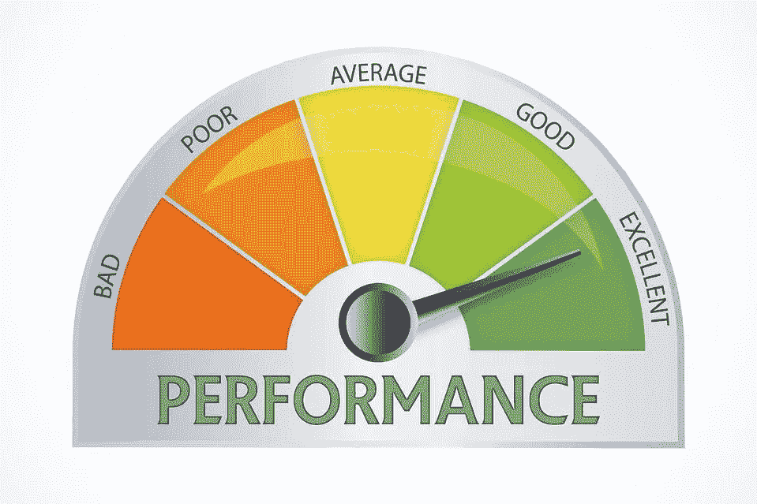
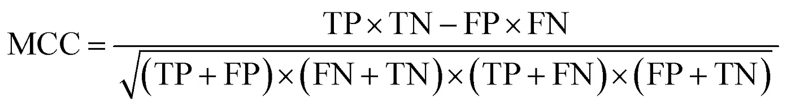
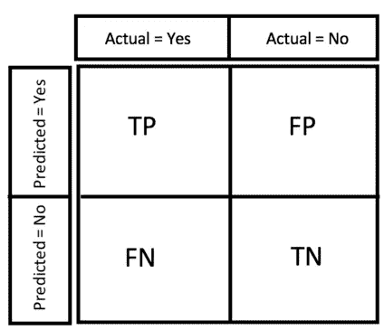
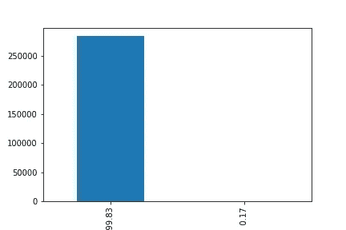
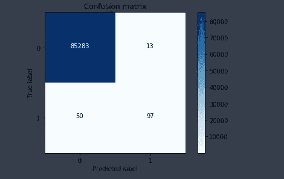
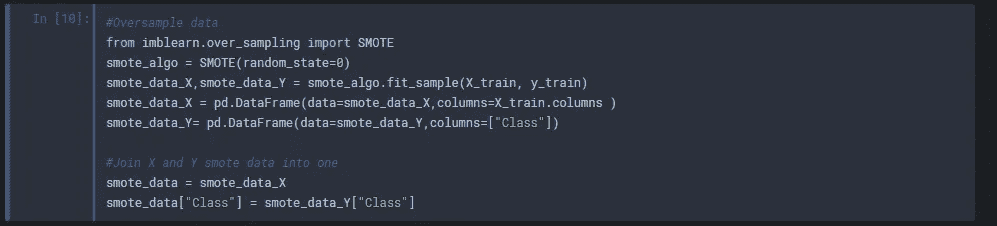

# 处理不平衡数据集:预测信用卡欺诈

> 原文：<https://medium.com/coinmonks/handling-imbalanced-datasets-predicting-credit-card-fraud-544f5e74e0fd?source=collection_archive---------1----------------------->

Credit Cards ([source](https://www.google.com.ng/url?sa=i&source=images&cd=&cad=rja&uact=8&ved=2ahUKEwjmzI6qnbvcAhUGLBoKHYm7AyEQjhx6BAgBEAM&url=https%3A%2F%2Fwww.finanzen.net%2Fnachricht%2Fprivate-finanzen%2Feuro-am-sonntag-service-grosser-exklusiv-test-das-sind-die-top-kreditkarten-6072848&psig=AOvVaw3mKM2m8d-yTNzTGnt9TiTQ&ust=1532641638127212))

作为数据科学家，我们会遇到各种类型的数据集。一个这样的数据集是不平衡数据集。这种类型的数据集总是给初学数据的科学家带来一个问题，因为大多数机器学习算法都不擅长处理它。

**什么是不平衡数据集？**

不平衡数据集是指属于一个组或一个类的观察值的数量明显高于属于其他类的观察值的数量。

Imbalance ([Source](https://www.google.com.ng/url?sa=i&source=images&cd=&cad=rja&uact=8&ved=2ahUKEwjQja_2p7vcAhUMxoUKHY1kDEoQjhx6BAgBEAM&url=https%3A%2F%2Fmedium.com%2F%40mikeal%2Fcommunity-imbalance-theory-c5f8688ae352&psig=AOvVaw2HPqvgwmquuXbxmYHbori5&ust=1532644524044133))

这种情况发生在诸如信用卡欺诈检测的情况下，在超过 100 万次交易中可能只有 1000 个欺诈案例，仅占数据集的 0.1%。罕见疾病的识别是处理不平衡数据的另一种可能情况。

**处理不平衡数据集的挑战**

当机器学习算法用不平衡数据集训练时，它们很可能产生错误的分类器。这些算法倾向于偏向多数类，将少数类视为数据集中的噪声。使用许多标准分类器算法，如逻辑回归、朴素贝叶斯和决策树，有可能对少数类进行错误分类。

在不平衡数据集上测量算法的性能时，还存在虚荣度量的问题。如果我们有一个不平衡的数据集，包含 1%的少数类和 99%的多数类，算法可以预测所有情况都属于多数类。这种算法的准确度分数将产生 99%的准确度，这似乎令人印象深刻，但真的是这样吗？在这种情况下，少数群体被完全忽略，这在一些分类问题上可能会被证明是昂贵的，例如信用卡欺诈，这可能会使个人和企业损失大量金钱。

**处理不平衡数据集的方法**

有两种处理不平衡数据集的主要方法，下面将对它们进行讨论:

**过采样:**这种方法通过复制或创建少数类的新观察值来减少或消除数据集中的不平衡。有四种过采样技术:

*   **随机过采样**:在这种情况下，通过随机复制现有样本来创建少数类的新实例，以便增加数据集中的少数计数。然而，这种方法会导致过度拟合，因为它只是简单地复制了少数类的现有实例。
*   **基于聚类的过采样**:这里，K-means 算法分别应用于多数和少数实例。这有助于识别数据集中的聚类。在识别之后，对每个聚类进行过采样，使得所有聚类具有相同数量的观察值。同样，使用这种方法有过度拟合模型的风险。
*   **合成过采样**:这种方法有助于避免过拟合。在该方法中，选择少数的一个小子集，并创建该子集的合成示例以平衡整个数据集。这向数据集添加了新的信息，并增加了观察的总数。
*   **改进的合成过采样**:这就像合成过采样方法，但是这种方法为少数类的噪声和固有分布留出了空间。

**2。欠采样:**在这种方法中，通过关注多数类来减少数据集的不平衡。一种流行的类型解释如下:

*   **随机欠采样**:在这种情况下，多数类的现有实例被随机消除。这种技术不是最好的，因为它会消除对分类算法有用的信息或数据点。

**在不平衡数据集上测量算法性能**

Performance ([Source](https://www.google.com.ng/url?sa=i&source=images&cd=&cad=rja&uact=8&ved=2ahUKEwinttnwqLvcAhVSxxoKHfllCzUQjhx6BAgBEAM&url=https%3A%2F%2Fblog.usejournal.com%2Fswift-performance-tips-55dc5688808b&psig=AOvVaw0xjlu5-xjkrZ9bKbwaM7E9&ust=1532644777416597))

既然我们已经确定在不平衡的数据集上，精确度是一个很差的性能度量，那么我们如何度量性能呢？为了确定这一点，让我们首先定义一些术语:

**假阳性(FP)** :这个用来形容现实生活中实际上是负面的正面预测。一个例子是预测信用卡交易是欺诈性的，而事实上它不是。

**真阳性(TP)** :这是用来形容现实生活中实际上是正面的正面预测。

**假阴性(FN):** 这个用来形容现实生活中实际上是正面的负面预测。一个例子是预测信用卡交易不是欺诈性的，而事实上它是。

**真否定(TN):** 这个用来形容现实生活中实际上是否定的否定预测。

现在我们已经解决了这个问题，让我们来看看可能的性能指标。

**模型性能的一些度量和指标包括—**

**精度:**这是在所有被识别为阳性的项目中，被正确识别为阳性的项目数的指标。公式如下:TP/(TP+FP)

**召回率/敏感度/真阳性率(TPR):** 这是在实际阳性总数中被正确识别为阳性的项目数量的指标。公式如下:TP/(TP+FN)

精准可以看做“结果有多有用”，召回就是“结果有多完整”

**特异性** / **真阴性率(TNR)** :这是实际阴性总数中被正确识别为阴性的项目数的指标。公式为:TN/(TN+FP)

**F1 评分:**这是一个综合了准确率和召回率的性能评分。这是这两个变量的调和平均值。公式给出为:2 *精度*召回/(精度+召回)

**马修相关系数评分:**这是一个考虑了真阳性和假阳性，以及真阴性和假阴性的表现评分。这个分数对于不平衡数据集给出了很好的评价。公式如下所示:

MCC

**ROC 曲线下面积:**ROC 曲线(接收机工作特性曲线)是显示分类算法在所有分类阈值下的性能的图形。这条曲线描绘了 TPR 与 FPR 的关系。

**精确召回曲线下的区域:**精确召回曲线是通过绘制精确召回曲线来显示性能的图形。

**混淆矩阵:**这是 TP、FP、FN 和 TN 的图形表示。广义混淆矩阵如下所示:

Confusion Matrix

通常，不平衡数据集的最佳度量是:Matthew 系数相关分数、F1 分数和精确-召回曲线下的面积。

然而，在选择绩效评估指标时，理解模型的业务含义是很重要的。理想情况下，在现实生活中会有假阳性和假阴性之间的权衡。例如，如果您正在针对信用卡欺诈进行分类，您可能更喜欢出现误报而不是漏报。也就是说，你宁愿预测一个交易是欺诈性的，而实际上它不是，也不愿预测一个交易不是欺诈性的。请记住，过多的假阳性预测可能会导致糟糕的客户体验，因此您可能也必须考虑这一点。此外，例如，如果您正在构建一个电影推荐模型，您可能更喜欢出现假阴性而不是假阳性。也就是说，你宁愿告诉一个人他们不喜欢一部电影，而不是告诉一个人他们不喜欢一部电影。

本质上，在满足于一个指标之前，需要考虑这些指标的业务含义。

**实际例子:信用卡欺诈预测**

这个实际例子利用了一个[匿名信用卡交易数据集。](https://www.kaggle.com/mlg-ulb/creditcardfraud)

非欺诈交易与欺诈交易的比率是惊人的——99.83%比 0.17%

Imbalance in the dataset

我继续建模，选择逻辑回归作为我的算法。我用不平衡数据集训练了算法。以下是我的结果:

Result for imbalanced data

confusion matrix

请注意，尽管存在假阳性和假阴性，但准确率非常高。然而，F1 分数和 MCC 分数更能说明实际模型的性能

Shame (Source- Giphy)

然后我开始平衡数据集。

我用 [SMOTE(合成少数过采样技术)](https://imbalanced-learn.readthedocs.io/en/stable/generated/imblearn.over_sampling.SMOTE.html)来平衡数据集。

Applying SMOTE algorithm

然后，我用平衡数据集训练算法，用原始数据进行测试，并获得以下结果:

Smote result

正如我们所看到的，这个模型比前一个好得多。

Cooool (Souce — Giphy)

你有它！我希望你喜欢读这一半就像我喜欢写它一样。如果有，请为帖子鼓掌并分享。你也应该关注我，看看我的其他帖子。