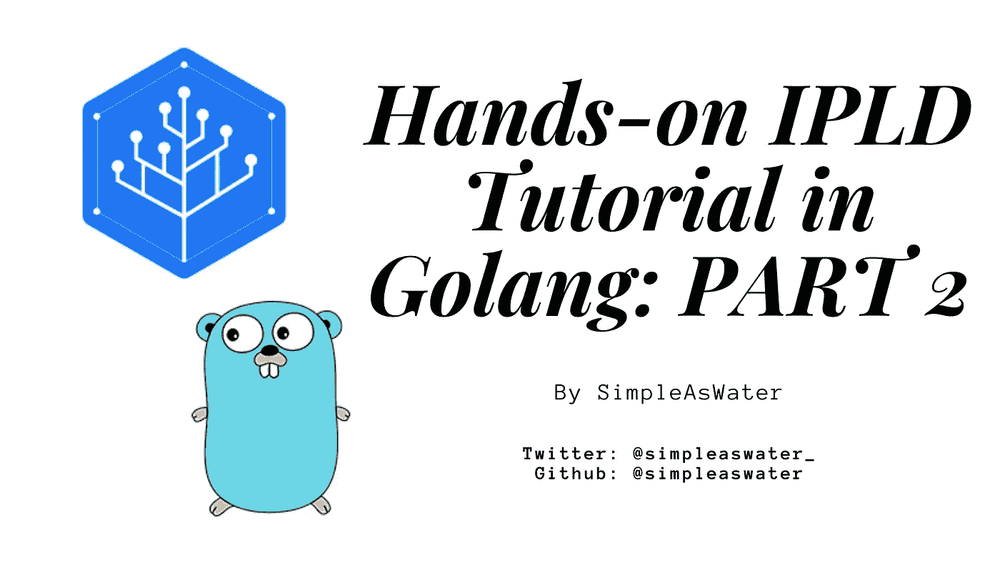

# Golang IPLD 实践教程:类似 MongoDB 的数据存储

> 原文：<https://medium.com/coinmonks/hands-on-ipld-tutorial-in-golang-mongodb-like-datastore-cc5f2f4b6a1d?source=collection_archive---------3----------------------->

## 在 IPLD 系列的这篇文章中，我们将增强当前的代码来处理文档条目，而不是键值条目。

