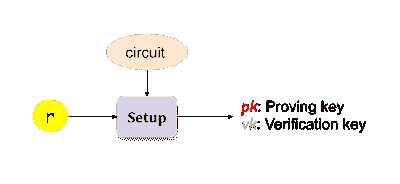
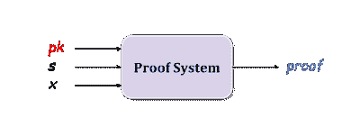
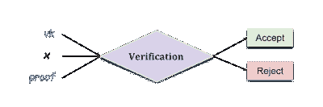

# 亲手操作您的第一个 ZK 应用程序！

> 原文：<https://medium.com/coinmonks/hands-on-your-first-zk-application-70fe3a0c0d82?source=collection_archive---------1----------------------->

> 我们开始吧！


Photo by [Clem Onojeghuo](https://unsplash.com/@clemono2) on [Unsplash](https://unsplash.com/)

在过去的一年里，zkp 的应用有了很大的增长。Zk rollup 于 2018 年底提出，目前由 [Matter Labs](https://github.com/matter-labs) 开发。Matter Labs 两个月前(2019/12)刚刚发布了 [ZK 同步](https://github.com/matter-labs/zksync)，解决了生成证明时的延迟问题。另外，我 [den3](https://github.com/iden3) 和 [ConsenSys](https://github.com/ConsenSys/liszt) 也有自己的 zk rollup 项目。以太坊研究论坛中的一项名为[基于账户的匿名汇总](https://ethresear.ch/t/account-based-anonymous-rollup/6657/1)的提议基于 zk 汇总的思想，也实现了匿名。[信号量](https://github.com/barryWhiteHat/semaphore)是基于零知识证明的信号系统。发送者可以广播任意字符串而不暴露他/她的身份。 [Semaphorejs](https://github.com/kobigurk/semaphore) 是 Semaphore 的升级版，完成了从前端网页到后端服务的整个概念。Zk-STARKs 还是很新的，刚出版不到两年，他们去年初和 0x 合作推出了基于 zk-STARKs 的[去中心化交易所](https://www.starkdex.io/)。

学术方面，去年下半年发表了很多论文。使用黑暗编译器可以使 SNARKs 透明(没有可信设置)。一些 SNARKs 可以有通用和可更新的可信设置(MARLIN、SONIC、PLONK 等。).递归的 SNARKs 也是一个惊人的。这个领域发展如此之快，很难跟上。[这里](/coinmonks/comparing-general-purpose-zk-snarks-51ce124c60bd)是一个很棒的关于不同 SNARKs 比较的帖子。[另一篇](https://nakamoto.com/cambrian-explosion-of-crypto-proofs/)要想对伊莱·本·萨松的所有 zkp 作一个概述，你必须读一读！

这里不谈什么数学，只介绍实现所需的基础。我们在本文中使用由 iden3 开发的语言 [circom](https://github.com/iden3/circom) 来帮助编写算术电路。有了 circom，实现零知识证明程序就更容易了。先介绍一些基本概念。

# 算术电路

零知识计划的实施不同于其他计划。首先，你要解决的问题需要转化为电路。(其实问题转化成多项式然后是电路)。例如，多项式 x + x +5 会变成这样的电路

```
sym_1 = x * x // sym_1 = x² 
sym_2 = sym_1 * x // sym_2 = x³ 
y = sym_2 + x // y = x³ + x 
~out = y + 5
```

Circom 编译器将逻辑转换成电路。你不需要自己处理电路。如果您需要散列或签名函数，您可以在 [circomlib](https://github.com/iden3/circomlib) 中找到它们。

# 生成/验证证据

在运行 zkp 程序之前，我们需要创建一个可信的设置。创建可信设置需要电路和一些随机数。一旦设置完成，将会生成一个**验证密钥**和一个**验证密钥**。顾名思义，生成证明需要一个，验证需要一个。(这两个密钥不同于 ECC 中的公钥/私钥)。

> 为生产生成可信设置需要更多的知识，请参考 ZCash 的[仪式](https://z.cash/technology/paramgen/)了解更多细节。



一旦证明密钥和验证密钥被创建，然后生成证明！

有两种投入，公共投入和私人投入。比如 A 转账给 B 但不想透露余额，那么 A 的余额就是私入，也叫**见证**。公共输入可以是 A 和 B 的地址或数量，这完全取决于你的设计。

然后，证明者通过**证明密钥**、**公共输入**和**见证**生成证明。



最后一步，验证！

验证者通过**公共输入**、**证明**和**验证密钥**来验证证明。



**公共输入、见证(私有输入)、证明密钥、验证密钥、电路、证明**及其关系是本节需要了解的内容！

# Circom 101

首先介绍一下 circom 的语法。根据文档，circom 使用 js 和 c 的语法，所以，有基本的操作/数据类型，像 for，while，>>，array。

这里有一个用 circom 写的例子。
假设 x，y 是我们的秘密(也就是证人)不想公开 x，y，但是需要证明 **(x * y) + z == out** (z，out 是公开输入)。假设 out = 30，z = 10，你会知道(x * y) = 20，但是你不会知道 x 和 y 各是什么。

这里介绍一下 circom 中的关键词。 **信号**:该变量将被转换成电路，具有以下特性:
。**私有**:私有输入(见证)。默认为公共
**模板**:函数声明的关键字，像 Solidity 中的*函数*或者 golang 中的 *func* 。
**组件**:文件中没有任何说明。它是一个变量类型，但赋值是一个函数。可以用关键字 **signal** 给函数内部的变量赋值。你也可以想象组件变量是类对象，信号是类中的公共成员。

有额外的操作符来操作信号变量。
**< ==，== >** :这两个运算符用来连接信号，同时隐含一个约束。
**↓、→** :这些运算符给信号赋值，但不产生任何约束。
===:这个操作符定义了一个约束。

因此， **< ==** : **，←** + **===**

这些是你开始前需要知道的关键词。这里是安装 circom/snarkjs 的[教程](https://iden3.io/blog/circom-and-snarkjs-tutorial2.html)，我们在接下来的章节中需要它。

# Circom 命令

**步骤 1。**编译电路文件。 ***circuit.json*** 会在这一步之后生成。

```
***circom sample1.circom***
```

**步骤二。**创建可信设置。将生成***proving _ key . JSON***和 **verification_key.json** 。(使用协议“groth”)

```
***snarkjs setup — protocol groth***
```

**第三步。**生成见证。这一步需要输入，所以把你的输入放在如下 json 格式的 ***input.json*** 中。

```
// input.json
{“x”:3, “y”:5, “z”: 100}
```

生成见证。 ***witness.json*** 就会生成。

```
***snarkjs calculatewitness***
```

**最后一步，**生成证明。一旦完成，就会生成 ***proof.json*** 、 ***public.json*** 。公共输入将在 **public.json** 中。

```
// public.json
{
  “115”, // → out
  “100” // → z:100
}
```

生成证明

```
***snarkjs proof***
```

调用“验证”进行验证。

```
snarkjs verify
```

以上是生成证明的基本命令。下面是一个高级示例，用来理解如何实际使用 circom 编写 zkp 程序。

# 例子

在这里，我们来实现 zk rollup！


Photo by [pixpoetry](https://unsplash.com/@blackpoetry) on [Unsplash](https://unsplash.com/)

zk 汇总是第 2 层解决方案，它不像其他第 2 层解决方案。zk 汇总将所有数据放在链上，并通过 zk-SNARKs 验证。因此，没有复杂的挑战游戏。在 zk 汇总中，用户的地址被记录在 smart contract 的 merkle 树中，使用索引(3 个字节)来表示用户的地址(地址的原始大小是 20 个字节)。通过减少数据量来增加 TPS，详情请参看[我之前的帖子](/coinmonks/zk-rollup-optimistic-rollup-70c01295231b)。

为了使例子易于理解，省略了许多细节。(本例基于[zkcroll 教程](https://keen-noyce-c29dfa.netlify.com/#6))

首先，有一个 merkle 树来记录帐户。账户内容包含(**公钥**、**余额**)。每笔交易的内容为(**发送方索引**、**接收方索引**、**金额**)。流程如下

1 检查发送方账户是否在树中(检查是否存在)
2 验证发送方签名
3 更新发送方余额并验证中间 merkle 根
4 更新接收方余额并更新 merkle 根

# 0.变量声明

```
 // account tree
  signal input account_root;
  signal private input account_pubkey[2];
  signal private input account_balance;  // new account root after sender's balance is updated
  signal private input new_sender_account_root;    // tx
  signal private input tx_sender_pubkey[2]
  signal private input tx_sender_balance
  signal private input tx_amount
  signal private input tx_sender_sig_r[2]
  signal private input tx_sender_sig_s
  signal private input tx_sender_path_element[levels]
  signal private input tx_sender_path_idx[levels]
  signal private input tx_receiver_pubkey[2]
  signal private input tx_receiver_balance
  signal private input tx_receiver_path_element[levels]
  signal private input tx_receiver_path_idx[levels]

  // output new merkle root
  signal output new_root;
```

在这种情况下，几乎所有的变量都是私有的，从公钥、余额、签名等，只有 merkle 根和更新的 merkle 根是公共的。path_element 是构造 merkle 根的中间值，path_idx 是一个索引数组，用于存储 merkle 树中每一层的索引(它是一个二叉树，所以只有左或右，0 表示左，1 表示右。最终的路径就像一个二进制字符串，001011)

# 1.检查发件人是否存在

```
 //__1\. verify sender account existence
 **component** senderLeaf = ***HashedLeaf***();
 senderLeaf.pubkey[0] <== tx_sender_pubkey[0];
 senderLeaf.pubkey[1] <== tx_sender_pubkey[1];
 senderLeaf.balance <== account_balance; **component** senderExistence = ***GetMerkleRoot***(levels);
 senderExistence.leaf <== senderLeaf.out;  for (var i=0; i<levels; i++) {
     senderExistence.path_index[i] <== tx_sender_path_idx[i];
     senderExistence.path_elements[i] <== tx_sender_path_element[i];
 } senderExistence.out === account_root;
```

我们可以在这里看到**组件**是如何工作的， ***组件 senderLeaf = hashedlaf()；*** *。***hashedlaf()*被分配给*senderelaf*，使用< ==将公钥和余额分配给*hashedlaf()*中的值( *pubkey[0]、pubkey[1]、balance* 这些都是信号类型)，并生成电路。哈希值将是 *senderLeaft.out* 。*

*这个片段很简单，散列发送者的公钥并进行平衡，用 merkle 树的中间值进行计算，然后得到 merkle 根( *senderExistence.out* )。检查计算出的 merkle 根与输入的相同( *account_root* )。*

*为简单起见，跳过 merkle 树和 hash 函数的实现，可以检查实现 [HashedLeaf](https://github.com/KimiWu123/Samples/blob/master/circom/rollupSample/rollup.circom#L75) 和 [GetMerkleRoot](https://github.com/KimiWu123/Samples/blob/master/circom/rollupSample/rollup.circom#L43) 。*

# *2.检查发件人的签名*

```
 *//__2\. verify signature
  **component** msgHasher = ***MessageHash***(5);
  msgHasher.ins[0] <== tx_sender_pubkey[0];
  msgHasher.ins[1] <== tx_sender_pubkey[1];
  msgHasher.ins[2] <== tx_receiver_pubkey[0];
  msgHasher.ins[3] <== tx_receiver_pubkey[1];
  msgHasher.ins[4] <== tx_amount

  **component** sigVerifier = ***EdDSAMiMCSpongeVerifier***(); 
  sigVerifier.enabled <== 1;
  sigVerifier.Ax <== tx_sender_pubkey[0];
  sigVerifier.Ay <== tx_sender_pubkey[1];
  sigVerifier.R8x <== tx_sender_sig_r[0];
  sigVerifier.R8y <== tx_sender_sig_r[1];
  sigVerifier.S <== tx_sender_sig_s;
  sigVerifier.M <== msgHasher.out;*
```

*就像区块链交易一样，需要签名来证明你是汇款人。在这个代码片段中，我们首先对消息进行哈希处理，然后对哈希处理后的消息进行签名。我把所有东西都封装到函数中，所以和第一部分非常相似，只是调用了不同的函数。*

> *SNARKs 中的签名方案是 EdDSA，而不是 ECDSA。*

# *3.更新发件人的平衡，并检查新的 Merkle 根*

```
 *//__3\. Check the root of new tree is equivalent
 **component** newAccLeaf = ***HashedLeaf***();
 newAccLeaf.pubkey[0] <== tx_sender_pubkey[0];
 newAccLeaf.pubkey[1] <== tx_sender_pubkey[1];
 newAccLeaf.balance <== account_balance - tx_amount;

 **component** newTreeExistence = ***GetMerkleRoot***(levels);
 newTreeExistence.leaf <== newAccLeaf.out;
 for (var i=0; i<levels; i++) {
   newTreeExistence.path_index[i] <== tx_sender_path_idx[i];
   newTreeExistence.path_elements[i] <== tx_sender_path_element[i];
 } newTreeExistence.out === new_sender_account_root;*
```

*前两步是从发送方检查信息。在这些检查之后，我们更新发送者的余额并计算新的 merkle 根。**最后一行，*new tree existence . out = = = new _ sender _ account _ root；*** ，是检查计算出的 merkle 根和输入的一个( *new_sender_account_root* )是否相同。通过这种检查，防止用户的虚假/错误输入。*

# *4.更新接收方的余额和 Merkle 根*

```
 *//__5\. update the root of account tree
 **component** newReceiverLeaf = ***HashedLeaf***();
 newReceiverLeaf.pubkey[0] <== tx_receiver_pubkey[0];
 newReceiverLeaf.pubkey[1] <== tx_receiver_pubkey[1];
 newReceiverLeaf.balance <== tx_receiver_balance + tx_amount;

 **component** newReceiverTreeExistence = ***GetMerkleRoot***(levels);
 newReceiverTreeExistence.leaf <== newReceiverLeaf.out;
 for (var i=0; i<levels; i++) {
  newReceiverTreeExistence.path_index[i]<==tx_receiver_path_idx[i];
  newReceiverTreeExistence.path_elements[i] 
  <==tx_receiver_path_element[i];
 }

 new_root <== newReceiverTreeExistence.out;*
```

*最后一步，更新接收者的余额，计算新的 merkle 根并输出新的 merkle 根。一旦电路被制造出来，它就像一个黑盒子。如果输入正确的值，输出也一定是正确的。因此，用户很容易检查这些值，以防止恶意中间人。这就是为什么我们需要在电路的末端输出一些东西(在我们的例子中是 merkle 根)。*

*zk rollup 聚合许多上述事务，并生成一个证明以减少数据大小。为了使示例易于理解，这里只处理一个事务。[这里的](https://github.com/KimiWu123/Samples/blob/master/circom/rollupSample/rollup.circom)是完整示例代码的链接，[其他常见示例](https://github.com/KimiWu123/Samples/tree/master/circom)。*

# ***结论***

*Circom 是一个非常新的语言，现在支持的库不多，很多功能需要我们自己实现。幸运的是，iden3 实现了许多哈希、签名函数和其他哈希或 merkle 树函数，这些函数可以在 Semaphore 或其他 zk rollup 实现中找到。调用不同的函数来完成你的应用，就像搭积木一样。从实现的角度来看，这并不困难(尽管缺少文档，但阅读源代码是必需的)。对我们的工程师来说，最困难的部分是在实现之前，我们需要了解许多密码学知识。*

*另外，哈希函数的选择也很重要。如何降低电路的复杂度，同时又保证足够的安全性，是另一个课题。*

*除了 circom，ZoKrates 也是另一种帮助编写算术电路的语言。这两个工具都可以生成智能合约，可以验证零知识证明。然后，对于 dapp 开发者来说，只要继承这个契约，构建自己的业务逻辑。如何生成可验证的契约以及如何与契约进行交互不是这篇文章的范围，可能会有另一篇文章来解释它。就在我写完这篇文章之前，Matter Labs 刚刚发布了另一种实现电路的语言 [Zinc](/matter-labs/release-of-zinc-v0-1-8d949aa9a2f2) 。*

**欢迎任何需要纠正的反馈或错误。**

**感谢* [*梁志成*](https://medium.com/u/5c031577a87d?source=post_page-----d7ac1fa8bbd3----------------------) *的点评**

> *[直接在您的收件箱中获得最佳软件交易](https://coincodecap.com/?utm_source=coinmonks)*

*[](https://coincodecap.com/?utm_source=coinmonks)**[](https://coincodecap.com)*