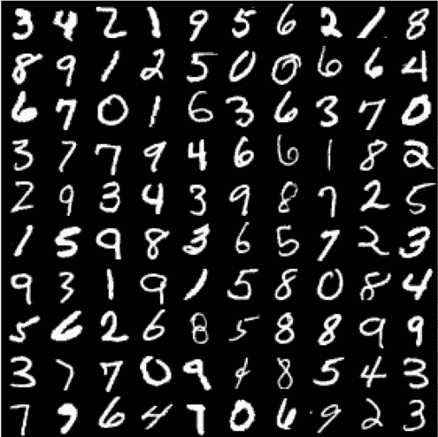
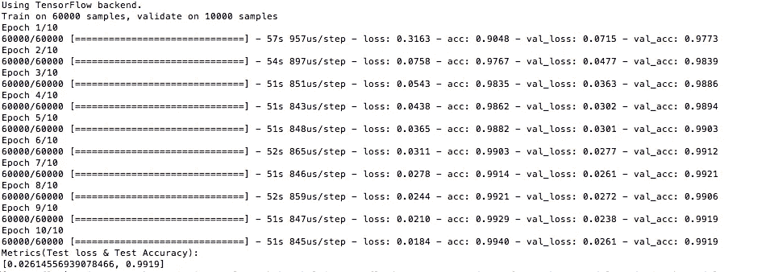
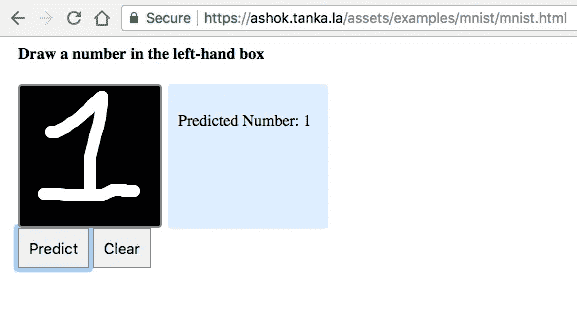

# 在 TensorFlow 中使用卷积神经网络进行手写数字预测

> 原文：<https://medium.com/coinmonks/handwritten-digit-prediction-using-convolutional-neural-networks-in-tensorflow-with-keras-and-live-5ebddf46dc8?source=collection_archive---------1----------------------->

每当我们开始学习一门新的编程语言时，我们总是从 **Hello World** 程序开始。同样，大多数 AI/ML 开发者说“就像编程有 Hello World，机器学习有 MNIST”。



像所有人一样，我想从那里开始。事实上，我想写我的第一篇关于 MNIST 的文章/故事，但这听起来并不令人兴奋，因为互联网上有很多 MNIST 的文章。我希望我的文章/故事与众不同，所以我想用代码为什么我不能分享一个活生生的例子呢？

让我们开始吧。我希望你的系统里有 TensorFlow，Keras 如果没有请阅读[我以前的文章](/@ashok.tankala/build-your-first-deep-learning-neural-network-model-using-keras-tensorflow-in-python-a3e76a6b3ccb)。[它](/@ashok.tankala/build-your-first-deep-learning-neural-network-model-using-keras-tensorflow-in-python-a3e76a6b3ccb)有如何安装它们的说明。

首先，让我们导入所有必需的库。

```
import numpy
from keras.datasets import mnist
from keras.models import Sequential
from keras.layers import Dense
from keras.layers import Dropout
from keras.layers import Flatten
from keras.layers.convolutional import Conv2D
from keras.layers.convolutional import MaxPooling2D
from keras.optimizers import Adam
from keras.utils import np_utils
```

接下来，让我们加载 Keras 提供的 MNIST 数据

```
# load data
(X_train, y_train), (X_test, y_test) = mnist.load_data()
```

数据集(训练和测试)是 3D 阵列。训练数据集形状为(60000，28，28)，测试数据集形状为(10000，28，28)。

CNN 期望的输入形状是一个 4D 数组(批次、高度、宽度、通道)。通道表示图像是灰度的还是彩色的。在我们的例子中，我们使用灰度图像，所以如果这些是彩色图像，我们给通道 1，给 3(RGB)。重塑我们输入的代码。

```
# Reshaping to format which CNN expects (batch, height, width, channels)
X_train = X_train.reshape(X_train.shape[0], X_train.shape[1], X_train.shape[2], 1).astype('float32')X_test = X_test.reshape(X_test.shape[0], X_test.shape[1], X_test.shape[2], 1).astype('float32')
```

数据规范化总是好的。我们的数据集每个像素的数据在 0–255 之间，所以现在我们使用下面的代码将其缩放到 0–1。

```
# normalize inputs from 0-255 to 0-1
X_train/=255
X_test/=255
```

我们的输出范围在 0–9 之间。所以，这是一个多类分类问题。所有值(输出)都等于 us，所以最好使用**一键编码**。一键编码将整数转换为二进制矩阵，其中数组只包含一个“1”，其余元素为“0”。

例如，我们期望输出为 8 表示输出变量 8 的值，因此根据一键编码，其[0，0，0，0，0，0，1，0]

```
# one hot encode
number_of_classes = 10
y_train = np_utils.to_categorical(y_train, number_of_classes)
y_test = np_utils.to_categorical(y_test, number_of_classes)
```

现在让我们建立模型

```
# create model
model = Sequential()
model.add(Conv2D(32, (5, 5), input_shape=(X_train.shape[1], X_train.shape[2], 1), activation='relu'))
model.add(MaxPooling2D(pool_size=(2, 2)))
model.add(Conv2D(32, (3, 3), activation='relu'))
model.add(MaxPooling2D(pool_size=(2, 2)))
model.add(Dropout(0.2))
model.add(Flatten())
model.add(Dense(128, activation='relu'))
model.add(Dense(number_of_classes, activation='softmax'))
```

让我们一步步理解上面的代码。

1.  第一个隐藏层是一个卷积层，称为卷积 2D。该层有 32 个滤波器/输出通道，大小为 5×5，具有激活功能。这是输入层，需要具有上述结构(高度、宽度、通道)的图像。
2.  第二层是 MaxPooling 层。MaxPooling 层用于对输入进行下采样，以使模型能够对特征进行假设，从而减少过拟合。它还减少了要学习的参数数量，减少了训练时间。
3.  多一个隐藏层，具有 32 个大小为 3×3 的滤波器/输出通道和一个激活功能。
4.  多一个 MaxPooling 层。
5.  下一个图层是正则化图层，使用了称为 dropout 的 Dropout。它被配置为随机排除该层中 20%的神经元，以减少过度拟合。
6.  下一层将 2D 矩阵数据转换为称为展平的矢量。它允许输出由标准的全连接层处理。
7.  下一层是具有 128 个神经元的全连接层。
8.  下一层(最后一层)是具有 10 个神经元(输出类的数量)的输出层，它使用 softmax 激活函数。每个神经元将给出该类的概率。这是一个多类分类，这就是为什么 softmax 激活函数，如果是一个二元分类，我们使用 sigmoid 激活函数。

让我们编译模型。我使用**分类交叉熵**作为损失函数，因为这是一个多类分类问题。我使用**亚当**作为优化器，以确保我们的权重得到适当优化。我使用**准确度**作为衡量标准来提高我们神经网络的性能。

```
# Compile model
model.compile(loss='categorical_crossentropy', optimizer=Adam(), metrics=['accuracy'])
```

我们的模特训练时间到了。该模型将适合超过 10 个时期，并在每 200 幅图像训练后更新。测试数据用作验证数据集，允许您在模型训练时查看模型的技能。

```
# Fit the model
model.fit(X_train, y_train, validation_data=(X_test, y_test), epochs=10, batch_size=200)
```

我想用我自己的图像来测试我的训练模型，所以我想把我的模型存储在我的本地硬盘上。

```
# Save the model
model.save('models/mnistCNN.h5')
```

测试数据集用于评估模型，评估后将打印测试损失和测试准确性指标。

```
# Final evaluation of the model
metrics = model.evaluate(X_test, y_test, verbose=0)
print("Metrics(Test loss & Test Accuracy): ")
print(metrics)
```

我得到了大约 99.19%的准确率。您将在我的 GitHub 库中找到这个名为 mnistCNN.py 的示例代码。



完成后，我没有得到满意，因为它运行在 Keras 提供的数据。我想用自己的数据来验证我训练好的模型。所以我自己创建了一些图片&把图片存储在我的数据文件夹中，然后用我的模型检查。结果看起来不错。这个的代码

```
# Importing the Keras libraries and packages
from keras.models import load_model
model = load_model('models/mnistCNN.h5')from PIL import Image
import numpy as npfor index in range(10):
    img = Image.open('data/' + str(index) + '.png').convert("L")
    img = img.resize((28,28))
    im2arr = np.array(img)
    im2arr = im2arr.reshape(1,28,28,1)
    # Predicting the Test set results
    y_pred = model.predict(im2arr)
    print(y_pred)
```

你可以在[我的 GitHub 库](https://github.com/tankala/ai-examples)找到上面的代码、图片和模型文件。要运行以上代码，你需要 **Pillow** 包。你需要运行下面的命令来获得这个包。

```
pip3 install pillow
```

但是，我仍然不满意，所以我想让我们做更多的事情。我们都知道 Google 引入了 TensorFlow.js。我听说我们也可以使用现有的模型。所以我想为什么不为这个例子建立一个小页面。从这里开始，旅程变得更加激动人心。

首先，我们需要用户可以画出数字的画布。为此，我借助[这篇文章](https://zipso.net/a-simple-touchscreen-sketchpad-using-javascript-and-html5/)写了一个 HTML。

现在，我们希望我们的模型在浏览器级别使用，因为我们需要转换成 TensorFlow.js 可以使用的格式。为了这个任务，[这篇文章](https://js.tensorflow.org/tutorials/import-keras.html)帮了我。要将 Keras 模型转换为 TensorFlow js 可消耗模型，我们需要 **tensorflowjs_converter** 。为此我们需要安装 **tensorflowjs** 包。

```
pip3 install tensorflowjs
```

我使用下面的命令来转换格式

```
tensorflowjs_converter --input_format keras models/mnistCNN.h5 models/
```

现在，模型文件&模型的两个支持文件将在 models 文件夹中创建。用这些(model.json，group1-shard1of1，group2-shard1of1，group3-shard1of1，group4-shard1of1)名字。这些将帮助我们使用我们训练过的 DL(深度学习)模型。

现在我要揭示我们这个故事的秘密成分

我将在这里解释 3 件重要的事情，其余的都很简单。一切从 TensorFlow.js 脚本包含开始。需要将 TensorFlow.js 添加到 HTML 文件的下面一行。

```
<script src="https://cdn.jsdelivr.net/npm/@tensorflow/tfjs@0.11.2"> </script>
```

接下来是我们的 **init** 函数。在这个 init 函数中有两行很重要。

1.我使用了 async 函数，因为我想确保在使用这个例子之前模型已经被加载。这就是为什么在加载模型时使用 await。

2.加载模型。为此使用下面的代码。

```
model = await tf.loadModel('model.json');
```

下一个最重要的，我们的**预测**功能。

```
function predict() {
   const imageData = ctx.getImageData(0, 0, 140, 140);
   //convert to tensor
   var tfImg = tf.fromPixels(imageData, 1);
   //Resize the image
   var smalImg = tf.image.resizeBilinear(tfImg, [28, 28]);
   smalImg = tf.cast(smalImg, 'float32');
   var tensor = smalImg.expandDims(0);
   tensor = tensor.div(tf.scalar(255));
   const prediction = model.predict(tensor);
   const predictedValues = prediction.dataSync();
   var isThereAnyPrediction = false;
   for (index = 0; index < predictedValues.length; index++) {
      if (predictedValues[index] > 0.5) {
         isThereAnyPrediction = true;
         document.getElementById('rightside').innerHTML = '<br/>Predicted Number: ' + index;
      }
   }
   if (!isThereAnyPrediction) {
      document.getElementById('rightside').innerHTML = '<br>Unable to Predict';
   }
}
```

让我们一步步理解上面的代码。

1.  首先，我们从画布中提取灰度图像。
2.  然后将该图像转换为张量(数组)
3.  我们想要 28*28 的数组(图片),所以我们正在调整数组的大小
4.  我们希望数据采用 float32 格式，所以我们将数据类型转换为 float32 格式
5.  我们需要模型的[1，28，28，1]形状，因为它需要(批次，高度，宽度，通道)
6.  我们需要将数据标准化，所以我们将数据除以 255。
7.  然后试着预测这个数字

你可以在我的另一个 GitHub 库中找到这段代码。

这里可以看到它的活生生的例子[。它并不完美，但表现得体。](https://ashok.tanka.la/mnist.html)



和平。快乐编码。
[这里看我的原创文章。](https://blog.tanka.la/2018/05/27/handwritten-digit-prediction-using-convolutional-neural-networks-in-tensorflow-with-keras-and-live-example-using-tensorflow-js/)

> 加入 Coinmonks [电报频道](https://t.me/coincodecap)和 [Youtube 频道](https://www.youtube.com/c/coinmonks/videos)获取每日[加密新闻](http://coincodecap.com/)

## 另外，阅读

*   [复制交易](/coinmonks/top-10-crypto-copy-trading-platforms-for-beginners-d0c37c7d698c) | [加密税务软件](/coinmonks/crypto-tax-software-ed4b4810e338)
*   [网格交易](https://coincodecap.com/grid-trading) | [加密硬件钱包](/coinmonks/the-best-cryptocurrency-hardware-wallets-of-2020-e28b1c124069)
*   [密码电报信号](http://Top 4 Telegram Channels for Crypto Traders) | [密码交易机器人](/coinmonks/crypto-trading-bot-c2ffce8acb2a)
*   [最佳加密交易所](/coinmonks/crypto-exchange-dd2f9d6f3769) | [印度最佳加密交易所](/coinmonks/bitcoin-exchange-in-india-7f1fe79715c9)
*   [开发人员的最佳加密 API](/coinmonks/best-crypto-apis-for-developers-5efe3a597a9f)
*   最佳[密码借贷平台](/coinmonks/top-5-crypto-lending-platforms-in-2020-that-you-need-to-know-a1b675cec3fa)
*   [SmithBot 评论](https://coincodecap.com/smithbot-review) | [4 款最佳免费开源交易机器人](https://coincodecap.com/free-open-source-trading-bots)
*   [比特币基地僵尸程序](/coinmonks/coinbase-bots-ac6359e897f3) | [AscendEX 审查](/coinmonks/ascendex-review-53e829cf75fa) | [OKEx 交易僵尸程序](/coinmonks/okex-trading-bots-234920f61e60)
*   [如何在印度购买比特币？](/coinmonks/buy-bitcoin-in-india-feb50ddfef94) | [WazirX 评论](/coinmonks/wazirx-review-5c811b074f5b)
*   [加密交易机器人](/coinmonks/crypto-trading-bot-c2ffce8acb2a) | [菜鸟评论](https://coincodecap.com/probit-review)
*   [隐料斗替代品](/coinmonks/cryptohopper-alternatives-d67287b16d27) | [HitBTC 审查](/coinmonks/hitbtc-review-c5143c5d53c2)
*   [CBET 评论](https://coincodecap.com/cbet-casino-review) | [库科恩 vs 比特币基地](https://coincodecap.com/kucoin-vs-coinbase)
*   [折 App 回顾](https://coincodecap.com/fold-app-review) | [库币交易机器人](/coinmonks/kucoin-trading-bot-automate-your-trades-8cf0ca2138e0)
*   [免费加密信号](/coinmonks/free-crypto-signals-48b25e61a8da) | [加密交易机器人](/coinmonks/crypto-trading-bot-c2ffce8acb2a)
*   [杠杆代币](/coinmonks/leveraged-token-3f5257808b22)终极指南