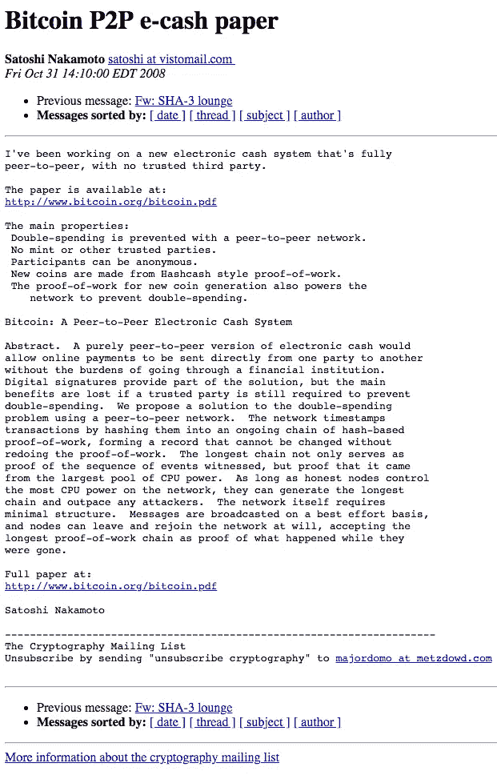

# 比特币生日快乐

> 原文：<https://medium.com/coinmonks/happy-birthday-bitcoin-7f81ab8a362d?source=collection_archive---------7----------------------->

2009 年 1 月 3 日，世界协调时 18:15:05，中本聪开采了比特币 Genesis Block，就在著名的[白皮书](https://bitcoin.org/bitcoin.pdf)发布 64 天后。

[https://images.unsplash.com/photo-1519162584292-56dfc9eb5db4?ixlib=rb-1.2.1&ixid=eyJhcHBfaWQiOjEyMDd9&auto=format&fit=crop&w=500&q=60](https://images.unsplash.com/photo-1519162584292-56dfc9eb5db4?ixlib=rb-1.2.1&ixid=eyJhcHBfaWQiOjEyMDd9&auto=format&fit=crop&w=500&q=60)

[http://www.metzdowd.com/pipermail/cryptography/2008-October/014810.html](http://www.metzdowd.com/pipermail/cryptography/2008-October/014810.html)