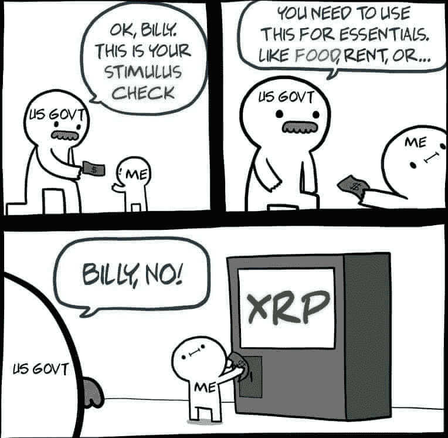
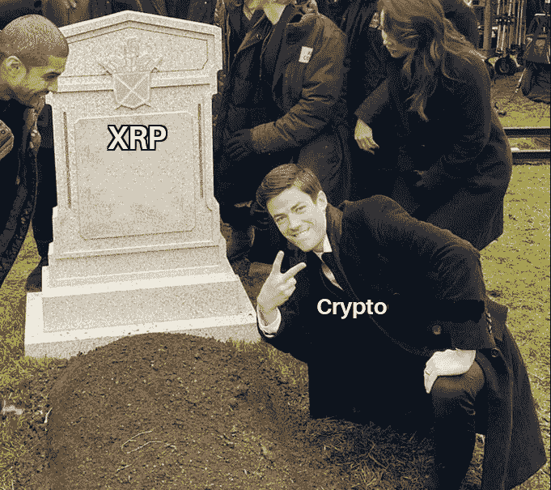
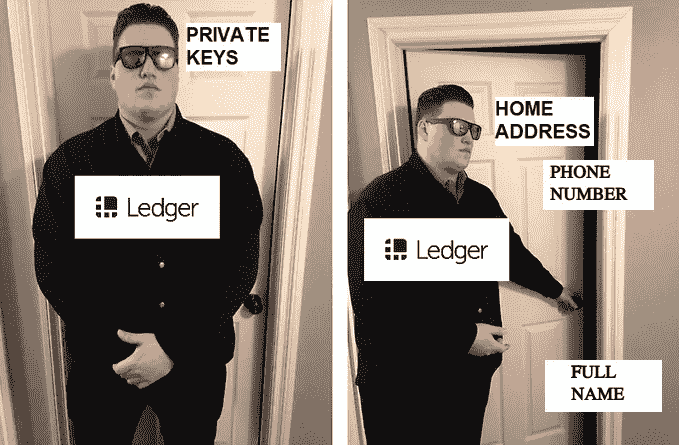
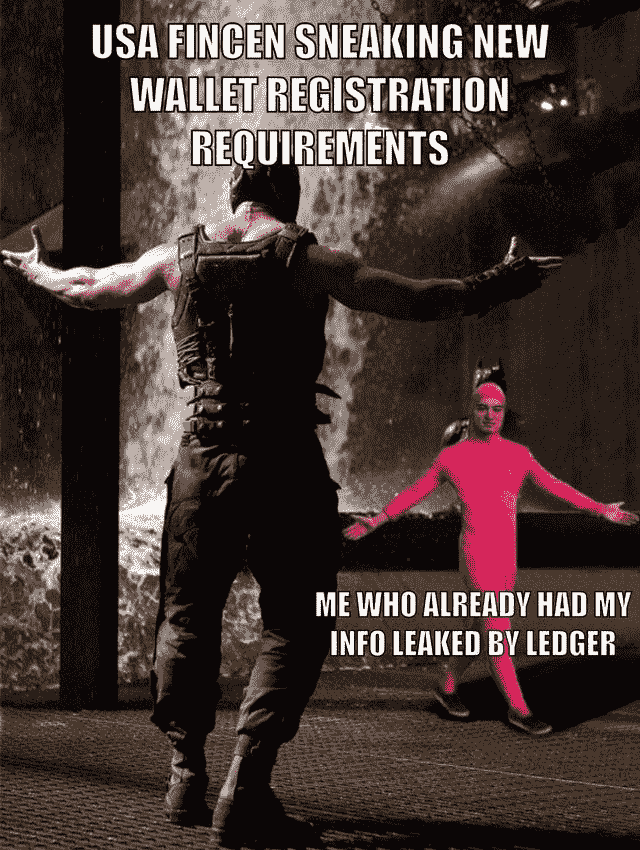
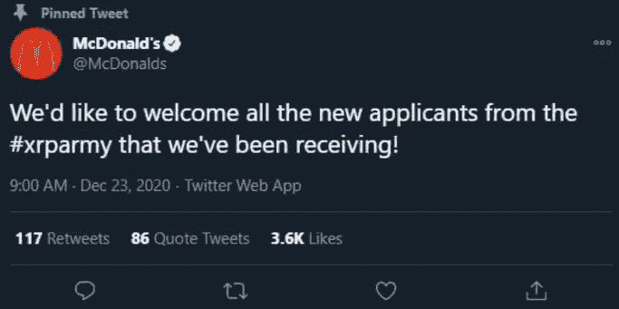

# 新年快乐💌/每个人都在倾销$XRP

> 原文：<https://medium.com/coinmonks/happy-new-year-every-one-is-dumping-xrp-e38ae0dcde?source=collection_archive---------6----------------------->

[Source](https://twitter.com/emetismail/status/1343652295553118208/photo/1)

## 印度考虑对比特币交易征收 18%的税/日本准备推出自己的数字货币

对每个人来说，这都是艰难的一年。许多人失去了他们的朋友和家人。让我们想想他们，并希望 2021 年将为我们所有人带来最好的。祝节日快乐，新年快乐！！享受吧，你值得拥有。 ❤️

*   Ripple 创始人通过向散户投资者抛售 XRP 赚了 6 亿美元(据称)。现在 [SEC 紧随项目](https://www.sec.gov/news/press-release/2020-338)而来，Ripple 的首席执行官加林豪斯正试图团结整个加密市场，抛弃比特币和以太坊。他忘记了 Ripple 在加密方面没有盟友，它将成为历史上最糟糕的硬币。(不是理财建议)。
*   日本正准备在公共和私营部门推出一种数字货币，紧随中国之后。中国正处于推出自己的数字货币的试验阶段。
*   Anthony Scaramucci 的 Skybridge Capital 已经代表其投资基金向比特币投资了多达 1.82 亿美元。

## [Pionex](http://blog.coincodecap.com/go/pionex)

试试专业的加密交易所 Pionex，它有免费的加密交易机器人来自动完成你的交易。阅读我们的 [Pionex 评论](/coinmonks/pionex-review-exchange-with-crypto-trading-bot-1e459d0191ea)并查看我们的[最佳加密交易机器人](/coinmonks/crypto-trading-bot-c2ffce8acb2a)列表。

## 最新消息📰

*   [OKCoin](https://www.theblockcrypto.com/linked/89402/okcoin-suspending-xrp-trading-deposits) 、 [Bittrex、比特币基地](https://cointelegraph.com/news/bittrex-joins-coinbase-in-delisting-ripple-s-xrp-following-sec-lawsuit)和 [Bitstamp](https://www.theblockcrypto.com/linked/89241/bitstamp-to-halt-trading-of-xrp) 正在暂停 XRP 的交易和存款
*   印度考虑对比特币交易征收 18%的税
*   T21 准备推出自己的数字货币
*   DeFi 协议封面[被利用](https://www.theblockcrypto.com/post/89368/defi-protocol-cover-exploited-attackers-minted-at-least-40-quintillion-tokens)，攻击者，铸造了至少 40 万亿个令牌
*   Russell Okung 成为[首位获得比特币支付的 NFL 球员](https://www.coindesk.com/panthers-russell-okung-becomes-first-nfl-player-to-be-paid-in-bitcoin)
*   据 deck 报道，Anthony Scaramucci 的 Skybridge)已经向比特币投资了 1 . 82 亿美元
*   比特币矿工每小时赚 100 万美元。
*   英国加密交易所 EXMO 称 400 万美元的被黑资金是通过 Poloniex
*   Tierion torRepay ICO [投资者高达 2500 万美元](https://www.coindesk.com/tierion-sec-settlement-tnt)外加 SEC 结算利息
*   日本互联网巨头获准在纽约发行第一枚与日元挂钩的稳定币

> *报税季即将到来，使用最好的* [***加密报税软件***](/coinmonks/best-crypto-tax-tool-for-my-money-72d4b430816b) *来申报你的加密报税吧。*

[Source](https://www.reddit.com/r/CryptoCurrency/comments/kk8q28/rip_ripple/)

> BlockFi 首次推出加密奖励信用卡。在日常购物中获得 1.5%的比特币奖励。现在加入等候名单。

## 好的读物📑

*   动物行为学:以太坊黑暗森林中的狩猎之旅
*   为什么我改变了对代币的想法
*   如何[确保](/mycrypto/how-to-ensure-youre-running-the-legitimate-version-of-metamask-5fcd8ab32b96)您运行的是元掩码的合法版本
*   账本数据黑客显示[加密存储](https://thedefiant.io/ledger-data-hack-shows-crypto-storage-is-a-catch-22/)是第二十二条军规(**必须读**给账本钱包主人 **)** 。
*   使用骰子生成[设备](/coinmonks/generating-device-seeds-using-dice-894082d43aea)种子
*   在 Golang 中创建[原始多签名 P2SH 比特币](/coinmonks/build-p2sh-address-and-spend-its-fund-in-golang-1a03a4131512)交易
*   俳句书，一个[由来](https://thehaikubook.org/the-haiku-book-an-origin-story/)的故事
*   如何[让你的电脑](https://decrypt.co/52436/how-to-make-your-computer-safe-for-crypto-trading)安全进行加密交易
*   太空入侵者:发射密码进入轨道

> *买一个* [***硬件钱包***](/coinmonks/the-best-cryptocurrency-hardware-wallets-of-2020-e28b1c124069)*[*保护你的加密货币*](/coinmonks/how-to-prevent-cryptocurrency-hacking-and-theft-from-your-wallet-65c8ff767766) *。**

**

*[Source](https://www.reddit.com/r/CryptoCurrency/comments/kk8mgm/ledger_security/)*

## *开发商*

*   *[可重复](https://mooniversity.io/posts/gitian-1)使用 Gitian 构建*
*   *分片+ DAS 提案的[解释](https://hackmd.io/@HWeNw8hNRimMm2m2GH56Cw/sharding_proposal)*
*   *使用 DeFi Pulse API 获取 [DeFi 项目数据](/coinmonks/get-defi-projects-data-with-defi-pulse-api-81721f8e6dd2)*
*   *构建，[部署](https://blog.chain.link/build-deploy-and-sell-your-own-dynamic-nft/)，出售自己的动态 NFT*
*   *Web3 开发者最头疼的 5 大问题*
*   *亚马逊管理的区块链[现在支持](https://aws.amazon.com/about-aws/whats-new/2020/12/amazon-managed-blockchain-supports-ethereum/)以太坊*
*   *[光环](https://eprint.iacr.org/2019/1021.pdf)，零知识证明系统*
*   *[可靠性基础](/coinmonks/solidity-fundamentals-a71bf54c0b98):数据位置和分配行为*
*   *[AIR-FI](https://arxiv.org/pdf/2012.06884.pdf) :从有气隙的电脑产生隐蔽的 Wi-Fi 信号*

> *想成为以太网和 **Web3 开发者**？[从这里开始](http://blog.coincodecap.com/go/learn)。*

## *多方面的*

*   *Cairo——证明一般计算的图灵完整框架*
*   *[Multisol](https://github.com/paulrberg/multisol) — Multisol 是一个 CLI 应用程序，用于在 Etherscan 上验证可靠性合同*
*   *[使用元掩码](https://github.com/mdtanrikulu/use-metamask) —一个定制的 React 挂钩，用于管理以太坊 App 项目中的元掩码*

## *播客和视频💽*

*   *[以太坊](http://podcast.banklesshq.com/ethereum-vs-the-stable-act-rohan-grey) vs 稳定法案*
*   *城堡派遣 0.0.1 :鲁道夫·诺瓦克&埃文·卡鲁迪斯*

**

*[Source](https://www.reddit.com/r/Bitcoin/comments/kj92r6/im_immune_to_this_news/)*

## *黑客马拉松、活动和峰会*

*   *[Inout 7.0](https://portis.medium.com/inout-7-0-virtual-hackathon-challenge-122591bb55e8) 虚拟黑客马拉松挑战赛*
*   *分散式[网络西雅图](https://www.meetup.com/ProtoSchool-Seattle-Learn-to-Make-the-Decentralized-Web/events/274586198/)于 12 月 17 日召开会议*
*   *ETHGlobal 的 [Market Make](https://marketmake.ethglobal.co/) 黑客马拉松*

## *加密交易和折扣🔖*

*   *注册参加[**by bit**](/coinmonks/bybit-exchange-review-dbd570019b71)exchange，赢取高达 625 美元的奖金。*
*   *试用 [**Altrady**](http://blog.coincodecap.com/go/altrady) 并使用优惠券代码 **COINMONKS** 获得 40%的折扣(年度计划)和 10%的折扣(月度计划)*
*   *试用 [**Coinrule**](https://webapp.coinrule.io/coupon/coinmonks-7-25-3-e2bf6c60e795407381edf98d1a174ac2?fp_ref=coincodecap) ，使用 [**此链接**](https://webapp.coinrule.io/coupon/coinmonks-7-25-3-e2bf6c60e795407381edf98d1a174ac2?fp_ref=coincodecap) 可获得 7 天免费试用和 3 个月 25%优惠。*

## *产品评论和其他加密软件📙*

*   *[莱杰 vs 特雷佐](/coinmonks/ledger-nano-s-vs-x-battery-hardware-price-storage-59a6663fe3b0)*
*   *[区块链审查](/coinmonks/blockfi-review-53096053c097)*
*   *[AAX 交易所评论](/coinmonks/aax-exchange-review-2021-67c5ea09330c)*
*   *[Bitsgap vs 3 commas vs quad ency](/coinmonks/bitsgap-vs-3commas-vs-quadency-must-read-2021-cdc1a40cf31d)*
*   *[Cryptohopper vs HaasBot](https://blog.coincodecap.com/cryptohopper-vs-haasbot)*
*   *[Pionex 审查](/coinmonks/pionex-review-exchange-with-crypto-trading-bot-1e459d0191ea)*
*   *密码[复制交易](/coinmonks/top-10-crypto-copy-trading-platforms-for-beginners-d0c37c7d698c)机器人*
*   *[Stackedinvest 审查](https://blog.coincodecap.com/stackedinvest-review)*
*   *[Deribit 审查](/coinmonks/deribit-review-options-fees-apis-and-testnet-2ca16c4bbdb2) —选项、费用、API 和测试网*
*   *[总账 vs 平均](https://blog.coincodecap.com/ngrave-vs-ledger)*
*   *[you hodler Review](/coinmonks/youhodler-4-easy-ways-to-make-money-98969b9689f2)——从您的密码中赚取 12%的利息*

*想让我们展示你的产品吗？请通过 [Twitter @coinmonks](https://twitter.com/coinmonks) 联系我们*

## *XRP😆*

**

*[source](https://www.reddit.com/r/CryptoCurrency/comments/kk8ny0/who_said_flippening_aint_happening/)*

## *乔布斯👷*

*   *[DevOps 工程师](https://remoteok.io/remote-jobs/100451-remote-devops-engineer-district0x)，0x 区，远程*
*   *[生态系统开发者](https://jobs.lever.co/3box/ec1093c5-ed31-483c-b1b3-49b07bd0bd2e)，3 盒，远程*
*   *[位于 mStable 的 BD](https://angel.co/company/mstable/jobs/1096364-business-development-manager)*
*   *[动作设计师](https://cryptocurrencyjobs.co/design/kraken-digital-asset-exchange-motion-designer/) —北海巨妖*
*   *[全栈工程师](https://cryptocurrencyjobs.co/engineering/zapper-full-stack-engineer/) —扎珀*
*   *[高级前端工程师](https://cryptocurrencyjobs.co/engineering/uma-senior-front-end-engineer/) —乌玛*
*   *SigmaPrime，[区块链安全工程师](https://blog.sigmaprime.io/blockchain-security-engineer.html)*
*   *0x 寻找各种类型的[开发人员](https://0x.org/about/jobs)和一名[抹茶营销经理](https://boards.greenhouse.io/0x/jobs/4923909002)*
*   *Nexus Mutual: [在欧洲时区经历了稳健发展](https://angel.co/company/nexus-mutual-1/jobs/967538-smart-contract-engineer)*

## *在 Coinmonks 上发布*

*如果你喜欢在 crypto/区块链空间上写教育文章，并且想在 Coinmonks 出版物上发表。只需在**邮件我或者 DM 我**[***推特***](https://twitter.com/coinmonks)***