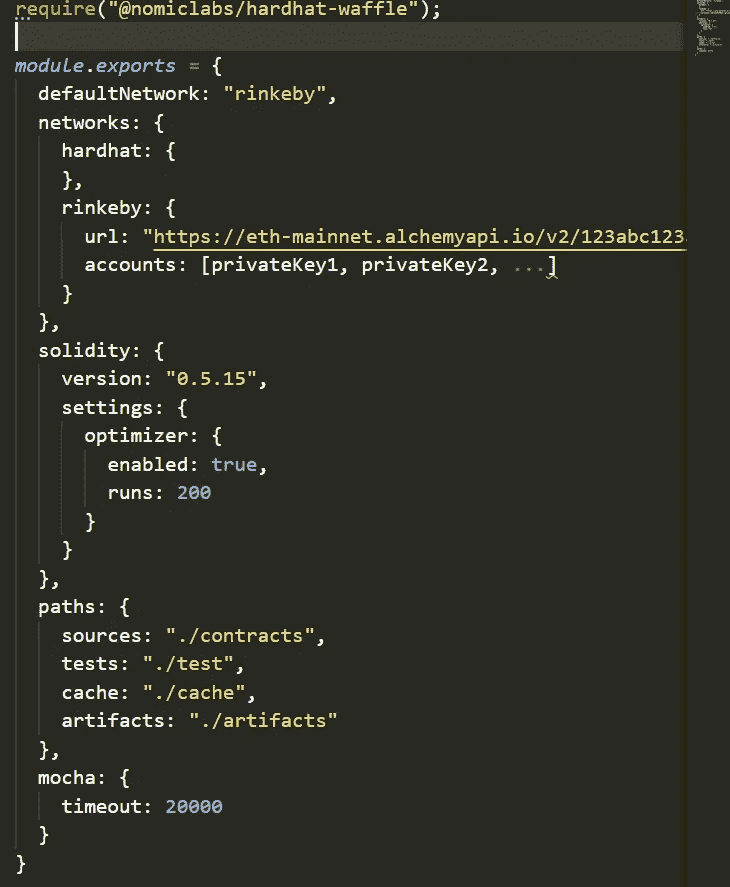
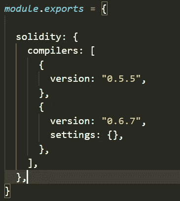

# 安全帽配置

> 原文：<https://medium.com/coinmonks/hardhat-configuration-c96415d4fcba?source=collection_archive---------0----------------------->

这篇文章是关于你的 hardhat.config.js 文件的配置。这个文件通常位于您的项目的根目录中，并且是 Hardhat 工作所必需的。关于你的 Hardhat 设置的所有东西(例如，你的配置，插件和自定义任务)都包含在这个文件中。

## **可用选项:**

从 hardhat.config.js 中导出一个对象来设置项目。这个对象可以有实体，如*默认网络，网络，坚实度，路径和摩卡。*

下面显示了一个示例配置文件:

A sample hardhat.config.js file

**网络配置:**

Hardhat 中有两种网络:基于 JSON-RPC 的网络和内置的 Hardhat 网络。

默认网络是“ ***hardhat*** ”，但您可以通过设置 *defaultNetwork* 字段自定义运行 hardhat 时使用哪个网络作为默认网络。

## **安全帽网络:**

Hardhat 有一个名为 hardhat 的内置网络。当您使用此网络时，当您测试合同或运行任务或脚本时，会自动创建一个 Hardhat 网络实例。

可以在配置中为安全帽设置以下字段:

*chainId* :安全帽网络区块链使用的 chainId。默认值为 31337。

*发件人*:这是作为默认发件人的地址。如果没有设置这个值，它将考虑安全帽网络的第一个帐户。

*气体*:其值一般为数字或应为“*自动*”。所使用的数字将是每笔交易中使用的汽油限额。如果使用“自动”,将自动估计气体极限。默认值与 blockGasLimit 的值相同。

*gasPrice* :需要是“auto”或者一个数字。默认值为 8000000000。

*gasMultiplier* :这是一个与气体估算结果相乘的数字，由于估算过程的不确定性，该数字有一定的余量。gasMultiplier 的默认值为 1。

*账户*:该字段可配置为:

*   描述高清钱包的对象。它是默认的，可以有以下字段，如助记符(BIP39 定义的 12 或 24 个单词的种子短语)、initialIndex(默认值:0)、path(所有派生键的 HD 父项)、count(要派生的帐户数)、accountsBalance(每个派生帐户的余额为 wei 的字符串)。
*   Hardhat Network 将创建的初始帐户数组，每个帐户都是一个带有 privateKey 和 balance 字段的对象。

*blockGasLimit* :这是在 Hardhat Network 的区块链中使用的气体限制。默认值:12450000。

*minGasPrice* :安全帽网络接受的最低气价。接受气价较低的交易，但不开采。

*hardfork* :这是设置 Hardhat 网络如何工作。它可以从“拜占庭”、“彼得堡”、“伊斯坦布尔”、“穆尔格拉西耶”、“柏林”、“君士坦丁堡”和“伦敦”中取值。默认:“柏林”。

*throwOnTransactionFailures*:这是一个布尔值，控制 Hardhat 网络是否在事务失败时抛出。如果是真的，Hardhat Network 会在交易失败时抛出 Javascript ans Solidity stack traces。如果为 false，它将返回失败的事务哈希。默认值:true。

*throwOnCallFailures* :这个布尔控制 Hardhat 网络是否抛出呼叫失败。如果这是真的，当调用失败时，网络将抛出 JavaScript 和 Solidity 堆栈跟踪。如果为 false，它将返回带有恢复原因的调用返回数据。默认值:true。

loggingEnabled :这个布尔值控制 Hardhat 网络是否记录每个请求。默认值:true(对于支持 JSON-RPC 服务器的 Hardhat 网络)和 false(对于主 Hardhat 网络)。

*initialDate* :这是一个可选的字符串，用来设置区块链的日期。默认值:当前日期和时间，如果没有分叉另一个网络。

*allowUnlimitedContractSize*:此布尔值禁用 EIP 170 强加的合同大小限制。默认值:false

*forking* :这个对象描述了 forking 配置，包括 url(指向一个 JSON-RPC 节点的 URL，该节点具有您想要分叉的状态)、blockNumber(一个用于锁定要分叉的块的编号)和 enabled(用于打开或关闭 fork 功能的布尔值)等字段。

*minGasPrice* :交易必须具备的最低气价。如果“hardfork”为“london”或更高版本，则不包括此字段。

*initialbaseFeePerGas*:第一个块的 baseepergas。如果分叉一个远程网络，第一个块是紧接在您分叉的块之后的块。

# **基于 JSON-RPC 的网络:**

这些类型的网络连接到外部节点。节点可以像 Ganache 一样在你的计算机上运行，或者像 Infura 一样远程运行。要设置这样的网络，您必须用以下字段配置对象:

*url* :这是自定义网络节点的 url。

*chainId* :该号码用于验证 Hardhat 连接的网络。

*发件人*:该地址将作为默认发件人。如果默认发件人未实例化，第一个帐户将是默认地址。

*气体*:可以是“自动”也可以是数字。如果是一个数字，这将是每笔交易的气体限制，气体限制将在“自动”的情况下自动估计。默认值:自动

*gasPrice* :其值应为 auto 或一个数字。默认值:自动

*气体倍增器*:默认值:1

*账户*:该字段控制 Hardhat 使用的账户。它可以使用 node 的账户或高清钱包。默认:“远程”。

*httpHeaders* :该字段可用于设置在发出 JSON-RPC 请求时使用的额外 HTTP 头。它接受一个 JavaScript 对象，该对象将标题名映射到它们的值。默认值:未定义。

*超时*:发送到 JSON-RPC 服务器的请求的超时以毫秒表示。超过设定时间的请求将被取消。默认值:20000。

**高清钱包配置:**

要在 Hardhat 上使用 HD Wallet，您必须在以下字段中设置您的网络帐户。

*助记符*:作为钱包种子短语的字符串

*路径*:所有派生键的 HD 父级。默认值:“m/44'/60'/0'/0”。

*initialIndex* :要导出的初始索引。默认值:0

*计数*:要导出的账户数。默认值:20

**坚固性配置**:

坚固性配置是一个可选字段，可以作为一个 *solc* 版本使用，如“0.8.0”。它可以是描述编译器配置的对象，如*版本* (solc 版本)，设置如*优化器*启用*和*运行*键。默认值:{ enabled : false，runs : 200 }。另一个设置可以是 *evmVersion* ，它是一个控制目标 evm 版本的字符串。它可能采取的价值，如家园，伪钞，拜占庭，君士坦丁堡等。默认值:由 solc 管理。*

它还可能包含一个描述多个编译器及其配置的对象。
它可能包括一个编译器配置对象和覆盖列表，帮助您将编译器对象与文件名进行映射，以便为该特定文件指定编译器配置。

**路径配置**:您的 hardhat 项目使用不同的路径，您可以通过向 paths 字段提供一个带有以下关键字的对象来自定义:
root:缺省值是包含配置文件的目录。这是你的安全帽项目的根。

这是存放你的合同的目录。该路径是从项目的根解析的，并且具有默认值:“”。/合同。

测试:这是你的测试所在的目录。默认值:'。/test '。

*缓存*:hard hat 用来缓存内部东西的目录。默认值:'。/cache。

*工件*:该目录包含编译工件。默认值:'。/artifacts。

**mocha 配置:**您可以配置如何使用 Mocha 实体运行测试，它将接受与 Mocha 相同的选项。

> 加入 Coinmonks [电报频道](https://t.me/coincodecap)和 [Youtube 频道](https://www.youtube.com/c/coinmonks/videos)获取每日[加密新闻](http://coincodecap.com/)

## 此外，请阅读

*   [拷贝交易](/coinmonks/top-10-crypto-copy-trading-platforms-for-beginners-d0c37c7d698c) | [密码税务软件](/coinmonks/crypto-tax-software-ed4b4810e338)
*   [网格交易](https://coincodecap.com/grid-trading) | [加密硬件钱包](/coinmonks/the-best-cryptocurrency-hardware-wallets-of-2020-e28b1c124069)
*   [密码电报信号](http://Top 4 Telegram Channels for Crypto Traders) | [密码交易机器人](/coinmonks/crypto-trading-bot-c2ffce8acb2a)
*   [最佳密码交易所](/coinmonks/crypto-exchange-dd2f9d6f3769) | [印度最佳密码交易所](/coinmonks/bitcoin-exchange-in-india-7f1fe79715c9)
*   [币安 vs Bitstamp](https://coincodecap.com/binance-vs-bitstamp)|[Bitpanda vs 比特币基地 vs Coinsbit](https://coincodecap.com/bitpanda-coinbase-coinsbit)
*   [如何购买瑞波(XRP)](https://coincodecap.com/buy-ripple-india) | [非洲最佳密码交易所](https://coincodecap.com/crypto-exchange-africa)
*   [非洲最佳密码交易所](https://coincodecap.com/crypto-exchange-africa) | [Hoo 交易所点评](https://coincodecap.com/hoo-exchange-review)
*   [eToro vs robin hood](https://coincodecap.com/etoro-robinhood)|[moon xbt vs Bybit vs Bityard](https://coincodecap.com/bybit-bityard-moonxbt)
*   [开发人员的最佳加密 API](/coinmonks/best-crypto-apis-for-developers-5efe3a597a9f)
*   最佳[密码借阅平台](/coinmonks/top-5-crypto-lending-platforms-in-2020-that-you-need-to-know-a1b675cec3fa)
*   [免费加密信号](/coinmonks/free-crypto-signals-48b25e61a8da) | [加密交易机器人](/coinmonks/crypto-trading-bot-c2ffce8acb2a)
*   [杠杆代币的终极指南](/coinmonks/leveraged-token-3f5257808b22)