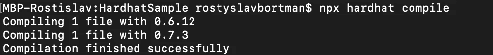
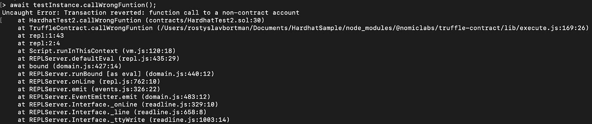
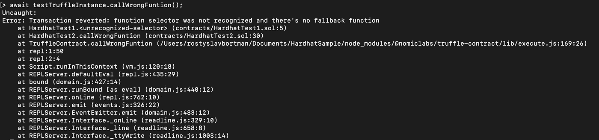
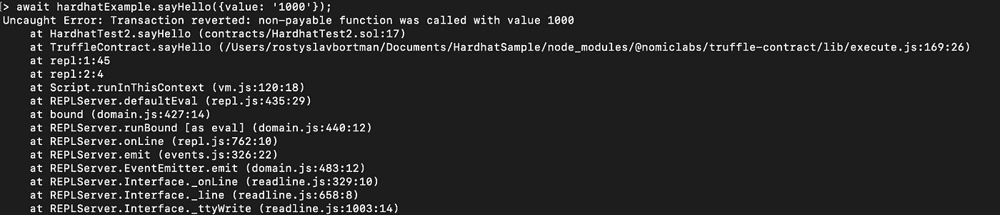
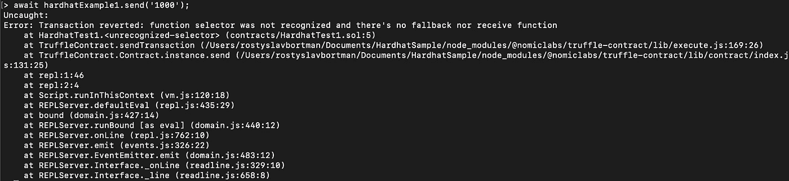
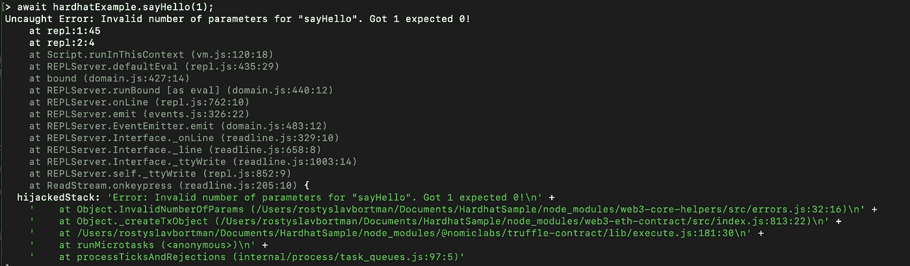
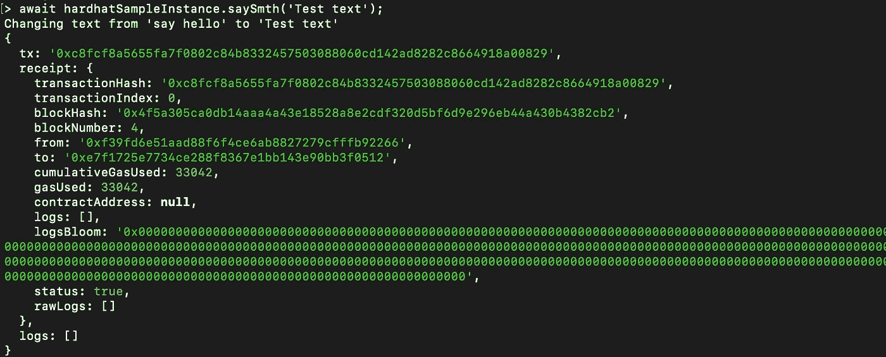

# 安全帽——以太坊发展演变？所以，我们来搞清楚。

> 原文：<https://medium.com/coinmonks/hardhat-ethereum-development-evolution-so-lets-figure-it-out-34f4656bc1a9?source=collection_archive---------1----------------------->

## 对于那些不知道的人来说，Hardhat 是一个编译、部署、测试和调试以太坊软件的开发环境。佛朗哥·泽奥利

首先，我想为我和 Web3 工程师强调以太坊软件开发中的三个主要部分:

## 1.编译和部署

对我来说，能够快速编译和部署契约(检查它们是否仍然可部署——例如 [eip-170](https://github.com/ethereum/EIPs/blob/master/EIPS/eip-170.md) ,如果你明白我的意思)并快速调用所需的函数来检查输出&功能非常重要；

## 2.测试

关于这个话题，所有可能的事情都已经说过了，我只想说，能够快速方便地用单元测试覆盖你所写的内容是至关重要的；

## 3.调试

这是一篇完全独立的文章的主题。以太坊开发中的大部分头痛都来源于此。例如，在 2017-2018 年，我用事件(！)这真的很烦人(可能是我错过了一些不错的调试工具，你可以在评论中分享你最喜欢的调试 solidity smart contracts 的方法)。

让我们来看看 Hardhat 是如何管理这三项至关重要的任务的。以下是我的研究结果:

# **编制&部署**

为了测试，我创建了两个不同的 solidity 版本 0.6.12 和 0.7.3 的测试契约(参见最后的链接部分)。在他们的文档中，您可以找到:

> Hardhat 支持使用不同的、不兼容的 solc 版本的项目。例如，如果您有一个项目，其中一些文件使用 Solidity 0.5，其他文件使用 0.6，您可以配置 Hardhat 使用与这些文件兼容的编译器版本，如下所示

我试过了，效果很好:

顺便说一下，与最接近的竞争对手松露相比，这是一个很大的优势。每当您处理一个已经在 mainnet 上部署了遗留合同的项目，并且您需要添加新的合同来与以前的合同协作时(并且您不希望使用旧的过时的 solidity 版本)，这就变成了一个大问题。关于如何配置它的细节，你可以在他们的官方文档中找到，那里足够详细。此外，与已经提到的 truffle 相比，编译要快得多。

关于**部署**，没有太多要说的——hard hat 还没有自己的部署系统，但据我所知，他们正在积极地工作，这里有一个关于 git 的[开放问题](https://github.com/nomiclabs/hardhat/issues/381)。同时，您可以使用 truffle 迁移(它们与 Hardhat 完全兼容)或您自己的 js 脚本。

# 测试

谈到测试，哈德哈特建议开发人员在***web 3 . js&Truffle***和 ***ethers.js & Waffle 之间进行选择。在我的项目中，我总是使用第一种变体，但是没有限制使用最适合你的。对于 ***Web3.js &松露*** 你需要做的一切——安装`Truffle`和`Web3.js`插件(`@nomiclabs/hardhat-truffle5`、`@nomiclabs/hardhat-web3).`***

一般来说，Hardhat 没有自己的测试系统——但这不是问题，因为您可以在自己的 Hardhat 项目中轻松使用其他项目的解决方案。

# 调试

对我和以太坊工程师来说，最有趣的事情是调试合同中的 Hardhat 改进。

**坚实度叠加痕迹**

我创建了一个简单的接口来测试其他契约上不存在的选择器调用的情况，并检查 Hardhat 控制台输出:

**例 1** —对非合约账户的函数调用

**例 2** —选择器不存在的函数调用

因此，您可以看到它像预期的那样工作(所有代码示例都可以在链接部分找到)。

**自动错误信息**

目标—重现 Hardhat 文档中声明的几个错误消息。

**例 1** —用 ETH 调用一个不可支付的函数

**例 2** —向没有应付回退或接收功能的合同发送 ETH

**例 3** —没有回退函数时调用不存在的函数

参见**坚实度堆栈痕迹**部分——我们已经在那里测试了这个案例。

**例 4** —调用参数不正确的函数

我不会在这里涵盖所有的错误消息，没有理由，但我在本地尝试了所有的错误消息，我可以说——一切正常，✅

**Console.log**

我想强调几个重要事项:

*   不管调用或事务是成功还是失败，它总是有效的。
*   它适用于任何库:ethers.js、web3.js、waffle、truffle-contract 等。
*   通话可以在其他网络中运行，如 mainnet、kovan、ropsten 等。他们在这些网络中什么也不做，只是消耗最少量的汽油。(这意味着无论何时你想在 Kovan 网络中测试你的 solidity 代码，例如，不需要删除代码中所有的`console.log`命令，这太棒了)

**console.log** 用法示例:

这里的一切都像预期的一样好，✅

# 结论

那么，Hardhat 是下一代以太坊开发体验吗？我可以肯定的回答是的，是。还有很多事情要做，但是到目前为止，在列表可靠性调试方面——非常棒的特性。去吧，自己试试，我相信你会有惊喜的！

【链接:】
代码示例:
[https://github.com/RostyslavBortman/HardhatSample](https://github.com/RostyslavBortman/HardhatSample)
安全帽文档:
[https://hardhat.org/getting-started/#overview](https://hardhat.org/getting-started/#overview)

## 另外，阅读

*   最好的[密码交易机器人](/coinmonks/crypto-trading-bot-c2ffce8acb2a)
*   [Deribit 审查](/coinmonks/deribit-review-options-fees-apis-and-testnet-2ca16c4bbdb2) |选项、费用、API 和 Testnet
*   [FTX 密码交易所评论](/coinmonks/ftx-crypto-exchange-review-53664ac1198f)
*   [比特交换评论](/coinmonks/bybit-exchange-review-dbd570019b71)
*   最好的比特币[硬件钱包](/coinmonks/the-best-cryptocurrency-hardware-wallets-of-2020-e28b1c124069?source=friends_link&sk=324dd9ff8556ab578d71e7ad7658ad7c)
*   [密码本交易平台](/coinmonks/top-10-crypto-copy-trading-platforms-for-beginners-d0c37c7d698c)
*   最好的[加密税务软件](/coinmonks/best-crypto-tax-tool-for-my-money-72d4b430816b)
*   [最佳加密交易平台](/coinmonks/the-best-crypto-trading-platforms-in-2020-the-definitive-guide-updated-c72f8b874555)
*   最佳[加密贷款平台](/coinmonks/top-5-crypto-lending-platforms-in-2020-that-you-need-to-know-a1b675cec3fa)
*   [莱杰纳米 S vs 特雷佐 one vs 特雷佐 T vs 莱杰纳米 X](https://blog.coincodecap.com/ledger-nano-s-vs-trezor-one-ledger-nano-x-trezor-t)
*   [block fi vs Celsius](/coinmonks/blockfi-vs-celsius-vs-hodlnaut-8a1cc8c26630)vs Hodlnaut
*   Bitsgap 评论——一个轻松赚钱的加密交易机器人
*   [Quadency Review](/coinmonks/quadency-review-a-crypto-trading-automation-platform-3068eaa374e1) -为专业人士打造的加密交易机器人
*   [PrimeXBT 评论](/coinmonks/primexbt-review-88e0815be858) |杠杆交易、费用和交易
*   HaasOnline 评论享受九折优惠
*   [埃利帕尔泰坦评论](/coinmonks/ellipal-titan-review-85e9071dd029)
*   [SecuX Stone 评论](https://blog.coincodecap.com/secux-stone-hardware-wallet-review)
*   [BlockFi 评论](/coinmonks/blockfi-review-53096053c097) |赚取高达 8.6%的加密利息
*   [开发人员的最佳加密 API](/coinmonks/best-crypto-apis-for-developers-5efe3a597a9f)
*   [最佳区块链分析工具](https://bitquery.io/blog/best-blockchain-analysis-tools-and-software)
*   [加密套利](/coinmonks/crypto-arbitrage-guide-how-to-make-money-as-a-beginner-62bfe5c868f6)指南:新手如何赚钱
*   顶级[比特币节点](https://blog.coincodecap.com/bitcoin-node-solutions)提供商
*   最佳[加密制图工具](/coinmonks/what-are-the-best-charting-platforms-for-cryptocurrency-trading-85aade584d80)
*   了解比特币的[最佳书籍有哪些？](/coinmonks/what-are-the-best-books-to-learn-bitcoin-409aeb9aff4b)

> [直接在您的收件箱中获得最佳软件交易](/coinmonks/newsletters/coinmonks)

