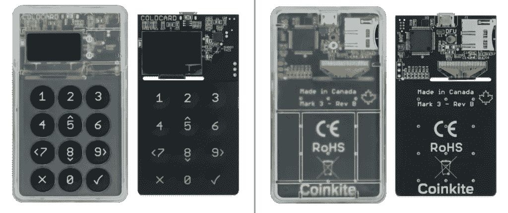

# 8 大最佳硬件钱包|顶级加密硬件钱包

> 原文：<https://medium.com/coinmonks/hardware-wallets-dfa1211730c6?source=collection_archive---------1----------------------->

Hardware wallet

保管您的数字资产很容易，但找到正确的存储方式却是一项繁琐的任务。网上钱包有被黑的风险，正如人们所说的“不是你的钥匙，也不是你的钱”。因此，硬件钱包是我们存储加密资产的唯一可靠选择。在本文中，我们将讨论 8 款最佳硬件钱包。

# 总结(TL；博士)

# 什么是硬件钱包？

硬件钱包是用于存储加密货币的物理设备。他们不能连接到互联网和运行复杂的应用程序。相反，它们以脱机模式存储私钥，不会受到攻击。

市场上提供了许多硬件钱包可供选择，如[总账](https://blog.coincodecap.com/go/5491-2)、[特雷佐](https://shop.trezor.io/?offer_id=10&aff_id=5199)、 [Ngrave](https://shop.ngrave.io?sca_ref=380802.hYAXqGXOgJ) 、 [Ellipal](https://www.ellipal.com/?rfsn=5176371.5d3d58) 、 [BitBox](https://shiftcrypto.shop/en/?ref=NGR4VOALV3) 、 [Prokey](https://blog.coincodecap.com/go/prokey) 、 [SecuX](https://coincodecap.com/go/secuxtech) 和 [Coldcard](https://coldcardwallet.com/) 。为了方便您，我们根据外观、连接性、电池、硬件、安全性、备份和恢复、加密货币支持和成本对所有这些钱包进行了比较。

# 硬件钱包:物理外观

## 分类帐

[Ledger Nano S](https://blog.coincodecap.com/go/5491-2) 在设备顶部提供了两个导航按钮。Ledger Nano X 在屏幕的每一侧都有两个前置按钮，这使得它更容易像智能手机一样使用。但是，如果长按这两个按钮，您将直接返回到 Ledger Nano X 的主屏幕。

> *还有，看* [*总账 Nano S vs X |电池、硬件、价格、存储*](https://coincodecap.com/ledger-nano-s-vs-x)

## 特雷佐

Trezor One 提供了两个按钮，而 Trezor T 是一个完整的触摸屏设备，可以保护您的密码免受键盘记录器的攻击。

## n 平均

*   首先，分辨率是 480 x 800 像素。
*   再进一步，LCD 电容式 600 Cd/m2 高亮度触摸屏。
*   第三，640 x 480 的内置摄像头。
*   而且，它有一个 12 x 12 mm 的指纹传感器。
*   它还内置了光传感器
*   最后，在设备的侧面有一个“打开”按钮。

## 埃利帕尔

[Ellipal 钱包](https://www.ellipal.com/?rfsn=5176371.5d3d58)有一个侧边按钮，用于启动设备。此外，它还配有一个 500 万像素的内置摄像头。

## 比特盒

[BitBox02 钱包](https://shiftcrypto.shop/en/?ref=NGR4VOALV3)没有任何按钮。

*   设计时尚简约，边缘内置传感器。
*   隐形触摸传感器使用三种简单的手势:滑动、点击和按住。
*   一个用于插入备份用 micro 卡的卡槽。
*   点击—导航并选择
*   幻灯片-验证您的地址。
*   保持-它避免了任何意外的交易。
*   要了解更多信息，请阅读 [BitBox02 Review](https://blog.coincodecap.com/bitbox02-review) 。

## Prokey

[Prokey](https://prokey.io/?reflink=f1c020ef79bb43d39f80dad38610d9c1) 钱包重 16.7 克，该设备有四个按钮。要了解更多信息，请阅读 [Prokey Review](https://coincodecap.com/prokey-review) 。

## SecuX

[SecuX 钱包](https://coincodecap.com/go/secuxtech)设计时尚，易于使用。它有一个 2.8 英寸的触摸屏，塑料机身。

> ***也，读***[***SecuX STONE 五金钱包点评|八五折优惠券***](https://coincodecap.com/secux-stone-hardware-wallet-review) ***。***

## 冷卡

Coldcard 钱包有一个全尺寸的数字键盘，可以快速输入 pin 码。它重约 30 克。

# 硬件钱包:连接性

## 分类帐

您可以将 [Ledger Live App](https://shop.ledger.com/pages/ledger-nano-x?r=da6d9b98e517) 连接到台式机和智能手机。

虽然 Ledger Nano S 使用 USB type Micro-B 进行连接，但 Ledger Nano X 可以使用 USB Type-C 电缆和蓝牙进行连接。因此，即使蓝牙遭到破坏，攻击者也无法获得用户的私钥。要了解更多信息，请阅读[分类账实时回顾](https://coincodecap.com/ledger-live)。

## 特雷佐

Trezor 使用 USB 连接到支持互联网的设备。Trezor One 使用 Micro-B，而 Trezor T 使用 Type-C USB。

## n 平均

[n rave](https://shop.ngrave.io?sca_ref=380802.hYAXqGXOgJ)是一个独立的气隙器件。因此，它不需要任何连接，如 USB、蓝牙、NFC 或 Wi-Fi。这反过来将数字攻击面降至最低。

它们提供了一个 USB-C 端口用于墙壁充电，可以安全地传输固件更新。此外，这些更新在与操作系统其余部分完全隔离的隔离分区中进行验证。

要了解更多，请阅读我们的[n 零审查](https://coincodecap.com/ngrave-zero-review)。

## 埃利帕尔

Ellipal 钱包完全采用气隙设计。因此，应用程序和钱包之间的所有通信都通过 QR 码进行认证。此外，应用程序和钱包都可以生成二维码。

## 比特盒

[BitBox02](https://shiftcrypto.shop/en/?ref=NGR4VOALV3) 使用连接到设备的 USB-C 端口。此外，它们还为适配器提供 USB 接口。

## Prokey

[Prokey](https://prokey.io/?reflink=f1c020ef79bb43d39f80dad38610d9c1) 使用 USB 型 Micro-B 连接到任何支持互联网的设备，如台式机、笔记本电脑或手机。

## SecuX

可以通过蓝牙 5.0 连接。此外，您可以通过 USB Type-C 连接 SecuX V20 或 USB-Micro B 连接 [SecuX](https://coincodecap.com/go/secuxtech) W20/W10。

## 冷卡

[Coldcard 钱包](https://coldcardwallet.com/)不需要连接电脑或智能手机。相反，它从 USB 电源组或交流电源适配器获取能量。此外，如果你愿意，你可以把它连接到 Coldcard 适配器，一个 9V 电池。

# 硬件钱包:电池

## 分类帐

莱杰纳米 S 不使用电池。然而，Ledger Nano X 消耗 100 mAh 的电池，你可以通过连接 USB 电缆到 PC 或笔记本电脑来充电。如果连续使用，它可以提供 8 小时的电池寿命，但如果闲置，它可以延长到 3 个月。

## 特雷佐

Trezor 不需要电池。相反，它们通过 USB 连接来消耗电能。

## n 平均

[n rave](https://shop.ngrave.io?sca_ref=380802.hYAXqGXOgJ)使用 1200 mAH(超高效低功耗)电池。此外，它使用 USB 兼容的电池充电器。

## 埃利帕尔

[Ellipal](https://www.ellipal.com/?rfsn=5176371.5d3d58) 消耗 1400 mAH 电池，待机时间 259 小时。电池可以用 USB 线充电。

## 比特盒

比特币钱包不使用电池。

## Prokey

[Prokey](https://prokey.io/?reflink=f1c020ef79bb43d39f80dad38610d9c1) 钱包不需要电池。你需要把它插到笔记本电脑之类的设备上才能开机。

## SecuX

SecuX 提供 600 mAH 锂聚合物电池，使用时间长达 7 小时，空闲时间为 3 个月。给电池充满电需要两个小时。

## 冷卡

Coldcard 钱包不需要电池。

# 五金器具

## 分类帐

Ledger 使用了一种独特的硬件架构， [BOLOS](https://www.ledger.com/introducing-bolos-blockchain-open-ledger-operating-system) (区块链开放 Ledger 操作系统)，以及称为[安全元素](https://www.ledger.com/academy/security/the-secure-element-whistanding-security-attacks)的专用芯片。安全元件包含一个 STM32 微控制器(MCU ),用作安全元件和外设之间的路由器。

> *还有，看* [*莱杰纳诺 S vs 特雷佐一 vs 特雷佐 T vs 莱杰纳诺 X*](https://coincodecap.com/ledger-nano-s-vs-trezor-one-vs-trezor-t-vs-ledger-nano-xledger-nano-s-vs-trezor-one-vs-trezor-t-vs-ledger-nano-x)

## 特雷佐

Trezor 使用 120 MHz 的 ARM Cortex-M3 处理器和定制软件。此外，它还有一个微型 SD 卡插槽。T 型 Trezor 由一个微控制器或一个芯片组成，用于存储和生成私钥。

## n 平均

[Ngrave](https://shop.ngrave.io?sca_ref=380802.hYAXqGXOgJ) 提供了一种由高端材料制成的多层防回火五金装置。金属外壳有助于在进行暴力攻击时减少私钥的范围，并保护攻击者可以选择的无线电频率。它使用定制固件，安全专家已经验证了这一点。此外，他们正计划开源固件以供社区审查。

## 埃利帕尔

Ellipal 使用安全硬件。此外，固件更新是增加加密货币支持和更新固件的重要部分。

在 [**Ellipal wallets**](https://www.ellipal.com/?rfsn=5176371.5d3d58) 中，你要从厂商的页面下载更新的固件，并复制到 SD 卡中。然后，还得把 SD 卡插到钱包里。你可以在这里查看升级[的详细步骤。](https://www.ellipal.com/pages/ellipal-update)

## 比特盒

[Bitbox](https://shiftcrypto.shop/en/?ref=NGR4VOALV3) 使用 ATSAMD51J20A 微控制器和真随机数发生器。此外，为了防止物理篡改，他们使用安全芯片 ATECC608A。这可以防止暴力攻击，并为私钥提供额外的安全性。

## Prokey

[Prokey](https://prokey.io/?reflink=f1c020ef79bb43d39f80dad38610d9c1) 使用安全硬件。他们使用带真随机数发生器(RNG)的 STM32F205VG 芯片。

你可以从 [Github 库获得更多关于他们硬件的信息。](https://github.com/prokey-io)

## SecuX

[SecuX 钱包](https://coincodecap.com/go/secuxtech)内含英飞凌芯片 CC EAL 5+安全元素，为金融业保护您私人钥匙的最高等级。此外，它还确保了零交易泄漏。

## 冷卡

处理器的安全元件和重要部件在工厂用环氧树脂覆盖。这使得移除任何芯片或改变它们周围的线路变得更加困难。工厂私钥对固件更新进行签名。

# 硬件钱包:安全性

## 分类帐

**台账**有认证等级 CC [EAL5+](https://en.wikipedia.org/wiki/Evaluation_Assurance_Level) 。莱杰 Nano S 采用安全元件芯片 STM32F042 + ST31H320(安全)，而 Nano X 采用 ST33J2M0(安全)+ STM32WB55。

他们使用贴纸来确保没有人在离开工厂后在钱包上动过手脚。使用可信计算基础，其通过使用密码证明来验证。可以通过执行证明检查来检查设备的完整性。

您可以使用按钮设置 pin 码。要确认，你必须同时按下两个按钮。

## 特雷佐

[**Trezor 钱包**](https://shop.trezor.io/?offer_id=10&aff_id=5199) 通过 CE 和 [RoHS](https://en.wikipedia.org/wiki/Restriction_of_Hazardous_Substances_Directive) 认证。此外，他们使用带有工业胶水的防篡改封条来防止供应链攻击。因此，如果有人试图篡改设备并再次将其密封，您可以发现一个明显的差异，知道设备已被篡改。

> *还有，阅读* [*Ngrave vs Trezor:哪个是最适合你的硬件钱包？*](https://coincodecap.com/ngrave-vs-trezor)

## n 平均

n 钱包是最安全的钱包之一。他们获得了 CE、EAL7 和 ROHS 的认证。EAL7 是世界上最高的安全保证和认证。他们使用[STM 32 MP 157 c(2019)MCU/MPU](https://www.st.com/en/microcontrollers-microprocessors/stm32mp157c.html)。

Ngrave 提供加密证明，以确保您的设备没有被扫描二维码的物理篡改。此外，它们还提供了两种保护钱包的方法。第一个选项是选择 12、18 或 24 个单词的恢复种子短语。

第二个选项是创建一个定制的密钥，“n 保存完美密钥”这是 256 位主种子的 64 个字符的十六进制等效值。他们使用生物数据和来自内置光传感器的光来增加随机性。处理完所有这些信息后，密钥会实时变化。芯片制造商和 Ngrave 都没有对密钥进行后门操作。它允许您“冻结”和“解冻”并突出显示某些关键部分，使体验直观而快速。

## 埃利帕尔

Ellipal 完全与互联网隔离。他们使用防篡改封条来保护钱包免受供应链攻击。如果封条破损，您应该联系支持团队。

使用 microSD 卡插槽传输数据。因此，您可以验证所有交易。此外，它允许您设置多个密码和密码短语。

钱包有密码保护，如果任何人试图用错误的密码反复解锁设备，它会删除钱包中的所有数据。因此，您可以使用恢复种子短语完全恢复您的帐户。

## 比特盒

在工厂设置期间，Bitbox 证明他们所有的钱包。该应用程序只接受由 Shift Crypto 签名的固件。固件是开源的，并有一个漏洞奖励程序，用于报告任何安全漏洞。

[比特币钱包](https://shiftcrypto.shop/en/?ref=NGR4VOALV3)被装在真空密封塑料袋中运送，以防止供应链攻击。引导装载程序防止安装不同版本的固件或任何降级。安全芯片包含一个单调计数器，限制密码输入的尝试次数，以避免暴力攻击。设备和应用程序之间的所有通信都是加密的。

此外，你可以使用[通用双因子(U2F)](https://en.wikipedia.org/wiki/Universal_2nd_Factor) 来注册你的一些在线账户——GitHub、Dropbox、谷歌、脸书等等。但是，它不允许您在未通过设备验证的情况下登录。你可以通过插入和触摸来进行认证。

## Prokey

[Prokey](https://prokey.io/?reflink=f1c020ef79bb43d39f80dad38610d9c1) 使用安全固件；因此，不需要供应商信誉或全息印章来防范供应链攻击。当您收到钱包时，设备上不会安装任何固件。例如，假设设备在接收之前已经被破坏；将不会安装最新的固件更新。

如果已经安装了固件，则在 [**Prokey**](https://prokey.io/?reflink=f1c020ef79bb43d39f80dad38610d9c1) 服务器和设备之间开始相互认证过程。因此，如果你的设备被篡改，由于服务器的认证，它将无法访问你的账户。

他们不会为你的硬币或代币使用第三方钱包来防止网络钓鱼攻击。相反，他们使用 Omni 协议和以太坊区块链的最高安全级别来管理 USDT。

## SecuX

[SecuX](https://coincodecap.com/go/secuxtech) 使用内部供应链和制造。因此，如果有人试图篡改包装，这将是显而易见的。

您可以设置一个四至八位数的 PIN。此外，设备在五次错误输入后会自动复位。此外，如果您的设备被盗，还可以使用动态键盘来跟踪指纹。

## 冷卡

Coldcard 钱包的 PIN 码分为两部分。进入第一部分后，屏幕上会显示两个词。这些对于所有端号前缀都是唯一的。因此，您需要记住它们，并在输入 PIN 的第二部分之前检查它们。

Coldcard 提供了一个胁迫 PIN，其操作类似于钱包的 PIN 码，但生成的比特币密钥不是主密钥。还可以在胁迫钱包里放一些比特币，让它更真实。

此外，一个“砖我”PIN 破坏了安全元素，使你的钱包不值钱。此外，他们支持 BIP39 密码，以创建一个无限供应的分心钱包。

Coldcard 不存储私钥不存储在主微处理器中，而是存储在单独的安全元件 [ATECC608A](https://www.microchip.com/wwwproducts/en/ATECC608A) 中。这种芯片坚固而安全。通信由复杂的挑战和 SHA-256 响应控制，防止窃听和重放。

固件用出厂密钥签名，防止你的钱包受到邪恶女仆的侵害。此外，闪存的每个字节都通过设置的绿/红灯进行验证。此外，Coldcard 使用防篡改塑料袋包装产品。包里有一个唯一的号码，与 Coldcard 的安全元件相匹配。

# 备份和恢复

## 分类帐

无论何时初始化您的设备，您都必须收到一个 24 个字的恢复种子短语。你可以随时使用这个短语来恢复你的所有资金。种子短语应离线存储在安全的地方。Ledger 提供了一个恢复短语表来存储短语。你不应该制作这张卡的数字副本，并且必须妥善保管，以防火灾和盗窃。此外，该平台还提供了一个加密胶囊来保护短语表。

> *也，读* [*总账 vs 平均零|买前读*](https://coincodecap.com/ledger-vs-ngrave-zero)

## 特雷佐

Trezor 提供了一个恢复种子卡，用于存储种子短语。此外，钱包会自动启动 Shamir backup，将种子短语分成多个不同的部分。此外，它还会生成多达 16 个恢复份额，这些份额是由 20 或 33 个字组成的序列。

要恢复钱包，你必须使用特定数量的份额。您可以在初始化设备时设置该数字。例如，如果您使用六个份额创建一个 [Shamir 备份](https://trezor.io/shamir/)，您的阈值可以大于等于三且小于等于六。阈值的最小值大于 1。

## n 平均

n rave 提供了一种高质量的不锈钢解决方案，称为 n rave 石墨烯。这是一个非常耐用的密码难题。此外，它可以承受水，房屋火灾(1660 C / 3020 F)，腐蚀，冲击，或任何此类极端条件。此外，它是一种加密的非电子解决方案。它由两个盘子组成，你可以把它们放在不同的地方。只有两个人都在一起，你才能知道钥匙；否则，你将什么也不知道。

对于每个字符，你应该用自动压花笔在石墨烯上打一个洞。这种点击产生体力作用，在第一板上打孔而不损坏第二板。第一个标牌上的字符为顾客定位不同。上板有 1024 个孔和 1078 种可能的上板配置。现在只有这两个板块在一起，你才能知道关键。它消除了单点故障。

建议多买一个下盘，因为下盘比上盘便宜。

现在假设你失去了上面的盘子。n rave 给每个包裹贴上一个订单号。将订单号输入专用的 Ngrave 服务器或区块链界面，就可以知道上层板材的配置。你必须在 Ngrave 团队中用你的 KYC 数据来证明你自己。您也可以联系客户支持，他们会保存所有订单的离线记录，并获取有关配置的信息。

您可以告诉 Ngrave 团队不要存储您的订单详细信息。但是，选择此选项后，您将无法恢复上板配置。

## 埃利帕尔

Ellipal 提供 [Ellipal 金属助记符](https://www.ellipal.com/?rfsn=5176371.5d3d58)，防水、防火、防虫、防霉。这个钱包的尺寸是 86x60x8mm。

这些钱包严格遵循 [BIP39](https://en.bitcoin.it/wiki/BIP_0039) 标准助记符，并允许存储 12 个和 24 个单词的助记符。你必须存储每个单词的前四个字母。不会有两个单词有相同的前四个字母。您可以从 BIP39 列表中了解该单词的剩余字符。你必须滑动字母来存放你的钥匙。

要了解更多，请阅读我们的 [Ellipal titan review](/coinmonks/ellipal-titan-review-85e9071dd029) 。

## 比特盒

[**BitBox**](https://shiftcrypto.shop/en/?ref=NGR4VOALV3) 提供钢钱包防末日备份，由不锈钢制成，可以经受住辐射、室内火灾、腐蚀、辐射或任何此类极端情况。

该设备易于使用，并为后代提供了抗老化的备份。最重要的是，它们与 BIP-39 兼容。

钢制钱夹由两块金属薄片组成，每块金属薄片上有六个字。使用打孔机将恢复单词存储在上面，打孔机会产生凹痕。恢复短语的前四个字符是唯一的；所以，你只需要打他们一拳。你可以先用记号笔在孔上做标记，然后用打孔机来避免错误。例如，要识别第一张和第二张图纸，您可以在图纸的侧面分别打一个和两个孔。

## Prokey

要恢复您的 [Prokey 设备](https://prokey.io/?reflink=f1c020ef79bb43d39f80dad38610d9c1)，您可以通过将设备重置为出厂设置来禁用 PIN。为此，您必须同时按住 C 按钮，将电缆插入 Prokey optimum。接下来，你应该点击重置设备。现在，你必须重新设置你的设备。

## SecuX

[SecuX wallet](https://coincodecap.com/go/secuxtech)采用分层确定性钱包架构，符合 BIP32、BIP39 和 BIP44 协议。你启动这个装置后，它会产生一个 24 个字。您应该将此写在恢复单上并妥善保管。该架构基于 BIP32、BIP39 和 BIP44 协议，可与使用相同架构的任何硬件钱包进行交换。您将能够恢复您的数据，并将其与 24 个单词的种子短语一起加载到您的硬件钱包中。

## 冷卡

[Coldcard](https://coldcardwallet.com/) 提供两种备份和恢复选项。

1.  它有一个 MicroSD 卡插槽，可以离线备份已签名和未签名的交易。
2.  可以用种子板比特币备份金属板。这个盘子每边有 12 个字。它的尺寸为 12.7 x 7.62 厘米，由 2 毫米厚的坚硬钢板制成。蚀刻标记用化学方法染成黑色，以便于辨认。

# 加密货币支持

# 硬件钱包:兼容性

## 分类帐

Ledger Live 应用程序支持桌面和移动设备上多达 27 项资产和 ERC20 令牌。

莱杰 Nano S 支持 Android 设备，莱杰 Nano X 同时支持 Android 和 iOS。它们兼容超过 1100 个应用程序。此外，Ledger Nano X 为安装三到二十个应用程序提供存储空间，而 Nano X 最多可以安装 100 个应用程序。

## 特雷佐

Trezor 提供其专有应用 [Trezor 钱包](https://shop.trezor.io/?offer_id=10&aff_id=5199)。它有一个易于使用的界面，允许您转移和管理您的资金。

它还兼容多个独立的加密货币钱包和一些仅支持手表的钱包，如 [bitWallet](https://bitwallet.com/en/) 和 Blockononmics。

也可以使用第三方在线服务，如 [Bitex](https://coincodecap.com/go/bitex) 、 [Bitstamp](https://coincodecap.com/go/bitstamp) 等。

## n 平均

n rave 提供了一种叫做 NGRAVE LIQUID 的应用。下载钱包，可以扫描钱包里的二维码。然后，您可以进一步扫描下一个二维码，将设备上的所有帐户同步到您的应用程序。

钱包和应用程序之间的所有通信都将使用二维码。钱包与应用程序通信，应用程序又与区块链通信。它获取所有交易的实时数据，为我们提供强大的移动应用体验。但是，它不能访问您的私钥。

## 埃利帕尔

Ellipal 应用程序允许您在一个钱包中存储和管理多个硬币。此外，根据钱包的大小，您可以在一个钱包中开设多达 10 个账户。

这款应用同时支持[安卓](https://play.google.com/store/apps/details?id=com.ellipal.wallet&hl=en_IN&gl=US)和 [iOS](https://apps.apple.com/us/app/ellipal/id1426179665) 平台。此外，您可以查看加密新闻和价格图表。该应用程序允许您查看实时利率和您的余额。为了连接到应用程序，你必须扫描二维码。

## 比特盒

[Bitbox](https://shiftcrypto.shop/en/?ref=NGR4VOALV3) 提供了一个用户友好且安全的应用程序来管理和更新您的 Bitbox 设备。此外，他们使用最新的 [Segwit Bech32](https://en.wikipedia.org/wiki/SegWit) 地址格式，这样你就可以节省交易费用。

它支持 macOS、Windows、Linux 和 Android。你可以从[这里](https://shiftcrypto.ch/download/)下载。您可以使用 BitBox Bridge 将 Bitbox02 设备与应用程序配对。此外，该应用程序提供多语言支持。

# Prokey

它拥有专有的基于网络的应用程序，允许您从单一界面管理所有交易。

## SecuX

[SecuX 钱包](https://coincodecap.com/go/secuxtech)支持 Windows、macOS、Linux 和 ChromeOS。浏览器方面，支持 Chrome V.71 或更高版本，Opera V.57，另外单个 SecuX 钱包最多支持两百个账户。

## 冷卡

Coldcard 没有其专有的应用程序。不过支持 [Electrum](https://electrum.org/) 等多个独立 app。

# 硬件钱包定价

# 最佳硬件钱包:结论

需要硬件钱包在离线模式下安全存储加密货币。在详细讨论了八大顶级硬件钱包后，最佳的硬件钱包取决于您需要的功能和预算。Ngrave 是最贵的钱包之一，而 [Ellipal](https://blog.coincodecap.com/go/ellipal) 拥有几乎相似的功能，价格只有它的一半。此外，您还可以使用 Ellipal 下注、赚取利息以及兑换加密货币。如果你只想用比特币交易，那么 Coldcard 提供了最好的比特币钱包之一。虽然 Coldcard 和 [BitBox](https://shiftcrypto.shop/en/?ref=NGR4VOALV3) 与 Ellipal 相比提供了类似的功能，但并没有空隙。

然后是莱杰和[特雷佐](https://shop.trezor.io/?offer_id=10&aff_id=5199)，他们在市场上拥有最多的客户，并且已经领先了相当一段时间。此外，有了 [Ledger Live app](https://blog.coincodecap.com/ledger-live) 你可以入股、出借、买卖、转让等。你的加密资产。

如果你刚刚起步，你可以选择 Prokey，因为与市场上现有的钱包相比，它既安全又便宜。

## 另外，阅读

 [## 2022 年 6 大最佳硬件钱包|顶级加密硬件钱包[更新]

### 最好的加密货币硬件钱包是绝对必要的。我们将在 NGRAVE、Ledger Nano X 和…

medium.com](/coinmonks/the-best-cryptocurrency-hardware-wallets-of-2020-e28b1c124069) 

*   [比斯勒评论](https://coincodecap.com/bitsler-review)|[WazirX vs coin switch vs coin dcx](https://coincodecap.com/wazirx-vs-coinswitch-vs-coindcx)
*   [7 大副本交易平台](https://coincodecap.com/copy-trading-platforms) | [BuyCoins 点评](https://coincodecap.com/buycoins-review)
*   [XT.COM 评论](https://coincodecap.com/profittradingapp-for-binance)币安评论 |
*   [SmithBot 评论](https://coincodecap.com/smithbot-review) | [4 款最佳免费开源交易机器人](https://coincodecap.com/free-open-source-trading-bots)
*   [杠杆代币](/coinmonks/leveraged-token-3f5257808b22) | [最佳密码交易所](/coinmonks/crypto-exchange-dd2f9d6f3769) | [Paxful 点评](/coinmonks/paxful-review-4daf2354ab70)
*   [加密套利](/coinmonks/crypto-arbitrage-guide-how-to-make-money-as-a-beginner-62bfe5c868f6)指南| [如何做空比特币](/coinmonks/how-to-short-bitcoin-568a2d0b4ae5)
*   [币安期货交易](https://coincodecap.com/binance-futures-trading)|[3 comas vs Mudrex vs eToro](https://coincodecap.com/mudrex-3commas-etoro)
*   [如何购买 Monero](https://coincodecap.com/buy-monero) | [IDEX 评论](https://coincodecap.com/idex-review) | [BitKan 交易机器人](https://coincodecap.com/bitkan-trading-bot)
*   [尤霍德勒 vs 考尼洛 vs 霍德诺特](/coinmonks/youhodler-vs-coinloan-vs-hodlnaut-b1050acde55a) | [Cryptohopper vs 哈斯博特](https://coincodecap.com/cryptohopper-vs-haasbot)