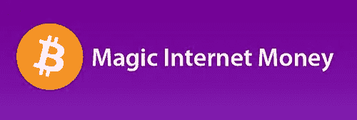
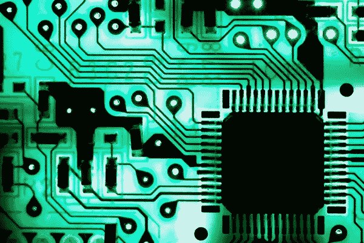
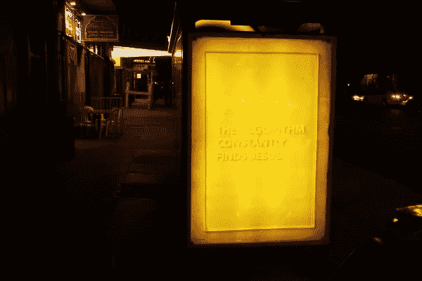
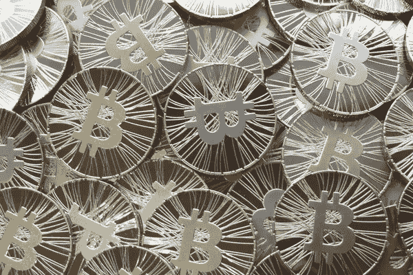

# 听，10 倍 APY 交易机器人！

> 原文：<https://medium.com/coinmonks/hark-the-10x-apy-trading-bot-27456293e662?source=collection_archive---------12----------------------->

Magic Interwebs dollarydoos!

## 一开始，我很害怕，我被吓呆了！我怎么也想不出复利！

唉，贪婪的肠子在嘀咕。已经订阅访问算法交易机器人的人。“那是一口血”，你可能会正确地说。但它正在成为加密货币领域最热门的话题之一。

“Beep Boop”, I coded a bot that beats the market! Promise!

你不应该相信讨论密码的名人。如果他们的投资进行得如此顺利，他们为什么还要费心和你谈呢？纯粹的平等主义和善良？不，正如我的德语老师常说的“不！不不。不要。Nein！”当然，我的老师是对的。这些机器人一无是处。非常漂亮和闪亮的大便有很多很酷的代码！但仍然是棕色的，发臭的，充满神秘玉米的大便。为什么？因为他们没有证明他们比买入并持有更有利可图。他们只是没有战胜市场。

or does it?

如果这些人这么擅长投资，为什么要在一个机器人身上浪费时间？当然，除非这和零花钱有一点点关系。我的意思是钱，以前在你的口袋里，现在在他们的。

Gimme, it’s mine!

你会期待这种资金交换的回报。不幸的是，你将一无所获。原因是，在过去的 12 个月里，这些机器人没有一个打败或跑赢市场。一个都没有。他们显示了 1000%的收益，因为比特币在过去 12 个月里的收益超过了 1000%。他们真的没有什么了不起的。

Much gains, many profits.

获得 10 倍收益的机器人每月还能获得近 200 美元的费用。绝对坦白是非常非常昂贵的。然而，如果这些机器人打败了市场，200 美元就等于零。假设复利根本不存在，1000%足以让任何人变得非常富有，即使本金很少。在很短的时间内。

Earn it, or pay it.

为机器人做广告的人并不坏。他们就像你我一样，试图在新兴市场赚一美元。没有那么多坏演员，但有几个真的不知道自己在做什么。不到四天前，一名“算法”交易员在给他的客户造成巨大损失后，删除了他的社交媒体和机器人。这些人是匿名的。因此，他们给你的保证完全没有价值。握紧你的硬币，管理你自己的投资组合。没有人，绝对没有人会比你更明智地花你的钱。你经历了赚钱的痛苦。你牺牲了你的时间和劳动。你应该对此负责。

Workin’ 9 to 5

停止订阅 algo 机器人。

亚历山大·米歇尔
所有图片都由知识共享许可。