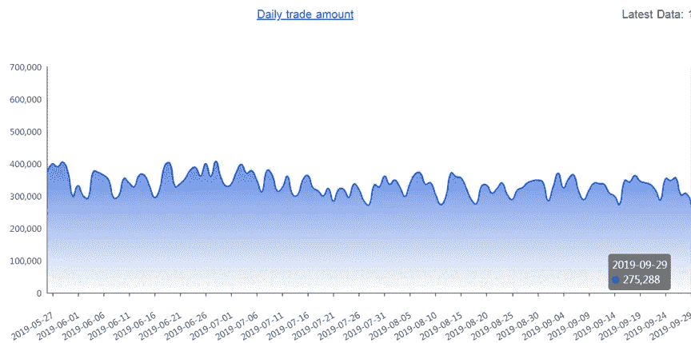
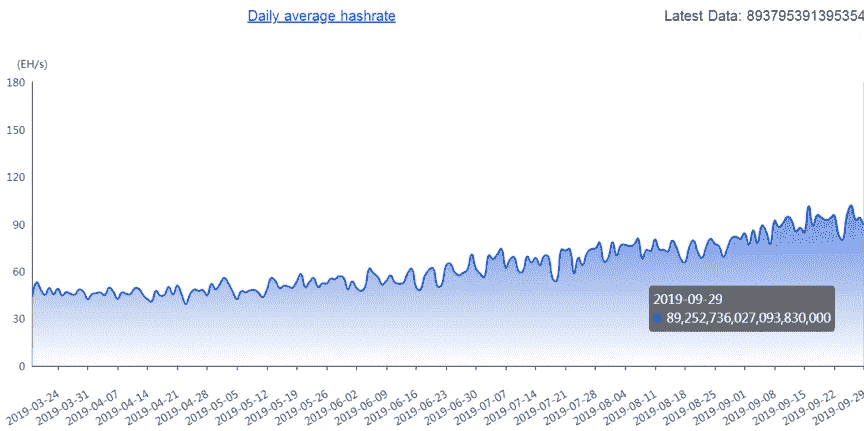
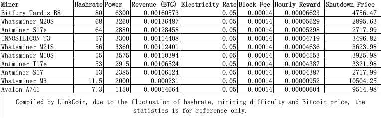
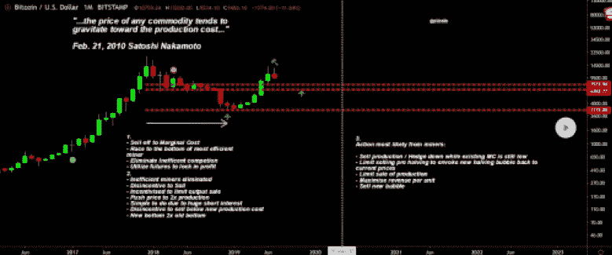
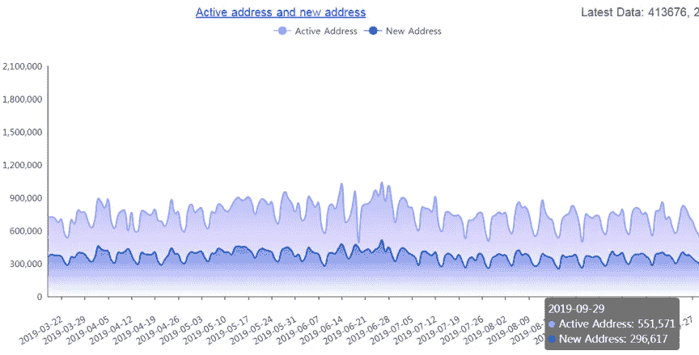
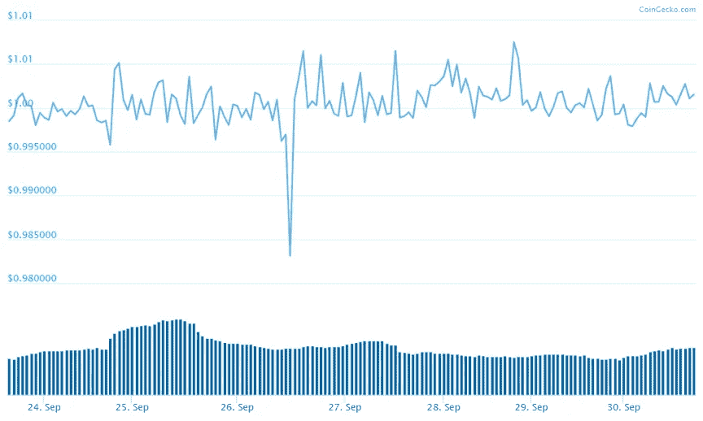
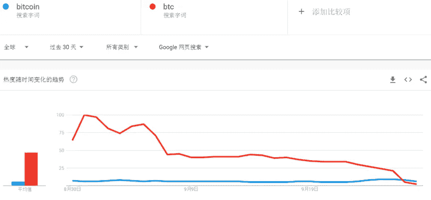
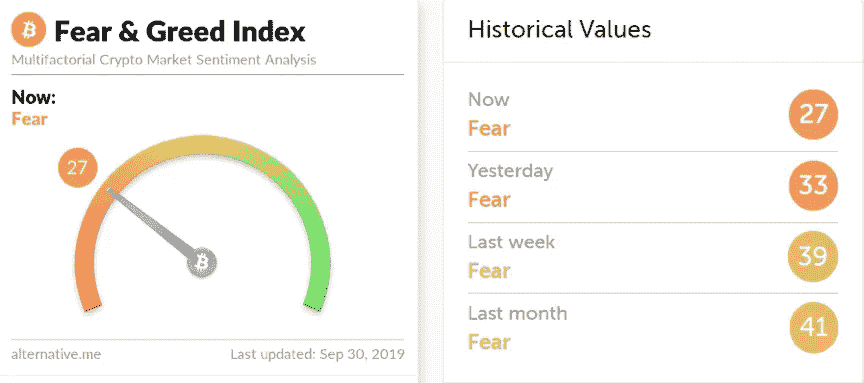
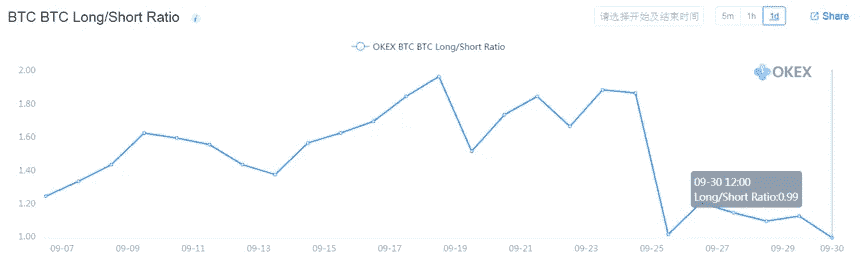

# 比特币已经触底了吗？比特币价格分析

> 原文：<https://medium.com/coinmonks/has-bitcoin-hit-rock-bottom-yet-bitcoin-price-analysis-a5a50512fb36?source=collection_archive---------2----------------------->

我们上周根据我们对多头/空头头寸比率的分析得出结论，比特币将出现重大价格调整。我们的预测是正确的，但是价格下跌的幅度仍然比预期的要大。我们来看看本周的行情。

# **日交易量**

Source: Tokenview

日交易量从 35 万下降到 30 万，下降了 14%。然而，这一数字仍然比去年同期下降了 20%要好。这表明，我们可能会在短期内看到比特币价格的暂时反弹。

自 2018 年 2 月以来，每日交易量一直在缓慢增长。它显示了比特币的核心价值，是比特币价格的根本支撑。

# **日均哈希表**

Source: Tokenview

与上周相比，我们看到比特币的价格有所下降。比特币的 7 天平均价格为 90EH/s。3 天平均价格为 88EH/s。作为同类产品中的顶级产品，比特币的底部价格与大多数采矿钻机的“停工价格”高度相关。这是否意味着比特币的价格已经触底？

我们来看看 f2pool 的统计数据。基于目前比特币挖矿的难度和 0.35 元的电价，两个知名的采矿钻机——沃斯迈纳 M3 和阿瓦隆 A741 已经达到了停工价格。至于其他主要的采矿钻机，与去年相比，它们的停工价格已经上涨。所以比特币的价格肯定还没有见底。

# 如何计算采矿钻机的停工价格？

停机价格=(电价*功耗/ 1000 +小时采奖励* 2%) /小时采奖励

小时挖矿奖励=(有效 hashrate / hashrate) *(大宗奖励+大宗交易费)* 6

Tradingview 上的热门分析师 Filbfilb 根据烛台图分析预测此轮关机价格为 7531.94 美元、6352.77 美元、3172 美元。我们已经接近第一个停工价格了。

# **激活&新地址**

Source: Tokenview

活动地址是指每天使用的唯一“发件人”或“收件人”地址的数量。新地址是指每天用于首次交易的地址数量。上周我们看到这两个数字急剧下降。

# **USDT 快照**

Source: CoinGecko

USDT 上周有所增长，但总体交易量仍然较低。这表明，有一些资金在该领域的底部捕捞，但它没有帮助市场太多。根据最新消息，Tether 将把另一个价值 1999.7 万美元的 USDT 搬到以太坊。

# **谷歌搜索趋势**

查看过去 30 天谷歌对“比特币”和相关术语的搜索趋势，我们发现“比特币”的全球搜索量创下历史新低。

# **恐惧&贪婪指数(FGI)**

FGI 当时 27 岁，这意味着市场继续表现出恐惧情绪。

# **多头/空头头寸比率**

Source: OKEx

多空持仓比终于降到了 1 以下。

拥有证券的“多头”头寸意味着你拥有该证券。投资者保持“多头”证券头寸，期望股票在未来会升值。“多头”头寸的反义词是“空头”。“空头”头寸通常是卖出你并不拥有的股票。卖空的投资者认为股票价格会下跌。在合约市场中，多头和空头的总头寸是相等的。每一个多头都有一个空头。如果多空持仓比高，那么说明做多的人比做空的人少。根据以往的经验，如果这一比例过高，我们很可能会看到市场回调。

# **结论**

总之，所有的基本指数都没有显示出复苏的迹象。但每日交易量——比特币价格分析的核心指标——并没有超出预期，这表明我们可能会看到比特币价格的暂时复苏。从 hashrate 等其他长期指数来看，比特币还没有到底部价格。比特币可能在重新反弹后创下历史新低。如果投资者想抄底，他们需要小心。比特币明年减半将给比特币带来光明的未来，但这种未来是随着障碍的克服而到来的。我们建议你持仓，不要急于在底部买入。

**关于 LinkCoin 上的比特币交易详情，请联系董事总经理:Leon Tang，**[**Leon @ yes bit . ca**](mailto:leon@yesbit.ca)