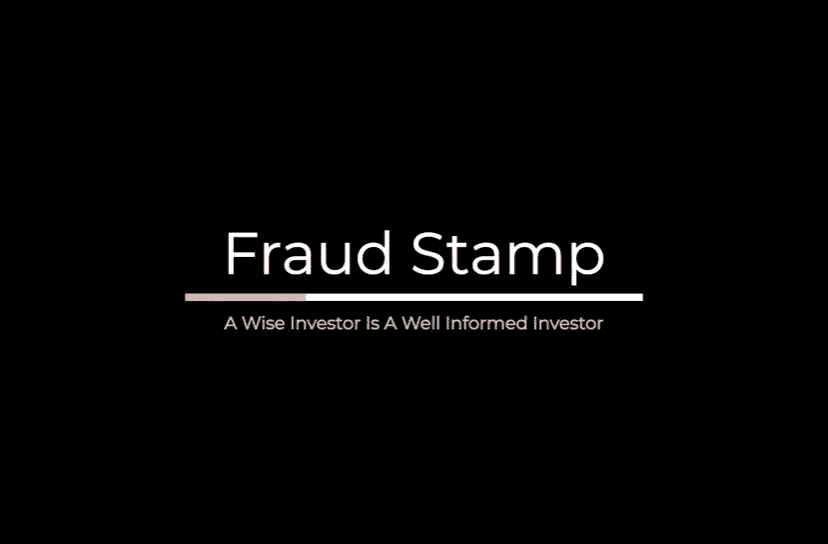

# 加密货币已经成为主流了吗？

> 原文：<https://medium.com/coinmonks/has-cryptocurrency-gone-mainstream-58e91e705586?source=collection_archive---------2----------------------->

## 如果有，谁来保护群众？

**关于你的作者:诈骗邮票**是一个小型的个人理财专家团队，提供一系列免费资源，包括在线课程、书籍和报告，以教育金融和投资领域的投资者。你可以访问我们在 www.fraudstamp.com[的网站](http://www.fraudstamp.com)，或者在 Twitter [@FraudStamp](https://twitter.com/fraudstamp) 上关注我们。

Photo by [Clifford Photography](https://unsplash.com/@cliffordgatewood?utm_source=unsplash&utm_medium=referral&utm_content=creditCopyText) on [Unsplash](https://unsplash.com/s/photos/cryptocurrency?utm_source=unsplash&utm_medium=referral&utm_content=creditCopyText)

PayPal 正在进入加密货币领域的最新消息是对加密货币未来的又一次认可。许多标题都写着，“加密货币正在成为主流”。你可能会想，他们这么说已经很多年了。你是正确的，他们有。但是考虑到比特币只有 12 年的历史，他们不可能说太久！事实上，我们在这篇文章中认为加密货币已经成为主流。让我们解释一下为什么…

我们要问的第一个问题是，主流到底是什么意思？

它描述了社会上大多数人眼中的“正常”。主流的东西是传统的。—Vocabulary.com

## **拥有加密货币正常吗？**

也许这不是正确的问题。也许所有权并不重要，重要的是意识。显然，90%的美国人听说过比特币，而这个数字在英国是 93%，在欧洲是 66%。如果认知度是衡量一种资产成为主流的标准，那么比特币已经到来。

然而，有人说，意识或所有权并不重要，重要的是经常使用，或者像一些人所说的那样，采用。

让我们暂时把注意力转向股票。我不认为股票作为一种资产类别不是主流资产是有争议的，因为超过 52%的美国人以某种形式拥有股票。

美国人拥有加密货币(更具体地说是比特币)的实际比例很难预测。在各种调查中，这一数字从 6.2%到 14.4%不等。我们认为 10%左右的数字更有可能。显然，与股票所有权相比，这是一个很大的差距。

这些是百分比，尽管它们是粗略的估计，现在让我们看看用户的数量，我警告你这是更粗略的估计！

## **所有权**

虽然区块链是透明的，但他们报告的数字无助于我们的事业。以比特币为例。许多钱包里没有或只有极少量的比特币。还有，很多人都有多个钱包。更糟糕的是，据估计，23%的比特币已经“丢失”。这意味着，至少可以说，我们看到的围绕比特币拥有者数量的许多数据具有误导性。

两个在许多评论者中似乎很常见的数字是，截至 2020 年 9 月，区块链钱包超过 5400 万个，有余额的地址略多于 3040 万个。对所有权的估计差异很大，从 1300 万到 2700 万不等。然而，这些数据也有根本性的缺陷，因为它们忽略了没有比特币或其他加密货币钱包的人。他们通过一家交易所购买加密货币，该交易所将他们的硬币保存在一个中央钱包中。这是业主数量从最初的估计开始快速增长的时候。

让我们客观地看待这些数字。最大的两家交易所比特币基地和币安共有 4500 万用户(比特币基地 3000 万，币安 1500 万)。据估计，包括集中保管的钱包在内，大约有 1 亿比特币所有者。

另一个有趣的相关事实是。你知道吗，55.4%的比特币持有者还投资了另一种加密货币？这意味着大部分替代币是由已经持有比特币的人持有的。

在此基础上，加密货币拥有者超过 1 亿的数字是合理的估计，美国是加密货币拥有量最高的国家。

## **活跃用户**

好吧，这就是加密货币所有者的数量，尽管这种方式并不令人满意。活跃用户怎么样？这是衡量加密货币是否已经成为主流的另一个可能的指标。

每天大约有 30 万到 50 万人使用比特币。Blockchain.info 估计平均有 55 万个活跃地址。多项调查显示，只有 8%的比特币持有者将电子货币作为支付工具。这些调查表明，比特币和其他加密货币的大多数所有者都是长期持有者，他们可能是因为“害怕错过机会”而购买的。这对主流采用来说不是一个好例子，但对加密货币来说是一个好例子，更具体地说是**比特币已经达到成为主流投资的地步。**证明那一点。据估计，11%的美国成年人持有黄金作为投资，相比之下，持有比特币的比例高达 14%。

## **加密货币是否已经成为主流？**

从我们对所有相互矛盾的数据和虚假估计的分析中，我们可以得出结论，特别是比特币现在是一种主流投资，其所有权数量与金条相似，金条是最多样化投资组合的核心组成部分。

大部分比特币是通过交易所购买的，存放在最终由交易所控制的中央钱包中。这是克服主流所有权和采用加密货币的主要障碍——安全性和托管——的完美解决方案。尽管重要的是投资者通过受监管的保税交易所购买，而不是通过充斥在这一领域的许多夜间操作。

## **不久的将来**

有趣的是，虽然采用速度缓慢，但随着 PayPal 进入市场并利用其 3.5 亿客户，这一速度只会加快。然而，PayPal 正在加入拥有 3000 万客户的 Cash App 的行列，eToro 拥有类似数量的客户，Revolut 和 Robinhood Crypto 各拥有逾 1300 万客户，它们都向消费者提供加密货币。然而，PayPal 将通过允许人们使用他们的加密资产购买商品和服务，对加密货币的采用产生最大的影响。

此外，比特币基地明年将推出加密签证借记卡。现在，所有者可以轻松利用他们持有的加密货币进行日常交易。这看起来确实是比特币的主流采用方式，其他一些主要的替代硬币(以太坊、比特币现金和莱特币在 PayPal 平台上被接受)也在路上。

未来推动收养的是女性。目前只有十分之一的人拥有加密货币。然而，女性占了 70%的零售支出。随着女性开始对在日常生活中使用加密货币感到舒适，采用加密货币的情况将会大幅增加。

## **加密货币方程式的另一边**

我们一直在讨论的加密货币是否是主流的争论，并没有仅仅考虑到加密货币生态系统中的一小部分。我们一直在探索它储存价值和作为交换媒介的能力。但加密货币市场的其他领域我们还没有研究，例如快速扩张的分散金融或 DeFi 领域，其中分散应用程序提供各种加密货币借贷机会和自动化交易。

此外，还有其他 DApps 提供游戏，赌博和文件存储等。这些 dapp 正处于采用的早期阶段，DeFi 空间的日均用户不足 7，000 人，所有 dapp 的日均用户为 80，000 人。虽然这些 DApps 中的许多提供了令人兴奋但有风险的机会，但它们距离成为主流还有很长的路要走，尽管我们相信它们最终会到达那里。加密货币的直接所有权也将在未来几年成为主流，但目前，对于普通投资者来说，这仍然太令人困惑，因为狗吃了他的密码而失去所有钱的想法会吓跑最喜欢冒险的投资者。

## **主流采用的风险**

每个人都说可伸缩性是主流采用的主要障碍。而且是在一定程度上。但有了贝宝的帮助，如果以太坊或比特币与 Visa 的 56000 笔交易相比，每秒只能处理十几笔交易，这真的无关紧要了。采用的主要风险仍然是它的不稳定性。波动性不会阻止投机者或持有者，但它会阻止人们用它来支付账单和买咖啡。然而，在现实中，使用加密货币(在这种情况下是比特币)的人越多，价格波动就越小。长期来看，我们不认为波动性会影响比特币的应用。

## **其他有趣的发展**

*   **比特币 ETF**

如果证券交易委员会批准比特币支持的交易所交易基金，美国拥有比特币的人数可能会大幅增加。尽管他们拒绝了迄今为止的所有申请，理由是没有一项提案证明“比特币市场足以抵御市场操纵”。那一天会到来的。尽管推出比特币 ETF 不会影响其采用，但它将显著增加将比特币作为投资组合一部分的人数。

*   **机构开始行动**

亿万富翁对冲基金经理保罗·都铎·琼斯最近将比特币描述为“比赛中最快的马”，他购买了约 1.8 亿美元的比特币，占其基金价值的 2%(估计为 90 亿美元)。在这一大规模收购之后，上市企业软件公司 Microstrategy 被披露目前持有逾 5 亿美元的比特币。用不了多久，机构资金就会大规模流入比特币。

*   **脸书的天秤座**

回到 2019 年，在 crypto 的一生之前，脸书宣布了自己的稳定硬币 Libra。这引起了轩然大波，他们悄悄地继续进行这个项目，但没有大肆宣传。脸书已经声明，他们将不会发射天秤座，直到所有必要的批准已经收到。对于这个烫手山芋，他们无法承受“快速失败”的常规方法。Libra 的推出将进一步拓宽加密货币市场，并为其他稳定的硬币提供一种替代方案，主要是非常滑的系绳。然而，尽管脸书有 27 亿用户，这并不能保证成功。许多令人兴奋的项目通常会化为乌有，天秤座也可能会遭遇同样的命运。

**揭露比特币神话**

加密货币投资新手普遍认为，由于比特币的供应量有限，只有 2100 万枚，随着需求的增长，供应将受到限制，价格肯定会大幅上涨。这些新手投资者没有意识到的是，是的，有 2100 万个比特币，但它们可以被分割成 8 个小数点。这意味着一枚比特币实际上有 100，000，000 个 Satoshis(相比之下，一美元只有 100 美分！).在此基础上，如果一个 Satoshi 值 1 美分，那么一个比特币就值 100 万美元，市值为 18.4 万亿美元。相比之下，美国流通中的比特币价值 1.2 万亿美元。这个长篇大论的解释应该有助于你理解，2100 万比特币对很多人来说都是足够的。

## 谁保护投资新手的利益？

最后，我们还要问一个问题。所有这些公司都带着一个目标进入加密货币领域，尽可能多地销售加密货币，谁来保护消费者的利益？

以购买股票为例——股票主要在仅执行的基础上出售(即没有建议)。证券经纪人受证券交易委员会监管，这意味着如果他们疏忽大意，消费者将受到保护。在购买加密货币的情况下就没有这种保护了。虽然加密货币的风险警告与股票相同，但加密货币市场的复杂性要高得多。包括猖獗的价格操纵、泵送和倾销计划以及交易所报告的虚高交易量。你认为 SEC 为什么还没有批准比特币 ETF？

那么，谁来告知消费者购买加密货币的风险、复杂性和技术性呢？还是有人需要？消费者能为自己着想吗？

这些问题会得到不同的答案，取决于你问谁。我们认为消费者至少应该自己做调查。许多价格预测来自既得利益者。大型交易所总是试图推广他们的其他高风险产品。消费者可以信任谁来接收公正和最新的信息？

## **呼吸新鲜空气**

最近推出的一项新服务，我们认为对于加密货币市场的初学者来说，值得仔细研究一下。它叫做 crypto question—[www . crypto question . tech](http://www.cryptoquestion.tech/)。该平台完全独立于任何交易所，不持有任何加密货币，因此只有一个动机，即维护消费者的利益。为了帮助实现这一崇高的目标，他们提供由加密专家而不是机器人管理的问答服务，他们承诺在一小时内回答任何与加密货币相关的问题。尽管他们小心翼翼地不提供财务建议。他们还为那些想了解更多加密货币的人提供了一系列免费资源。这些免费资源包括在线课程、报告、研究和电子书。CryptoQuestion 为那些希望从门外汉身上快速赚钱的平台带来了新鲜空气。

**访问我们的**[**【www.fraudstamp.com】**](http://www.fraudstamp.com)**或在 Twitter 上关注我们:@**[**fraud stamp**](https://twitter.com/fraudstamp)

**没有理财建议**

本文不以任何方式构成财务建议。这篇文章应该作为补充信息添加到您现有的知识库中。

## 另外，阅读

*   最好的[密码交易机器人](/coinmonks/crypto-trading-bot-c2ffce8acb2a)
*   [Deribit 审查](/coinmonks/deribit-review-options-fees-apis-and-testnet-2ca16c4bbdb2) |选项、费用、API 和 Testnet
*   FTX 密码交易所评论
*   [Bybit 交换审查](/coinmonks/bybit-exchange-review-dbd570019b71)
*   最好的比特币[硬件钱包](/coinmonks/the-best-cryptocurrency-hardware-wallets-of-2020-e28b1c124069?source=friends_link&sk=324dd9ff8556ab578d71e7ad7658ad7c)
*   [密码本交易平台](/coinmonks/top-10-crypto-copy-trading-platforms-for-beginners-d0c37c7d698c)
*   最好的[加密税务软件](/coinmonks/best-crypto-tax-tool-for-my-money-72d4b430816b)
*   [最佳加密交易平台](/coinmonks/the-best-crypto-trading-platforms-in-2020-the-definitive-guide-updated-c72f8b874555)
*   最佳[加密贷款平台](/coinmonks/top-5-crypto-lending-platforms-in-2020-that-you-need-to-know-a1b675cec3fa)
*   [莱杰纳米 S vs 特雷佐 one vs 特雷佐 T vs 莱杰纳米 X](https://blog.coincodecap.com/ledger-nano-s-vs-trezor-one-ledger-nano-x-trezor-t)
*   [block fi vs Celsius](/coinmonks/blockfi-vs-celsius-vs-hodlnaut-8a1cc8c26630)vs Hodlnaut
*   [Bitsgap 评论](/coinmonks/bitsgap-review-a-crypto-trading-bot-that-makes-easy-money-a5d88a336df2)——一个轻松赚钱的加密交易机器人
*   为专业人士设计的加密交易机器人
*   [PrimeXBT 审查](/coinmonks/primexbt-review-88e0815be858) |杠杆交易、费用和交易
*   [HaasOnline 评论](/coinmonks/haasonline-review-d8d1a3400419)享受九折优惠
*   [埃利帕尔泰坦评论](/coinmonks/ellipal-titan-review-85e9071dd029)
*   [SecuX Stone 评论](https://blog.coincodecap.com/secux-stone-hardware-wallet-review)
*   [BlockFi 评论](/coinmonks/blockfi-review-53096053c097) |从您的密码中赚取高达 8.6%的利息
*   [开发人员的最佳加密 API](/coinmonks/best-crypto-apis-for-developers-5efe3a597a9f)
*   [最佳区块链分析工具](https://bitquery.io/blog/best-blockchain-analysis-tools-and-software)
*   [加密套利](/coinmonks/crypto-arbitrage-guide-how-to-make-money-as-a-beginner-62bfe5c868f6)指南:新手如何赚钱
*   顶级[比特币节点](https://blog.coincodecap.com/bitcoin-node-solutions)提供商
*   最佳[加密制图工具](/coinmonks/what-are-the-best-charting-platforms-for-cryptocurrency-trading-85aade584d80)
*   了解比特币的[最佳书籍有哪些？](/coinmonks/what-are-the-best-books-to-learn-bitcoin-409aeb9aff4b)

> [直接在您的收件箱中获得最佳软件交易](/coinmonks/newsletters/coinmonks)

