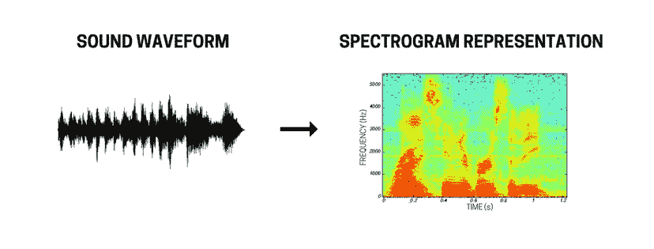

# 你有没有想过亚马逊 Echo、Siri 或者 Google Home 是怎么工作的？

> 原文：<https://medium.com/coinmonks/have-you-ever-wondered-how-amazon-echo-siri-or-google-home-work-539abed4092f?source=collection_archive---------8----------------------->

Google Home, Amazon Echo and Siri.

它们都是基于语音识别技术，这种技术在过去几年里变得非常流行。虽然语音识别是一个古老的学科，但深度学习跨越了这个领域，进入了 21 世纪，并导致错误率显著下降，性能提高。

> 深度什么？？？

我知道，几个月前这些术语对我来说也很陌生。在本文中，基于脸书人工智能研究实验室在école 42 开设的**语音识别课程，我们将解密语音识别系统是如何工作的，并了解它们当前的局限性。**

# **语音识别技术的背后是什么？**

像 Google Home 这样的系统基本上做 4 件事:

*1。识别您的声音—扬声器识别*

*2。识别你在说什么——语音识别*

*3。理解你的意思——自然语言处理*

*4。Renspond —语音合成*

我们将专注于语音识别，以了解机器如何通过使用深度神经网络来转录人类语音。

# 语音识别系统是如何工作的？

首先，我们需要了解人体是如何产生言语的。

语音只不过是由我们的肺部排出的空气，经过气管，然后是声带，最后由鼻子，嘴或两者排出，在那里由发音器官(牙齿，舌头，上颚，嘴唇)形成声音。为了捕捉这些声音，麦克风测量我们说话时产生的气压变化。麦克风将这些声音表示为**波形**，看起来像这样:

Waveform of a sound

# 试图复制人耳

试图仅通过查看波形来提取*单词转录*(例如单词“cat”)是不可能的。相反，我们将提取*音标*，即单词的实际发音。然而，由于波形只描绘了声音在一段时间内的振幅(响度)，因此很难区分特定类型的语音内容([音素](https://en.wikipedia.org/wiki/Phoneme)如 k，t)。我们将提取该信号的声学特征，用与其物理属性相关的值来表征它。为了简化起见，我们说声音基本上有两个物理属性:

*   音高(频率)
*   响度(振幅)

为了能够描绘声音，我们需要绘制两个参数相对于时间的曲线。我们将使用**声谱图**，这是一种视觉表示，用颜色表示振幅，绘制频率与时间的关系。

特征提取的作用是将信号转换成与机器学习相关的声学信号的表示，从而使我们的算法更容易学习。事实上，这样做是为了试图再现人耳的感知。但事实证明，人耳对低频的变化比对高频更敏感。在不涉及许多技术细节的情况下， **Mel-filterbanks** 对数标度将应用于声谱图以再现这一点。

现在我们有了一个尽可能与人耳感知相匹配的视觉表示，我们需要将它分割成短时间的片段。事实上，为了能够从声谱图中提取语音特征，我们不能一次处理整个句子；我们需要将其分割成小的固定长度的分析帧(通常为 10 毫秒),以固定的时间步长移动。这就是深度神经网络将进入游戏的地方。

# 深度声学模型，有趣的部分开始了

**深度声学模型**将提取语音特征的高级表示，并根据我们系统正在查看的特征，计算我们正在查看的特定帧中某个音素(k，a，t)发音的概率 P。它以特征作为输入，输出音素的概率。但是深度神经网络在这里是怎么用的呢？如果你是一个学数学的人，你可能知道我们在使用条件概率。如果你不是一个数学爱好者，这个深度声学模型只是一堆隐藏的层，它们将在彼此之上进行一些计算。最后，在将前一层的概率作为输入之后，*将输出音素的概率*。

我不会进入很多细节，但今天有两种主要类型的深度神经网络用于语音识别:

1.  *循环声学模型:*系统依次看到一个又一个矢量。处理向量时，它不仅会使用在特征中看到的信息，还会使用来自先前预测的信息。例如，它会考虑到这样一个事实，即辅音后面有元音的概率高于再次有辅音的概率，因为单词通常是这样构成的。
2.  *卷积声学模型:*与计算机视觉中使用的神经网络类型相同。它会观察语音特征，就像我们在看一幅图像一样，并且它会使用语音特征周围的一些上下文来计算概率。

# 从音素概率到音标

我们的深层声学模型给了我们音素的概率。我们还需要提取这个的*音标*再转写成单词。由于我们在声学模型中使用的固定长度的小分析帧不一定对应于单个声音，因为一个声音可能会占用几个帧，所以我们需要提取每个向量中每个音素的最大概率来训练我们的系统。然而，用正确的音素正确地标记每个向量是非常昂贵的，因为它需要由专业人员进行人工注释。相反，我们可以使用一种简单的技术，叫做**连接主义时态分类**。基本上，它不是最大化一个特定音素的概率，而是*计算每个路径的概率，并最大化有效路径*来给我们这个单词的音标。它会将声学模型的输出视为一个图形，并将一个音素的每个概率视为一个节点。每条路径都有自己的概率，它只是节点概率的乘积。

# 跨越终点线:单词转录

现在我们有了音标，我们还有一步要走，把它转录成有意义的单词。尽管这听起来很简单，但事实并非如此，因为我们可能有相似的语音输出，但单词和意思完全不同(“Madam”和“I'm Adam”在语音上非常相似，但单词的读音和意思都不相同)。为了将拼音转换成单词，我们将使用一个**语言模型**。它将基本上采用音标，使用单词的频率(通过分析大的文本语料库来计算)和它们一起出现的可能性来纠正声学模型和音标的错误。

Draw match: Humans 1 — Speech recognition system 1

> 嗯，没那么快，我的朋友…

即使现在最好的系统在英语会话语音方面与人类不相上下(平均 11%的单词错误率)，机器在语音识别方面远不如人类有效，原因有几个:

1.  *带口音的语音和嘈杂的语音*(带有严重的环境噪声)仍然非常具有挑战性，并且可以完全破坏语音识别系统的效率。
2.  *没有标准拼写的语言*如摩洛哥阿拉伯语是有问题的，因为两个不同的人不会以相同的方式写一个句子，因为没有标准的方式来写单词。
3.  *语言进化*是一个问题，因为新单词和重音符号不断出现在语言中，语音识别系统需要重新训练以纳入这些进化。
4.  与人类不同，*训练一个语音识别系统需要大量的数据*(一个 3 岁的孩子录制并注释的语音超过 12 000 小时，而非注释的语音在 2 00 到 2 400 小时之间)。不幸的是，并非所有语言都有如此大量的数据，例如*低资源语言*(使用人数少)。

# 人类 1 -语音识别系统 0

我必须承认拿机器和人类做比较是相当不公平的。不像语音识别系统，我们不只是腿上的耳朵。我们的语音识别系统使用:

1.  *我们的感官*:特别是我们看嘴唇的眼睛。
2.  例如，当我们在教室里时，我们更有可能听到与教室相关的词汇。
3.  例如，当有人指出一个物体，一辆公共汽车经过时，我们可以破译这个人所说的世界。
4.  *社交队列*:帮助我们理解单词的意思，例如，当一个父亲告诉他的孩子他做得很好时，他会对他微笑。

## 研究的机会

为了再现人类语音识别的效率，在以下领域进行了大量研究:

*   *多模态学习*:使用新的方法识别语音，如通过唇读的计算机视觉系统。
*   *未训练数据集*:不使用带注释的语音，而是使用不完整的注释来训练系统(没有特定顺序的单词)。
*   *半监督学习*:使用一个很好标注的小数据集和大量没有标注的语音。
*   *说话人识别中的迁移学习*:使用在另一种语言中训练的模型，并将其推广到另一种语言。
*   *计算机视觉系统和卷积神经网络*:试图消除对语音特征的需求，以便能够直接从波形到语音转录来训练语音识别系统。

> 所以不要担心，我们仍然比机器有一点进步；)

*如果你想了解更多关于语音识别的知识，我推荐你阅读* [*语音和语言处理*](https://web.stanford.edu/~jurafsky/slp3/) *和* [*声音场景和事件的计算分析*](https://www.amazon.fr/Computational-Analysis-Sound-Scenes-Events-ebook/dp/B075V1XXQV/ref=sr_1_1?s=books&ie=UTF8&qid=1512660092&sr=8-1&keywords=9783319634500) *。特别感谢脸书*人工智能研究实验室和 [*尼尔·泽格杜尔*](https://research.fb.com/people/zeghidour-neil/) *的语音识别课程。*

你学到什么了吗？点击👏为了感谢作者，也为了帮助其他非技术人员了解语音识别技术。