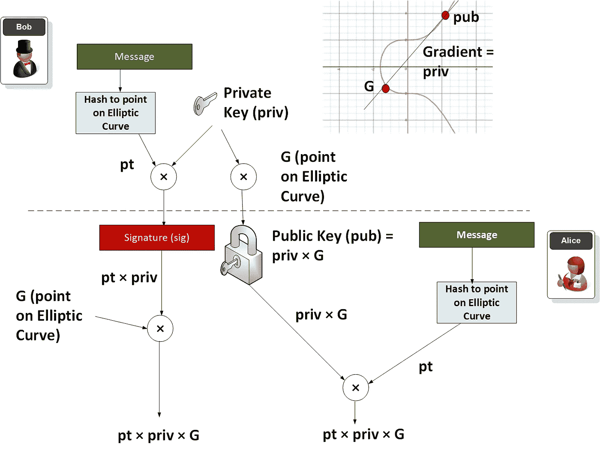

# 享受 BN 曲线带来的乐趣

> 原文：<https://medium.com/coinmonks/having-fun-with-bn-curves-37fb5b816f67?source=collection_archive---------0----------------------->

这里的演示了共享 BN 曲线的密钥。

## 介绍

椭圆曲线在公钥加密中应用相当广泛(比如在比特币和 Tor 中)。BN 曲线(Barreto-Naehrig 曲线)[ [论文](https://eprint.iacr.org/2005/133.pdf)定义了一种椭圆曲线，该曲线可用于考虑到高安全性和高效率水平的配对。本文使用 256 位 BN 曲线上的配对，并推导出一个