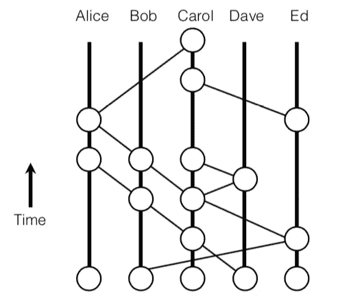
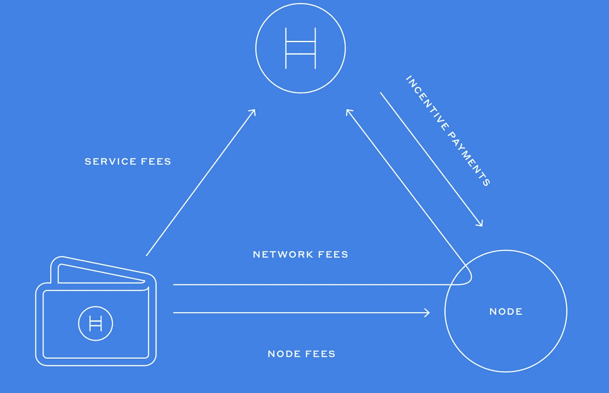

# hedera Hashgraph——“区块链黑仔”

> 原文：<https://medium.com/coinmonks/hedera-hashgraph-they-call-it-the-blockchain-killer-32a64729aa2d?source=collection_archive---------2----------------------->

DAG(有向无环图)链最近得到了很好的反馈。因为，每个人都在试图解决公共区块链网络中出现的问题。看起来这可能是一个很好的解决方案。市场上的一些顶级 DAG 链有:Hedera Hashgraph、IOTA、Nano、ByteBall。

这篇文章是对 Hedera Hashgraph 的一个概述。Hedera Hashgraph，LLC 是一家总部位于美国特拉华州的公司。它是治理委员会和公共分类帐网络的结合。我将讨论这两个方面。

**共识机制和数据结构**

Hashgraph 使用的协议是由 Leemon Baird 博士在漩涡公司的引擎盖下提出的。你可以在这里找到技术报告。该协议主要包括一个具有拜占庭容错保证的一致算法(在报告中被反复强调),网络中使用的数据结构是 DAG 结构——Hashgraph。在协议中，通过节点使用独特的八卦技术传播 hashgraph 数据结构来实现一致性。他们称之为“关于八卦的八卦”。

Visual representation of hashgraph (https://swirlds.com/downloads/SWIRLDS-TR-2016-01.pdf)

上面的可视化有助于理解事件(关于事务的信息)如何在节点之间传递。每个顶点都是一个事件，要么发生在节点内，要么通过流言从另一个节点接收。一个事件可以有多个事务、关于父事件的详细信息、分类帐状态、文件、时间戳、创建事件的节点的签名。

图中的边形成了一个 DAG 链，表示八卦历史的轨迹。当通过 gossip 同步时，节点只接受具有有效签名的事件以及它们还没有看到的事件。假设网络是一个拜占庭环境(2/3 的节点是诚实的，1/3 的节点是恶意的)，当事件被“强烈地看到”时，事件被认为是被确认的。这意味着，它已经通过网络的至少 2/3 的节点被另一个事件在时间上看到。这个过程称为“虚拟投票”，由所有节点自己执行，不依赖于其他节点。

在规则的时间阶段，节点还交换签名的一致状态。事件中的时间戳用于计算所有已确认事件的节点的时间中值(这个概念称为唯一著名见证人—不赘述)。在对交易进行排序时使用中间值。

在这一点上，我将把 hashgraph 与区块链进行比较，以说明 Hashgraph 的好处。

1.  区块链对分叉进行了大量修剪。这也可能导致某些有效事务的丢失。在 Hashgraph 中，随着结构的增长，没有修剪。根据他们的共识算法，他们说所有有效的交易都将被包括在内，永远不会被删除。
2.  随着更少的计算工作成为共识的一部分，通过 gossip 协议的事务吞吐量预计将远远高于当前的任何区块链，并且对于论文中提到的所有实验，延迟都低于 11 秒。每个节点自己计算投票，因此一个节点的带宽越大，流言传播越快，从而达成共识。
3.  在区块链，当一个块成为一定数量的父块(大约 6-7 个)的链的一部分时，就称为终结。Hashgraph 有一个概率为 1 的确定终结。
4.  具有功率一致性区块链易于受到 51%的攻击，而哈希图一致性算法解决了具有公平性的拜占庭容错。
5.  区块链允许矿商优先考虑收费较高的交易。他们可以重新排序，推送自己更感兴趣的。在 hashgraph 中，节点不能决定事务的顺序。它是基于事件时间戳自动完成的。
6.  区块链只允许匿名账户。根据使用情况，如果需要，我们可以在 hashgraph 中将第三方的身份附加/移除到帐户。这将有助于某些客户的任何 KYC(了解你的客户)或反洗钱(反洗钱)程序。这是一种托管身份系统。
7.  像 PAXOS 或 T2 RAFT 这样的共识机制依赖于选择一个领导者来安排交易。在 Hashgraph 中，对于某些节点，没有领导者或更高的角色。所有节点都将遵循相同的流程对事务进行排序。

**治理模式**

Hedera Hashgraph 委员会由 39 个负责维护网络的已知实体组成。所有成员的任期都是有限的。他们的职责包括:

1.  确保真正的权力下放。
2.  制定会员政策。
3.  代码库批准。
4.  规范网络令牌。

**POS 和分片一致性的改进**

这带来了共识机制的变化，将涉及利益证明(POS)和[分片](/@icebearhww/ethereum-sharding-and-finality-65248951f649)实现。每个节点都必须投入一定的加密货币才能加入网络。赌注的数量可以根据节点所有者的选择而增加或减少。他们还提到了一个名为“代理堆栈”的概念，这将允许没有能力托管节点的实体参与到网络中。当使用代理打桩时，利息收入的划分留给节点所有者和外部实体。

除了漩涡之外，实现分片还可以在网络中实现更高的事务吞吐量。最初网络中会有一个碎片，随着网络的发展，我想我们会看到更多的碎片加入。每一个都将有一组随机分配的节点，这些节点将遵循上述相同的共识过程。随机分配将由网络中的第一个分片主分片来完成。每天都会有重新分配，以保持所有碎片中每个节点的股份和分数的总量一致。跨分片通信也将通过每个分片中的消息队列来实现，以便实现不同分片中的节点之间的事件交换。每个碎片使用 64 位序列号跟踪来自其他碎片的消息。

**密码经济学**

现在是激动人心的话题——“费用”

客户必须为他们发布的每笔交易授权 3 种类型的费用。它们是:

1.  节点费—可由节点或市场力量设定。
2.  服务费——这是支付给 Hashgraph 管理成员直接使用他们的服务。
3.  网络费用—由节点向网络支付。

费用被授权为两个阶段支付，这降低了失去支付的风险。

Fees and Incentive payments (https://www.hedera.com/whitepaper)

**要考虑的事情**

等待..不全是绿色的。在我们兴奋地说这是“区块链黑仔”之前，有一些考虑要强调。

1.  虽然他们说代码将被公开审查，但直到现在还没有完成，它不是社区贡献的开源。
2.  白皮书中提到的路线图表明，最初的网络将不会是公共的，它将只是 39 个管理成员之间的网络。我们无法确认承诺的效率是否已经过测试。
3.  作为一个被许可的网络，我不认为 Hedera 令牌支付对公众是公平的。漩涡公司拥有 Hedera coins 10%的收入和 5%的股份。
4.  在公开之前，我不会担保这个共识和它的终结。
5.  围绕这里提到的[hashgraph 的公平性有一个很好的争论](/opentoken/hashgraph-a-whitepaper-review-f7dfe2b24647)。

总而言之，这是一种非常有趣的解决分散网络问题的方式。各队在他们的电报频道 [@Hashgraphdev](https://t.me/hashgraphdev) 公开讨论。他们还有一个[不和谐](https://discordapp.com/invite/FFb9YFX)社区，你可以在那里聊天。正如在他们的[门户](https://www.hedera.com/about#dapps)中提到的，许多 dapps 已经部署在网络上。

希望这能给你一个思路。请务必阅读漩涡公司的技术[报告](https://swirlds.com/downloads/SWIRLDS-TR-2016-01.pdf)，其中详细解释了算法。更多可用资源[点击这里](https://www.swirlds.com/resources/)。

> [直接在您的收件箱中获得最佳软件交易](https://coincodecap.com/?utm_source=coinmonks)

[**Click to read today’s top story**](http://bit.ly/2G71Sp7)