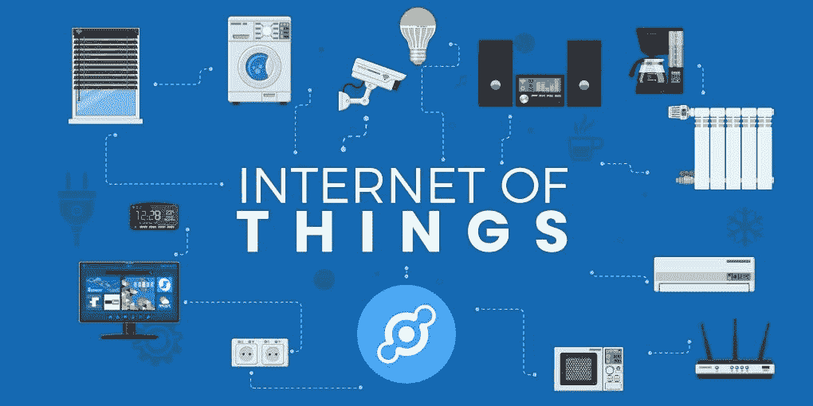
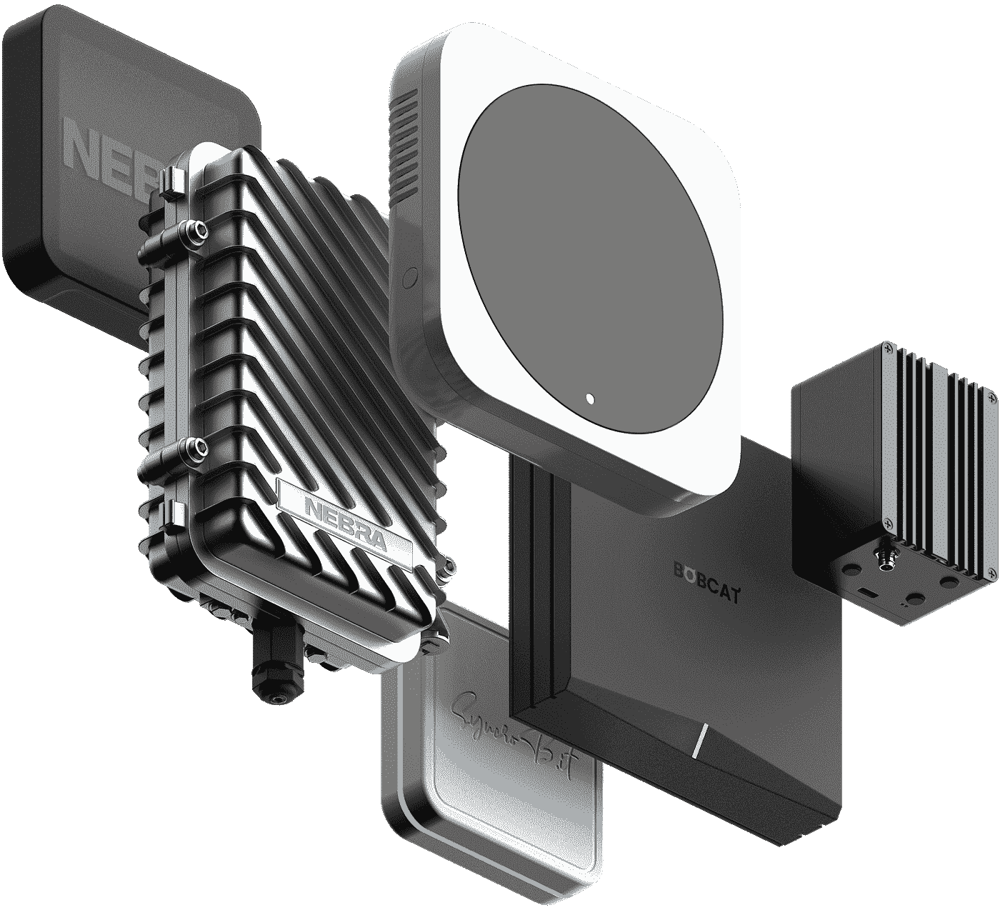

# 氦:物联网如何点对点

> 原文：<https://medium.com/coinmonks/helium-how-the-internet-of-things-goes-peer-to-peer-76b3a80e57ba?source=collection_archive---------3----------------------->

20 世纪 80 年代，笔记本电脑和台式电脑成为第一批大规模使用互联网的设备。几十年后，我们开始走向无线:连接到网络的移动设备变得无处不在。

在 2010 年代，一个新的趋势出现了:我们周围的电子设备也开始连接到互联网。这被称为物联网(IoT):你甚至可以在几英里外用智能手机监控、开关和配置小工具、家居用品和电子设备。

[**氦网**](https://www.helium.com/) 通过特殊的软硬件，方便物联网设备接入互联网。提供此类连接的用户将获得 HNT 代币奖励。让我们看看到底什么是物联网，以及氦如何通过引入 HNT 矿工的分散网络来推动物联网的采用。

# 物联网是我们的设备助手

物联网允许电子设备连接到互联网并共享它们的数据和信息。这为我们提供了一个机会来分析它们的使用统计数据并进行优化。

我们来考虑一下空调。当它离线时，你只能手动管理它:保持全天开机或回家后开始冷却。如果空调连接到物联网，您可以通过多种方式控制它，包括远程选项。在回家的路上打开手机，省电，享受走进一个凉爽的房间。

物联网优化并促进了我们与任何类型和大小的设备进行交互的方式。物联网汽车分析交通，并在跟踪发动机性能的同时为您提供最佳路线。您的物联网智能手表可以监控您的日程安排，提醒您参加商务会议，并提醒您有电话或收到消息。

# 为什么设备会盯着数据看，这如何帮助我们

除了增强的控制功能，物联网设备还可以找到周围的其他类似设备，并与它们共享数据。他们是如何以及为什么这样做的？

物联网设备有两种:通用设备和传感设备。一般的是你家里通过电缆或无线方式连接到互联网的智能设备。传感装置是安装在这些单元上的传感器。它们测量空气温度、湿度、时间、光亮度、一般设备的状态和性能。

传感设备收集的数据被上传到云存储，然后进行彻底的分析。这种分析的有用结果然后通过智能手机应用程序发送给用户。

这里有一个例子可以说明这在现实生活中如何帮助你。让我们回到空调:安装在它上面的传感器测量它的性能和健康状况，并将这些数据发送给制造商。每当一些机制磨损，生产者会意识到这一点，并通知你需要修理。

物联网在日常生活中帮助我们，让我们专注于重要的事情。如今，全球约有 500 亿台物联网设备；这个数字预计到 2025 年将增加到 800 亿。

# 氦气开始工作

2013 年，三名开发人员肖恩·范宁、阿米尔·哈利姆和肖恩·凯瑞一起致力于一个充满希望的想法:一个将电信市场设备互联的无线点对点网络。不久之后，当物联网趋势变得明显时，他们将注意力转移到了构建名为氦的 5G 网络上。

2017 年，当加密市场飙升至前所未有的高位时，该团队意识到:值得建立一个以加密货币为核心的激励模型。到 2019 年，HNT 令牌被开发出来，氦 mainnet 上线——就在第一个热点售出后不久。

# 氦气是如何工作的？

在氦的核心，有热点——类似 WiFi 路由器的设备，但事实上，有一个不同的目标。热点创建低带宽互联网连接，允许 100 公里以外的设备相互共享数据。这项名为 LongFi 的技术是氦的主要竞争优势:它比物联网迄今为止一直使用的蜂窝连接便宜得多。

任何人都可以购买现成的热点，或使用氦准备的软件包和可用的硬件创建一个新的热点。迄今为止，有 14 种不同品牌的**热点可以在氦网络中使用。**

**热点开采氦(HNT)令牌，使连接提供商提供服务有利可图。因此，氦是一个由人拥有并为人服务的网络。**

**氦经济有两个方面——供给和需求。在供应方面，令牌挖掘刺激了一些热点。在需求方面，有企业和开发者获得了一种廉价且健壮的方式来连接他们的设备。**

**从踏板车和宠物跟踪到环境传感和医疗保健监控解决方案，数据包存储在氦控制台中，可用于多种用途。它们与 Google Drive 兼容，因此数据所有者可以轻松访问它们。**

# **用氦怎么赚？**

**氦热点主要通过两种方式赚钱:**

*   ****他们挖掘 HNT** 用于从互联设备传输数据。传输的数据越多，奖励越高。**
*   **他们确保网络覆盖并获得回报。 Helium 利用覆盖证明，这是一种帮助网络确保所有设备都位于它们声称的位置并广播 LongFi 信号的机制。该检查由您所在范围内的随机热点执行。奖励支付给检查者和被检查者。今天，全世界有超过 425，000 个氦热点**，其中 82，000 个是在上个月产生的。****

****为了在网络中发送数据，Helium 中的物联网设备使用具有固定值的所谓数据信用。HNT 代币被焚烧以创造数据信用，并被铸造以向热点运营商支付采矿奖励。因此，在通货紧缩占主导地位的网络中存在一个均衡。就像比特币一样，氦通过每两年将排放量减半，使其 HNT 令牌变得稀缺。****

****如果你不想建立一个热点，但仍然想在氦网络中获利，股权 10000 HNT 成为一个 [**验证器**](https://www.helium.com/stake) 。在撰写本文时，氦网络中几乎有 3000 个验证器。为了确保最大的赌注奖励，尽可能保持在线状态:离线的验证者将受到大幅度的奖励。****

# ****结果****

****氦是一个全球网络的物联网所拥有的人。它帮助企业和个人创建分发 LongFi 信号的热点，这是一种从数英里以外连接物联网设备的方法，并在网络的本地资产 HNT 中这样做可以获得奖励。这种连接比传统的蜂窝网络便宜得多，因此为物联网提供了最佳解决方案之一。****

****HNT 代币今年的起价为 1.35 美元，到 12 月底的价格为 38.7 美元。这种价格动态显示了氦令牌经济学固有的通缩机制的积极影响，以及全球对物联网有前途的点对点解决方案的兴趣不断上升。随着物联网领域的发展，我们可能会看到更多此类解决方案和氦网络的进一步发展。****

> ****加入 Coinmonks [电报频道](https://t.me/coincodecap)和 [Youtube 频道](https://www.youtube.com/c/coinmonks/videos)了解加密交易和投资****

## ****也阅读****

**** [## 杠杆代币[多头代币]终极指南

### 杠杆化令牌是具有杠杆化风险敞口的 ERC20 令牌，不考虑保证金、要求、管理…

medium.com](/coinmonks/leveraged-token-3f5257808b22)  [## 最佳加密交易所| 2021 年十大加密货币交易所

### 加密货币交易所的加密交易需要了解市场，这可以帮助你获得利润。之前…

blog.coincodecap.com](https://blog.coincodecap.com/crypto-exchange)  [## 2021 年最佳加密交换平台| CoinCodeCap

### 编辑描述

blog.coincodecap.com](https://blog.coincodecap.com/best-swap-platforms)  [## 2021 年最佳加密借贷平台| 6 大比特币借贷平台

### 获得比特币和其他加密货币的最佳贷款利率

medium.com](/coinmonks/top-5-crypto-lending-platforms-in-2020-that-you-need-to-know-a1b675cec3fa)  [## 2021 年 6 大最佳硬件钱包|顶级加密硬件钱包[更新]

### 最好的加密货币硬件钱包是绝对必要的。我们将在 NGRAVE、Ledger Nano X 和…

medium.com](/coinmonks/the-best-cryptocurrency-hardware-wallets-of-2020-e28b1c124069)  [## 2021 年最佳免费加密交易机器人

### 2021 年币安、比特币基地、库币和其他密码交易所的最佳密码交易机器人。四进制，位间隙…

medium.com](/coinmonks/crypto-trading-bot-c2ffce8acb2a)  [## 最佳 4 个加密交易信号电报通道

### 这是乏味的找到正确的加密交易信号提供商。因此，在本文中，我们将讨论最好的…

medium.com](/coinmonks/best-crypto-signals-telegram-5785cdbc4b2b)****