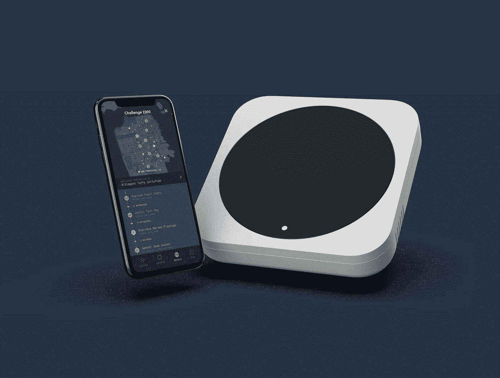
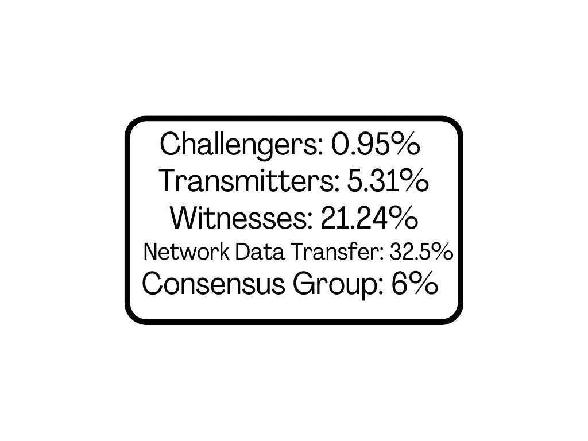

# 氦网络:采矿

> 原文：<https://medium.com/coinmonks/helium-network-mining-750de4c287b9?source=collection_archive---------5----------------------->

## 因帮助构建物联网网络而获得一些 HNT。

The Original Helium Hotspot Miner, now soldout (Image Source: helium.com press kit)

我[之前写过](/coinmonks/what-is-helium-network-fad1dc1e09c2)关于氦网络，以及我对此有多兴奋。这是一个有趣的加密项目，旨在为所有物联网设备建立一个庞大、可靠的网络。

到目前为止，由于社区运营的节点网络，它很好地实现了它的目标。

采矿在我的上一篇文章中有简要介绍。然而，我现在想更深入地探讨一下。我将主要关注 Helium 使用的覆盖范围验证算法，并快速接触设备。

# 覆盖范围证明

氦网络使用的算法不同于任何其他加密货币。覆盖范围证明(PoC)利用热点和其附近的其他热点发布挑战并验证 it 结果。网络由三个角色组成:挑战者、传递者和见证人。

**挑战者**，顾名思义，是向另一个节点发出 PoC 挑战的热点。向其发出挑战的节点不一定非常接近挑战者。节点大约每隔 240 个块发出一次挑战。

挑战者为挑战生成临时公钥/私钥对。两个密钥的 SHA256 摘要与块散列一起提交给网络。如果发现提交的材料有效，区块链将予以接受。使用来自挑战的数据，生成随机数，该随机数从网络上所有可用的节点中选择挑战目标。

从这里，我们到达**发射机**。发送器接收挑战包，使用适当的密钥解密最外层，然后将结果发送到网络。

一旦结果被传输，地理上靠近发射机的热点将会听到并看到这些数据包。由于结果没有特定的目标，任何附近的热点都可以成为**见证**。见证只是确认结果的有效性。

收入根据他们在过程中扮演的角色进行细分。截至 2021 年 6 月，奖励细分如下:

Information taken from Helium website as of June 2021

在一段时间后，奖励的分配会发生变化。我们讨论了前三个类别，但是这里还有两个其他的分发类别。

网络数据传输被分发到热点，热点从网络上的设备传输数据。它与传输的数据量成正比。至于共识组，热点被随机选入该组，以执行新的块发布和事务的验证。团体成员得到 6%的一部分。

值得注意的是，随着这些数字随着时间的推移而变化，氦处于两年减半的周期。因此，计划在今年 8 月初减半。

# 设备

有相当多不同的设备可用于采矿。一般来说，它们被分为室内或室外设备。每种设备都有一些不同之处，所以如果你想进入采矿行业，你绝对有必要做自己的研究。

采矿使用无线电技术发送和接收所有相关数据。因此，你必须确保为你所在的国家购买正确的频率。

简单介绍一下:Nebra 提供两种设备，一种室外设备，一种室内设备。从我所做的研究来看，他们的矿工是最受欢迎的品牌。在撰写本文时，美国和加拿大型号已售罄，只剩下欧盟型号。室外模型明显更贵，420 英镑(约 580 美元)，室内模型 300 英镑(约 415 美元)*。*在同一项调查中，我注意到山猫是下一个最受欢迎的矿工。山猫的模型与 Nebra 的室内模型定价相似，为 430 美元，这种模型仅适用于室内。

有更多的厂商生产矿工，但他们似乎不太受欢迎。

## **最后的想法**

开采氦气的初始投资不像其他一些投资那样大，但也不是微不足道的。一旦你找到一个你感兴趣的模型，研究你居住的地区。回想一下见证的过程，你会发现如果你的范围内没有其他矿工，你的收入会很低。

话虽如此，我仍然认为氦是一个伟大的项目。采矿技术对我来说特别有吸引力，快速浏览一下地图就会发现，如果你的位置合适，你可以赚到很多钱。即使你的范围内没有其他矿工，当其他人开始看到潜力时，开始你自己的矿会产生多米诺骨牌效应。

他们网站上的[采矿](https://www.helium.com/mine)部分提供了关于赚钱潜力和你可以购买的设备的最新信息。就像我说过的，对这个项目做你自己的研究，亲自看看他们如何通过提供一个坚实可靠的网络来改变物联网。

> 加入 [Coinmonks 电报频道](https://t.me/coincodecap)，了解加密交易和投资

## 另外，阅读

*   [网格交易机器人](https://blog.coincodecap.com/grid-trading) | [加密交易机器人](/coinmonks/cryptohopper-review-a388ff5bae88) | [加密交易机器人](https://blog.coincodecap.com/best-crypto-trading-bots)
*   [加密复制交易平台](/coinmonks/top-10-crypto-copy-trading-platforms-for-beginners-d0c37c7d698c) | [如何在 WazirX 上购买比特币](/coinmonks/buy-bitcoin-on-wazirx-2d12b7989af1)
*   【Crypto.com 评论】|[|](/coinmonks/crypto-com-review-f143dca1f74c)|[信用交易](/coinmonks/huobi-margin-trading-b3b06cdc1519)
*   [尤霍德勒 vs 科恩洛 vs 霍德诺特](/coinmonks/youhodler-vs-coinloan-vs-hodlnaut-b1050acde55a) | [Cryptohopper vs 哈斯博特](https://blog.coincodecap.com/cryptohopper-vs-haasbot)
*   [顶级付费加密货币和区块链课程](https://blog.coincodecap.com/blockchain-courses) | [币安评论](/coinmonks/binance-review-ee10d3bf3b6e)
*   [MXC 交易所评论](/coinmonks/mxc-exchange-review-3af0ec1cba8c) | [Pionex vs 币安](https://blog.coincodecap.com/pionex-vs-binance) | [Pionex 套利机器人](https://blog.coincodecap.com/pionex-arbitrage-bot)
*   [如何在印度购买比特币？](/coinmonks/buy-bitcoin-in-india-feb50ddfef94) | [WazirX 评论](/coinmonks/wazirx-review-5c811b074f5b) | [BitMEX 评论](https://blog.coincodecap.com/bitmex-review)
*   [印度比特币交易所](/coinmonks/bitcoin-exchange-in-india-7f1fe79715c9) | [比特币储蓄账户](/coinmonks/bitcoin-savings-account-e65b13f92451) | [HitBTC 审核](/coinmonks/hitbtc-review-c5143c5d53c2)
*   [币安收费](/coinmonks/binance-fees-8588ec17965) | [Botcrypto 审查](/coinmonks/botcrypto-review-2021-build-your-own-trading-bot-coincodecap-6b8332d736c7) | [Hotbit 审查](/coinmonks/hotbit-review-cd5bec41dafb) | [KuCoin 审查](https://blog.coincodecap.com/kucoin-review)
*   [我的密码交易经验](/coinmonks/my-experience-with-crypto-copy-trading-d6feb2ce3ac5) | [AAX 交易所评论](/coinmonks/aax-exchange-review-2021-67c5ea09330c)
*   [Bybit 融资融券交易](/coinmonks/bybit-margin-trading-e5071676244e) | [币安融资融券交易](/coinmonks/binance-margin-trading-c9eb5e9d2116) | [Overbit 审核](/coinmonks/overbit-review-9446ed4f2188)
*   [加密货币储蓄账户](/coinmonks/cryptocurrency-savings-accounts-be3bc0feffbf) | [YoBit 审查](/coinmonks/yobit-review-175464162c62) | [Bitbns 审查](/coinmonks/bitbns-review-38256a07e161)
*   [Botsfolio vs nap bots vs Mudrex](/coinmonks/botsfolio-vs-napbots-vs-mudrex-c81344970c02)|[gate . io 交流回顾](/coinmonks/gate-io-exchange-review-61bf87b7078f)
*   [Godex.io 评审](/coinmonks/godex-io-review-7366086519fb) | [邀请评审](/coinmonks/invity-review-70f3030c0502) | [BitForex 评审](/coinmonks/bitforex-review-c4bb28d9e271) | [北海巨妖评审](/coinmonks/kraken-review-6165fc1056ac)
*   [最佳比特币保证金交易](/coinmonks/bitcoin-margin-trading-exchange-bcbfcbf7b8e3) | [萝莉点评](/coinmonks/lolli-review-e6ddc7895ad8) | [比特币保证金交易](https://blog.coincodecap.com/bityard-margin-trading)
*   [创造并出售你的第一个 NFT](https://blog.coincodecap.com/create-nft) | [本地比特币评论](/coinmonks/localbitcoins-review-6cc001c6ed56) | [Prokey 评论](/coinmonks/prokey-review-26611173c13c)
*   [加密保证金交易交易所](/coinmonks/crypto-margin-trading-exchanges-428b1f7ad108) | [赚取比特币](/coinmonks/earn-bitcoin-6e8bd3c592d9) | [Mudrex 投资](https://blog.coincodecap.com/mudrex-invest-review-the-best-way-to-invest-in-crypto)
*   [WazirX vs coin dcx vs bit bns](/coinmonks/wazirx-vs-coindcx-vs-bitbns-149f4f19a2f1)|[block fi vs coin loan vs Nexo](/coinmonks/blockfi-vs-coinloan-vs-nexo-cb624635230d)
*   [杠杆令牌](/coinmonks/leveraged-token-3f5257808b22) | [最佳密码交易所](/coinmonks/crypto-exchange-dd2f9d6f3769) | [Paxful 点评](/coinmonks/paxful-review-4daf2354ab70)
*   [加密套利](/coinmonks/crypto-arbitrage-guide-how-to-make-money-as-a-beginner-62bfe5c868f6)指南| [如何做空比特币](/coinmonks/how-to-short-bitcoin-568a2d0b4ae5) | [1xBit 回顾](https://blog.coincodecap.com/1xbit-review)
*   [如何在印度购买以太坊？](https://blog.coincodecap.com/buy-ethereum-in-india) | [如何在币安购买比特币](https://blog.coincodecap.com/buy-bitcoin-binance)
*   [在美国如何使用 BitMEX？](https://blog.coincodecap.com/use-bitmex-in-usa) | [BitMEX 评论](https://blog.coincodecap.com/bitmex-review) | [期货交易机器人](/coinmonks/futures-trading-bots-5a282ccee3f5)
*   [最佳加密交易信号电报](/coinmonks/best-crypto-signals-telegram-5785cdbc4b2b) | [MoonXBT 评论](/coinmonks/moonxbt-review-6e4ab26d037) | [OKEx 评论](/coinmonks/okex-review-6b369304110f)