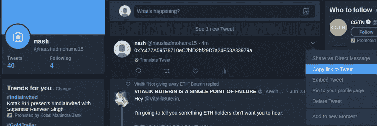
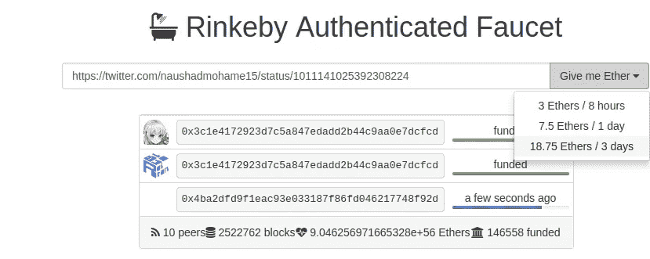
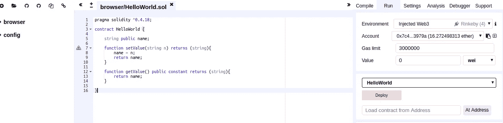
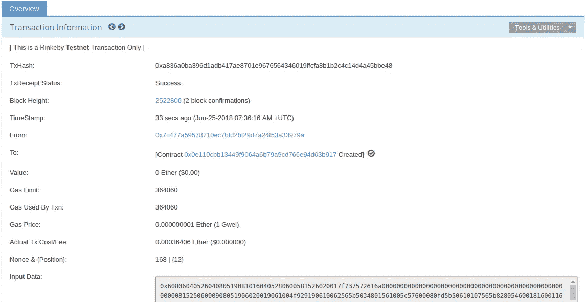
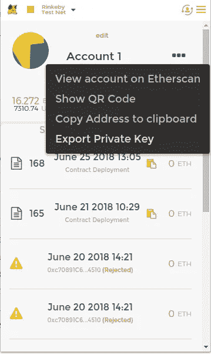

# 使用 Ethers.js 的“Hello World”智能合约

> 原文：<https://medium.com/coinmonks/hello-world-smart-contract-using-ethers-js-e33b5bf50c19?source=collection_archive---------1----------------------->

[**Ethers.js**](https://docs.ethers.io/ethers.js/html/index.html) 是 [**web3.js**](https://web3js.readthedocs.io/en/1.0/) 的替代，旨在更容易与**以太坊区块链**进行通信。嗯，使用 *Keythereum* 和 **Ethers.js** 有助于我们在客户端实现保存私钥的钱包功能，我们将在即将发布的本系列 ***第二部分*** 中看到详细内容。

区块链是现实世界问题和以太的解决方案，js 是我们实现它的工具之一。

我们将分三个部分进行讲解:

1.  **智能合约**
2.  **将智能合约部署到以太坊 Rinkeby Testnet**
3.  **与来自 Nodejs 的合同进行沟通**

> 交易新手？尝试[加密交易机器人](/coinmonks/crypto-trading-bot-c2ffce8acb2a)或[复制交易](/coinmonks/top-10-crypto-copy-trading-platforms-for-beginners-d0c37c7d698c)

## 1.智能合同

## 2.将智能合约部署到以太坊 Rinkeby Testnet

为了部署这个智能合同，我们需要在我们的谷歌 chrome 浏览器上安装 [**元掩码**](https://metamask.io/) 插件，并且帐户应该加载足够的以太网。如果您是安装 metamask 的新手，请参考下面的指南。

 [## 如何为 Chrome 使用 MetaMask

### MetaMask 是浏览器的以太坊扩展。它可以轻松地将您连接到以太坊应用程序(称为 dApps ),并且…

blog.ujomusic.com](https://blog.ujomusic.com/how-to-use-metamask-for-chrome-f258e6034226) 

将你的网络切换到 Rinkeby testnet 并复制你的地址。任何拥有 Twitter、Google+或脸书账户的人都可以在许可范围内向 https://faucet.rinkeby.io/申请资金。

我将使用 twitter，我的帐户地址是**0x7c 477 a 59578710 EC 7 bfd 2 BF 29 D7 a 24 f 53 a 33979 a**。

我现在将**用这个地址发推文**并且**复制推文链接**粘贴到水龙头。

Copying the tweet to use it in the faucet to load ethers

将推文链接粘贴到 **Rinkeby 水龙头**中，并请求乙醚，如下图所示。

Load 18.75 Ethers for 3 days

成功后，您将能够在 Metamask 中的帐户地址中看到 18.75 以太作为余额。

好了，现在我们必须将我们的智能合约从名为 **Remix** 的**在线 IDE** 部署到以太坊 Rinkeby Testnet。在 http://remix.ethereum.org[打开混音](http://remix.ethereum.org)

Deploying Smart Contract

请确保使用**环境**作为**注入的 Web3** ，当您按下**部署**按钮时，会出现 Metamask 弹出窗口，要求您**确认提交**交易。提交交易后，您将能够在 Remix 控制台下方看到 Rinkeby 交易链接浏览器。点击链接后，可以在 Rinkeby Etherscan 中查看交易，如下所示。

当合同创建成功时， **TxReceiptStatus** :将显示**‘Success’**，请注意**‘To’**地址，一旦我们必须从 Nodejs 应用程序与区块链合同通信，我们将不得不使用该地址。

在我的例子中，收件人地址是**0x 74 a9 a 20 f 67d 5499 b 62255 BFA 1 DCA 195d 06 aa 4617**。

现在从 **Remix IDE** 中，我们需要复制 **ABI** ，这是应用二进制接口，稍后也需要用它与智能合约进行通信。在 Remix 中，在**‘编译’**标签下，点击**‘细节’**，你会看到 ABI。点击 ABI 复制它。你可以用一个 JSON 丑化器([http://jsonmate.com/](http://jsonmate.com/))来丑化得到的 ABI，它会是这样的。

## 3.从 Nodejs 与智能合约通信

现在我们有了我们的契约所在的地址和 ABI，这足以让我们从 Nodejs 与我们的智能契约进行通信。我们需要使用模块“ethers”与合同进行通信。

转到您的工作目录，从命令行键入**‘NPM init’**来创建 package.json 文件。请注意，您需要在系统中安装“node”和“npm”。

现在，我们可以通过执行'**NPM install—save ethers @ 3**'来安装 ethers 模块，这将在目录中安装 ethers 节点模块。

*‘请注意，在撰写本文时，它是 ethers 版本 3，但现在 ethers 已经到了更新的版本，因此当您使用 npm 安装 ethers 时，您必须使用 NPM install-save ethers @ 3’*。

现在在同一个目录下创建 setvalue.js 文件，内容如下。

*'请注意，在撰写本文时，ethers 版本 3 支持通过调用上述方法中的 provider 直接访问* ***infura rinkeby 节点*** *。然而，现在* ***infura 已经改变了*** *，你必须用 infura 创建一个帐户，你将免费获得一个项目 id。我已经创建了一个新的提供者初始化如何做的例子如下。*

# var provider = new ethers . providers . jsonrpcprovider(" https://rinke by . in fura . io/v3/62349 EDB 370 e 4523 b 328 b 8823d 211551 "，" rinke by ")；

*其中****62349 EDB 370 e 4523 b 328 b 8823d 211551****是我的项目 id。请注意用此提供程序替换下面的所有内容。请不要发垃圾邮件。*

这会将网络提供者设置为 Rinkeby testnet。现在我们需要添加合同所在的地址，以及我们在第 2 步中获得的 ABI。

## 3.1 设置 Hello World

现在我们的智能合约有两个功能，一个是设置值，一个是获取值。请注意，设置一个值会改变智能合约的状态，其中必须发生一个事务，而获取该值不会调用状态更改，并且是一个常量函数。

因此，为了设置值，我们必须使用与智能合约通信的帐户的私钥来签署交易。我们可以从元掩码中获取帐户的私钥。单击 Metamask 中的“导出私钥”,并提供您的密码。

Exporting Private Key From Metamask

我得到的私钥是 3ab 6468 f 2465130 c 51946 a 5456 b 8e 2d 309 be 7 af 2f 8 afcd 6823996d 281 c 0990d 0。

我们必须添加前缀 0x 使其成为十六进制，因此私钥将是 0x3ab 6468 f 2465130 c 51946 a 5456 b8e 2d 309 be 7 af 2 f 8 afcd 6823996d 281 c 0990d 0。

现在，我们必须使用 Ethers.js 提供的钱包功能来签署我们的交易，并使用契约功能来初始化契约，以便与它进行通信，如下所示。

现在让我们通过将“Hello World”设置为参数来调用 setValue 函数。

现在从你的工作目录中，运行“node setvalue.js”来调用 setvalue 函数，将值设置为“Hello World”。

您将能够在控制台中看到如下所示的交易。

## 3.2 了解世界

正如我提到的，获取值是一个常量函数，不会改变区块链的状态，所以我们不需要签署交易或使用 Ethers.js 中的 wallet 功能。因此，我们将只使用足以与区块链通信的提供者，而不是作为合同中的参数的 wallet。

现在我们将调用如下所示的 getValue 函数。

现在，从您的工作目录中，运行“node callPromise.js”来获取智能合约函数 getValue()的返回值。

> 您将能够在您的控制台中看到返回的' **Hello World** '。

感谢您的阅读，如果您认为这值得，请随意鼓掌。

> 加入 Coinmonks [电报频道](https://t.me/coincodecap)和 [Youtube 频道](https://www.youtube.com/c/coinmonks/videos)获取每日[加密新闻](http://coincodecap.com/)

## 另外，阅读

*   [复制交易](/coinmonks/top-10-crypto-copy-trading-platforms-for-beginners-d0c37c7d698c) | [加密税务软件](/coinmonks/crypto-tax-software-ed4b4810e338)
*   [网格交易](https://coincodecap.com/grid-trading) | [加密硬件钱包](/coinmonks/the-best-cryptocurrency-hardware-wallets-of-2020-e28b1c124069)
*   [密码电报信号](http://Top 4 Telegram Channels for Crypto Traders) | [密码交易机器人](/coinmonks/crypto-trading-bot-c2ffce8acb2a)
*   [最佳加密交易所](/coinmonks/crypto-exchange-dd2f9d6f3769) | [印度最佳加密交易所](/coinmonks/bitcoin-exchange-in-india-7f1fe79715c9)
*   开发人员的最佳加密 API
*   最佳[密码借贷平台](/coinmonks/top-5-crypto-lending-platforms-in-2020-that-you-need-to-know-a1b675cec3fa)
*   [免费加密信号](/coinmonks/free-crypto-signals-48b25e61a8da) | [加密交易机器人](/coinmonks/crypto-trading-bot-c2ffce8acb2a)
*   [杠杆代币](/coinmonks/leveraged-token-3f5257808b22)终极指南