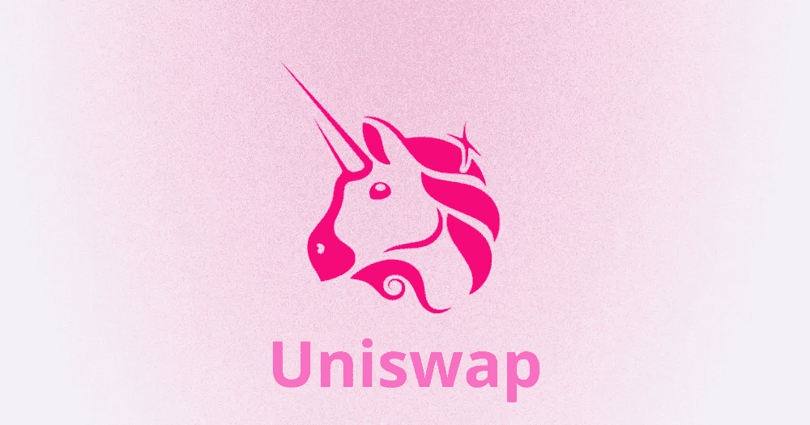
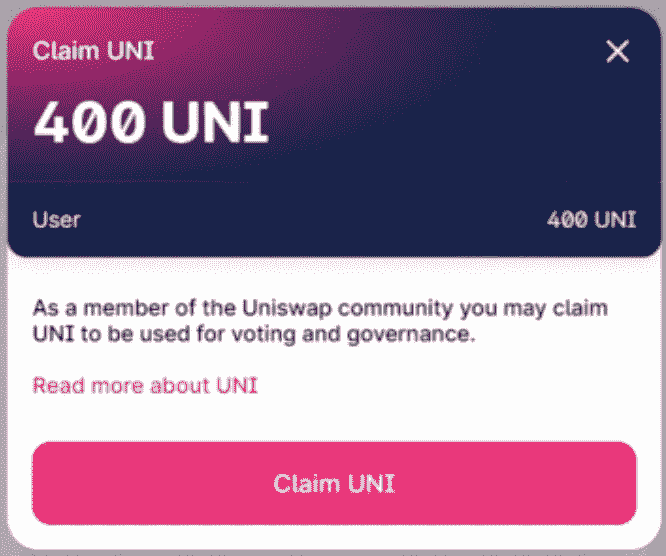

# 这是 UNI，Uniswap DEX 令牌

> 原文：<https://medium.com/coinmonks/here-is-uni-the-uniswap-dex-token-bf5908cb7c71?source=collection_archive---------0----------------------->

**Uniswap 展示了其治理令牌**,这是 DeFi 部门的许多人都在等待的。该公告来自分散式交易所(DEX)的开发团队，于 9 月 16 日发布，在比特币基地专业版和币安上市后，其价格和交易量都有相当大的增长。

这一举动和代币的发行被认为是对 Sushiswap 代币经济学政策的直接回应，这是上个月从 Uniswap 取走约 8 亿美元流动性的著名分叉。事实上，通过流动性挖掘，衍生平台已经成功地让人们在 DeFi 的世界中非常一致地谈论自己。这两个项目目前正在争夺自动做市商领域的**霸主地位，即所谓的自动做市商(AMMs)。**

## **什么是流动性挖掘**

[流动性挖掘](https://blog.coincodecap.com/defi-yield-farming-and-liquidity-mining)是一个正在 DeFi 中扎根的流程，本质上是向特定池(如 ETH / USDT)提供流动性:根据用户提供的时间和数量，后者将获得令牌管理奖励。因此，流动性提供者(LP)直接从资金池和治理令牌中收取费用，设法**赚取非常高的 APYs** 。
因此，Uniswap 将启动自己的流动性挖掘计划，允许用户通过向其资金池提供流动性来赚取 UNI，这些资金池最初将是 USDT 联邦理工学院、USDC 联邦理工学院、戴联邦理工学院和 WBTC 联邦理工学院。

## 令牌及其特征

开发团队随后提供了这个令牌的各种信息和特征。首先，**已经铸造了 10 亿个 UNI**并将在 4 年内实现。初始分配如下:
- 60%给社区成员
- 21.51%给团队成员和未来员工
- 17.80%给投资者
-0.069%给顾问。

在象征性分发后，象征性通货膨胀率将为每年 2%,以牺牲被动持有者的利益为代价，确保继续参与和对 Uniswap 的贡献。因此，UNI 正式将 Uniswap 视为公有且可自我维持的基础设施，同时继续小心翼翼地保护其坚不可摧的自主品质。

## 价格和初次分配

**第一批令牌被分发给 9 月**前使用 Uniswap 的用户，提供了近 29，000 个地址，UNI 数量相当于 400 个。发布后，价格真的爆炸了，仅一天后就从最初的 2.8 美元变成了大约 5.8 美元。因此，根据 CoinGecko 的说法，资本化金额约为 4.3 亿美元，使该令牌进入前 50 名，并“给”用户一个数字，即在第一个交易日之后，每个地址约为 2000 美元。

在 UNI token 发布后，**平台重新回到了 DeFi 排名的首位，其资金被冻结，是几天前的两倍。**

## 作为治理令牌的 UNI

UNI 持有者还将负责确保最佳平台开发，以提高令牌本身的价值。**因此，UNI 是一项治理资产，可用于对 DEX** 中的变化和发展进行投票，该 DEX 正越来越多地进入 DeFi 世界的核心。这些令牌发布的时机非常好，再次证明了项目的健壮性和开发团队的参与。

你呢？你认领了吗？

关注我在加密和区块链领域的其他文章！