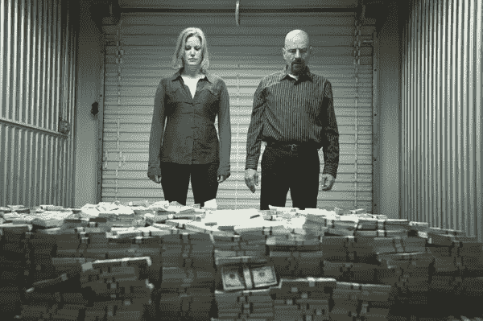

# 以下是通过非金融交易洗钱的方式！！！

> 原文：<https://medium.com/coinmonks/heres-how-money-is-being-laundered-through-nfts-3069b832fa98?source=collection_archive---------1----------------------->

每年大约有 5%的全球 GDP 被洗钱。相当于目前的 2 万亿美元。虽然这只是一个估计，但实际数额要大得多。有许多方法可以使非法收入合法化。让我们来看看其中的一些，看看这些年来洗钱是如何演变的。

Money Laundering

洗钱是将非法收入合法化的过程。它可以分为三个阶段:

1.  安置—将资金从非法活动中转移出去
2.  分层——掩盖资金转移的痕迹
3.  整合——通过合法渠道将资金释放到合法系统中。

几十年来，通过 smurfing(将大交易分成较小的交易)进行放置，通过骡子(走私现金)进行分层，并转换成黄金、艺术品、葡萄酒或手表，使其可变。整合是通过空壳公司或基于贸易的洗钱(误报资产价格)完成的。

Money Laundering

长期以来，艺术品被广泛用于洗钱。走私者过去常常购买廉价的艺术品，并以人为抬高的价格卖给一个已知的交易对手，这个交易对手实际上是在向他支付他应该合法化的非法资金。过去存放的艺术品是自由港。自由港是国际站附近的仓库，你可以在那里存放你的艺术品而不需要海关介入。只有当它们被带出自由港时，才应该缴税。大多数短期艺术品买家过去常常将艺术品存放在自由港以避税。尽管人们可以将艺术品存放在自由港，但艺术品的运输是非常透明的，如果监管机构有任何怀疑，可以追溯到相关人员。

通过 art 洗钱遵循以下流程。假设，我有 100 万美元，我的朋友也有 100 万美元。我们可以买两件便宜的艺术品，然后，我可以用一百万买他的，他可以用同样的钱买我的。因此，艺术品价格被人为地抬高了，因此资金来源对接受者来说是合法的。要求卖家的身份匿名，以避免追查到钱。以前，除非用现金付款，否则让卖家匿名是非常复杂的。

Money Laundering through Art

随着区块链的发展，任何交易都可以匿名。所以，没有办法知道发送者或接收者的人格。被抓的唯一可能性是将加密货币转换成法定货币。因为这是一大笔钱，你不能出示合法的收入证明。因此，尽管洗钱在区块链是安全的，但要想将其转换成法定货币而不被发现却是一个非常复杂的机制。所有从 crypto 到银行的提款都受到监控，并能引起税务当局的注意。除非加密变得更加广泛，成为日常支付的一种方式，否则它不是一种万无一失的洗钱方式。

通过加密货币洗钱仍然会让你在整合阶段被监管机构抓住(释放到法律系统中)。但当你将艺术品加入区块链，并可以人为抬高价格时，通过消除整合阶段的脆弱性，它可能成为洗钱的理想方式。如此高的价格可以用艺术品的稀有性、需求性和独特性来解释。这就是非艺术珍品出现的原因。不可替换令牌或 NFT 是区块链上的唯一令牌，不能与其他令牌交换。它们可以是数字艺术、音乐、数字视频、创意内容或任何形式的知识产权。这些 NFT 的稀有性赋予了它们一些历史上用于洗钱的艺术品的特征。需求越高，价格越高。一幅好的 NFT 作品可以卖到比你购买时高得多的价格。此外，还有拍卖条款，可以合法地抬高价格。

Money Laundering through NFTs

使用 NFTs，汇款人是未知的，交易无法追溯到区块链网络中的某个人，收款人可以通过合法的方式将资金整合到系统中。这使得 NFT 市场成为洗钱的绝佳场所。此外，为了进一步匿名，人们在发送者或接收者端使用加密混合器来保护他们的比特币地址。

让我们看一个例子。假设我有 200 万美元要洗，我的朋友 B 还有 200 万美元要洗。钱已经在加密网络里了。为了让它以合法的方式回到菲亚特系统，我和 B(我的朋友)可以买一辆便宜的 NFT。然后，我们可以人为地将 NFT 的价格抬高 200 万英镑，并以 200 万英镑购买对方的非功能性食品。这样，我的加密钱包里就有了合法的 200 万美元。我可以通过出售我买的稀有的 NFT 来证明这一点。监管者无法追溯到给我寄钱的 B(我的朋友)的人格。我可以把它们转换成法定货币并使用它们。

不留活口！！

一个具体的缺点可能是将如此巨额的资金投入到加密网络中。监管机构仍然可以访问你的银行账户，当你向 crypto 进行巨额转账时，他们可以锁定你。这可以通过使用 smurfing 来规避——将繁重的交易分解为较小的交易，然后将它们转换为密码，从而避开海关的注意。

这是一个典型的第 22 条军规，在去中心化和监管之间进行妥协。如果你认为有什么方法可以解决这些问题，请告诉我。

再见！！

在 instagram 上关注我，获取更多关于未来文章的更新: [@thevcfactor](https://www.instagram.com/thevcfactor/)

参考资料:

1.  [https://www . uno DC . org/uno DC/en/money-laundering/overview . html](https://www.unodc.org/unodc/en/money-laundering/overview.html)
2.  【https://www.fatf-gafi.org/faq/moneylaundering/ 
3.  https://EC . Europa . eu/info/business-economy-euro/banking-and-finance/financial-supervision-and-risk-management/anti-money-and-counting-financing-terrorism _ en
4.  [https://India forensic . com/certificates/methods-of-money-laiming/](https://indiaforensic.com/certifications/methods-of-money-laundering/)
5.  [https://legal jobs . io/blog/money-laiming-statistics/#:~:text = A % 3A，% 24800%200 亿% 20 到% 20% 242% 20 万亿](https://legaljobs.io/blog/money-laundering-statistics/#:~:text=A%3A,%24800%20billion%20to%20%242%20trillion)。
6.  [https://www . eisneramper . com/non-repoible-tokens-money-laiming-flvs-blog-0821/](https://www.eisneramper.com/non-fungible-tokens-money-laundering-flvs-blog-0821/)
7.  [https://coin telegraph . com/news/are-nfts-being-use-for-money-laundry-yes-they-is-claims-whale 先生](https://cointelegraph.com/news/are-nfts-being-used-for-money-laundering-yes-they-are-claims-mr-whale)