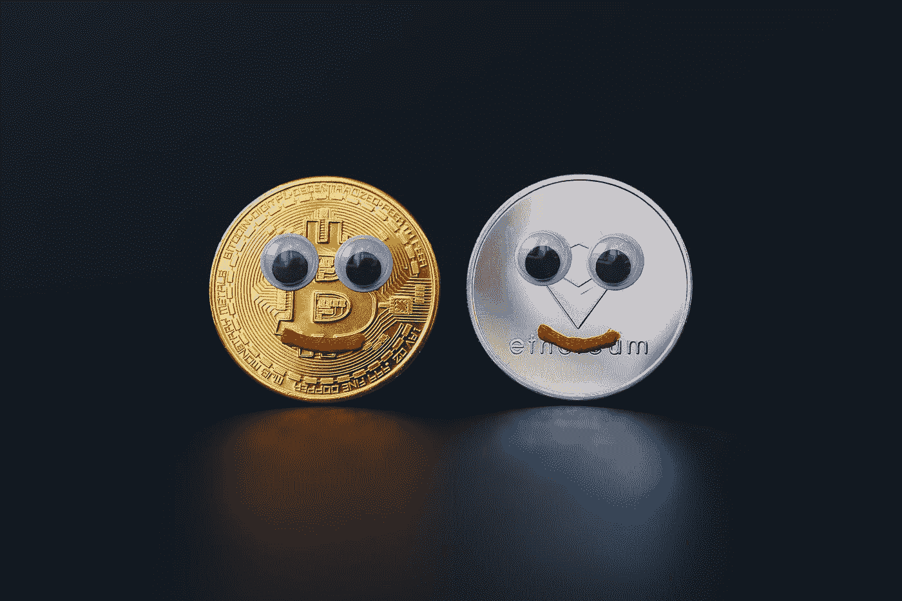
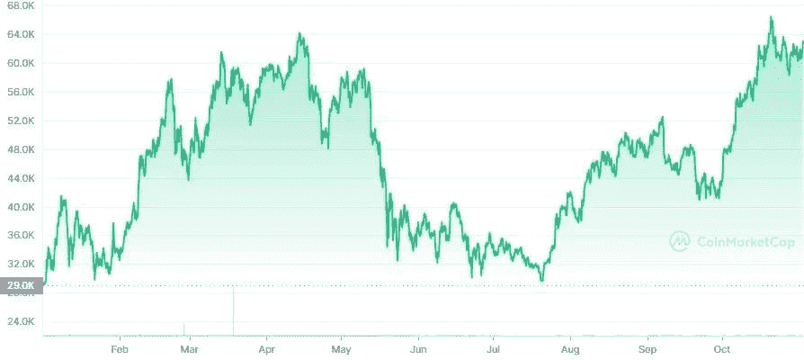
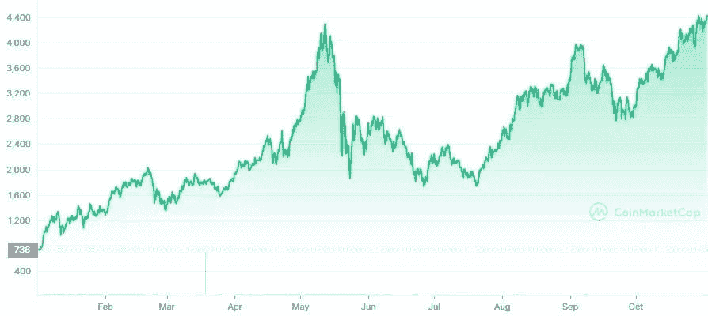

# 这是我今年在两种最大的加密货币中取得成功的秘诀

> 原文：<https://medium.com/coinmonks/heres-my-secret-sauce-for-success-in-two-of-the-biggest-cryptocurrencies-this-year-2b4196e38522?source=collection_archive---------6----------------------->

Photo by [Old Money](https://unsplash.com/@moneyphotos?utm_source=medium&utm_medium=referral) on [Unsplash](https://unsplash.com?utm_source=medium&utm_medium=referral)

分析师预测以太坊和比特币在 10 月份达到历史新高后，将在今年年底前翻一番。

B 计划背后的分析师在 9 月份正确预测了比特币的价格，并在 10 月份非常接近，预计**比特币将在本月达到 98，000 美元，并在 12 月超过 135，000 美元。**

这与基于世界上最古老的加密货币的其他比特币价格预测一致。**渣打银行预测比特币将在 2021 年或 2022 年初达到 10 万美元。**

额外的 ETF 预计将进入市场，为比特币作为金融工具提供更多有效性。

与此同时，全球投资银行**高盛**预测，以太坊的价格将在年底达到 8000 美元，比现在的价格还要高。最近一个由 50 名加密货币专家组成的小组，由 [Finder](https://twitter.com/100trillionUSD/status/1454962054297788417?ref_src=twsrc%5Etfw%7Ctwcamp%5Etweetembed%7Ctwterm%5E1454962054297788417%7Ctwgr%5E%7Ctwcon%5Es1_&ref_url=https%3A%2F%2Fcryptopotato.com%2Fbitcoin-to-reach-98k-this-month-according-to-s2f-creator-planb%2F) 召集，预计价格为 5000 美元。

# **推动比特币价值翻倍**

自从第一只基于比特币的交易所交易基金(ETF)在纽约证券交易所(NYSE)上市以来，机构投资者一直在向比特币注入资金。根据 CoinShare 的每周报告，截至 10 月 31 日的一周，加密投资产品获得了 2.88 亿美元的流入，其中**比特币占 93%，为 2.69 亿美元。**

这种加密货币在 10 月 31 日庆祝了它的 13 岁生日，今年迄今为止已经上涨了 112%，在 10 月份达到了 67，000 美元的历史新高。分析师预计，随着更多 ETF 进入市场，加密货币将进一步上涨，从而加强比特币作为投资工具而非真正交易媒介的有效性。

Bitcoin’s price year-to-date from January 1 to November 2

## 阅读这篇文章:“[2022 年前掌握加密货币成功的 9 个有力事实](/coinmonks/9-powerful-facts-to-master-your-success-in-cryptocurrency-through-2022-4d575cfa859d)”

# 以太坊的价格将随着盈亏平衡通胀而上涨。

第二大加密货币与通货膨胀的历史关联使高盛预计以太坊将在不久的将来突破 8000 美元。**据银行业巨头称，自 2019 年以来，加密货币一直与通胀区间保持一致，通胀区间是名义债券和同期限通胀挂钩债券的收益率之差**。

“它密切跟踪通胀市场，这可能是因为它作为一种‘网络型’资产的顺周期性质。”如果最近几个阶段的主导关系保持不变(灰色圆圈)，最近通胀盈亏平衡点的上升预示着上行风险，”该报告称。

Ethereum’s token, Ether’s price year-to-date from January 1 to November 2

# **以太坊的价格上涨**

分散金融(DeFi)的出现支持了以太坊的上涨，因为它有可能通过消除对银行、汇款提供商和其他参与者等中间人的需求来扰乱国际货币体系。此外，随着不可替代令牌(NFT)的兴起，许多新项目都采用了以太并加入了以太坊区块链。

以太坊协议现在正在经历从工作证明(PoW)到利益证明(PoS)共识的转变，预计这将节省 99%的用于采矿(验证交易)的能量。

# **以太坊面临的挑战**

以太坊的成长之路并非没有困难。由于社区就更新达成一致需要时间，新区块链如 Cardano、Solana、Polkadot 和其他人出现了，每个人都声称解决了升级带来的一个或多个问题，如过高的交易费用、能源使用或交易延迟。

由 50 名加密货币专家组成的发现者小组的一些成员认为，他们的“以太坊杀手”将能够在 DeFi 和 NFT 市场超越以太坊。

另一方面，比特币预计将保持其作为世界上最有价值的加密货币的地位——至少暂时如此。

但是现在开始对你来说很重要。你还必须遵循正确的策略来最大化你的利润。我相信你有很多问题，想知道它是如何工作的。这就是为什么我创造了 [**加密量子飞跃。**](https://bit.ly/3GqOwPC)

**一个循序渐进的视频** [**课程**](https://bit.ly/3GqOwPC) **向你展示如何入门比特币和加密货币，即使你对技术毫无头绪。**

在这个 [**课程**](https://bit.ly/3GqOwPC) 中，我将通过简单易懂的视频向你传授你需要知道的一切，这样你就可以跟上并从这个历史性的投资机会中获利，因为你通过采用加密货币来赚取一代人财富的窗口即将关闭。

> [**这是你的机会！**](https://bit.ly/3GqOwPC)

Photo by [Austin Distel](https://unsplash.com/@austindistel?utm_source=medium&utm_medium=referral) on [Unsplash](https://unsplash.com?utm_source=medium&utm_medium=referral)

如果你喜欢这篇文章，一定要关注我的博客。感谢❣join·科恩蒙克斯[电报频道](https://t.me/coincodecap)和 [Youtube 频道](https://www.youtube.com/c/coinmonks/videos)了解加密交易和投资

## 也阅读

 [## 最佳加密交易所| 2021 年十大加密货币交易所

### 编辑描述

blog.coincodecap.com](https://blog.coincodecap.com/crypto-exchange)  [## 2021 年 10 大最佳加密贷款平台| CoinCodeCap

### 编辑描述

blog.coincodecap.com](https://blog.coincodecap.com/crypto-lending)  [## 2021 年最佳免费加密交易机器人

### 2021 年币安、比特币基地、库币和其他密码交易所的最佳密码交易机器人。四进制，位间隙…

medium.com](/coinmonks/crypto-trading-bot-c2ffce8acb2a)  [## 最佳 4 个加密交易信号电报通道

### 这是乏味的找到正确的加密交易信号提供商。因此，在本文中，我们将讨论最好的…

medium.com](/coinmonks/best-crypto-signals-telegram-5785cdbc4b2b)  [## BlockFi 评论 2021:利弊和利率| CoinCodeCap

### 编辑描述

blog.coincodecap.com](https://blog.coincodecap.com/blockfi-review)  [## 如何在印度购买比特币？2021 年购买比特币的 7 款最佳应用[手机版]

### 如何使用移动应用程序购买比特币印度

medium.com](/coinmonks/buy-bitcoin-in-india-feb50ddfef94)  [## 加密税务软件——五大最佳比特币税务计算器[2021]

### 不管你是刚接触加密还是已经在这个领域呆了一段时间，你都需要交税。

medium.com](/coinmonks/best-crypto-tax-tool-for-my-money-72d4b430816b)  [## 存储比特币的最佳加密硬件钱包[2021] | CoinCodeCap

### 编辑描述

blog.coincodecap.com](https://blog.coincodecap.com/best-hardware-wallet-bitcoin)  [## Pionex 评论 2021 |免费加密交易机器人和交换

### Pionex 是为交易自动化提供工具的后起之秀。Pionex 上提供了 9 个加密交易机器人…

medium.com](/coinmonks/pionex-review-exchange-with-crypto-trading-bot-1e459d0191ea)