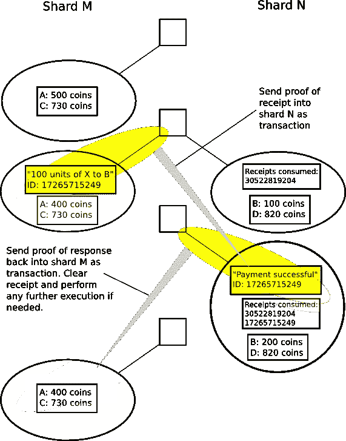

# 这是关于分片的交易

> 原文：<https://medium.com/coinmonks/heres-the-deal-on-sharding-96d8591856c4?source=collection_archive---------3----------------------->

## 以太坊可扩展性解决方案

区块链 ***吸*** 。

它们真的很慢，费用很高，现在没有任何基于它们的东西可以扩展，Cryptokitties 和此后的每一次以太坊压力测试都证明了这一点。

事实上，区块链是如此糟糕，以至于有一个臭名昭著的“可伸缩性三难困境”来概括他们最大的缺点:就像他们现在这样，如果不在**去中心化**、**可伸缩性**或**安全性**之间进行权衡，他们就无法生存。

例如:如果你的区块链真的像比特币一样去中心化，那么它将不得不在可扩展性或安全性之间进行权衡；在比特币的例子中，它是可扩展性。比特币是真正安全的，这是因为投入到这一链中的散列能力的数量，以及节点的数量。然而，因为有如此多的节点，所以即使处理一个事务也要花费很长时间，因为每个节点都必须按顺序验证它。

目前已经提出的一些通用可伸缩性解决方案是增加 [*块大小*](https://en.bitcoin.it/wiki/Block_size_limit_controversy) ，创建更多的个体*替代币*来处理单独的任务，以及 [*合并挖掘*](https://www.cryptocompare.com/mining/guides/what-is-merged-mining-bitcoin-namecoin-litecoin-dogecoin/) 。然而，它们都有自己的陷阱；区块大小(或 ETH 案例中的区块气体限制)不能无限增加(增加的区块大小将导致网络[变得集中](https://www.newsbtc.com/2017/11/12/61408/)在少数矿工周围)，altcoins 将在多个区块链上分散哈希能力，这大大降低了安全性，合并采矿增加了矿工的计算负担。

## 关于分片的 ELI5 有点

分片是协议内解决方案之一，旨在帮助以太坊扩展。分片将网络的 ***状态*** 分割成多个*分片*或片段，其中每个片段都有自己的事务历史和网络状态的一部分。(状态由网络在某一特定时刻的所有信息组成，例如已处理的交易量、每个地址的余额等。)

Source: [123rf.com](https://www.123rf.com/photo_67736162_bright-blue-texture-from-natural-gemstone-blue-crystal-background-for-your-jewelry-designs-.html)

例如，在一种分片机制中，一定数量的地址可以被限制在某个分片中。换句话说，所有以 0x00 开头的地址都可以进入分片 1，所有以 0x01 开头的地址都可以进入分片 2，以此类推。每个单独碎片上的每个新事务将只改变那个碎片的状态。碎片间的通信将通过[一些奇特的功能](https://github.com/ethereum/wiki/wiki/Sharding-FAQs#how-can-we-facilitate-cross-shard-communication)来促进，我将在后面解释。

每个单个碎片处理网络的*状态*的它自己的部分，这允许多个事务被并行验证，而不是必须由每个单个节点处理一个事务。这样，网络将能够更快地处理交易。

有了这样的协议，我们现在将有两个方面的操作，而不是只有一个。让我们放大，从第一个维度开始，那就是碎片。查看下图:

Source: [Hackernoon](https://hackernoon.com/blockchains-dont-scale-not-today-at-least-but-there-s-hope-2cb43946551a)

不是制造事务块，而是每个分片固有的被称为*提议者*的某些节点构建*排序规则*，这些排序规则基本上是事务组。

每个排序规则都有一个排序规则标题*如上所示，它包含了关于排序规则的信息——它属于哪个分片，事务处理前分片的状态，事务处理后分片的状态，以及所有事务验证后的收据根。带有所有< sig #0000 >元素的标题的右侧表示*公证*节点或*整理器*，它们用于下载和验证整理。这些公证人被随机分配给每个碎片，分配的碎片在一段时间后被洗牌。*

然后，在排序规则的主体中，我们看到所有要处理的事务 id 的集合。

*这么快****TL；DR*** *:提议者节点构建了事务组的排序规则。排序规则的头包含了关于碎片状态的信息以及验证它们的节点。校对主体包含事务。*

让我们稍微缩小一下**操作的第二维度** —“主链”。

现在，主链——工作证明链——不再存储完整的事务块，而是仅仅用来存储已经过正确验证的每个碎片的整理头。

Source: [Hackernoon](https://hackernoon.com/blockchains-dont-scale-not-today-at-least-but-there-s-hope-2cb43946551a)

在上图中，我们可以看到协议的“顶层”,在每个块中我们存储两个根；一个描述网络状态，分为多个碎片；另一个包含所有经过验证的排序规则头的信息。这意味着每个碎片的“最长链”是包含放在主链上的每一个排序规则的最长链。

## 跨碎片通信

分片最重要的一个方面是实现一些跨分片通信的方法。如果不能将事务从碎片 1 中的地址 X 发送到碎片 3 中的地址 Y，会有什么好处呢？

这种能力将通过收据来构建。还记得存储在每个排序规则头中的收据根吗？这些收据可以通过主链“块”中的事务组 [Merkle root](https://brilliant.org/wiki/merkle-tree/) 轻松访问。您可以将收据视为存储在单独的数据结构(Merkle 树)中的事务的副产品。节点可以很容易地调用它们来检查事务的存在，而不必下载整个区块链。碎片将能够通过这些收据相互通信。这是一个在[以太坊分片常见问题](https://github.com/ethereum/wiki/wiki/Sharding-FAQs#how-can-we-facilitate-cross-shard-communication)中解释的示例流程，其中来自分片 M 的账户 A 想要向分片 n 上的账户 B 发送 100 个硬币

> 1.在 shard M 上发送交易，该交易(I)从 A 的余额中扣除 100 个硬币，并且(ii)创建收据。收据是不直接保存在状态中的对象，但是可以通过 Merkle 校样来验证收据被生成的事实。
> 
> 2.等待包含第一个事务(有时需要等待完成；这个要看系统)。
> 
> 3.在 shard N 上发送一个事务，其中包括来自(1)的收据的 Merkle 证明。该事务还检查 shard N 的状态，以确保该收据是“未用完的”；如果是，那么它增加 B 的余额 100 个硬币，在收据花掉的状态下保存。
> 
> 4.可选地,( 3)中的事务还保存了一个收据，该收据随后可用于在碎片 M 上执行进一步的动作，这些动作取决于原始操作的成功。

实际上，这里有两个过程:一个“交易”只是扣除账户 A 的余额，然后另一个交易，与扣除交易的收据匹配，将从账户 A 扣除的金额添加到账户 B 的余额中。这样，我们可以有效地构建一个完整的跨分片交易。

如果你是一个更直观的学习者，这里有一个描述相同过程的图表:

Source: [Ethereum Sharding FAQ](https://github.com/ethereum/wiki/wiki/Sharding-FAQs)

## 脆弱点

所以分片听起来很神奇，但是你一定在想，在某个地方有*有*是一个陷阱。你说得对。分片解决方案可能面临的最大问题是单分片接管攻击。区块链通过网络中每个节点对每个交易的验证来确保安全性。然而，当网络状态被分割时，每个节点将只处理每个事务的某一部分。这将使保持信息安全变得更加困难。为了提交虚假的证明，将所有的提议人、证明人和公证人集中起来是比较容易的。

Single Shard Takeover Attack. Source: [Hsiao-Wei Wang](https://medium.com/u/1b39791caf3f?source=post_page-----96d8591856c4--------------------------------)

以太坊旨在解决这个问题的主要方式是通过**随机抽样**。一定数量的*公证人*被分配给每一个碎片，以验证整理，如前所述，分配的碎片将在一段时间后洗牌。

发生这种情况有两种方式。公证人可能会被明确地挑选出来，并被分组到委员会中去投票决定文书是否有效。还可以**隐式**期望它们返回到链中，并使用它们处理的每个新的归类来验证一定数量的旧的父归类。

有了这个限制，即使每个片上只有一小部分节点在处理新事务，安全级别仍然相对保持不变。我们可以在这里应用二项分布理论:

Binomial Distribution. Source: [Wikipedia](https://en.wikipedia.org/wiki/Binomial_distribution)

每条虚线下的总面积代表网络中节点的总数。驼峰下面的部分显示了大多数节点的位置。x 轴上的数字表示总集中诚实节点的数量。驼峰越偏向图的右边，网络中的节点就越诚实。驼峰越向左倾斜，节点越不诚实。蓝线表示节点对 20 节点样本大小诚实的概率为 50–50，绿线表示节点对 20 节点样本大小诚实的概率为 70–30，以此类推。

出于这个原因，如果我们继续统计概率，并假设大多数节点，大约 67%，将是诚实的，这意味着我们的二项式分布的“驼峰”将更加向右倾斜。因此，如果我们从节点总数中抽取一个代表 1 个碎片的较小样本(比如 150 个节点),我们将会看到[实际上有 100%的概率](https://github.com/ethereum/wiki/wiki/Sharding-FAQs#how-can-we-solve-the-single-shard-takeover-attack-in-an-uncoordinated-majority-model)该碎片拥有大多数诚实节点。

这样，如果实施了分片解决方案，攻击者将不得不实际控制网络的 100%-67% = 33%，才能真正构成威胁。

## 把所有的放在一起

因此，现在我们拥有了所有这些优秀的功能，为解决分片带来的一些最大挑战提供了坚实的尝试。我们实际上可以通过两件事来实现和连接它们。**股权证明信标链**，以及**验证器管理器合同**。

还记得我说过的切分提议是如何将以太坊分割成二维运作的吗？Ethereum 没有使用主工作证明链作为存储经过验证的排序规则和状态信息的“顶级”元素，而是实际上希望过渡到使用利益证明链(他们的 Casper 链)来取代这个功能。也称为信标链，它将管理和存储一组公证人和校对者，这些公证人和校对者被选择来在给定的时间内验证每个校对。在 PoS 链上，这些节点将被称为*验证器*。此外，信标链将由称为**交叉链接的元素组成，而不是存储事务组根。**这些类型的事务包含某个碎片上最近验证的排序规则的散列，并证明 2/3 的选定验证者已经批准了该排序规则。

目前，为了成为利益链证明上的验证者，你必须提交 32 个醚的利益到验证者管理器契约(VMC)上，它本质上跟踪哪个验证者正在做什么。如果您没有验证适当的排序规则，VMC 将不会退还您的股份。有点像保证金。VMC 的角色本质上是对验证器进行随机抽样，验证排序头散列，并通过收据促进跨分片通信。

## 它并不完美

这似乎是一个超级全面的解决方案，而且在大多数方面都是如此，但是分片建议仍然有很多需要解决的问题。首先，我们实际上不知道这将会实现得多好，以及我们还没有考虑到哪些问题，因为 [Casper 还没有完全实现](https://www.infoq.com/news/2018/06/Ethereum-Casper-First-Release)。在交叉通信方案中，还需要解决许多棘手的问题，因为[原子操作](https://github.com/ethereum/wiki/wiki/Sharding-FAQs#what-is-the-train-and-hotel-problem)(其中，如果一个事务失败，那么所有其他事务也必须取消)仍然没有解决。在验证的后勤方面，以及如何执行某些安全机制方面，还有许多其他问题。

如果你想继续更深入地了解分片提议，我推荐浏览这篇文章中的链接，以及阅读官方文档。

> 我希望这有所帮助！请让我知道你在评论中可能有的任何问题，以及如果我歪曲了任何信息的任何反馈。感谢您的阅读！一定要关注我更多这样的文章。

> [在您的收件箱中直接获得最佳软件交易](https://coincodecap.com/?utm_source=coinmonks)

