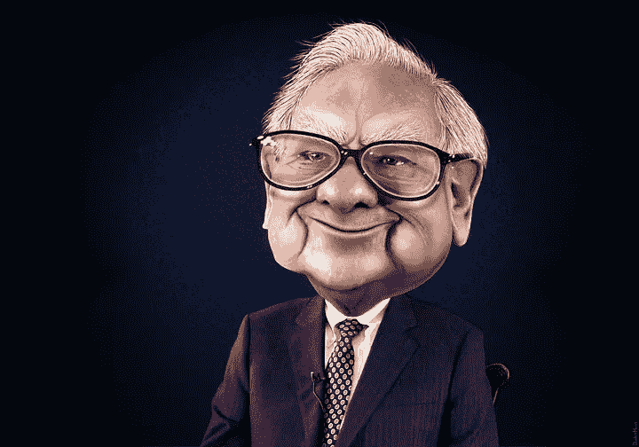

# 以下是加密投资者应该从股神沃伦·巴菲特那里学到的东西

> 原文：<https://medium.com/coinmonks/heres-what-crypto-investors-should-learn-from-stock-market-greats-like-warren-buffett-d82cd3b1768c?source=collection_archive---------7----------------------->

## 来自加密货币世界中成功的股票市场投资者的 4 个教训。

Warren Buffett Caricature by [Donkey Hotey](https://www.flickr.com/photos/donkeyhotey/12682081033)

我看到密码界有太多的人在嘲笑股票市场巨头，比如查理·芒格和沃伦·巴菲特。