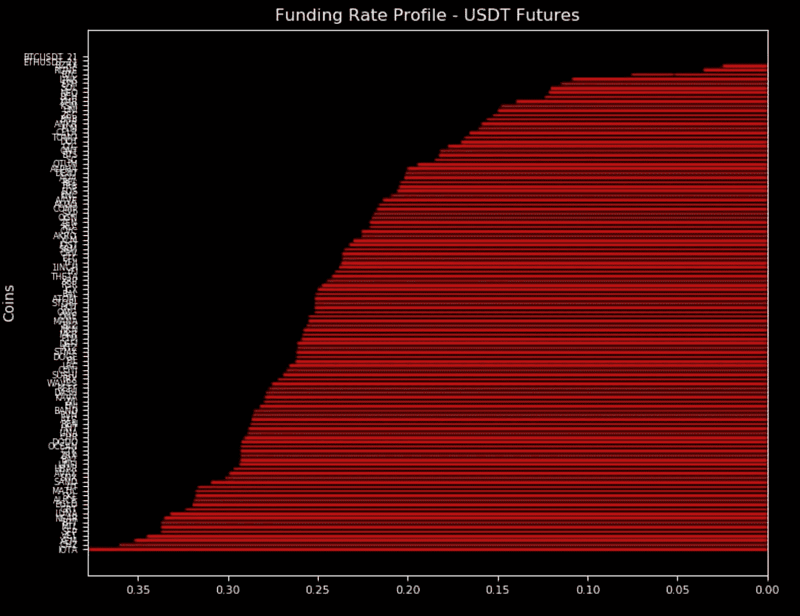
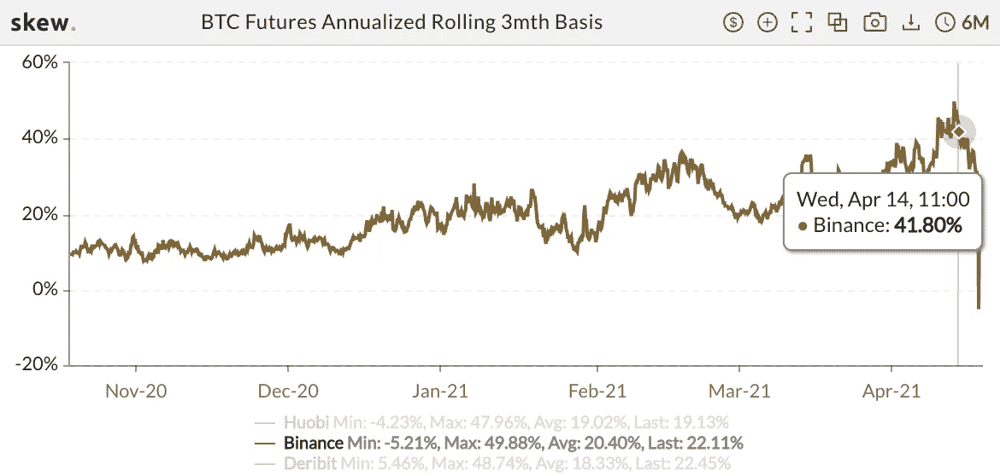
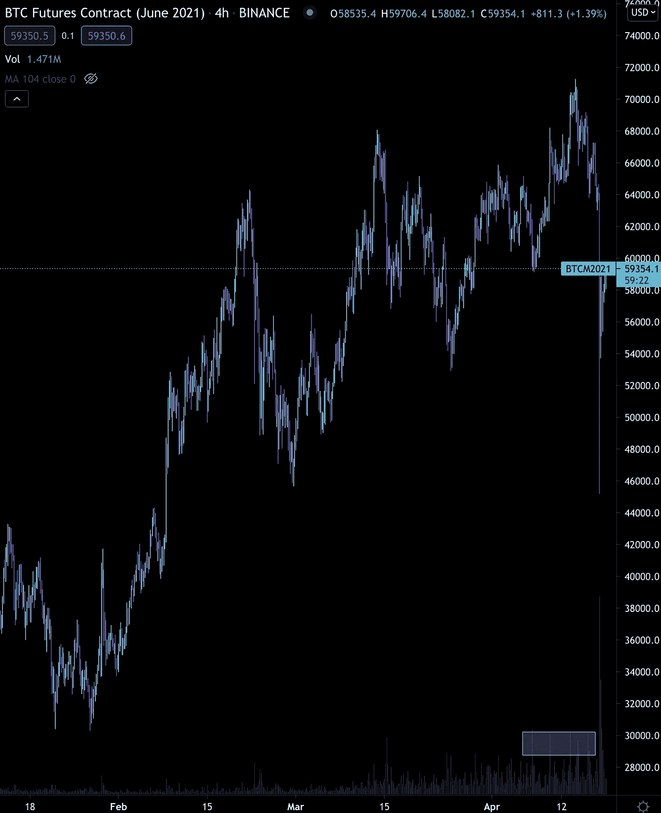
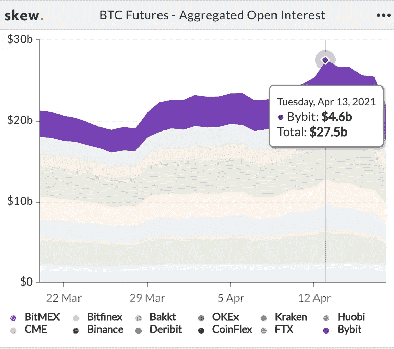
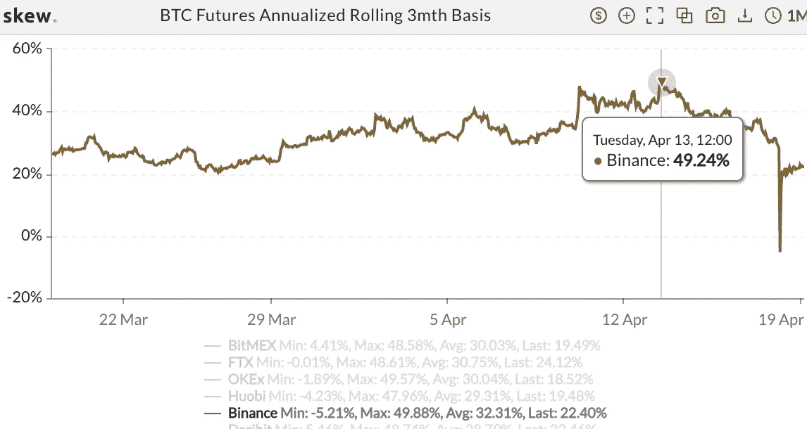
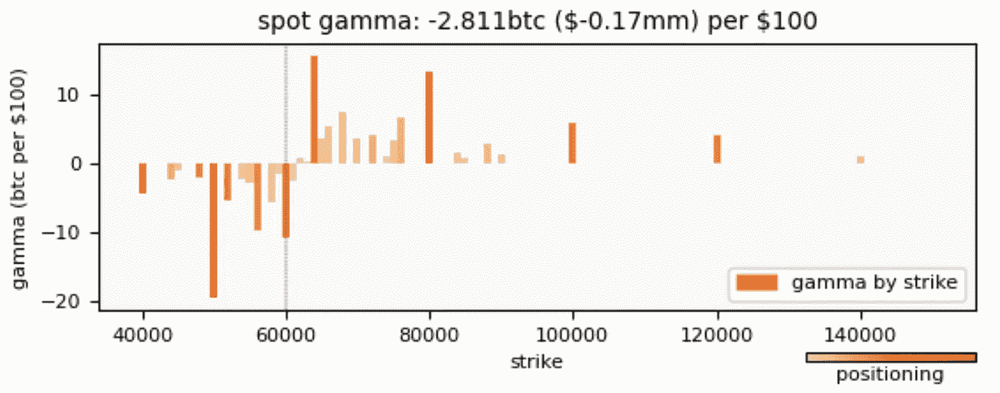
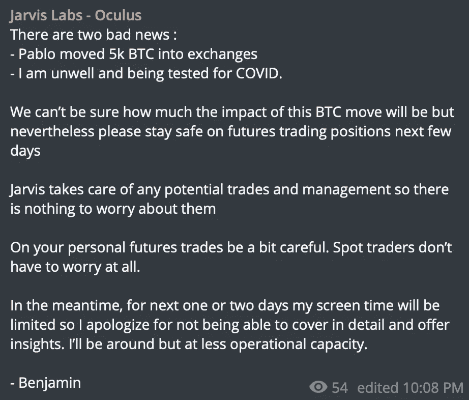

# 他回来了——回顾一下抛售

> 原文：<https://medium.com/coinmonks/hes-back-recap-on-the-selloff-96a0976b88f2?source=collection_archive---------4----------------------->

当涉及价值近 100 亿美元的清算时，连锁反应的警告信号有限。

这来自我们——一个链上分析师团队。

事实上，我们认为我们正在与过去 36 小时的趋势背道而驰，因为 twitter 上的每一个帖子都是有人将事件与他们的叙述相吻合。

如果你是一个链上的家伙，你将能够指出一些不正常的 BTC 流入你选择的交易所之一。

如果你是一家交易所的粉丝，你会指责另一家交易所的故障或停机。

日内交易者会指出融资利率。不相信加密的人会说这是空话和泡沫。许多人不愿意做艰苦的工作，而简单地称之为操纵。

至于我们……你知道我们是链上分析师，非常依赖市场结构。

这意味着我们的叙述通常与链上交换流相关。

但诚实的事实是，我们实际上没有看到任何特别突出的交易。

我们很乐意像往常一样向您展示导致抛售的具体大宗交易……也许我们会在几天内嗅出它，但就目前而言，我们将它视为一系列事件。

我一会儿就解释。

但首先我想提醒大家注意抛售前 18 小时的融资利率。

如你所见，价格提高了。但实际上，这些利率并没有我们在本轮牛市中看到的那么高。一月份，我记得看到过一些 0.7 以上的读数。

因此，尽管利率很高，但我认为简单地指着永久期货市场说散户交易员疯了是不公平的。

相反，我想拼凑上周晚些时候到周末的市场结构…

首先，让我们快速回顾一下一段时间以来 BTC 的外汇平衡。4 月 11 日，该数字为 234 万。到 4 月 16 日是 239 万。

余额每天增加一至四千 BTC。稳住。这是从 12 日到 16 日的净流量:3.6k，3.77k，1.31k，1.72k……也就是 10.4k。根据每个比特币的价格，这大约是 6 亿到 6.3 亿美元。

这意味着交易所在抛售压力方面正在放缓。

正如阿拉米达研究公司(Alameda Research)的萨姆·特拉布科(Sam Trabucco)指出的那样，被夸大的比特币基地上市失败可能导致市场出现一些疲软。

现在，虽然替代硬币的永久期货融资利率很高，但与最近的其他时间相比并不过分令人担忧…期货合同*是*。

在比特币基地上市时，这一比例超过了 40%。你可能记得我们[上周三](https://jarvislabs.substack.com/p/not-a-coincidence)讨论过这个问题，当时我们强调这个市场领域很可能会受到攻击。

它被攻击了。

这是币安 6 月合约，显示这段时间交易量增加…

现货和永久期货的交易量并没有像期货合约那样显示出大的变化，就像你在上面看到的那样(6 月)。我在成交量曲线周围画了一条横线，这样你就可以看到上周的上涨。

对我来说，这表明传播范围足够广，足以吸引重量级人物的注意。当你管理着数亿美元的资本时，40%以上并不是什么好掩饰的。

更支持这一观点…我们可以看到，当价差最大时，期货市场的未平仓合约(OI)开始飙升。这是石油投资的峰值，为 275 亿美元。

这是 3mo 系列的上衣…同一天。

所以我们在这里，更高的抛售压力来自交易中 BTC 数量的增加，美元硬币价格表现平平，期货抛售压力可能会受到重磅人物的攻击。

对我来说，这不像是操纵或单一交易。相反，它看起来像是一系列事件，一些最大的交易商暴露了市场的低效。

为了打击这类交易，需要做空 6 月和 9 月合约。

这最终导致拥挤的永续期货交易(第一份融资概况显示如此)损失近 100 亿美元。

此外，甚至期权市场也有助于创造一些连锁效应。

在下面的图表中，你可以看到一些相当大的红色条。这些红条突出显示了低于 61k 美元的有效负伽马值。这意味着做市商在价格下跌时卖出 BTC，以保持 delta 中性。

虽然这种伽玛效应不足以推动市场本身，但它肯定有助于创造下跌的动力。这是这一系列事件的另一个促成因素。

然后再加上一些中国矿工下线，一些被黑的推特账号发布看跌消息，以及其他一些事情…

很快你就有了一个市场戏剧自助餐桌，每个人都可以建立自己的故事……我的版本包含了六个因素。

虽然这可能不是市场被一桶冷水浇脸的确切原因，但这是一个不错的开端。

如果我们在接下来的几天里发现更多关于某个主力球员的信息，我们可能会在这里分享。

与此同时，当我们展望未来时…

巴勃罗回来了，本杰明感觉不舒服。

是的，你没看错。昨天收到的。

现在，与其详细说明这一切意味着什么，不如让我与你分享一个本杰明写给客户的帖子。请记住，Benjamin 让客户日夜了解最新情况。

他在市场上被套牢了，为了以防万一，他告诉交易员们在周末前结清他们的个人替代头寸。他的建议很明智。

以下是他未经过滤的话。

让我们都希望他在接下来的日子里感觉好些…

本·莉莉

又及——帕布罗最近时机不佳。事实上，他往往会在我们反转前的最后一次下跌时及时出现。因此，不要认为这是极端悲观的，只是更加谨慎。对于那些不知道 [Pablo 的人，请阅读这篇](https://jarvislabs.substack.com/p/who-crashed-the-market)。

> 加入 Coinmonks [电报集团](https://t.me/joinchat/PmKOYQ9NNKZlZGNl)，了解加密交易和投资

## 另外，阅读

*   最好的[加密交易机器人](/coinmonks/crypto-trading-bot-c2ffce8acb2a) | [网格交易机器人](https://blog.coincodecap.com/grid-trading)
*   [加密复制交易平台](/coinmonks/top-10-crypto-copy-trading-platforms-for-beginners-d0c37c7d698c) | [如何在 WazirX 上购买比特币](/coinmonks/buy-bitcoin-on-wazirx-2d12b7989af1)
*   [CoinLoan 审核](/coinmonks/coinloan-review-18128b9badc4)|[Crypto.com 审核](/coinmonks/crypto-com-review-f143dca1f74c) | [火币保证金交易](/coinmonks/huobi-margin-trading-b3b06cdc1519)
*   [尤霍德勒 vs 考尼洛 vs 霍德诺特](/coinmonks/youhodler-vs-coinloan-vs-hodlnaut-b1050acde55a) | [Cryptohopper vs 哈斯博特](https://blog.coincodecap.com/cryptohopper-vs-haasbot)
*   [杠杆代币](/coinmonks/leveraged-token-3f5257808b22) | [最佳密码交易所](/coinmonks/crypto-exchange-dd2f9d6f3769) | [Paxful 点评](/coinmonks/paxful-review-4daf2354ab70)
*   [加密套利](/coinmonks/crypto-arbitrage-guide-how-to-make-money-as-a-beginner-62bfe5c868f6)指南| [如何做空比特币](/coinmonks/how-to-short-bitcoin-568a2d0b4ae5) | [1xBit 回顾](https://blog.coincodecap.com/1xbit-review)
*   [如何在印度购买比特币？](/coinmonks/buy-bitcoin-in-india-feb50ddfef94) | [WazirX 评论](/coinmonks/wazirx-review-5c811b074f5b) | [BitMEX 评论](https://blog.coincodecap.com/bitmex-review)
*   [印度比特币交易所](/coinmonks/bitcoin-exchange-in-india-7f1fe79715c9) | [比特币储蓄账户](/coinmonks/bitcoin-savings-account-e65b13f92451)
*   [币安费用](/coinmonks/binance-fees-8588ec17965) | [Botcrypto 审核](/coinmonks/botcrypto-review-2021-build-your-own-trading-bot-coincodecap-6b8332d736c7) | [Hotbit 审核](/coinmonks/hotbit-review-cd5bec41dafb) | [KuCoin 审核](https://blog.coincodecap.com/kucoin-review)
*   [我的加密副本交易经验](/coinmonks/my-experience-with-crypto-copy-trading-d6feb2ce3ac5) | [购买硬币评论](https://blog.coincodecap.com/buycoins-review)
*   [Bybit 融资融券交易](/coinmonks/bybit-margin-trading-e5071676244e) | [币安融资融券交易](/coinmonks/binance-margin-trading-c9eb5e9d2116) | [Overbit 审核](/coinmonks/overbit-review-9446ed4f2188)
*   [加密货币储蓄账户](/coinmonks/cryptocurrency-savings-accounts-be3bc0feffbf) | [YoBit 审查](/coinmonks/yobit-review-175464162c62) | [Bitbns 审查](/coinmonks/bitbns-review-38256a07e161)
*   [Botsfolio vs nap bots vs Mudrex](/coinmonks/botsfolio-vs-napbots-vs-mudrex-c81344970c02)|[gate . io 交流回顾](/coinmonks/gate-io-exchange-review-61bf87b7078f)
*   [最佳比特币保证金交易](/coinmonks/bitcoin-margin-trading-exchange-bcbfcbf7b8e3) | [萝莉点评](/coinmonks/lolli-review-e6ddc7895ad8) | [比特币保证金交易](https://blog.coincodecap.com/bityard-margin-trading)
*   [创造并出售你的第一个 NFT](https://blog.coincodecap.com/create-nft) | [本地比特币评论](/coinmonks/localbitcoins-review-6cc001c6ed56)
*   [加密保证金交易交易所](/coinmonks/crypto-margin-trading-exchanges-428b1f7ad108) | [赚取比特币](/coinmonks/earn-bitcoin-6e8bd3c592d9) | [Mudrex 投资](https://blog.coincodecap.com/mudrex-invest-review-the-best-way-to-invest-in-crypto)
*   [如何在印度购买以太坊？](https://blog.coincodecap.com/buy-ethereum-in-india) | [如何在币安购买比特币](https://blog.coincodecap.com/buy-bitcoin-binance)
*   [顶级付费加密货币和区块链课程](https://blog.coincodecap.com/blockchain-courses) | [币安评论](/coinmonks/binance-review-ee10d3bf3b6e)
*   [MXC 交易所评论](/coinmonks/mxc-exchange-review-3af0ec1cba8c) | [Pionex vs 币安](https://blog.coincodecap.com/pionex-vs-binance) | [Pionex 套利机器人](https://blog.coincodecap.com/pionex-arbitrage-bot)
*   [在美国如何使用 BitMEX？](https://blog.coincodecap.com/use-bitmex-in-usa) | [BitMEX 审查](https://blog.coincodecap.com/bitmex-review)