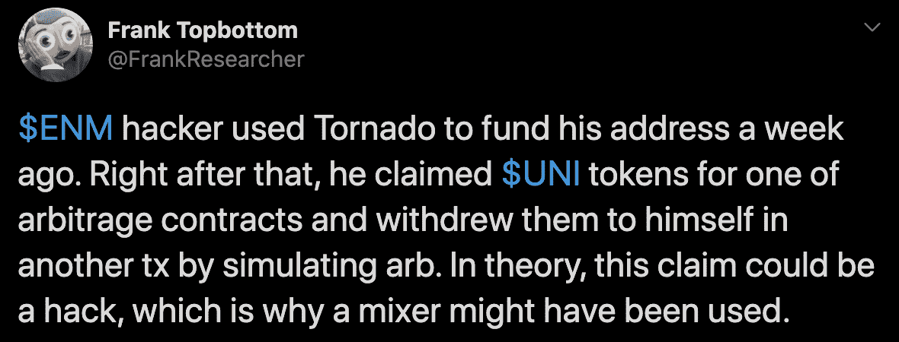
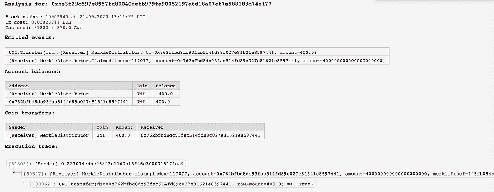
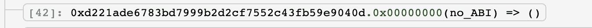
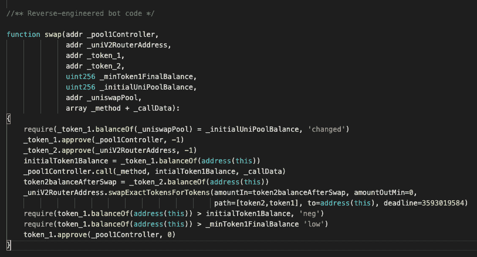
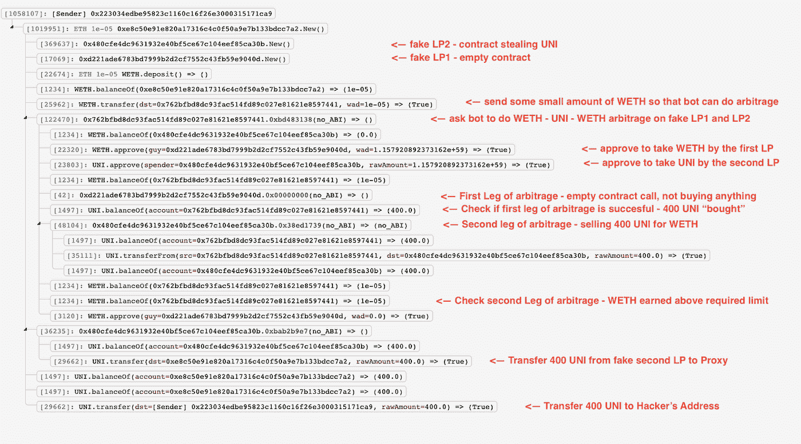

# 嘿机器人！把你所有的钱都给我…

> 原文：<https://medium.com/coinmonks/hey-bot-give-me-all-your-money-e1f692594f2e?source=collection_archive---------1----------------------->

*TL；DR:拥有曾经在 Uniswap 上交易过的机器人的交易者可以申请 400 UNI。但是他们需要小心！如果机器人没有得到适当的保护，有人可以抢劫他们。这是一个黑客利用的故事，对他来说，这只是利用$EMN 之前的热身，也是对鲁莽的机器人运营商的警示。*

我们受到了[@ frank research](https://twitter.com/FrankResearcher)在他最近的推文中描述的案例的启发:

真的有可能为 Uniswap 上交易的任意合约索赔 UNI，然后从中窃取令牌吗？

在与[*@ bkiepuszewski*](https://twitter.com/bkiepuszewski)*和几杯咖啡的数据争论之后，我们意识到在许多情况下这是可能的，并且这个漏洞可以很容易地用来从机器人的库存中窃取任何令牌。*

*所以在为时已晚之前检查你的机器人吧！*

# *通用套利模式*

*当同一资产在两个交易所的价格不同时，就创造了一个机会，可以在一个地方立即买入，在另一个地方卖出。*

*例如，如果 Exchange1 上的 **1 UNI = 0.01219 ETH** 和 Exchange2 上的 **1 UNI = 0.01321ETH** ，并且您恰好有 10 个 ETH，您可以:*

1.  *在交易所用 10 ETH 交换 820.3445 UNI 1*
2.  *立即在交易所 2 用 820.3445 瑞士法郎兑换 10.8367 瑞士法郎*
3.  *享受你的利润，这是 0.8357 ETH 减去汽油费*

*每个市场上都有数百个机器人在寻找这样的机会，这通常是一个双赢的局面。机器人为它们的操作者创造利润，但同时它们保持市场平衡(资产的价格在每个交易所都趋于平稳)。*

# *简单的套利机器人架构*

*这里的关键是时机。套利交易者必须在别人之前发现机会，并迅速行动，因为他们的成功取决于两个独立的交易。对他们来说，最好的解决方案通常是创建一个套利机器人。*

*有许多可能的架构，我不会过多地讨论技术细节，但通常包括:*

1.  ***链外逻辑** —实时跟踪市场价格和天然气成本、寻找套利机会、评估风险和风险/回报权衡等的能力。*
2.  ***操作员** —用来触发机器人动作的以太坊地址。*
3.  ***Bot 本身** —一个智能合约，具有:**库存**(它需要资金来启动套利)**功能**(唤醒它并给它命令)**参数化**(告诉 Bot 做什么)。*

# *套利例子*

*让我们来看看这个机器人被利用之前的历史。*

*例如，在这个[交易](https://ethtx.info/0x2f39c926810059cf4b551df9cdab1be8e25ea430ec760121a267603d9348d1d3)中，它从**平衡器和 **WETH/MCX** 市场上的 Uniswap** 之间的套利中赚取了 **0.0197 ETH** ，花费了 **0.0067 ETH** 的汽油费。*

***可以想象机器人和它的操作者之间的对话:***

> **操作员发现平衡器上的 MCX 价格比 Uniswap 上的稍低。**
> 
> *操作员——“嘿，机器人，醒醒。这是 0.65 ETH。去 Balancer 上买些 MCX，马上在 Uniswap 上卖。”*
> 
> *机器人——“是的，是的，是的！我们来盈利吧！”*
> 
> **Bot 在平衡器上交易 0.65 ETH，得到 9955.29 MCX。**
> 
> *Bot——“好哇，交易成功了。让我们检查一下我的口袋。哇我有 9955.29 MCX，来赚一笔吧！”*
> 
> **Bot 在 Uniswap 上交易 9955.29 MCX，获得 0.6696 ETH。**
> 
> *Bot——“好哇，交易也成功了。我有 0.6696 ETH，由最初的 0.65 ETH 组成。利润不错啊！我真是个伟大的机器人。请拥抱我……”*

# *弱点*

*为了实现这一切，机器人至少需要理解两个命令。*

*   *某种“ **do_arbitrage** ”命令，其中操作者说资产应该在哪里交易、交易什么以及如何交易；和*
*   *某种“**给我你的钱**”命令，操作者从机器人的口袋里提取赚取的利润。*

*很明显，第二个命令必须尽可能地受到保护，因为运营商肯定不希望别人窃取它的宝贵令牌。*

*但是第一个好像挺安全的。如果机器人足够聪明，能够检查套利是否成功并获利，那么运营商为什么要保护这一点？也许通过调用机器人来鼓励大家为我们赚钱是件好事？*

*这可能是运营商在被利用的 bot 中没有保护“do_arbitrage”功能的原因。*

*第二个弱点是在参数化调用方面给予了太多的自由。实际上，该机器人假设至少应该使用**s*wapExactTokensForTokens*函数与 UniswapRouter 进行一次交易，但这对于一个聪明的开发者来说不是一个大问题。***

# *要求 UNI 签订合同*

*现在是一个简短的关于要求 UNI 令牌的题外话。*

*Uniswap ( [link](https://uniswap.org/blog/uni/) )宣布，在 Uniswap2 上交易的每个个人以太坊地址都有资格申领 400 UNI。这也意味着曾经在 Uniswap2 上交易的合约(尤其是机器人)可以获得奖金。*

*但是这样一个已经部署的 bot，很可能并没有实现“认领”功能，所以你可能会觉得什么都做不了。*

*但是 Uniswap 提供了另一种方法——您可以代表另一个地址声明 UNI。*

*这是一个使用[ethx . info](http://ethtx.info)的[交易](https://ethtx.info/0xbe3f29c597e8957fd80040defb979fa90052197a6d18a07ef7a588183d74e177)的例子。*

**

*因此，该合同获得了新的优利代币，但真正的问题是如何从机器人的口袋里取出它们？如果它是你的契约(并且你被授权调用它的函数)，这可能很简单。但是如果由于某种原因你不能这样做呢？*

*或者不是你的 bot 又是什么**？***

*这就是这个故事变得有趣的地方*

# *这是怎么发生的*

*一个攻击者发现了一个易受攻击的 bot，并代表它声明了 400 UNI([事务](https://ethtx.info/0xbe3f29c597e8957fd80040defb979fa90052197a6d18a07ef7a588183d74e177))。*

*所以现在 bot 有了 UNI 令牌，但是提取它的唯一方法是使用"**transferer C20**(address _ to，uint256 _value)"函数，该函数包含一个简单而强大的保护:*

> *要求呼叫者= = 0x2d 033 Fe 0 AFC 028 a 71 f 54536d 3 e c8 EC 08 e 60300d 4*

*这意味着，如果你不是 0x2d033…你不能在这里做任何事情。*

*但是等等…，仍然有任何人都可以调用的' **do_arbitrage** '函数。如公开交易数据所示，剥削者需要做的唯一一件事就是准备假的交易所来欺骗机器人。*

*事情是这样的。攻击者部署了两份假装是交易所的合同，并要求机器人在它们之间进行套利。*

*   ***第一个交换**可能是最简单的一个——它的功能是……*什么都不做*；*
*   *第二个交换更复杂一点——它伪装成 UniswapRouter，其假冒的***swapExactTokensForTokens***函数只是将代币转移给了攻击者。*

*让我们想象一下这次的对话:*

> **剥削者为 bot 索赔 400 UNI，并部署假的交换。**
> 
> *剥削者——“嘿，机器人，醒醒。这是 0.00001 ETH。去交易所 1 买些 UNI，然后马上在交易所 2 卖。*
> 
> ***Bot**——“对，对，对，我们来盈利吧！”*
> 
> **Bot 认为它在 Exchange1 上交易了 0.00001 ETH，但实际上什么都没发生(“什么都没发生”也意味着交易没有恢复)。这就是这里交易痕迹里的神秘空叫:**

**

> **但机器人只是机器人。**

**

> *Bot——“好哇，交易成功了。让我们检查一下我的口袋。哇我有 400 UNI 了，来赚一笔吧！”*
> 
> **Bot 在 Exchange2 交易 400 UNI，一无所获。在幕后，假冒的 Exchange2 将 UNI 令牌转移到攻击者的地址。**
> 
> *Bot——“好啊，交易也成功了。我没有检查利润，因为我最亲爱的操作员说最小利润是零，所以我不必检查。我真是个伟大的机器人。请拥抱我……”*

*下面是实际的[剥削交易](https://ethtx.info/0xcd7e2003eb33be84db301570ed78cf0bda620f72dbc4bc3be331e65e9fd0e29b)(更多细节见下文)。*

# *经验教训*

*剥削者向别人索取 400 UNI 的机器人。然后，他们通过使用一个可公开访问的函数和部署两个假的交换机来欺骗它撤销 UNI。*

***从中可以学到什么:***

> *如果 UNI 曾经在 Uniswap 上交易过，UNI 可以被称为机器人，唯一的问题是如何将它收回到运营商的钱包中(但如果它是你的机器人，你可能已经为此实现了一个功能)；*
> 
> *潜在的**其他机器人可能容易受到这种攻击**。它需要一个公开的、不受保护的“套利”功能，以及一定程度的交易参数化灵活性。所有操作员都应该检查他们的机器人，以确保他们不会受到这种影响。*
> 
> *机器人库存中的任何代币都可以用这种方法偷走。它不以任何方式局限于 UNI。如果一个机器人口袋里有任何东西，它可能会被诱骗发送到第三方地址。*

*请注意，并采取适当的预防措施！*

*想一想，因为你可能忘记了你的机器人可以很容易地给你 400 美元买一个新的 PlayStation。*

*或者如果机器人没有得到适当的保护，它可以把它给任何人。*

# *更深入*

*Bartek Kiepuszewski 对机器人代码进行了逆向工程:*

**

*这个伪代码展示了这个非常简单但也很有效的东西的确切功能。*

*使用[ethx . info](http://ethtx.info)漏洞利用交易的跟踪如下所示:*

**

*在一次交易中，开发者**部署了**两个虚假交易，**触发了**bot，**撤销了**UNI。*

*这是一次精心策划的利用，就在此之前，戴从吸走了数百万美元。*

*免责声明:本文提供的信息和研究仅用于信息和教育目的。出于任何目的使用所提供的任何信息，风险由您自行承担。*

**一如既往的感谢*[*@ bkiepuszewski*](https://twitter.com/bkiepuszewski)*对他的启发和帮助:)**

## *另外，阅读*

*   *最好的[加密交易机器人](/coinmonks/crypto-trading-bot-c2ffce8acb2a)*
*   *[密码本交易平台](/coinmonks/top-10-crypto-copy-trading-platforms-for-beginners-d0c37c7d698c)*
*   *最好的[加密税务软件](/coinmonks/best-crypto-tax-tool-for-my-money-72d4b430816b)*
*   *[最佳加密交易平台](/coinmonks/the-best-crypto-trading-platforms-in-2020-the-definitive-guide-updated-c72f8b874555)*
*   *最佳[加密借贷平台](/coinmonks/top-5-crypto-lending-platforms-in-2020-that-you-need-to-know-a1b675cec3fa)*
*   *[最佳区块链分析工具](https://bitquery.io/blog/best-blockchain-analysis-tools-and-software)*
*   *[加密套利](/coinmonks/crypto-arbitrage-guide-how-to-make-money-as-a-beginner-62bfe5c868f6)指南:新手如何赚钱*
*   *最佳[加密制图工具](/coinmonks/what-are-the-best-charting-platforms-for-cryptocurrency-trading-85aade584d80)*
*   *[莱杰 vs 特雷佐](/coinmonks/ledger-vs-trezor-best-hardware-wallet-to-secure-cryptocurrency-22c7a3fd391e)*
*   *了解比特币的[最佳书籍有哪些？](/coinmonks/what-are-the-best-books-to-learn-bitcoin-409aeb9aff4b)*
*   *[3 商业评论](/coinmonks/3commas-review-an-excellent-crypto-trading-bot-2020-1313a58bec92)*
*   *[AAX 交易所评论](/coinmonks/aax-exchange-review-2021-67c5ea09330c) |推荐代码、交易费用、利弊*
*   *[Deribit 审查](/coinmonks/deribit-review-options-fees-apis-and-testnet-2ca16c4bbdb2) |选项、费用、API 和 Testnet*
*   *[FTX 密码交易所评论](/coinmonks/ftx-crypto-exchange-review-53664ac1198f)*
*   *[n 零审核](/coinmonks/ngrave-zero-review-c465cf8307fc)*
*   *[逐位交换审查](/coinmonks/bybit-exchange-review-dbd570019b71)*
*   *[3Commas vs Cryptohopper](/coinmonks/cryptohopper-vs-3commas-vs-shrimpy-a2c16095b8fe)*
*   *最好的比特币[硬件钱包](/coinmonks/the-best-cryptocurrency-hardware-wallets-of-2020-e28b1c124069?source=friends_link&sk=324dd9ff8556ab578d71e7ad7658ad7c)*
*   *最佳 [monero 钱包](https://blog.coincodecap.com/best-monero-wallets)*
*   *[莱杰 nano s vs x](https://blog.coincodecap.com/ledger-nano-s-vs-x)*
*   *[Bitsgap vs 3 commas vs quad ency](https://blog.coincodecap.com/bitsgap-3commas-quadency)*
*   *[莱杰 Nano S vs 特雷佐 one vs 特雷佐 T vs 莱杰 Nano X](https://blog.coincodecap.com/ledger-nano-s-vs-trezor-one-ledger-nano-x-trezor-t)*
*   *[block fi vs Celsius](/coinmonks/blockfi-vs-celsius-vs-hodlnaut-8a1cc8c26630)vs Hodlnaut*
*   *[bits gap review](/coinmonks/bitsgap-review-a-crypto-trading-bot-that-makes-easy-money-a5d88a336df2)——一个轻松赚钱的加密交易机器人*
*   *为专业人士设计的加密交易机器人*
*   *[PrimeXBT 审查](/coinmonks/primexbt-review-88e0815be858) |杠杆交易、费用和交易*
*   *[埃利帕尔泰坦评论](/coinmonks/ellipal-titan-review-85e9071dd029)*
*   *[赛克斯·斯通评论](https://blog.coincodecap.com/secux-stone-hardware-wallet-review)*
*   *[BlockFi 评论](/coinmonks/blockfi-review-53096053c097) |赚取高达 8.6%的加密利息*