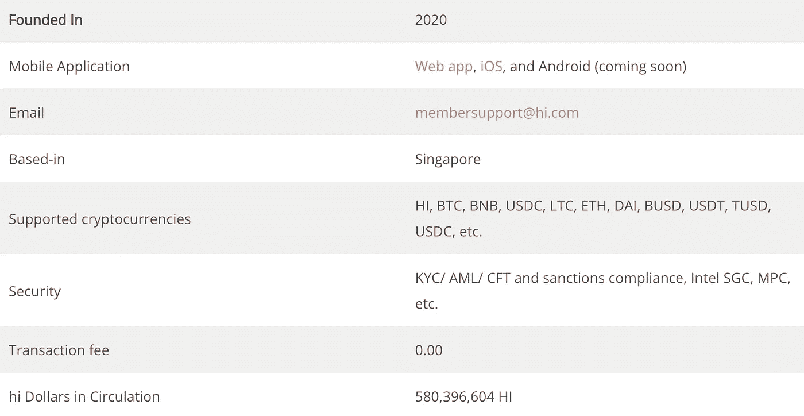
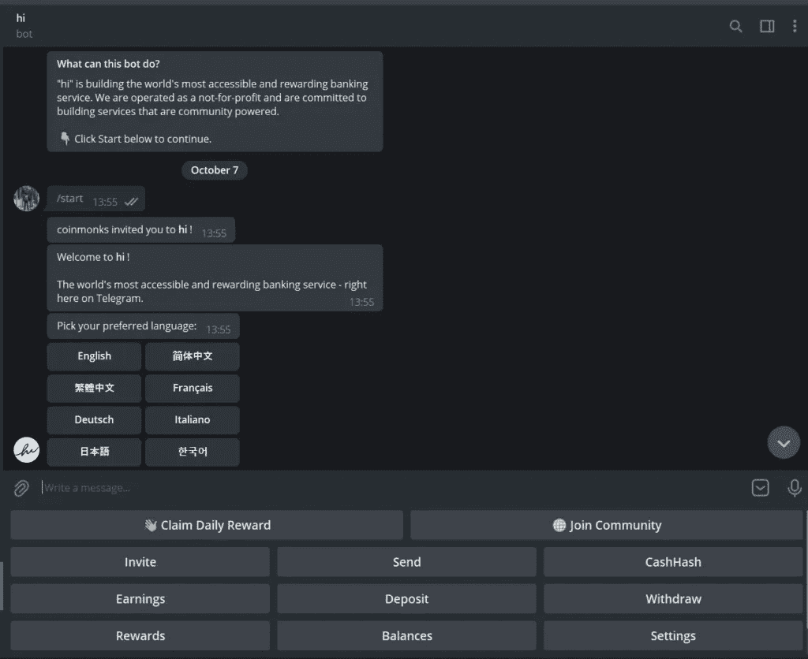
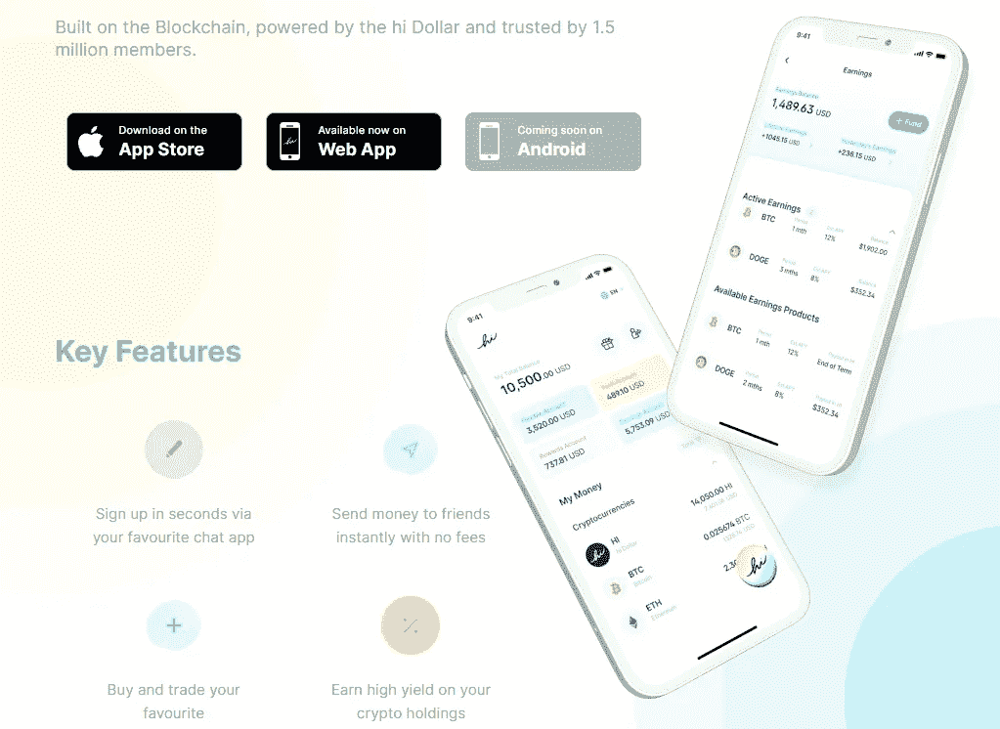
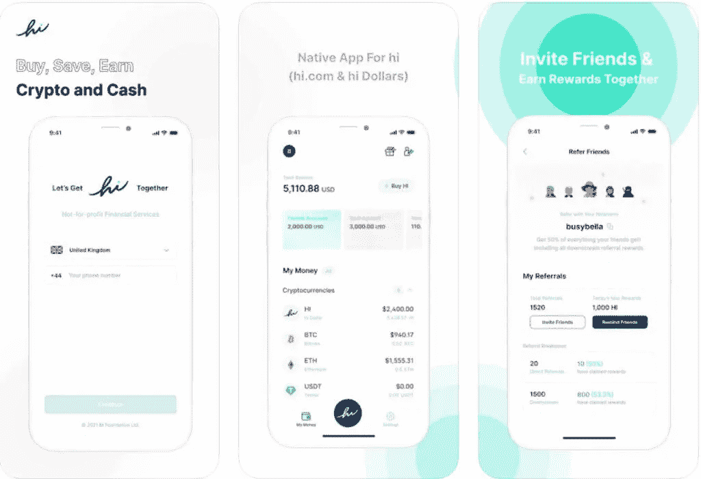
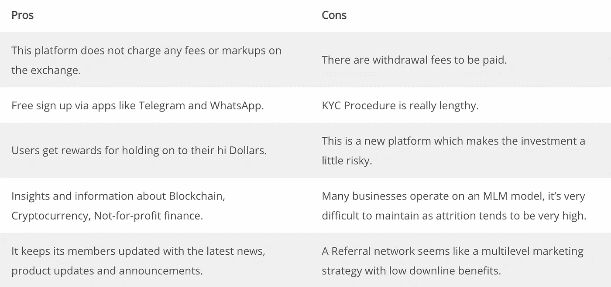
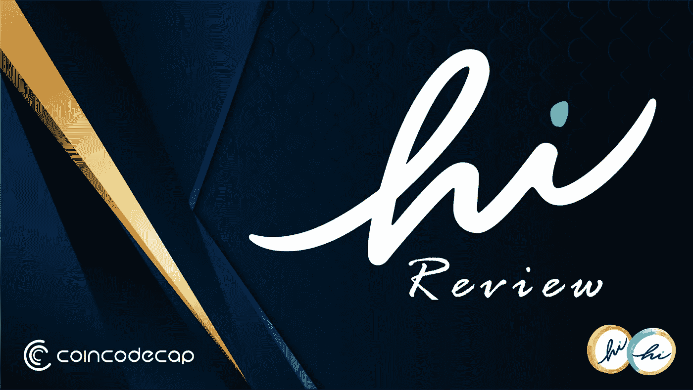

# 嗨，美元评论:每天在 Telegram 或 Whatsapp 上免费赚 1 美元

> 原文：<https://medium.com/coinmonks/hi-dollar-review-df891e727ab1?source=collection_archive---------5----------------------->

如果我们看看今天的场景，加密货币行业正在快速增长，交易员和投资者正在寻找一个一体化的平台来交易和赚更多的钱。Hi.Com 的目标是为其用户提供全球首个通用的跨生态系统支付和金融服务平台。此外， [**开始通过你的社交媒体应用程序每天赚取免费的 Hi 美元**](https://hi.com/coinmonks) 。继续阅读这篇(Hi.com)Hi Dollar 评论，了解更多。

> [***点击这里***](https://hi.com/coinmonks) ***开始每天在 Telegram 或 Whatsapp 上赚 1 美元。***

# 详细摘要

*   Hi 为其成员提供了一个具有数字银行系统的平台，可以在几秒钟内购买、赚取和发送加密货币和现金，并且不收取任何交易费用。
*   该平台允许用户通过推荐程序通过他们最喜欢的聊天应用程序注册后，获得 Hi 美元作为奖励，赢得每日奖励，并将他们的加密货币保留在他们的账户中。
*   此外，他们为会员提供最新的新产品更新和公告，以及关于[区块链](https://coincodecap.com/what-is-blockchain-a-simple-guide-for-dummies)、加密货币和非营利金融的见解。
*   凭借其高级会员资格，您可以获得其他好处，如他们让其成员有机会通过由获奖厨师、作家和表演者讲授的在线课程来追随他们的热情。
*   他们推出了一种虚拟借记卡，可以在线支付账单，购买商品和服务。
*   用户可以在一个账户中建立一个包含 100 多种货币(包括传统货币和加密货币)的多元化投资组合，并获得高达 20%的年利率

# 什么是嗨。Com？

Hi.first Com 的目标是创建世界上第一个非营利和社区支持的通用跨生态系统移动支付和金融服务平台。他们的成员是 hi 生态系统中最重要的利益相关者，他们致力于帮助他们从成员中获得最大收益。此外，该平台每天赠送 1 hi 美元，用于通过 Telegram 或 WhatsApp 回答简单问题。

> [***点击这里***](https://hi.com/coinmonks) ***开始每天在 Telegram 或 Whatsapp 上赚 1 美元。***

# 嗨，美元评论:Hi.Com 产品

*   该平台提供数字银行服务，购买、[赚取](https://coincodecap.com/passive-income-crypto-lending)并立即发送加密货币和现金，费用为零。
*   这个平台为会员提供了一个免费的注册过程，通过你最喜欢的应用程序，作为奖励 hi 美元。
*   Hi dollar 是其会员令牌，也是一种加密货币，可以让用户获得更多优惠。用户有两种选择，要么购买或赚取与经济中使用的货币相似的美元。用户可以赚取或购买会员令牌-嗨美元。
*   此外，用户可以从其账户中持有的加密货币获得高回报，包括高达 40%的 Hi 美元。用户可以转售这些资产，并获得有竞争力的价格。
*   此外，您还可以享受高级会员福利。Hi Benefits 奖励持有 Hi 美元的用户。
*   它向其成员提供直接来自 hi 团队的最新新闻、产品更新和公告。
*   此外，它还有一个专门的社区，用户可以在这里参与讨论、提问、寻找答案并与来自世界各地的 hi 成员联系。
*   用户也可以在他的帐户创建后，通过玩基于每小时比赛的游戏来赚取 hi 美元，hi Flyers。

# 你怎么能靠他赚钱。Com？

1.  第一步是打开 Hi.com[的网站。在页面的右侧，你会找到你最喜欢的聊天应用(Telegram 和 Whatsapp)的图标，你可以通过它免费注册。](https://hi.com/coinmonks)
2.  假设你是通过 telegram 的 app 注册的。当您点击电报图标时，用户将被重定向到电报应用程序中的 hi bot。
3.  选择首选语言，然后发送所有详细信息以成功设置您的帐户。
4.  它建议您通过为 messenger 应用程序打开生物识别或密码来提高安全性。一旦你完成了上面提到的所有步骤，它会要求用户要求他们的奖励。
5.  Hi.com 通过回答用户的日常问题，每天奖励用户 Hi 美元。一旦你回答了，你的账户将会被存入一美元。此外，用户可以通过其独特的注册链接邀请每个朋友，每天额外赚取 0.5 Hidollar。
6.  然后，用户可以下载 [iOS 应用](https://apps.apple.com/us/app/hi-buy-earn-send-crypto/id1583215766)并进行进一步的交易活动，如购买 Hidollars，将他们的加密货币存储在他们的冷钱包中等。

# 喜美元审查:额外的好处

你好。Com 为客户提供了一系列方法，根据他们的喜好来赚取利润。

1.  第一步是通过你最喜欢的聊天应用程序注册，包括 WhatsApp 和 telegram，它们为你提供奖励。一旦用户给出了所有的细节和问题的答案，他/她就有资格获得 1 Hi 美元。
2.  推荐计划包括每天为每一个用你独特的注册链接邀请的朋友赚取 0.5 hi 美元的额外收益。
3.  用户可以自由地进行交易，转换法定货币和法定货币，加密货币和加密货币，以及法定货币和加密货币。所有这些都是中等市场汇率，没有额外的好处。
4.  用户可以通过虚拟借记卡使用他们 hi 账户中的钱在线支付账单。
5.  用户可以在一个账户中持有超过 100 种货币(包括传统货币和加密货币)的多元化投资组合，并获得高达 20%的年息

# 嗨，美元评论:费用

*   Hi platform 不会向用户收取任何交易费用，也没有要求用户遵守的最低余额政策。
*   虽然没有存款费用，但取款费用是 30 美元，包括网络费用，这在连锁网络上是不确定的。

> [***点击这里***](https://hi.com/coinmonks) ***开始每天在 Telegram 或 Whatsapp 上赚 1 美元。***

# 你好。Com 评论:移动应用

hi 的移动应用程序可用于 Android 和 iOS 操作系统。这个平台有一个非常互动的界面平台。此外，用户可以通过世界上最受欢迎的社交媒体和通信平台登录，如 Telegram 和 WhatsApp 等。还可以通过 WebApp 访问 Hi.com，只需简单的登录过程。一旦你安装了应用程序，你会发现他的金融服务，游戏和会员福利。

# 你好。Com 评论:客户支持

你好。Com 拥有非常活跃的客户服务支持服务。你可以在 membersupport@hi.com 给他们发电子邮件，或者通过推特、脸书和电报。他们在 FAQ 中开辟了一个部分，回答用户需要解决的所有问题。此外，该平台的移动应用程序提供全天候实时客户支持。

> [***点击这里***](https://hi.com/coinmonks) ***开始在 Telegram 或 Whatsapp 上每天赚 1 美元。***

# 你的美元安全吗？

是的，Hi.Com 是安全和合法的使用。此外，该网站声称他们对网络安全采取全面的方法，并不断管理和降低风险。他们的安全措施包括:

*   针对 KYC/反洗钱/ CFT 和制裁合规性，筛选所有流入资产和所有融资交易。
*   超过阈值的交易需要其运营团队的人工批准。此外，他们利用行业领先的人工智能和分析工具以及第三方服务提供商筛选所有的法定和加密交易。
*   通过 MPC(多方计算),多方可以各自持有秘密信息，并通过降低平台的权威来解决问题，而无需共享信息。
*   为了保证加密材料和算法的安全，选定的代码和数据被隔离在系统内，被称为 SGX 的硬件级飞地。
*   签名策略引擎定义了如何处理和批准交易。引擎集成在 SGX 飞地内部，代码不能修改。
*   为了进一步消除风险的可能性，该平台使用资金地址认证网络，该网络通过自我调节的资金地址认证和轮换来转移网络。

# 嗨评论:赞成和反对

# 嗨，美元评论:结论

Hi 有一个吸引很多用户的交互界面。随着时代的进步，从传统货币系统到加密货币和区块链技术有了巨大的转变。因此，人们正在寻找更多像 hi 这样的平台，它提供了像数字银行平台和支持最受欢迎的加密货币的钱包这样的设施。

# 常见问题

## 什么是嗨。Com？

Hi 是一个数字银行平台，在这里您可以立即购买、发送和赚取加密货币，交易费用为零。正如 Hi 网站宣称的那样，它旨在为其用户提供全球首个通用跨生态系统支付和金融服务平台的首个服务。

## hi 平台的安全性如何？

Hi 采取了各种方法来确保其平台的安全，如 KYC/反洗钱/ CFT 和制裁合规、英特尔 SGC、MPC、资金地址认证和轮换等。

## 你怎样才能挣到更多的钱？

有各种各样的方法可以让你赚到更多的钱。最简单的方法是注册，把这个平台推荐给朋友，玩 hi Flyers 游戏等等。

## 这个平台有什么移动应用吗？

hi.com 的移动应用程序在 Android 和 iOS 上都可用。它最近于 2021 年 9 月推出。

## 用户如何联系这个平台？

用户可以通过在[membersupport@hi.com](mailto:membersupport@hi.com)写电子邮件联系 hi.com 的客户服务团队。

