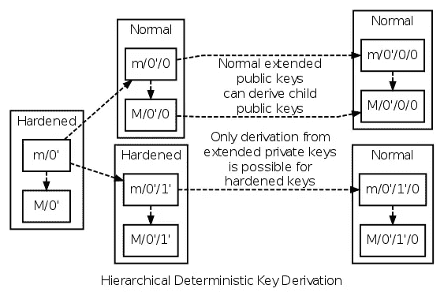

# 分层确定性钱包:以太坊

> 原文：<https://medium.com/coinmonks/hierarchical-deterministic-wallets-ethereum-589f8a359b81?source=collection_archive---------4----------------------->


[image source](https://www.google.co.in/url?sa=i&source=images&cd=&cad=rja&uact=8&ved=2ahUKEwj88IailczcAhVLuo8KHYIpAEoQjxx6BAgBEAI&url=http%3A%2F%2Fwww.sv-veert.de%2Faddress-iphone%2Fdo-i-need-a-cryptocurrency-wallet-buy-icn-crypto-currency%2F&psig=AOvVaw2_e6sptIZm1OAnwiYRtW__&ust=1533223593280178)

本文将带您了解如何创建兼容以太坊的层次确定性钱包。这将使您能够为事务生成自己的公私密钥、校验和以及地址。

我们将使用 bip39、ethereumjs-tx、ethereumjs-util、hdkey 和 web3.js。

*   [BIP39](https://github.com/iancoleman/bip39) :生成助记符
*   [Ethereumjs-tx](https://github.com/ethereumjs/ethereumjs-tx) :创建事务(设置参数并序列化)
*   [以太坊-util](https://github.com/ethereumjs/ethereumjs-util) :利用校验和、私有-公共密钥创建，并将公共密钥转换为地址
*   [HDkey](https://github.com/cryptocoinjs/hdkey) :构建分层确定性密钥树

> 还读:[最佳比特币硬件钱包](/coinmonks/the-best-cryptocurrency-hardware-wallets-of-2020-e28b1c124069)

## 事实上的规则:

*   私钥证明你对以太的所有权。
*   丢失您的私人钥匙意味着您不再有访问权，并且不能花费被锁住的以太。就当它烧焦了。
*   地址用于进行和接收交易，而不是公钥。
*   公钥和地址不是同义词。
*   知道了您的公钥或私钥，您就可以重新创建您的地址。
*   公钥和私钥用于建立数字签名。

*   生成 BIP 39 兼容助记符:

```
const mnemonic = bip39.generateMnemonic();
```

助记符是一组单词，当按照准确的顺序再现时，它们将重新创建您的私钥。记忆术的发展是为了帮助加密货币持有者记住或者更确切地说是找到一种在人类记忆中保留特定信息集的方法，这将使他们能够重新创建他们的私钥。

记住单词的顺序要容易得多，比如“*cherry you receive shuffle ski wise your roof shield private shaft shield*”而不是“*331 D1 e 7724 a 2784 fa 4d 75 c 96 da 9d 68 f 23321 e 1c d0b 55 a4 d 2377192 bdae 2 f 10 fc*”

*   生成主公钥和私钥:

```
const root = hdkey.fromMasterSeed(seed)const masterPrivateKey = root.privateKey.toString('hex');
const masterPubKey = root.publicKey.toString('hex');
```

可以从一个主公钥对中生成公钥和私钥的复杂树形结构。
在大多数密码学中，运算都是在字节级进行的。它在这里被转换为十六进制，以便以人类可读的格式轻松验证预期的行为。

主公钥对是 HD 树的一个密钥(双关语)部分。

主密钥对的知识将允许该人重建整个密钥树。将主密钥对和主密钥助记符视为主要目标，并以最高优先级保护。

*   从 HD 树生成密钥对

```
var path = "m/44'/60'/0'/0/0";const addrNode = root.derive(path)
const pubKey = ethUtil.privateToPublic(addrNode._privateKey)
```

树本身可以由任意*数量的叶子和节点生成。最终，为了获得一个特定的密钥对，我们需要指定路径来获得它对应的密钥对。

指定路径后，我们从相应的根中导出一个密钥对。这个过程是确定的。

存在形成分层确定性树结构的一部分的硬化键和扩展键。当需要生成子树时，在端点级别固有地使用强化键和扩展键。



你可以在这里了解更多信息

*   生成校验和和地址

```
const addr = ethUtil.publicToAddress(pubKey).toString('hex');
const address = ethUtil.toChecksumAddress(addr)
```

根据导出的公钥，我们计算校验和，以验证它确实是一个以太坊地址。我相信这是由于 [EIP 55](https://github.com/ethereum/EIPs/blob/master/EIPS/eip-55.md) 而增加的。

*   构建交易:

```
const params = {
  nonce:0x6,
  to: '0x4584159875418ef77D1142bEec0b6648BD8eDb2f',
  value: '0x30000',
  gasPrice: 0x09184e72a000,
  gasLimit: 0x30000,
}
```

事务由说明事务性质的参数组成。

Nonce 定义了处理来自该地址的事务的顺序。具有相同 nonce 的两个事务意味着其中一个被拒绝。
至:接收方地址
值:正在交易的乙醚
气价和气限定义了本次交易可以消耗的气

*   签署一项交易

```
const tx = new ethTx(params);
tx.sign(addrNode._privateKey); // Signing the transaction
const serializedTx = tx.serialize()
```

从指定的参数生成事务的新构造函数实例。因此，用来自 HD 树中先前生成的叶节点的地址的私钥对事务进行签名。

然后，签名的事务在广播到节点之前被串行化。

这个项目的源代码可以从[这里](https://github.com/prahaladbelavadi/HD-wallets-ethereum/releases)下载。
这绝不是生产就绪。这仅仅是一个学习阶段。

演职员表:[普拉蒂克·雷迪](https://medium.com/u/eb493dfa7df5?source=post_page-----589f8a359b81--------------------------------)和[比特大陆有限责任公司](https://medium.com/u/a214bb5814a1?source=post_page-----589f8a359b81--------------------------------)

这篇文章是试图理解以太坊交易过程的结果。欢迎提出编辑、建议、更正和反驳。

干杯！