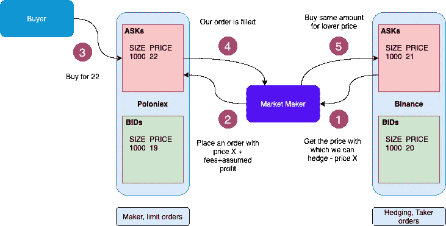
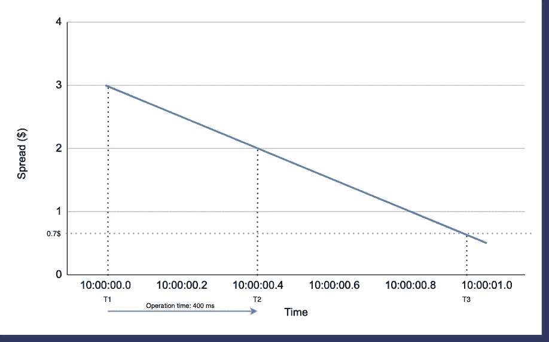
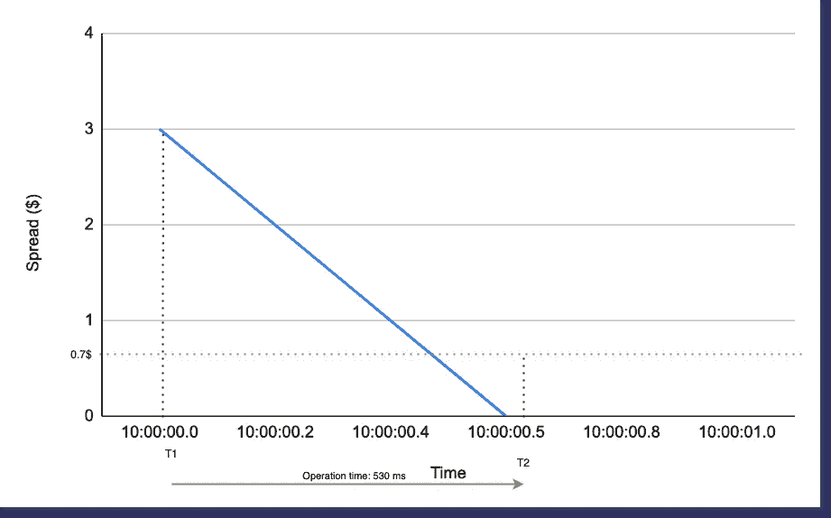
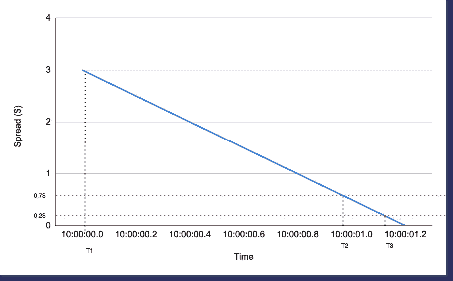

# 高频高速套利与做市

> 原文：<https://medium.com/coinmonks/high-frequency-and-high-speed-arbitrage-and-market-making-e721cec542d5?source=collection_archive---------5----------------------->

# …为什么速度和低费用如此重要

由于每个交易所都有自己的订单簿，并且交易所是独立的、地理上分布的实体，因此每个交易所之间的订单簿是不同的。差异可能很小，也可能很大，它们会随时间变化，套利者和做市商会确保它们不会存在太久。

## **套利**

交易所之间的价格差异导致这样的情况:在一个交易所购买一项资产，然后在另一个交易所以更高的价格出售，价格包括订单费用和一些假设的利润，这就是我们所说的套利。套利是一种相对简单的操作，在这种操作中，我们是市场订单或限价订单的双方接受者，这些订单具有“立即或取消”的生效时间。你可以在我的旧文章系列[加密货币套利策略](/coinmonks/cryptocurrency-arbitrage-strategies-part-i-20e9dd327919)中找到关于这个策略的更多细节。

## **交叉外汇对冲做市**

当我们看到交易所 A 提供一项资产时——假设价格 X 比交易所 B 的价格 Y 低 0.01 BTC——我们开始在交易所 B 为价格 X +费用+假设利润提供 0.01 BTC。这意味着我们将限价单放入交易所 B 的账簿中，当交易所 A 的价格发生变化时，我们会积极地调整这个订单。当我们的订单在交易所 B 完成时，这意味着我们以 X +费用+假定利润的价格卖出了我们的 BTC，我们在交易所 A 执行市价订单，为 X 购买 0.01 BTC。在此操作之后，我们在 BTC 的总余额没有变化，我们在两个交易所都支付了费用，我们的口袋里有了一些额外的钱，这就是假定利润。

Figure 1: Market making with cross-exchange hedging

在这种情况下，我们一方使用限价单，总费用低于我们在套利中使用市价单的情况，一方的限价单保证了交易所匹配引擎将尽快满足我们的订单。这个因素使这种方法比两边都有两个接受订单更有弹性，因为接受订单我们有更高的滑点机会。

## **价差的争夺**

在这两种情况下，一切都是从交易所的差价开始的。为了使这个例子更简单，我们假设价差是订单簿顶层条目的价格之间的差异(实际上，我们应该更深入地研究两个方向，我们的价差将由曲线而不是单个值来表示，您可以在[我的关于交叉交换订单簿匹配](https://www.multitrader.io/cross-exchange-order-book-matching/)的文章中了解它)。如果我们在寻找[加密套利](https://blog.coincodecap.com/crypto-arbitrage-guide-how-to-make-money-as-a-beginner)，我们将测量我们的价差，作为交易所 A 的买价和交易所 B 的买价或交易所 A 的买价和交易所 A 的买价之间的差额。如果是交叉交易所对冲的做市，价差是交易所 A 的买价和交易所 B 的买价或交易所 A 的买价和交易所 B 的买价之间的差额。

假设在 T1 时刻，我们开始看到交易所之间的价差。这是比赛开始的时刻。谁先缩小差距，谁就能从差价中获利。

Figure 2: Spread in time

为简单起见，我假设价差以线性方式清算。事实上，价差将在一个或多个不连续的步骤中清算，因此该图表应该看起来像楼梯。

所以当我们开始看到价差时，是 3 美元。两个交易所的总费用是 70 美分——在这张图上用红色虚线表示。从理论上讲，如果我们能够立即结束运营，我们将获得 2，3 美元的利润。如果我们未能在价差降至 70 美分以下之前平仓，这意味着我们在此次操作中亏损，或者如果我们在对冲时使用了立即生效或取消生效的限价单，这意味着我们的订单被取消而没有任何填充，我们根本没有设法对冲，现在我们暴露了。从图 1 可知，从第 1 点到第 5 点，我们操作的总周转时间是 400 ms，我们可以看到，在 T2，当我们结束操作时，价差是 2 美元。减去费用后，它是 1.3 美元，比我们立即关闭的情况少 76%，比我们的操作时间缩短两倍的情况少 38%，如果它需要 200 毫秒。

现在，让我们来看看当我们在图 3 中的交易所处于高波动期时，价差会发生什么。

Figure 3: high volatility situation

与平静期相比，交易总数和交易量可能上升数百倍。这可能会导致交易所之间的价差变大，运营条件也更具挑战性。为了便于举例，让我们假设两个交易所之间的价差在 500ms 内以比正常情况下快两倍的速度关闭。可以预期，exchange 在发送订单时可能会略有延迟—更多的价格点、更多的客户、更多的负载通常意味着性能下降。第二件事是来自交易所的业务将影响交易所互联网连接的整体吞吐量。第三是 exchange APIs 接受您的订单，在繁重的负载下将需要更多的时间来处理您的订单请求。考虑到这三个因素，让我们假设正常周转时间从 400 毫秒增加 30%到 530 毫秒。瞧，我们在水下。经过 5.3 亿个小时的运作，我们要么亏损了(相当多)，要么没有进行对冲。现在，我们正在研究这笔投资到底会带来什么。这些数字有些理论性，但重点在于:速度很重要！

## **有点靠手续费**

让我们回到市场平静时的情形(图 2)，让我们假设我们有低得多的费用——由于我们有大量的交易，我们的费用大大降低，而不是必须支付 70 美分，我们只需要支付 20 美分

Figure 4: lower fees

如果我们在正常的预期时间内成功完成业务，不仅我们会赚得更多，而且我们完成整个业务的时间也会增加约 20%，而不会有暴露的风险。

当然，本文给出的例子只是试图形象化地描述一个复杂得多的现象，但希望它能阐明**为什么速度和低费用很重要**！