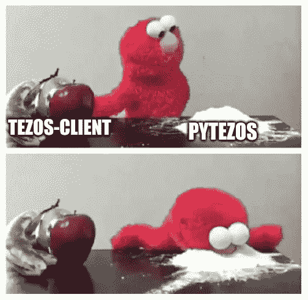

# 迈克尔逊合同的高级界面

> 原文：<https://medium.com/coinmonks/high-level-interface-for-michelson-contracts-and-not-only-7264db76d7ae?source=collection_archive---------0----------------------->

## 通过烘焙 Bad 对 PyTezos 库进行重大更新

我们已经为这个版本准备了很长时间，并设法添加了几乎所有开发 Tezos 应用程序所必需的东西。我们希望我们的库对参加 [IDEO 黑客马拉松](http://ideo.tqtezos.com/)的人以及所有对 Tezos 和 Python 感兴趣的人有用。我们要感谢 Tezos 基金会对这个项目的支持，以及所有 PyTezos 早期用户的反馈。



PyTezos 建立在三个基本原则之上，这三个原则是我们在任何软件开发中努力遵循的:

1.  *一切都应该开箱即用*
    在 PyTezos 中，我们已经预定义了 RPC 端点，甚至演示键(请不要滥用)，以便您可以轻松开始游戏。
2.  *编程界面应该是直观和自描述的*
    除了文档字符串和自动完成，PyTezos 还在交互模式(Python 控制台或 Jupyter 笔记本)中提供内联文档。
3.  *简单而不牺牲灵活性* 使用 PyTezos，您可以在任何抽象层次上工作，并在它们之间无缝切换。

在本文中，我们将介绍主要特性，或者，您可以阅读[快速入门指南](https://baking-bad.github.io/pytezos/)，或者通过交互式控制台或 Jupyter 浏览 API:

```
*>>> !pip install pytezos*
*>>>* **from** pytezos **import** pytezos
*>>>* pytezos
```

# PyTezos 客户端

高层互动通过 PyTezos 客户端进行。您可能希望的第一件事是配置 RPC 节点连接和用于签名操作的私钥。

*   使用`.using()`方法改变当前外壳和/或密钥；
*   通过`.shell`和`.key`属性可以访问实际对象；
*   账户余额可以通过`.account()`方式找回。


Initializing key from faucet file and setting default alphanet provider

## 发送操作

使用 PyTezos 客户端，你可以用最少的信息初始化操作内容，然后`.autofill()`缺口。操作也可以被链接、运行、预应用，当然还有注入。PyTezos 现在支持:

*   激活帐户
*   揭示
*   交易
*   起源
*   委托


Sending a parameterless transaction to an implicit account

## 与合同互动

更新中引入的最令人兴奋的功能是用于与智能合约交互的高级界面。它基于类似于 better-call.dev 使用的转换算法(我们将很快同步)。实际上，在传递事务参数或读/写存储时，您可以使用 JSON 结构而不是 Michelson/Micheline 表达式。

*   使用`.contract()`方法通过地址获取合同接口；
*   分别用`.storage()`和`.big_map_get()`方法访问存储和大地图；
*   按名称调用 entrypoints，并根据 docstring 传递 args/kwargs。

下面是演示契约的参数方案:

```
$parameter:
 { "transfer": [ $address , $nat ] } || 
 { "approve": [ $address , $nat ] } || 
 { "transfer_from": [ $address , $address , $nat ] } || 
 { "balance_of": $balance_of } || 
 { "allowance": [ $address , $address , $contract (pair nat nat) ] } || 
 { "create_account": [ $address , $nat ] } || 
 { "create_accounts": [ [ $address , $nat ] , ... ] }$balance_of:
 {
   "address": $address,
   "nat_contract": $contract (nat)
 }$address:
 string  /* Base58 encoded `tz` or `KT` address */$contract:
 string  /* Base58 encoded `KT` address */$nat:
 int  /* Natural number */
```

它是自动生成的，并试图模仿 Tezos RPC 文档的风格。


Accessing contract storage/big_map and calling an entrypoint

# 下一步是什么

我们的下一步是构建一个单元测试框架，在这个框架中，您将能够用 Python 编写测试，并使用 Python 对象作为契约调用和存储初始化的有效负载。我们还将在未来几周内发布巴比伦协议的更新，以及对不可避免的错误的修复。

我们将在即将到来的柏林 TQuorum 大会上举办一场[研讨会](https://twitter.com/TQTezos/status/1162000245129129985)，在那里人们可以学习如何使用 [PyTezos](https://github.com/baking-bad/pytezos) 和 [ConseilPy](https://github.com/baking-bad/conseilpy) 构建应用。我们在等大家，会有奖品，当然还有品牌贴纸。带上笔记本电脑和好心情:)

在推特上关注我们，加入我们舒适的电报聊天。

干杯！

*最初发表于 2019 年 8 月 19 日*[*https://baking-bad.org*](https://baking-bad.org/blog/2019/08/19/high-level-interface-for-michelson-tezos-smart-contracts-and-not-only/)*，在那里你可以找到文章的完整版本。*

> [在您的收件箱中直接获得最佳软件交易](https://coincodecap.com/?utm_source=coinmonks)

[](https://coincodecap.com/?utm_source=coinmonks)