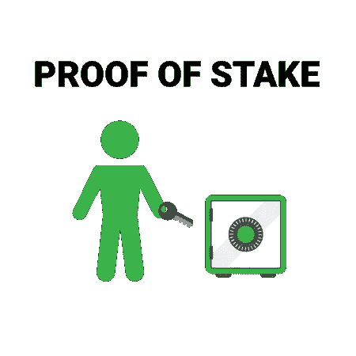

# 高风险加密#1

> 原文：<https://medium.com/coinmonks/high-stakes-crypto-4b4251350e82?source=collection_archive---------7----------------------->

## 看一看利害关系证明中的利害关系



[Image source](https://www.google.co.in/url?sa=i&source=images&cd=&cad=rja&uact=8&ved=2ahUKEwikz-vR6vvcAhVKWysKHTufA7IQjxx6BAgBEAI&url=https%3A%2F%2Fcrypviz.io%2Fknowledge-database%2Fproof-of-stake%2F&psig=AOvVaw0gEFNDCtraH5-aJ8t2ryV7&ust=1534861428853100)

在截至 2018 年 8 月 19 日的两周内，igh Stakes Crypto 包括 Vitalik Buterin 的以太坊 PoS 研究历史，ThunderCore testnet 的发布，NuCypher 的赌注经济学的发布以及 OmiseGo eWallet 软件的 v1.0 发布。

# 以太坊 PoS 研究历史:2018 年 8 月 15 日

📖[推特风暴](https://twitter.com/VitalikButerin/status/1029900695925706753)

维塔利克·布特林发表了一篇史诗般的推特风暴(75 条推特！)涵盖“以太坊的 Casper 研究的历史和状态，包括 FFG vs CBC 战争、混合= >全开关、随机性的作用、机制设计问题等等。”

## ⚡️Cliffs 笔记

换句话说，我们已经减少了大约 75%的 tweetstorm 字符数，如下所示:

Vitalik Buterin 在 2014 年初开始 PoS 研究，用惩罚(砍)的概念来解决无利害关系问题。2014 年年中，Vlad Zamfir 引入了验证器“存款”，以增加对恶意行为的惩罚。2014 年末，我们花在了“远程攻击”防御上，这是一种动态，验证者从存款中提取股份，以避免大幅罚款，并重建一个比主链签名更多的备用链。所提出的将验证器存放锁定四个月的解决方案要求节点在初始同步时从可信来源获得区块链，这引入了“弱主观性”。

## 到 2015 年，Casper 已被定义为基于保证金的经济共识协议。

> 节点，或“绑定验证器”，将被要求放置安全押金(称为“绑定”)，以便产生或验证块。协议对这些保证金的直接控制是 Casper 影响验证者动机的主要方式。具体来说，如果一个验证者产生了任何 Casper 认为“无效”的东西，他们的押金和参与共识过程的特权都会被没收。保证金的使用通过对可客观证实的恶意行为施加惩罚性损害赔偿来解决“无利害关系”问题。

接下来是寻找“经济终结”，它可以半正式地定义如下:“如果客户有证据表明(i) B1 将永远成为规范链的一部分，或者(ii)导致 B1 被恢复的行为者保证受到至少等于$X 的金额的经济处罚，则块 B1 以安全余量$X 被经济终结。”

虽然 Vitalik 未能成功追求“通过打赌达成共识”，即验证器对块终结性进行打赌以确定共识的构造，但 Vlad 研究了受传统拜占庭容错(BFT)理论(如 Tendermint)启发的共识算法，目标是使 Casper 对寡头垄断更具弹性。由于他对硬阈值的厌恶(例如⅔在实用 BFT 和 Tendermint)，弗拉德提出了一个 BFT 的替代设计，称为“通过构造纠正”(CBC)，其中的最终性完全是主观的。在 CBC 中，验证器对消息进行签名，而冲突消息需要“证明”。为了检测终结性，客户端寻找消息模式，证明大多数验证器可靠地投票给一个块，并且如果没有大部分验证器也“非法”切换他们的投票，就不能切换块。

在研究了实用的 BFT 算法后，Vitalik 开发了一个简化的框架，具有两个最小的“斜杠条件”,称为 Casper 友好的终结性小工具(FFG ),旨在用作任何 PoW 或 PoS 区块链之上的覆盖层，以添加终结性保证。

## 终结是一个深刻的进步:

> 一旦一个块被最终确定，不管网络延迟如何，它都是安全的(不同于 PoW 中的确认)，恢复块需要> = 1/3 的验证者以可检测的方式作弊，并可用于削减或破坏他们的存款。

卡斯珀 CBC 和卡斯珀 FFG 都是**覆盖，需要应用到现有的分支选择规则，尽管抽象的工作方式不同。在卡斯珀 CBC 中，终结性覆盖适应分叉选择规则，而在卡斯珀 FFG 中，分叉选择规则适应终结性覆盖。弗拉德最初对分叉选择规则的偏好是“最新消息驱动的幽灵”，这是对[幽灵](https://eprint.iacr.org/2013/881.pdf)的改编，以证明利害关系，而维塔利克的偏好是从混合 PoS / PoW 系统开始，使用工作证明作为基本分叉选择规则。**

Vlad 和 Vitalik 都花时间研究了共识激励理论，特别是唯一可归因错误和非唯一可归因错误之间的区别，前者可以识别并惩罚违规方，后者可能是多方之一造成的错误。非唯一可归因错误的经典案例是离线与审查，也称为“说话者-听者错误对等”。虽然惩罚唯一可归因的错误(例如，卡斯珀·FFG 砍杀条件)很容易，但惩罚非唯一可归因的错误却很难。

2017 年 11 月，Vitalik [发表了](https://arxiv.org/abs/1710.09437)卡斯帕·FFG 砍杀条件和使用“二次泄漏”机制解决“1/3 离线”问题的建议方案。然后重点转向“阻止攻击”模型和方法，以阻止、减轻和恢复 51%的攻击。

到 2018 年初，Vlad 已经在 Casper CBC 的安全证明方面取得了实质性进展。**在宣布计划将卡斯珀 FFG 作为智能合同发布到区块链以太坊并发布基于 Python 的测试网后，2018 年 6 月做出了艰难的决定，放弃“混合卡斯珀 FFG 作为合同”模型，转而将卡斯珀作为独立的链，因为最终从 EVM 电子邮件系统和分片的实施进行转换会出现复杂情况。**最近，Justin Drake 在可验证的延迟函数方面取得了进展，而 Vitalik [发布了](https://ethresear.ch/t/beacon-chain-casper-ffg-rpj-mini-spec/2760)信标链的“迷你规范”,计划将结束时间从 2.5 个时段减少到理论上最佳的 2 个时段。

## FFG 和 CBC 之间的主要权衡是，CBC 似乎有更优雅的理论属性，但 FFG 似乎更容易实现。

> PoS 研究的长期目标是尽可能地减少对社会层的依赖，并最大化破坏链条稳定性的成本，以至于回到社会层是不可行的。对于卡斯珀·FFB 和 CBC 来说，正式的证明、对规范的改进和实现进度(> = 3 个团队在 FFG 上工作)以及对安全和快速部署的关注是主要的未完成项目。

# 迅雷测试网发布时间:2018 年 8 月 13 日

📣[公告](/thunderofficial/introducing-thundercore-decentralized-future-today-1952af3d97fd)

经过多年研发，ThunderCore 于 2018 年 8 月 13 日成功推出官方 [testnet](https://www.thundercore.com/developers) 。Thunder 是一个兼容 EVM 的双协议(有许可和无许可)智能合约平台，每秒可处理高达 1，200 笔交易(TPS)。Thunder 协议使用简单的 PoS 快速路径协议和底层的 PoW 慢速链，以确保在最坏情况下的最坏情况安全性，以及在乐观情况下的即时确认和高吞吐量。使用基于 PoS 的算法来为加速快速路径区块链选举一组共识节点。

虽然货币政策仍在确定中，但预计块奖励将来自预先分配的 Thunder token(TT)供应，这是 ThunderCore 的本地加密货币。激励模式有望基于康奈尔大学 Rafael Pass 和 Elaine Shin (ThunderCore 的创始人)提出的 [FruitChains](https://eprint.iacr.org/2016/916.pdf) fair 区块链提案。TT 令牌用于基于 PoS 的快速通道委员会选择流程，并用于支付平台上智能合同执行的燃气费。TT 代币将在 mainnet 发布会上提供，该发布会定于 2019 年 Q1 在**举行。Thundercore testnet 目前只能通过远程过程调用(RPC)访问。迅雷将很快开源 ThunderCore，使任何人都可以运行一个迅雷节点。**

## 🔑奥格在迅雷测试网上部署了他们的智能合约

> “我喜欢你把以太坊 RPC 端点换成 Thunder 端点的方式，而且它还能工作。以太坊每秒可以处理一笔占卜交易，而迅雷可以处理数百笔。”— Joey Krug，Augur 的联合创始人，潘迪拉资本公司的联合首席信息官

# NuCypher 赌注经济学提案:2018 年 5 月 8 日

📄[简介](https://blog.nucypher.com/nucypher-staking-economics-a7bb56b20716) / [论文](https://github.com/nucypher/mining-paper/blob/master/mining-paper.pdf)

NuCypher 发表了 NuCypher 网络赌注经济学的初步提案，详细说明了激励设计、通胀时间表、赌注锁定和苛刻条件。NuCypher 节点因重新加密服务而受到激励，并被期望提供高可用性(节点一致在线)和长期承诺(以支持长期访问策略)。节点通过 NuCypher (NU)令牌中的通货膨胀资助的块奖励和 ETH 中的重新加密用户支付的费用得到补偿。

## 💰跑一个节点能赚多少钱？

> “这取决于你多早开始(越早越好)，以及你承诺提供多长时间的重新加密服务。通胀率将取决于系统中有多少短期矿工和长期矿工。**基于这一点，初始通货膨胀率将在 50% APR(当所有矿工都非常短期)和 100% APR(当每个人都承诺长期)之间**。通货膨胀将每天呈指数衰减，在 2 到 4 年间减半。”

NuCypher 是一种分散式密钥管理系统(KMS)、加密和访问控制服务。它允许在公共共识网络(例如以太坊)中任意数量的参与者之间共享私有数据，使用代理再加密以传统对称或公钥加密方案无法实现的方式委托解密权限。本地令牌(NU)用于激励网络参与者执行密钥管理和访问授权/撤销操作。

代理重新加密(PRE)是一种公钥加密(PKE ),它允许代理实体将加密数据或密文从一个公钥转换为另一个公钥，而无需了解底层明文消息的任何信息。PRE 非常适合希望与多方共享加密数据的用例。代理重新加密允许发送方加密一次数据，然后根据接收方的公钥委派对数据的访问，而不是与接收方共享私钥(一种非常不安全的方法)或为每个接收方加密整个消息。这消除了对数据所有者在线的要求，并且还便于撤销访问。

*资料来源:NuCypher* [*白皮书*](https://www.nucypher.com/whitepapers/english.pdf)

# 快速点击

## **OmiseGo 发布 OMG 电子钱包 1.0 版:2018 年 8 月 17 日**

💾 [Github](https://github.com/omisego/ewallet/releases)

OmiseGO 电子钱包是一种服务器软件，允许企业使用本地账本运营数字钱包服务。随着开发的进展，它将连接到区块链，并与 OmiseGo on-chain 分散式交换机(DEX)集成。OmiseGO 电子钱包的所有实例将成为一个联合网络，形成 OMG 网络的顶层，旨在实现货币的透明交换。

[Staked](http://staked.us) 代表投资者和金融机构为领先的 PoS 协议运营高可用性、高安全性、一流的赌注基础设施。Staked 的验证节点部署在多层签名和监听云配置中，该配置结合了本地数据中心和云提供商的地理多样性和冗余性。我们使用 Google 的 Kubernetes 容器编排来实现近乎无限的规模、自我修复和硬件去中心化。

🍰Tezos (XTZs)需要被委托给面包师来获得块奖励。Staked 为 Tezos 烘焙提供匿名和全自动的委托服务，我们张贴烘焙所需的保证金，并收取 10%的烘焙费。委托是非托管的，委托人不能花你的钱(XTZs)，你的股份永远不会有风险。要委托您的 XTZ 进行 Staked，请使用以下地址:

```
**tz1RCFbB9GpALpsZtu6J58sb74dm8qe6XBzv**
```

> [在您的收件箱中直接获得最佳软件交易](https://coincodecap.com/?utm_source=coinmonks)

[](https://coincodecap.com/?utm_source=coinmonks)