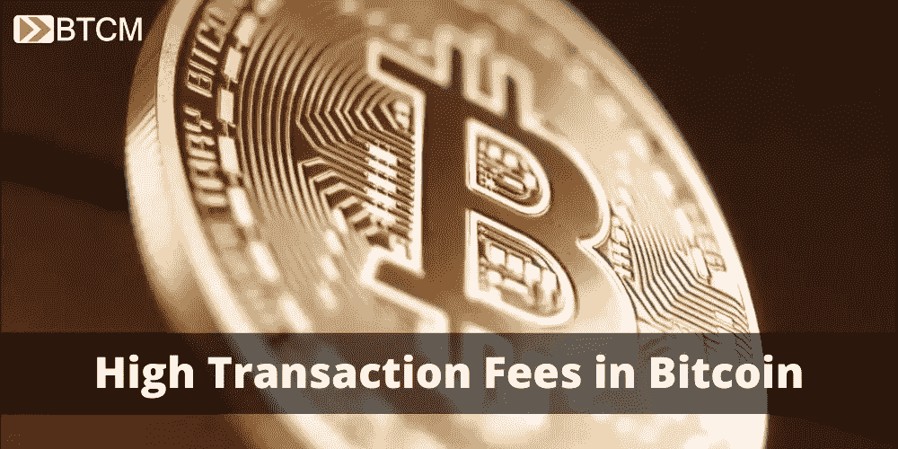
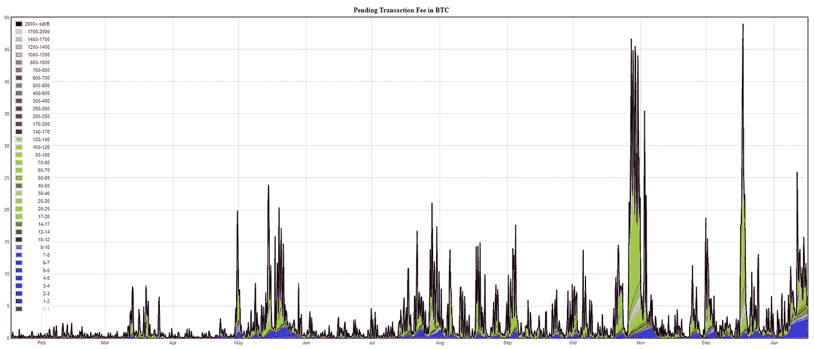

# 比特币的高额交易费不是问题

> 原文：<https://medium.com/coinmonks/high-transaction-fees-on-bitcoin-a7b0827026be?source=collection_archive---------5----------------------->

多年来，比特币受到的一个普遍批评是交易费用过高。人们声称他们将阻止比特币被广泛采用为货币。这些初学者错过了一些东西，事实证明，高费用实际上对比特币有利。让我解释一下。

# 为什么收费高？

比特币的交易费用很高，因为它是以非常特定的方式设计的，有非常特定的目标。高收费不是开发商疏忽的结果，也不是因为技术上很难做到。任何人都可以构建一个每秒发送数千个事务(tps)的简单程序。就分散货币而言，技术上的困难任务是设计一个可以长期保持分散的网络。

一个自治的分散式网络必须对它能够处理的事务数量有一个限制。如果它不这样做，并且它的货币有任何重要的市场用途，网络将很快被垃圾邮件淹没。这是因为[帕金森定律](https://en.wikipedia.org/wiki/Parkinson%27s_law)，“对资源的需求倾向于扩大以匹配资源的供应。”

适应比特币，“需求”是以字节为单位的交易数量和大小，“资源”是节点的存储和带宽。我们可以将帕金森定律重述如下:事务的数量和字节大小将扩展到节点的存储和带宽限制。这将限制这些资源规模低端的节点数量，将比特币集中到更少的节点上，这些节点的运营成本更高，更容易受到攻击。

因此，为了保持高度的分散，甚至随着时间的推移变得更加分散，网络必须对其最大资源需求有严格的限制。比特币通过块大小限制来实现这一点，也称为块重量限制。平均每 10 分钟就有一笔新的交易在比特币网络上被确认，在网络的历史上对这些交易进行排序。每个块只能是 1 MB(尽管现代节点软件对某些事务类型的字节计数不同，理论上允许每个块最大 4 MB)。

事务由数据组成，大小以字节为单位。只有一定数量的事务可以容纳在 1 MB 的限制内(大约 2，500-3，000)。随着交易需求的增加，将这些交易分成区块的矿商自然会优先考虑收费较高的交易。随着需求的增加，费用也会增加。

# 高收费、层层把关的结果

在一个分散的网络中，高费用是一种自然的市场现象，但高费用非但没有抑制比特币的使用，反而刺激了创新。这种创新导致新产品和服务创造更多的比特币需求和比特币交易，刺激更多的创新，形成良性循环。

人们减少费用的主要方法是使用我们称之为第二层协议。您可能对分层协议很熟悉，甚至不知道它。Http 和 https 是位于互联网核心网络协议(TCP/IP)之上的层。视频和数据流是层，以太网和 WiFi 是层的类型。比特币也是互联网的一层，比特币上面还有层。

比特币主要有三层时代，闪电网络、联合侧链和集中服务。让我们快速地看一下每一个。

# 闪电网络

Lightning Network (LN)是一个开源的分散式网络，拥有自己的节点软件。要使用 LN，你需要一个比特币节点和一个闪电节点(或者访问一个为你运行它们的服务)。这些通常在同一台计算机上运行。

闪电节点通过一个支付渠道网络连接起来，这些支付渠道可以来回发送“交易”，或者通过多个渠道路由到一个接收者。支付通道本身是一种特殊类型的比特币交易，可以无限次数地进行加密更新。LN 是分散的第 2 层选项。

# 侧链

侧链是切线网络，通过交易与比特币相连。用户将比特币交易(以及相关费用)发送到一个侧链地址，将比特币锁定在适当的位置，并在切线网络内释放侧链令牌。侧链具有与比特币不同的功能，类似于替代币，但不是替代币，因为它们与作为货币单位的比特币挂钩。

然而，侧链中的这种更大的功能也有代价，即更大的集中化和审查的威胁。目前，分散的侧链是不可行的，所以使用联盟。这意味着几个大玩家根据软件的规则向普通用户提供服务。

迄今为止最著名的侧链是 Liquid，它鼓吹更快、更便宜、更私密和更可编程的交易；和根茎，这是以太坊的克隆，提供了比特币货币单位“智能合约平台”的所有功能。

# 集中式第 2 层

这些也可以简单地认为是集中的服务或拥有自己数据库的公司。例如，比特币基地有许多用户，并免费提供用户之间的交易，因为他们所要做的就是更新自己的数据库。

这些被恰当地认为是比特币的层次，因为它们给用户提供了主网络上没有的独特功能。这方面的一个例子是赌博。多年来，人们做了大量的工作来创建一个分散的赌博协议，但成效有限。然而，网上赌场很容易做到这一点。你将比特币存入一个地址，然后就可以参与由该公司集中服务管理的在线游戏。比特币余额在这项服务中的所有移动都是在没有在比特币网络上进行交易的情况下完成的，直到你将比特币收回到自己的钱包中。

# 比特币创新的未来

正如你所看到的，由于比特币基础层的高费用，第二层协议的创新进展迅速。随着未来比特币费用的增加，创新的动力也会增加。从市场活动中自然产生的费用远非致命缺陷，而是为比特币生态系统提供了强大的能量来源。

当然，在基础层上仍然有非常高级的工作要做，但是与第 2 层相比，它是非常保守的，并且在基础层上做的这种缓慢的基础工作经常被误认为是唯一要做的工作。然而，最令人兴奋的发展来自第 2 层，如果没有高额费用的激励，这是不可能的。我们将何去何从，只受到企业家想象力的限制。

*原载于 2021 年 1 月 18 日*[*【https://btcm.co】*](https://btcm.co/fee-market/)*。*