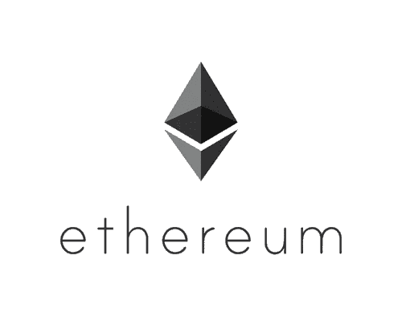
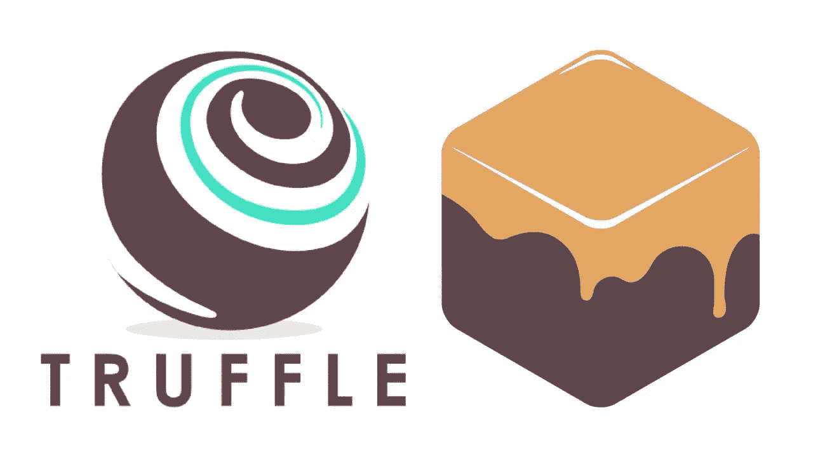
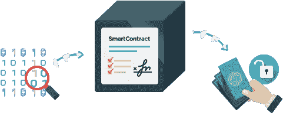
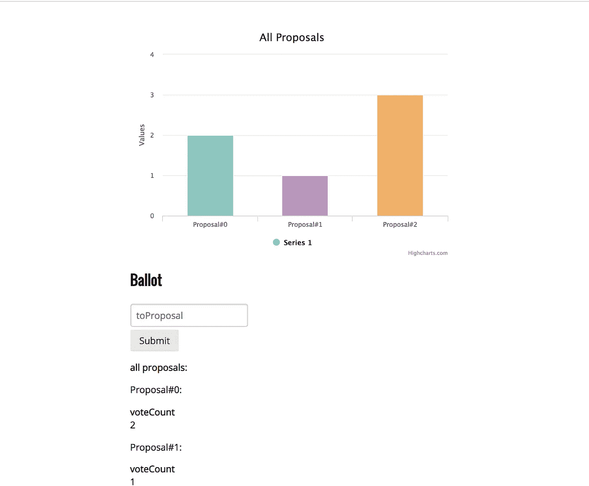
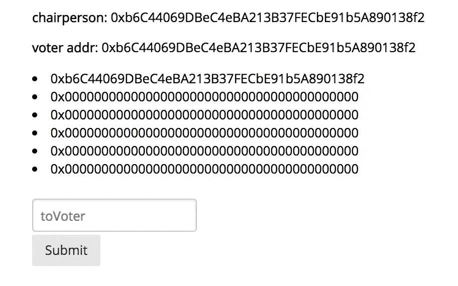
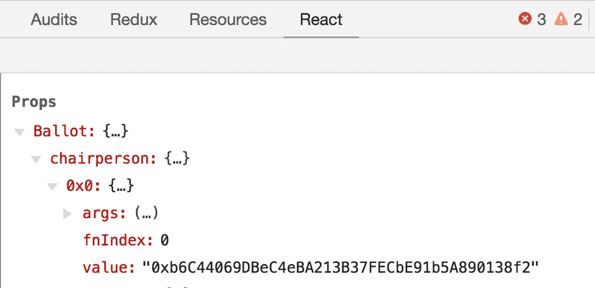
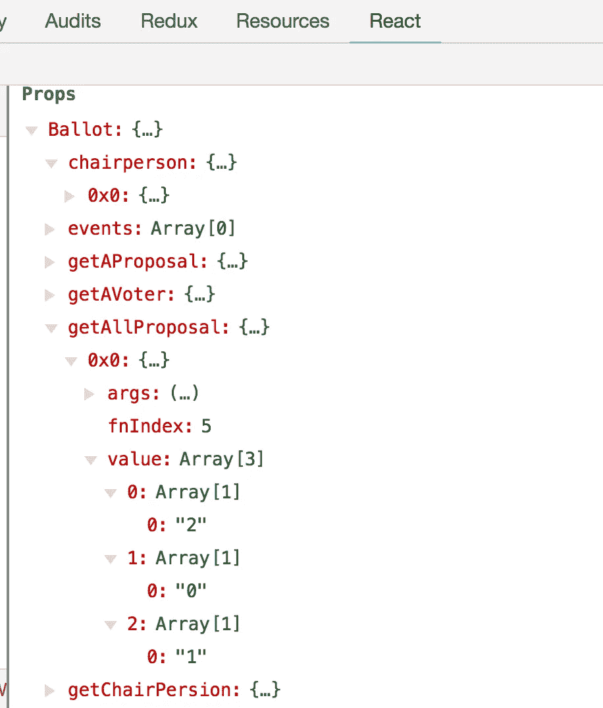
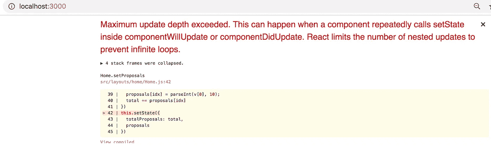

# 带有毛毛雨-反应-组件的高图表

> 原文：<https://medium.com/coinmonks/highchart-with-drizzle-react-components-fbce2e28a3a1?source=collection_archive---------0----------------------->



这个小故事来自我们在夏天早些时候做的一个黑客马拉松项目。

**目标**:通过以太坊区块链建立一个价值 10 亿美元的分销网络。

听起来像一个有趣的**哈克森**项目对不对😏？

技术堆栈如下所示:

前端:反应([松露盒/毛毛雨盒](https://github.com/truffle-box/drizzle-box)

后端:[坚固度](https://github.com/ethereum/solidity)。[加纳切](https://truffleframework.com/ganache)。 [Web3.js](https://github.com/ethereum/web3.js/) 。

我的 git 代表有这篇文章需要的所有代码。

后端方面，我们通过 [ganache-cli](https://github.com/trufflesuite/ganache-cli) 建立了一个以太坊网络，然后创建/部署一个智能契约。(我不会在这篇文章中讨论智能合同，那家伙应该有自己的文章😂 ).



明智地说，我们基于一个叫做[毛毛雨-反应-组件](https://github.com/trufflesuite/drizzle-react-components)的毛毛雨盒子来构建我们的项目。

我的回购中的代码是基于[毛毛雨盒](https://github.com/truffle-box/drizzle-box)，加上花哨 UI 的 HighCharts 以获得观众的*惊叹*，并谈论如何和为什么。

继续克隆我的[回购](https://github.com/lhong375/HighChart-drizzle-box)。

如果你还没有安装松露/加纳切。

```
npm install -g truffle
npm install -g ganache-cli
```

启动区块链服务器非常简单，如下所示:

```
ganache-cli -b 3 -p 8545
```

*   -b 3 表示你的格挡时间是 3 秒，对于 UI 来说，表示我们的 react 组件每 3 秒就会得到新的道具。
*   -p 是端口号，它是可选的，但我强烈建议您指定它，因为每个版本的 ganache-cli 都可以有不同的默认端口号，请确保它与您在 *truffle.js* 中拥有的端口号相同

```
//truffle.js
module.exports = {
     migrations_directory: “./migrations”,
     networks: {
     development: {
         host: “localhost”,
         port: 8545,
         network_id: “*” // Match any network id
     }
 },
 .....
}
```

现在，您的区块链网络已经启动并运行，但是等等，还没有智能合同，我们需要编译和部署它们。

```
npm run populate
```

以上将编译和部署/contracts/下的所有合同...



这个[投币盒](https://github.com/truffle-box/drizzle-box)带有情侣合同，我们感兴趣的那个叫做**选票**。它保存了一个投票者列表，3 个提案和它们的投票数，一个可以授予投票者权利的主席，和一个投票的功能。

```
//contracts/Ballot.sol
pragma solidity ^0.4.23;
pragma experimental ABIEncoderV2;contract Ballot { struct Voter {
        ...
    }
    struct Proposal {
        uint voteCount;
    } address public chairperson;
    mapping(address => Voter) voters;
    mapping(address => Voter[]) voterslist;
    Proposal[] proposals; ...
```

同样，我不打算在智能合约本身上过多的赘述，但是，我会在这篇文章的后面介绍我为这个演示添加的新功能。

现在字体结束。

执行 npm 安装以处理前端依赖关系。

```
npm install
```

要调出用户界面:

```
npm run start
```

它将打开您的浏览器并加载 localhost:3000，如下所示。



现在将一个数字从 **0，1，2** 输入到建议输入框中，然后点击提交，如下图所示:

 [## Recordit:快速免费录制屏幕广播！有 GIF 支持！

### 编辑描述

recordit.co](http://recordit.co/sfoIGnJT7Q) 

不错！当我们投票时，投票号码会在图表中更新(嗯，还记得 **3 秒**的阻塞时间吗？这将是我们预期的延迟)。

为了获得每个提案的投票数，我在 Ballot 中添加了新的函数。sol:

```
//Ballot.solcontract Ballot { ... struct Proposal {
        uint voteCount;
    } ... Proposal[] proposals; ... function getAllProposal() public view returns (Proposal[]) {
        return proposals;
    } function getAProposal(uint8 num) public view returns (Proposal)  {
        return proposals[num];
    }
    ...}
```

有两个新功能， **getAllProposal** 和 **getAProposal** 。为了支持 UI，我们一个接一个地绑定 3 个提议，所以**get proposal**是真正使用的那个。您还可以获取一个列表并进行迭代，这样 getAllProposal 会很有用。

附带毛毛雨框(毛毛雨反应组件)的用户界面给我们提供了一个简单的列表，如下所示:



这是工作，但不是很讨人喜欢。


为了引入 HighCharts 并正确地将 Ballo 合同数据绑定到它，我们需要理解 **ContractData** 是如何工作的，并对 HighCharts 使用相同的魔法。

但是…我提到过这是一个 **hackson** 项目吗？我们在赶时间，队友需要你在智能合同上的帮助，需要尽快让 UI 工作，你会怎么做？

> 捷径🚤。

我在玩[松露盒/毛毛雨盒](https://github.com/truffle-box/drizzle-box)时注意到的是，一旦你将 **ContractData** 带入 UI，无论你绑定什么智能契约函数，都会被填充到组件的道具中。

看看 Home.js，注意**主席**是如何绑定到 UI 的:

```
//Home.jsrender() {
    ...
    return (
      ...
        <p><strong>chairperson</strong>: <ContractData contract="Ballot" method="chairperson" /></p>
      ...
    )
}
```

如果你检查页面，并查看 react 选项卡(假设你的 chrome 中安装了 React 扩展)，注意到在我们的 home 组件的 props 中有**选票**，在它里面有**主席**:



所以从理论上讲，如果我们将提议绑定到 UI 中，我们应该能够用它来填充 HighCharts😼。

> 让我们测试一下，好吗？

在 Home.js 中，将提议函数绑定到 UI 中:

```
//Home.jsrender() {
    ...

    return (
      ...
      <p><strong>all proposals</strong>:<ContractData   contract="Ballot" method="getAllProposal"/></p>
         {listItemsProposals}
      <br/>
      ...
   )
}
```

现在查看页面，提案功能**和**显示出来🙌



又到了给我们的排行榜喂食的时候了，还是在 Home.js:

```
//Home.jsclass Home extends Component {
  state = {
    ...
    proposals: {},
  }; componentDidMount() {
    this.setProposals();
  } setProposals() {
    const val = Object.values(this.props.Ballot.getAllProposal);
    var proposals = [], total = 0;
    val[0] && val[0].value.forEach((v, idx) => {
      proposals[idx] = parseInt(v[0], 10);
      ...
    })
    this.setState({
      proposals
    })
    ...
  }
  ... render() { const data = this.state.proposals;
      ... const chartConfig = {
          ...
          series: [{
              data: [{
                  name: 'Proposal#0',
                  color: '#8DC5BF',
                  y: data[0],
                  }, 
                  ...
                  ]
      }]} <ReactHighcharts config={chartConfig} />
```

保存并刷新页面，然后…

不，不管你投多少票，这个州的提案都是 0，为什么？

哦，这是因为 componentDidMount 只被调用一次，而且是在你可以对 UI 进行任何投票之前。所以我们也需要在每次有新道具的时候更新:

```
//Home.js
componentDidUpdate(prevProps) {
    if (!isEqual(
      prevProps.Ballot.getAllProposal,
      this.props.Ballot.getAllProposal)
    ) {
      this.setProposals();
    }
}
```

应该不错吧？



哦不，怎么了？

所以原来我们一直在获得新的道具(记得 block time 设置为 3 秒)，为了防止重复重新渲染，有**shouldComponentUpdate**—**谢谢反应！**

```
//Home.js
shouldComponentUpdate(nextProps, nextState) {
 return !isEqual(nextState, this.state) || !isEqual(nextProps,   this.props);
 }
```

**就是这样！**

**这个**黑客马拉松**项目是我第一次体验区块链/以太坊/trulle/毛毛雨。**

**后端方面，建立一个简单的以太坊网络比我想象的要容易。**

**就字体端而言，像毛毛雨-反应-组件这样的现成库确实使我们的生活变得简单，但是它在后台的魔力需要一些时间来挖掘。**

**我们上面提出的解决方案远非完美，但是对于一个**黑客马拉松**项目，我没有太多抱怨。**

> **[直接在您的收件箱中获得最佳软件交易](https://coincodecap.com/?utm_source=coinmonks)**

**[](https://coincodecap.com/?utm_source=coinmonks)**