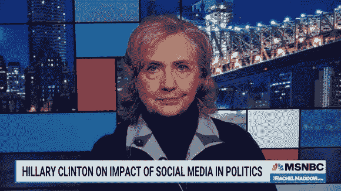

# 希拉里·克林顿现在希望拜登监管加密货币

> 原文：<https://medium.com/coinmonks/hillary-clinton-now-wants-biden-to-regulate-cryptocurrencies-9f663a92bc8a?source=collection_archive---------9----------------------->

MSNBC

## 希拉里·克林顿表示，俄罗斯和中国正在“操纵”加密货币，拜登政府需要“监管”加密货币市场

一天前，她对 MSNBC 的瑞秋·麦道说了这些。它立即成为了密码世界的头条新闻。