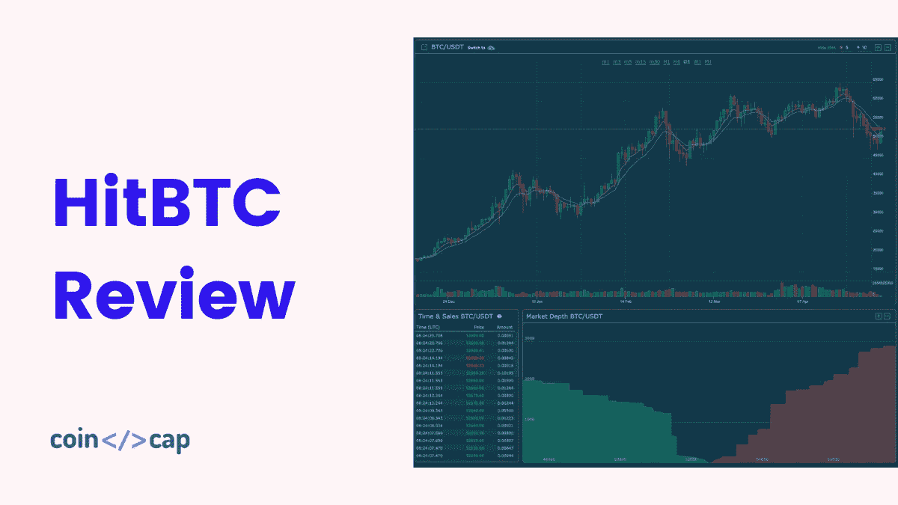
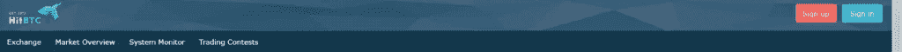
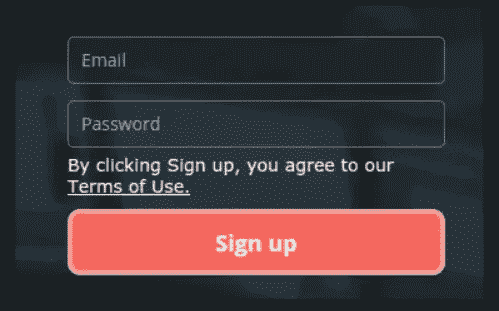
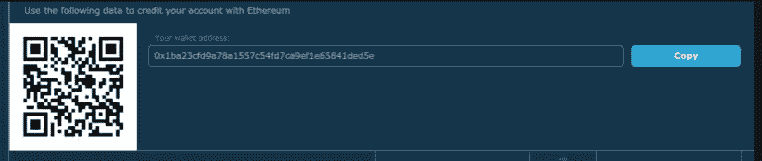
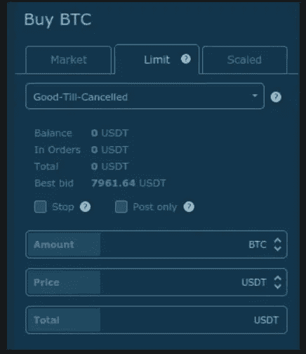
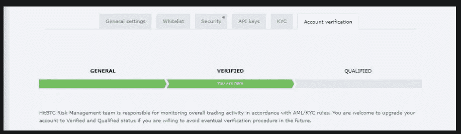
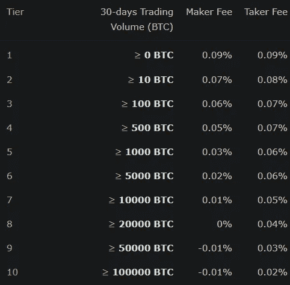
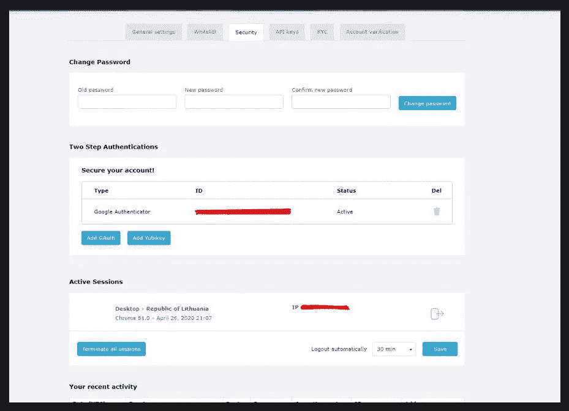

# HitBTC 评论 2021 |安全还是合法？

> 原文：<https://medium.com/coinmonks/hitbtc-review-c5143c5d53c2?source=collection_archive---------7----------------------->

今天我们将回顾一下 [**HitBTC**](https://blog.coincodecap.com/go/hitbtc) ，这是一家[的加密货币交易所](https://blog.coincodecap.com/go/crypto-exchange)，它提供了高流动性和业内最大的加密货币集合。

# HitBTC 是什么？

[**HitBTC**](https://blog.coincodecap.com/go/hitbtc) 是一个[加密货币交易所](https://blog.coincodecap.com/go/crypto-exchange)平台，提供高流动性，支持数百种加密货币。 [HitBTC](https://blog.coincodecap.com/go/hitbtc) 平台开发于 2013 年末，是业内最古老的[加密货币交易所](https://blog.coincodecap.com/crypto-exchange)之一。通过这个平台，用户可以购买、出售和交易数百种不同的加密货币。

对于 Hitbtc 交易所来说，最大和最主要的问题是他们的责任，因为它运营的公司位置是未知的。虽然通讯地址在香港，而且它声称在智利和爱沙尼亚都有办事处。因此，它应该作为一个重要的危险信号，因为如果由于任何原因，资金发生问题，将很难找到他们。HitBTC 在香港有大约 600 万的风险投资，但是它更关注欧洲的加密市场。

尽管如此，在这个平台上，用户可以通过直接银行转账，用真实世界的钱存入资金。它不支持借记卡/信用卡和电子钱包。Hitbtc 的 MSP(主要卖点)是其极具竞争力的费用，因为它提供了加密市场中最低的价格。

# 总结(TL；博士)

*   它提供了 800 多种加密货币对中 380 种加密货币的最全面选择。
*   HitBTC 允许用户进行加密到加密的交换。
*   开始交易时，验证不是强制性的。
*   它是一个安全的平台，至今从未被黑客攻击过。
*   高竞争费用，因为交易费用低于行业平均交易费用。
*   该交易所提供高流动性。
*   客户支持是多语言的。
*   HitBTC 上的用户可以使用[交易机器人](https://blog.coincodecap.com/best-crypto-trading-bots)，它们与健壮的 API 一起工作。
*   它也是新加密货币交易者的演示功能。
*   它有一个适用于 Android 和 iOS 版本智能手机的移动应用程序。

# 如何在 HitBTC 开户并交易？

这一部分是注册、存款和进行首次交易的分步指南。

## 步骤 1: Hitbtc 注册流程

要注册，用户必须访问 [**HitBTC**](https://blog.coincodecap.com/go/hitbtc) 主页。在他们家的右上角是“注册”按钮。点击开始注册过程。

之后，会出现一个注册窗口，要求用户填写一些细节。他们必须输入他们的电子邮件地址，然后选择一个强密码。填写完毕后，点击“注册”按钮。

下一步，你必须输入你的住址，全名和电话号码。在最后一部分，您必须通过点击 [**HitBTC**](https://blog.coincodecap.com/go/hitbtc) 将发送给您的电子邮件地址上的链接来验证您的电子邮件地址。当新链接打开时，复制并粘贴代码。

## 第二步:为你的账户注资

完成注册程序后，您必须将一些资金存入您的 [HitBTC 账户](https://blog.coincodecap.com/go/hitbtc)。这个过程包括使用加密货币而不是通过银行账户存款。使用银行账户存款需要一个完整的验证过程，这需要时间。另一方面，加密货币作为一种存款方式，只需 20 分钟左右，资金就会出现在你的账户上。

你会在页面顶部看到绿色的“存款”按钮；点击它。一长串硬币会出现在你的窗口上，你可以用它们存款。在搜索框中输入您喜欢的硬币名称。当它出现时，单击“+”蓝色按钮。

此后，您将看到您选择的硬币的唯一存款地址。点击“复制”蓝色按钮，将钱包地址复制到您的剪贴板。然后，去你的私人钱包，粘贴地址，并转移你的资金。

## 第三步:购买密码

一旦存入的资金出现在你的 [**HitBTC**](https://blog.coincodecap.com/go/hitbtc) 账户中，你就可以进行你的第一笔交易了。在页面的左上方，您会发现一个“交换”按钮。点击它，你将进入主交易区。对于从未交易过的用户来说，这个页面看起来有些吓人。要么在右边输入您的硬币名称，要么滚动列表并选择您想要购买的硬币。选择后，点击你选择的交易对。

## 第四步:完成交易

完成选择硬币后，你想买，移动到主图表下面。在那里你会发现一个“购买”按钮。在“金额”框中，输入您想要的加密货币金额。之后，点击绿色的“买入限价”按钮完成交易。交易将在几秒钟后完成。

# HitBTC 审查:核查过程

在注册过程中通过电子邮件验证后，用户可以通过完成验证过程来提高限额。要验证您的帐户以提高限额并使用菲亚特为您的帐户注资，您需要填写以下信息以完成您的 **HitBTC KYC** 。

*   个人信息，包括全名、出生日期、国籍(如政府颁发的身份证上所述)。
*   居住地址。
*   使用菲亚特的银行账户信息。
*   政府颁发的带照片的身份证明。
*   手机号码
*   一张你的身份证照片。

用户应该注意，身份证应该在未来三个月内有效，照片应该是原件，而不是复印件。此外，图像应该是清晰的，彩色的，高分辨率的。

根据账户类型，即:初始账户、交易账户、专业账户，适用以下限制:

*   用户可以每天交易 1 BTC，每月交易 5 BTC。对于初学者来说，法定货币是不可用的。
*   **Trader:**crypto 免费存款，用户每天最多可以提取价值 100 BTC 的加密货币。用户可以使用法定货币进行支付。
*   **Pro:** **无存款费用**，提供资金来源或开户等附加文件后，可享受更高限额。

Pro 账户持有人享受与 [**HitBTC**](https://blog.coincodecap.com/go/hitbtc) 相同的流动性杠杆，专用账户管理，存取不限。要成为职业玩家，用户至少要有 100 BTC 的余额或每月 1000 BTC 的营业额。

# HitBTC 费用

## Hitbtc 提款和存款费用

[**HitBTC**](https://blog.coincodecap.com/go/hitbtc) 不支持借记卡和信用卡交易，因此不收取任何费用。但是，对于使用欧洲银行转帐( [SEPA](https://ec.europa.eu/info/business-economy-euro/banking-and-finance/consumer-finance-and-payments/payment-services/single-euro-payments-area-sepa_en) )完成交易的用户，价格为 0.90 欧元。英国银行转帐的费用是 5 英镑。最后，对于国际银行电汇( [SWIFT](https://www.swift.com/) )，用户需要支付 9 美元的费用。

## HitBTC 交易费

[**HitBTC**](https://blog.coincodecap.com/go/hitbtc) 的交易费用结构很简单:用户要支付 **0.01%** 的交易费用。但是，这是在交易的两端收取的。例如，如果您购买价值 3000 美元的 crypto，并以相同的金额出售，用户将需要支付两笔 3 美元的交易。

请注意，HitBTC 上的验证用户属于他们的等级费用系统。根据分层收费制度，根据用户在过去 30 天内的交易量来确定费用。

一旦用户达到第 8 层，每月 50，000 BTC 或更多，该平台向用户支付每笔交易-0.01%的回扣。

# HitBTC 审查:付款方式

虽然 HitBTC 曾经支持像美元这样的法定货币，但它不再保留它了。然而，用户仍然可以在交易所购买支持的 800 种不同的加密资产。它还允许用户直接从他们的银行账户进行交易。只有完成 KYC 的用户才能使用银行账户。

存款和取款的过程简单明了。用户所要做的就是导航到“账户”标签并选择加密货币。取款过程通常需要几分钟，并且高度依赖于加密货币和网络速度。

# HitBTC 演示

[**HitBTC**](https://blog.coincodecap.com/go/hitbtc) 交易所为新手用户提供了一个尝试和交易加密货币的演示平台。要体验演示交易，用户可以注册并访问它。

屏幕下方有演示选项，也可以直接 [**点击此处进入**](https://demo.hitbtc.com/) 演示。请注意，用户必须为演示平台创建一个单独的帐户。在这个项目中，你将获得大约 4000 USDT(假币)价值的加密货币。利用这一点，你可以尝试策略和投资组合。

# Hitbtc 审查:场外交易

HitBTC 拥有为高交易量交易者提供的柜台交易服务 T4。场外交易者的出现是由于与 [TrustedVolumes](https://trustedvolumes.com/) 合作的结果。要使用该功能，用户每次交易必须兑换超过 100，000 美元，每次交易将产生 0.1%的交易费。

# HitBTC 审查:客户支持

HitBTC 有一个[支持中心](https://support.hitbtc.com/en/support/home)，帮助回答用户提出的几乎所有问题。该支持中心包含:

*   关于 [**HitBTC**](https://blog.coincodecap.com/go/hitbtc) 平台特性以及用户如何利用这些特性获利的广泛知识文章。
*   票务功能，允许用户直接联系 HitBTC 支持团队。

用户可以询问与支付、KYC 等相关的问题。团队一般 24 小时内回复。

# Hitbtc 审查:安全性

HitBTC 安全级别良好。以前从未被黑过。然而，一些消息来源声称 HitBTC 与 BTER 和 Excoin 一起被黑。消息来源从未证实这一信息。

[**HitBTC**](https://blog.coincodecap.com/go/hitbtc) 支持用户账户双因素认证，增加额外一层安全保障。“设置”菜单中的安全部分也允许用户检查他们帐户的所有登录。他们应该寻找他们不认识的 IP 地址或位置。万一有用户不认识的 IP 地址，他们只需点击一下就可以终止所有的会话。他们还可以选择定期自动注销所有会话。

HitBTC 还支持以下选项来保护用户的帐户:

*   会话终止工具和活动日志
*   冷藏保管
*   30 分钟不活动后自动注销。
*   通用第二因子(Yubikey)
*   [加密钱包](https://blog.coincodecap.com/best-crypto-wallets-app)地址白名单

在 **HitBTC 注册**之后，它会强制用户激活 2FA，因为如果没有它，其他人将无法使用某些功能。

# HitBTC 审查:利弊

## 赞成的意见

*   300 多种不同的硬币，800 对。
*   交易量是这个行业中最大的之一。
*   简单易用的导航界面。
*   KYC 不是强制性的。
*   交易费用太低，竞争激烈。
*   用户也可以使用演示模式。
*   有多种语言版本。

## 骗局

*   它不支持借记卡和信用卡。
*   法定货币不可用。
*   Hitbtc 位置不确定。
*   透明度问题。
*   不适合新手。

# HitBTC 审查:结论

总的来说， [**HitBTC**](https://blog.coincodecap.com/go/hitbtc) 是一个耐人寻味的优秀加密货币交易平台。它拥有全行业最多的加密货币。蛋糕上的定价是它也有最低的交易费用。该交换相对安全，并为用户提供许多设置和选项，以使他们的帐户更加安全。

然而，它确实存在一些透明度问题，这给该交易所带来了危险信号。因此，这取决于你和你的风险承受水平——是否在完成 KYC 和监管额外证券的情况下进行交易？记住黄金法则——永远不要交易超出你承受能力的钱，跟着感觉走。

# 常见问题

**hit BTC 安全吗？**

Hitbtc 以前从未被黑过，除了一些消息来源说，没有任何关于安全的证据。但是用户被黑的投诉也有一定数量。这种指控可能准确，也可能不准确。

**如何从 HitBTC 取钱？**

按照步骤从 HitBTC 取款:
–进入 Hitbtc 登录页面登录您的账户。
–点击“存款”最好是确保您要提取的货币存在于您交易账户的主账户中。
–然后点击“撤回”部分。
–输入您想要提取的金额。
–输入您的钱包地址和账户的 2FA 代码。
–最后，再次点击“撤回”按钮。

**如何开通支持票 HitBTC？**

可以直接点击[这里](https://support.hitbtc.com/en/support/tickets/new)打开 HitBTC 的支持票。另一个选项是向下滚动到主页的末尾，然后选择“支持中心”在支持中心，您会看到一个“联系我们”按钮。点击该按钮后，它将带您到支持票。

HitBTC 在哪个国家？

根据他们的网站，Hitbtc 位于香港，在智利也有办事处。Hitbtc 的邮政地址是香港新界荃湾海成路 11 号中城 1 号 7 楼 19 室。

*   [如何在印度购买以太坊？【手机和网站 2021】](https://blog.coincodecap.com/buy-ethereum-in-india)
*   [如何在 WazirX 2021 上购买比特币？【也适用于手机】](https://blog.coincodecap.com/buy-bitcoin-on-wazirx)
*   [如何将资金从币安转移到比特币基地？【2021】T5](https://blog.coincodecap.com/binance-to-coinbase)
*   [多车评论 2021:值得买吗？](https://blog.coincodecap.com/multicharts-review)
*   [加密赌注——加密赌注终极指南【2021】](https://blog.coincodecap.com/staking-crypto)

> 加入 [Coinmonks 电报频道](https://t.me/coincodecap)，了解加密交易和投资

## 另外，阅读

*   [加密交易机器人](/coinmonks/crypto-trading-bot-c2ffce8acb2a)
*   [尤霍德勒 vs 科恩洛 vs 霍德诺特](/coinmonks/youhodler-vs-coinloan-vs-hodlnaut-b1050acde55a) | [Cryptohopper vs 哈斯博特](https://blog.coincodecap.com/cryptohopper-vs-haasbot)
*   [币安 vs 北海巨妖](https://blog.coincodecap.com/binance-vs-kraken) | [美元成本平均交易机器人](https://blog.coincodecap.com/pionex-dca-bot)
*   [如何在印度购买比特币？](/coinmonks/buy-bitcoin-in-india-feb50ddfef94) | [WazirX 评论](/coinmonks/wazirx-review-5c811b074f5b) | [BitMEX 评论](https://blog.coincodecap.com/bitmex-review)
*   [加密副本交易平台](/coinmonks/top-10-crypto-copy-trading-platforms-for-beginners-d0c37c7d698c) | [五大 BlockFi 替代方案](https://blog.coincodecap.com/blockfi-alternatives)
*   [信用贷款审核](/coinmonks/coinloan-review-18128b9badc4)|[Crypto.com 审核](/coinmonks/crypto-com-review-f143dca1f74c) | [货币融资融券交易](/coinmonks/huobi-margin-trading-b3b06cdc1519)
*   [顶级付费加密货币和区块链课程](https://blog.coincodecap.com/blockchain-courses) | [币安评论](/coinmonks/binance-review-ee10d3bf3b6e)
*   [在美国如何使用 BitMEX？](https://blog.coincodecap.com/use-bitmex-in-usa) | [BitMEX 回顾](https://blog.coincodecap.com/bitmex-review) | [币安 vs Bittrex](https://blog.coincodecap.com/binance-vs-bittrex)
*   [最佳免费加密信号](https://blog.coincodecap.com/free-crypto-signals) | [YoBit 评论](/coinmonks/yobit-review-175464162c62) | [Bitbns 评论](/coinmonks/bitbns-review-38256a07e161) | [OKEx 评论](/coinmonks/okex-review-6b369304110f)
*   [比特币基地跑马圈地](https://blog.coincodecap.com/coinbase-staking) | [Hotbit 点评](/coinmonks/hotbit-review-cd5bec41dafb) | [KuCoin 点评](https://blog.coincodecap.com/kucoin-review) | [期货交易机器人](/coinmonks/futures-trading-bots-5a282ccee3f5)
*   [最佳加密交易信号电报](/coinmonks/best-crypto-signals-telegram-5785cdbc4b2b) | [MoonXBT 评论](/coinmonks/moonxbt-review-6e4ab26d037)

*原载于 2021 年 4 月 26 日 https://blog.coincodecap.com***。**