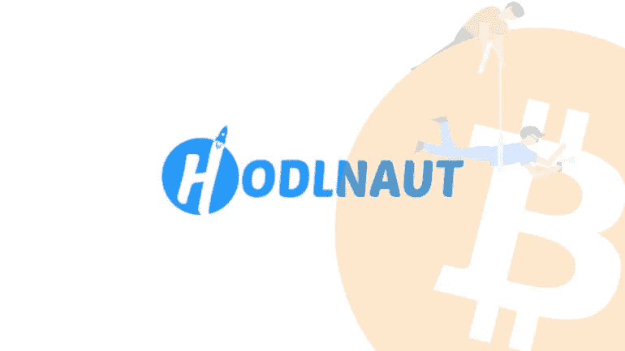
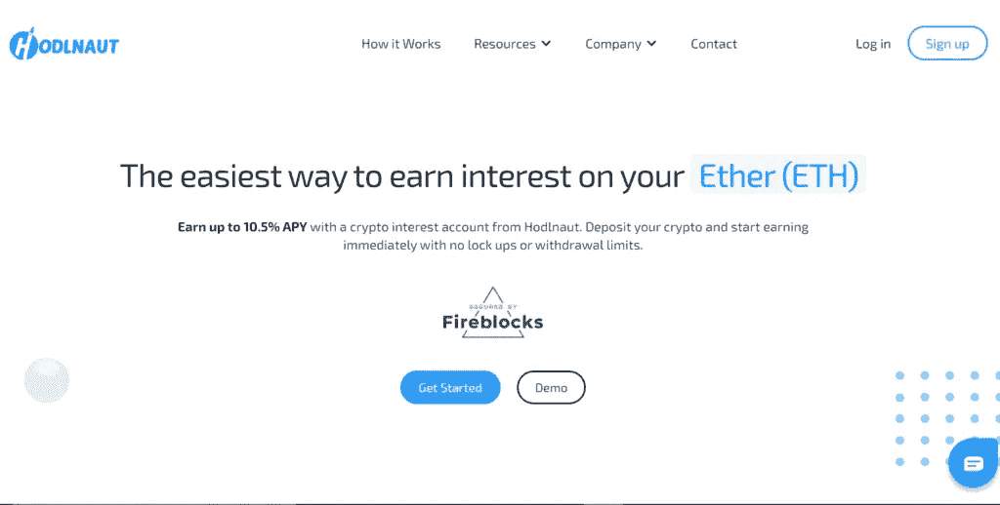
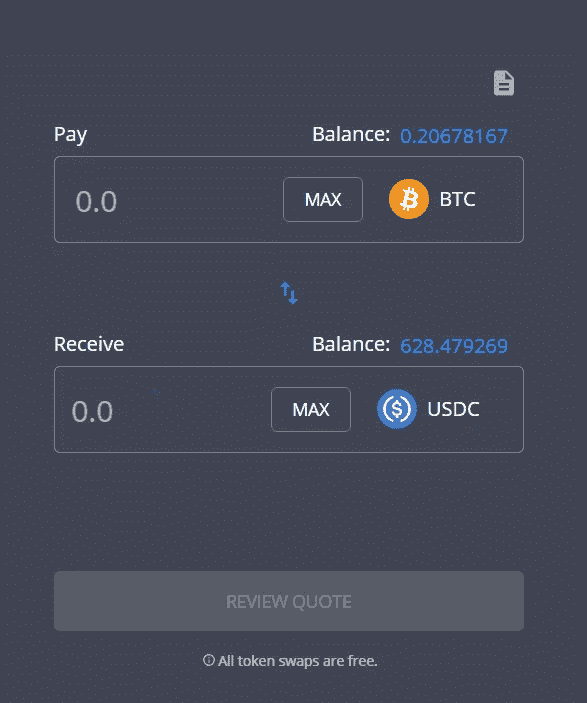
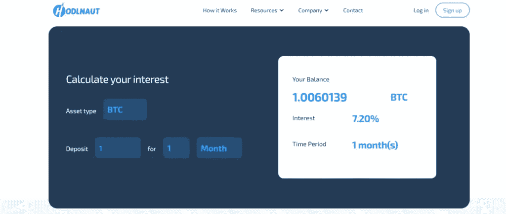
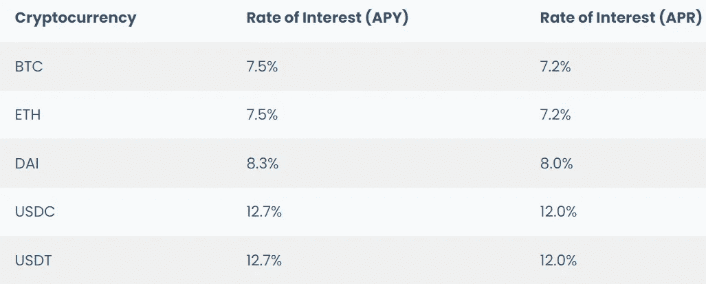
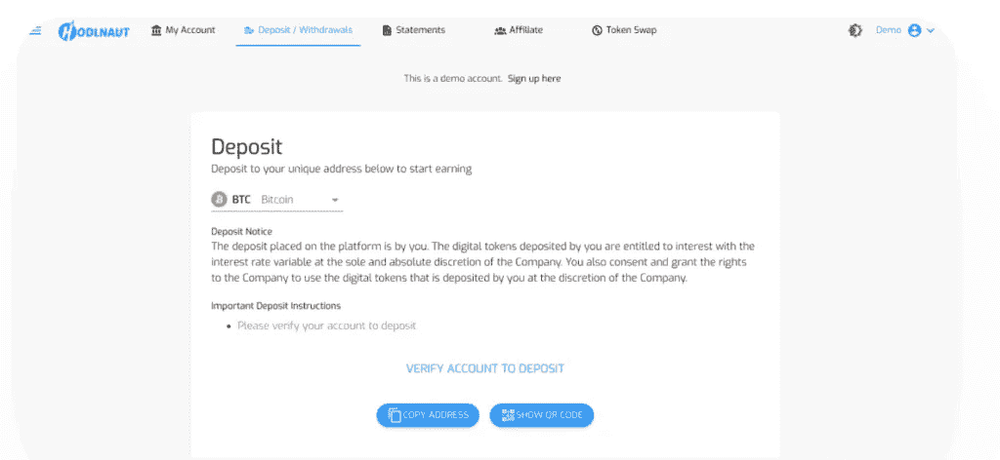
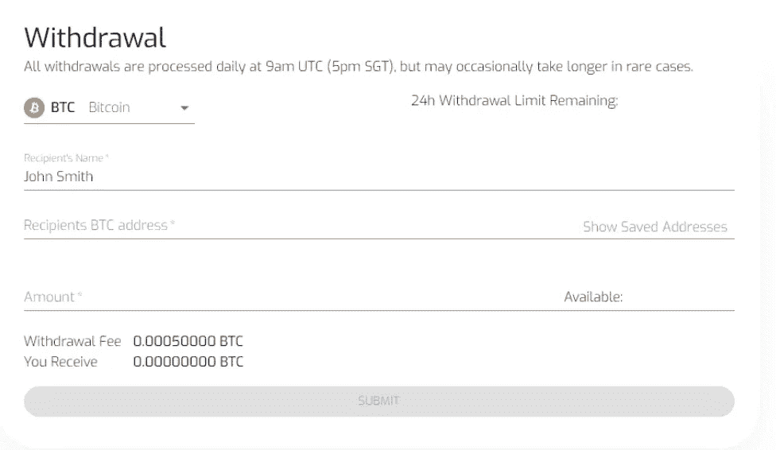
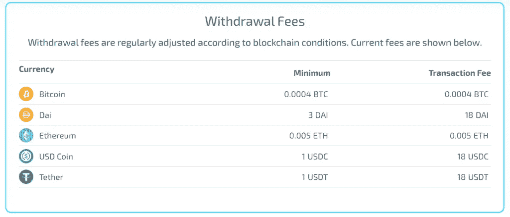
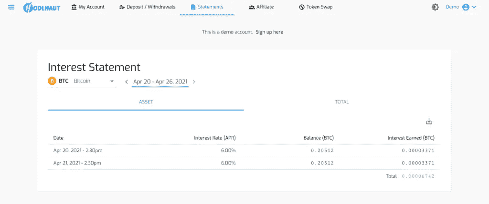

# Hodlnaut 评论 Hodl 的最佳方式是赚取比特币的利息

> 原文：<https://medium.com/coinmonks/hodlnaut-review-best-way-to-hodl-is-to-earn-interest-on-your-bitcoin-6658a8c19edf?source=collection_archive---------1----------------------->

[**霍德瑙特**](https://blog.coincodecap.com/go/hodlnaut) 是一家总部位于新加坡的金融科技公司，为超过 5000 名活跃用户提供金融服务。在这篇 Hodlnaut 评论中，我们将介绍它的特性、费用、支持，以及最重要的优点和缺点。

## 摘要

*   [**Hodlnaut**](https://blog.coincodecap.com/go/hodlnaut) 是一家新加坡金融科技公司。
*   他们提供每周支付的高加密利率。另外，没有锁定期。
*   而且，通过锁定一个月或更长时间的最低金额的加密货币，您可能会获得更高的收益率。
*   机构投资者可以用他们的密码作为抵押获得密码贷款。
*   此外，它们还提供了任何 [Hodlnaut](https://blog.coincodecap.com/go/hodlnaut) 支持的资产之间的即时代币交换。
*   Hodlnaut 支持五种加密货币用于存款和取款。
*   存款和代币兑换不收任何费用。此外，它们支持网络中允许的最低存款。
*   他们使用各种方法来保护他们的平台，如 KYC、SSL 加密、地址白名单、双因素认证等。
*   投资前可以查看他们的演示平台。

## 霍德瑙特是什么？

[**Hodlnaut**](https://blog.coincodecap.com/go/hodlnaut) 是一家在新加坡成立的金融科技公司，为个人和企业投资者提供金融服务。祝俊涛和西蒙·李是两位比特币最大主义者，他们于 2019 年 4 月成立了 Hodlnaut，通过提供简单的产品选择和所需的援助，帮助霍德勒实现数字资产的更多收益。

目前，他们拥有 5000 多名活跃用户和 2.5 亿美元的资产。

新加坡管理大学、三箭资本、麻雀和 T21 都支持这个项目。霍德瑙特也是投资初创公司的全球风险投资公司[鹿角](https://www.antler.co/)的投资组合公司。

## 霍德瑙特评论:特色

*   他们支持 [**比特币**](https://blog.coincodecap.com/a-candid-explanation-of-bitcoin) ()、以太坊(ETH)、戴(Dai)、美元币()和系绳(USDT)。
*   此外，您将在每周一下午 5 点(GMT 8+)收到周奖金。
*   利率是根据市场需求和上个月的收入决定的。此外，他们试图提供最好的利率。
*   利息以您存款的加密货币支付。
*   再者，你可以随时退出；没有锁定期。
*   没有最低存款额。
*   您还可以通过输入资产和天数来计算您将获得的利息。
*   此外，您还可以选择 [Nexus 相互监护保险](https://app.nexusmutual.io/cover/buy/get-quote?address=0xC57d000000000000000000000000000000000006)。

## 霍德瑙特评论:代币互换

霍德瑙特提供在任何 [**霍德瑙特**](https://blog.coincodecap.com/go/hodlnaut) 支持的资产之间即时交换代币。此外，它还能帮助你选择你想要赚取利息的资产类型，并节省双倍费用。因此，你可以管理你的投资组合，重新平衡资产持有。以下是步骤:

1.  登录您的 Hodlnaut 帐户。
2.  选择您想要交易的令牌。
3.  查看报价。
4.  下订单。

您可以在“交易”标签中查看您以前的交易。目前，该功能对新加坡用户不可用。

## 霍德瑙特的定期贷款

[Hodlnaut](https://blog.coincodecap.com/go/hodlnaut) 提供 VIP 定期贷款。此外，通过锁定您的加密货币一个月或更长时间，您可能会获得更高的收益率。

1.  选择 VIP 定期贷款。
2.  至少存入 100 BTC(或等值货币)
3.  在 crypto 上投资至少一个月。
4.  从您的加密货币中获得更大的回报。

## 霍德瑙特评论:机构贷款

[**Hodlnaut**](https://blog.coincodecap.com/go/hodlnaut) 提供以密码为抵押的机构贷款。此外，这些贷款有助于他们满足客户特定的业务需求。目前，它们只对机构开放。

## 机构贷款特征

*   最低贷款额为 5 万美元
*   灵活的贷款价值比，70%或更低
*   你可以选择无固定期限或 3 个月以上的固定期限
*   市场上最低的价格。
*   没有隐藏费用
*   Hodlnaut 将作为所有贷款的交易对手。

机构投资者可以利用这些贷款来满足他们的业务需求或分散他们的投资组合。此外，这些贷款有一个复杂的结构，条款和条件因贷款人而异。你可以写信到 support@hodlnaut.com 了解更多信息。

## 霍德瑙特评论:加密兴趣

该平台允许您通过 Hodlnaut 利息账户赚取高达 12.73%的 APY。

## 秘密利率

[霍德瑙特](https://blog.coincodecap.com/go/hodlnaut)试图保持利率一致。然而，市场利率决定了我们的利率，而利率是会波动的。

## 霍德瑙特评论:存款和取款

## 存款

[Hodlnaut](https://blog.coincodecap.com/go/hodlnaut) **不支持法定存款**。但是，您可以通过两种方式将加密货币存入您的 Hodlnaut 账户:

*   将您选择的 Hodlnaut 加密钱包地址复制并粘贴到您希望发送加密的交换机或钱包中。
*   或者，您可以从交易所或钱包中扫描包含您地址的二维码。然后，使用左侧的下拉菜单，您可以存入您选择的加密货币。

## 撤回

要从您的 [**Holdnaut**](https://blog.coincodecap.com/go/hodlnaut) 账户中提款，您必须从左侧的下拉框中选择加密货币。此外，如果已经添加了地址，您可以从那里选择手动添加收款人的姓名、您要向其汇款的钱包地址以及要提取的金额。

您还可以检查您帐户的可用资金，如果您想转移全部金额，只需点击金额，它将被复制到金额列。

## 霍德瑙特评论:费用

该平台不收取押金或交换代币。此外，它们支持网络上尽可能少的存款。

此外， [Hodlnaut](https://blog.coincodecap.com/go/hodlnaut) 专门对提款收取利息，并根据当前区块链市场情况进行调整。

## 霍德瑙特评论:安全

[**Hodlnaut**](https://blog.coincodecap.com/go/hodlnaut) 是一家在新加坡成立的金融科技企业，目前正在争取从[新加坡金融管理局](https://www.mas.gov.sg/)获得牌照。新加坡金融科技协会(Fintech Association)也承认它是经过认证的金融科技。此外，Hodlnaut 还被新加坡[Infocomm Media Development Authority](https://www.imda.gov.sg/)指定为认可的区块链公司。

他们要求所有用户通过一个 KYC 验证过程，作为[中央金融(CeFi)](https://www.hodlnaut.com/crypto-guides/what-is-centralized-finance-cefi) 加密借贷平台。此外，您的数据是完全保密的，仅用于合规目的。

它运行在[亚马逊网络服务](https://www.google.com/aclk?sa=L&ai=DChcSEwjz-Nz2qpbxAhVSlUsFHap1DrYYABAAGgJzZg&ae=2&sig=AOD64_0dWcAFRoy76lPITySHp9NqHyK3Cw&q&adurl&ved=2ahUKEwjl-Mz2qpbxAhUVXnwKHYreAu0Q0Qx6BAgEEAE)云平台上，并使用行业级 [SSL 加密](https://www.cloudflare.com/en-in/learning/ssl/what-is-ssl/)进行平台保护。此外，Hodlnaut 的服务器尽可能多地加密和匿名数据。

Hodlnaut 允许地址白名单，以确保加密只发送到已知和验证的撤销地址。此外，您可以将取款限制在已知地址列表中。撤回白名单获得批准大约需要 48 小时。一旦您启用了此功能，您就不能撤销未添加到列表中的地址。

为了保证更高的安全性，您可以选择对所有帐户交易使用双因素身份验证。此外，他们不会把资金存放在热门钱包里。

## 易用性

[**Hodlnaut**](https://blog.coincodecap.com/go/hodlnaut) 提供了一个用户友好的界面。您可以在明暗主题之间切换。不幸的是，目前他们不支持移动应用程序来管理你的帐户。然而，他们计划很快推出一款 iOS 应用。

您可以根据日期范围和加密货币查看和下载您的利息报表。此外，报表包含日期、利率(APR)、余额和获得的利息。此外，您还可以在右下角看到总金额。

要检查站台上的任何东西，你必须完成 KYC。要检查平台如何工作，可以查看 [Hodlnaut](https://blog.coincodecap.com/go/hodlnaut) 演示平台。

## 霍德瑙特的客户支持

[**霍德瑙特**](https://blog.coincodecap.com/go/hodlnaut) 提供全天候实时聊天。你可以在 info@hodlnaut.com 写信给他们。

此外，您还可以通过以下社交媒体渠道与他们联系-

*   [推特](https://twitter.com/hodlnautdotcom)
*   [电报](https://t.me/hodlnaut)
*   [领英](https://www.linkedin.com/company/hodlnaut)
*   [Instagram](https://instagram.com/hodlnautdotcom)

## 霍德瑙特评论:利弊

## 赞成的意见

1.  高利率
2.  没有锁定期或最低存款额。
3.  初学者友好平台
4.  [iOS](https://apps.apple.com/us/app/hodlnaut/id1564376022) 用户可以从 App store 下载应用。

## 骗局

1.  它不支持法定存款。
2.  他们不支持移动应用程序在旅途中管理您的帐户。
3.  它们支持有限的加密货币。
4.  加密贷款只适用于机构。

## 霍德瑙特评论:结论

[**Hodlnaut**](https://blog.coincodecap.com/go/hodlnaut)crypto interest platform 是一家总部位于新加坡的金融科技公司，允许客户存入加密货币，赚取有竞争力的利率，并交换代币。此外，个人投资者将通过将利息存入他们的、ETH、戴、和账户来扩大他们的资产。企业客户也可以通过抵押他们的数字资产来获得信贷额度。

随着比特币等加密货币的迅速崛起，霍德勒和个人投资者增加持股的需求越来越大。此外， [Hodlnaut](https://blog.coincodecap.com/go/hodlnaut) 允许您安全、直接地为您的加密货币创造回报。

## 常见问题

**什么是 Hodlnaut？**

Hodlnaut 是一家在新加坡成立的金融科技公司，为个人和企业投资者提供金融服务。你可以在他们的平台上赚取利息和交换代币。此外，机构投资者可以获得加密贷款。

【Hodlnaut 支持哪些加密货币？

Hodlnaut 支持比特币(BTC)、以太坊(ETH)、戴(Dai)、美元币(USDC)和系绳(USDT)。

**霍德瑙特支持法定存款吗？**

不， [Hodlnaut](https://blog.coincodecap.com/go/hodlnaut) 不支持法定存款。

**霍德瑙特安全吗？**

[Hodlnaut](https://blog.coincodecap.com/go/hodlnaut) 使用 KYC、SSL 加密、地址白名单、双因素认证等多种方法来保护其平台。此外，他们还得到了密码行业的知名企业的支持，如新加坡管理大学、三箭资本、Sparrow 和 BitGo。

*   [Hodlnaut 评论—赚取比特币利息【2021 年更新】](https://blog.coincodecap.com/hodlnaut-review)
*   [Celsius Network vs block fi vs Hodlnaut |利率、费用和风险](https://blog.coincodecap.com/blockfi-vs-celsius-vs-hodlnaut)
*   [You hodler vs coin loan vs Hodlnaut 2021【投资前阅读】](https://blog.coincodecap.com/youhodler-coinloan-hodlnaut)
*   [2021 年前 6 大密码借贷平台【已验证】](https://blog.coincodecap.com/top-5-crypto-lending-platforms)
*   [加密交易机器人](/coinmonks/crypto-trading-bot-c2ffce8acb2a)

*原载于 2020 年 9 月 2 日 https://blog.coincodecap.com**的* [*。*](https://blog.coincodecap.com/hodlnaut-review)