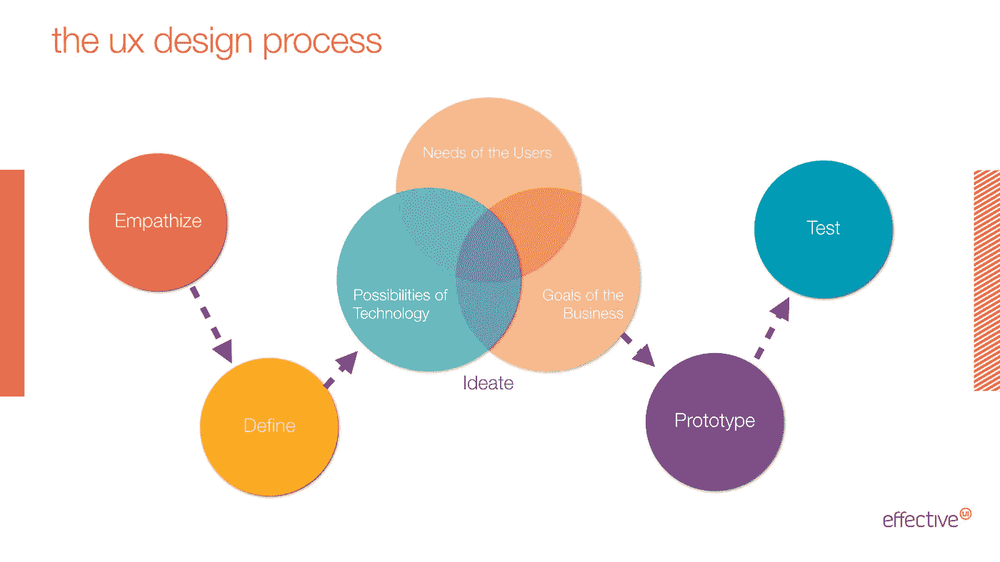
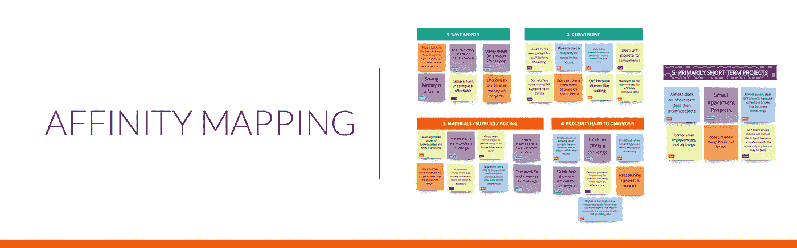
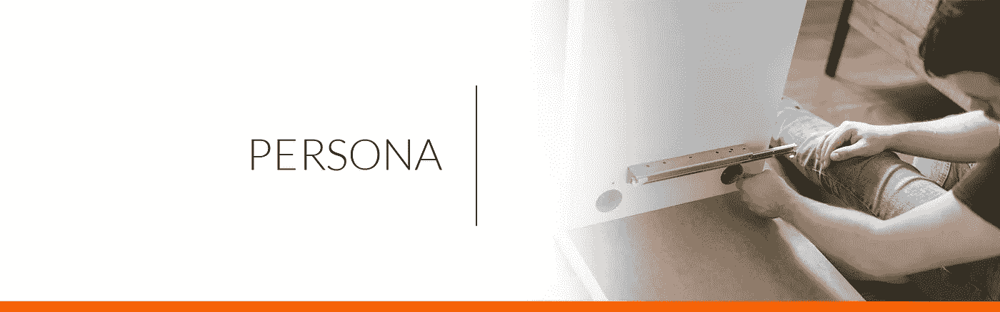
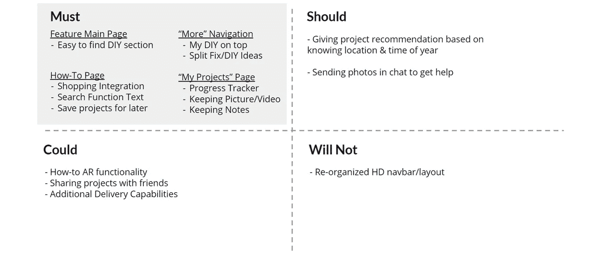
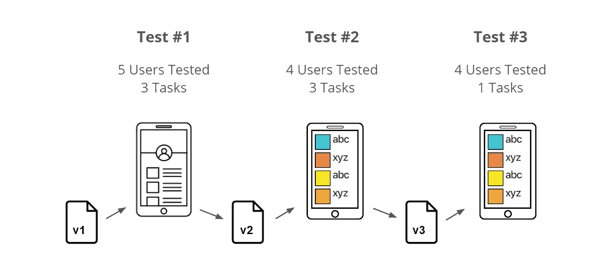
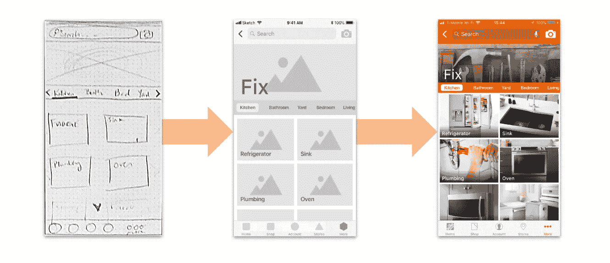
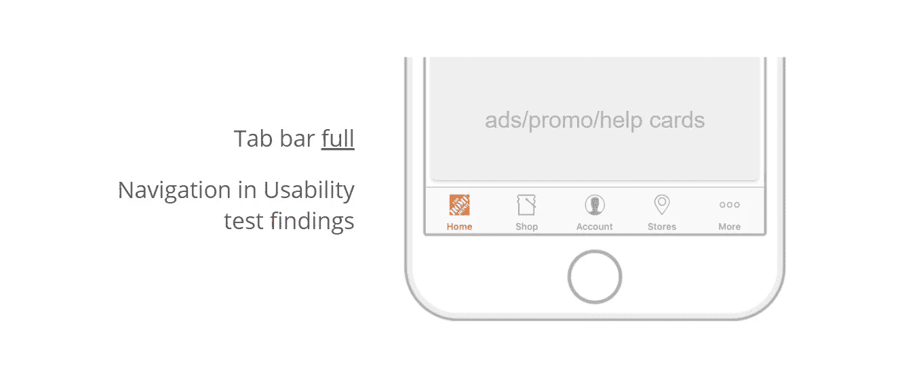
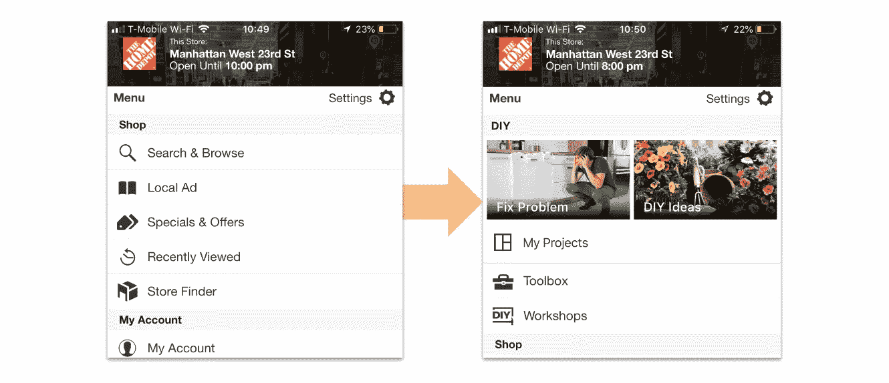
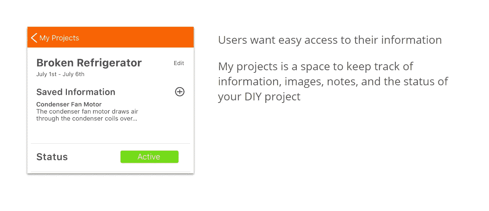
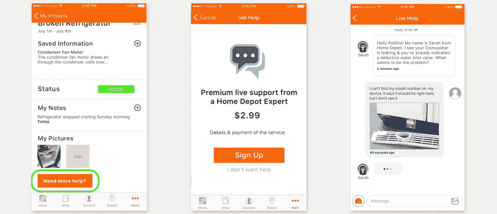

# 家得宝 DIY 移动 UX

> 原文：<https://medium.com/coinmonks/home-depot-diy-mobile-ux-2e32a091c0e8?source=collection_archive---------8----------------------->

## **将 DIY 带入移动体验**

家得宝最近对其智能手机应用程序进行了许多重大改进，他们希望在这一成功的基础上再接再厉。作为家装行业的市场领导者，家得宝希望为其客户提供一种工具，帮助他们集思广益，规划，跟踪，甚至记录他们的 DIY(自己动手)项目。他们还希望确保这个工具和用户的 DIY 规划材料可以在其他平台上使用。

## 项目范围:

在这个项目中，我们被分在不同的小组，为家得宝自己动手的移动体验提供解决方案。通过研究、概念化、设计和用户测试我们现有的移动应用程序，我们为 DIY 项目爱好者和家庭问题解决者创建了一个更加集中和突出的资源，从而更深入地了解了家得宝 DIY 人口统计。在范围内，我们希望更新应用程序，为其客户提供更多信息，以集思广益，计划，跟踪和记录他们的 DIY 项目。

Image credit: [Home Depot](http://www.homedepot.com)

那么，家得宝 DIY 社区的 it 用户最需要什么才能尽可能轻松地完成任务呢？让我们来了解一下！

## 工具

钢笔、铅笔、速写本、素描、谷歌幻灯片、相机、白板、四个创意头脑

## 持续时间

14 天

## 问题

Ronnie McAlister 是当地的一名零售员工，他并不总是确定解决家里问题的确切或最佳方法。从坏掉的冰箱到找到合适的工作用品，罗尼**希望轻松获得信息**，他们可以利用这些信息来找出*如何自己解决家里的问题*。

> “我希望有一份超级清晰的指导手册，告诉我常见的治疗方法。它给我提供了大多数普通人不知道的常见电器的复杂修复方法。”

## 解决方案

家得宝 DIY 移动体验有几个品牌和以用户为中心的目标。DIY 功能需要与当前品牌的移动应用功能无缝集成。该功能需要易于导航，由一个简单的用户界面支持，保持品牌的完整性。

为了解决上述问题，我们将开发一个可访问的 DIY 移动社区，提供易于遵循的操作说明和媒体、跟踪和记录他们的 DIY 项目的简单方法、找到他们需要的工具和用品的资源以及随时可用的客户支持。

Testing our Initial [Prototype](https://invis.io/4FMFQKEV9N2)

# 设计过程

一个协作的、以用户为中心的、迭代的设计过程被用来指导这个项目从启动到发现再到可视化设计解决方案。在有限的时间内完成这项任务，促进团队理解和决策至关重要。对我们从研究和布线到测试和设计迭代的步骤进行时间限制，对于我们专注于交付一个准确而简单的解决方案也起到了至关重要的作用。我们还进行了用户研究和可用性测试，以便不仅满足用户需求，而且满足核心业务需求。

## 用户研究

为了开始我们的发现阶段，我们进行了一轮筛选调查，以筛选用户，找到我们的目标用户，引导我们进行几次用户访谈，从中我们发现了一些见解，告诉我们为什么人们在家进行 DIY 项目。

## 相似性映射

为了进一步完善我们的发现，我们使用了一种熟悉的方法，称为相似性映射，以找到与受访用户的共同模式或趋势。这有助于我们更准确地了解用户在家得宝移动 DIY 体验方面的真正需求。我们的发现缩小到 3 个主要的用户特征。

1.  人们渴望省钱。
2.  他们认为 DIY 比联系承包商/专业维修人员要快得多。
3.  他们都有解决问题的决心和信心。

## ***小贴士和外卖***

大多数 DIY 项目都是为了修理家里的东西，而不是为了休闲。他们还分享了这样一个事实，即他们知道如何修理房子周围的东西，但只需要一点清晰的指导来激励他们。这就是直观的教学经验发挥作用的地方。

## 人物角色

此外，随着我们的研究深入，我们能够基于我们的亲和力地图洞察力来创建生活角色。这里是我们塑造和定义核心**问题**的地方。

> “我想要一本超级清晰的指导手册，告诉我常见的治疗方法。它给我提供了大多数普通人不知道的常见电器的复杂修复方法。”

在这里，我们可以看到 Ronnie，我们的主要角色具有 DIY 消费者的核心特征，列出了他们的主要需求和当今 DIY 的挫折。这些信息有助于我们在下一阶段进行一系列有时间限制的草图绘制。此时，我们脑子里充满了想法和解决方案。这是保持团队紧密团结最重要的地方，否则我们会失去对核心理解和目标的跟踪。时间有限，我们还有很多事情要做。

# 设计工作室

进入我们的设计阶段，我们从功能优先化开始，通过一系列的草图绘制，对我们添加到家得宝应用程序的 DIY 功能中的每个组件的布局和设计有一个基本的了解。

莫斯科方法(必须有，应该有，可能有和不会有)帮助我们在创建应用程序的这一部分的短时间内将我们的 3 大功能放在优先位置。

Our Feature prioritization chart (MOSCOW)

如您所见，我们根据用户洞察和创建的角色，为该应用程序提供了 3 个主要功能。我们的主要精力将放在

1.  一个易于使用的导航内的应用程序当前的 DIY 设计
2.  一个直观的“如何”部分，包括项目保存，购物和发现。
3.  一个用户定义和专用的项目部分，让用户能够创建，记录和跟踪他们的 DIY 项目。

Our usability test overview

## 可用性测试

从我们在几轮中高保真线框可用性测试后发现的情况来看，我们可以确定用户不喜欢杂乱和令人困惑的导航。当用户不能足够快地修复时，这也是非常令人沮丧和不安的。他们已经为手头的问题感到紧张。另一个见解是，他们喜欢使用清晰和大的视觉效果，尤其是在“创意”部分，这更适合寻求下一个挑战的 DIY 爱好者。用户也非常满意快速获得常见修复的能力，并且易于阅读富媒体支持的操作说明。

## DIY 修复进化

Team Member Sketch

在这里，您可以看到从低保真度线框到高保真度草图设计的演变，用于应用程序 DIY 部分的修复部分。易于导航的布局，具有受文本支持的相关视觉效果。

现在让我们倒回去一点…我们到底如何导航到修复屏幕？下面我给你看…

Standard Home Depot Toolbar

在这里，您可以看到家得宝应用程序上预先存在的导航/工具栏。为了通过完全改变导航来消除任何混淆，我们在这方面保持了品牌流的真实性。在这里，你点击更多，你登陆到以下屏幕…

Original App (left) Revised layout (right)

最后…你能看到对“更多”屏幕的主要调整吗？我们整合了所有与“DIY”相关的项目，并添加了两个大的动作按钮调用，这些按钮有清晰的视觉效果和文字支持，以消除对 DIY 功能在哪里的任何犹豫。

My project Screen

最后，“我的项目”是用户创建、添加、跟踪和记录他们的 DIY 项目体验的地方。他们还可以通过触摸上图中的状态栏来更改项目的状态。

Quick and Easy User support

## 注意

我们还增加了聊天和支持功能，您可以在“应该拥有”优先级中看到。这被认为是非常有益的，不仅对用户是一个很好的服务，也是家得宝的一个收入来源。

