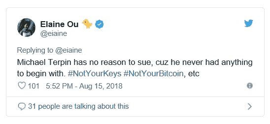

# 比特币熊的蜂蜜

> 原文：<https://medium.com/coinmonks/honey-for-the-bitcoin-bear-7bd66090d903?source=collection_archive---------4----------------------->

No bull.

“我 *t 在博弈论中是如此令人向往，它具有可转移的效用……尽管它可能不完全适用，除了大型保险公司玩的相对较小权重的个别游戏。*“约翰·纳西，[理想的金钱](http://personal.psu.edu/gjb6/nash/money.pdf)。

作为*不记名工具的比特币*在比特币熊市中较少被考虑:价格是价格，趋势是朋友；考虑到最近的价格波动，技术粥似乎不太合适。

考虑到这一点，很多人都在谈论比特币是一种*无记名工具*—**它关系到比特币将如何重获趋势动力**。

# 不是你的私人钥匙，不是你的比特币

有一种主流观点认为，如果你没有比特币的私钥(你声称拥有)，那么比特币就不是你的:

# 机构资金

> “随着华尔街加大加密货币的赌注，大型机构参与者正在围绕这一新的资产类别，并带来了自己的一系列要求。”Ian Allison，[加密保险市场总额可能达到 60 亿美元。这远远不够](https://www.coindesk.com/the-crypto-insurance-market-may-total-6-billion-thats-nowhere-near-enough)

现在有一种对话，讨论机构将如何轻松熟悉比特币和加密货币:在它们投资的其他领域，它们可以防范盗窃和其他形式的损失。

Ian Allison 在文章中指出的问题是，市场上可获得的保险金额，远远低于实际交易量和持有资产的要求。

# 不记名资产及其对比特币的重要性

> “保险对于让机构投资至关重要，因为与股票和债券不同，加密实际上是一种不记名资产。一旦小偷获得了钱包的私人钥匙，钱就不见了，就像从保险柜里偷走的现金或珠宝一样。”Ian Allison，[加密保险市场总额可能达到 60 亿美元。这远远不够](https://www.coindesk.com/the-crypto-insurance-market-may-total-6-billion-thats-nowhere-near-enough)

比特币是一种无记名资产的想法之所以被表达出来，是因为它[通常]被认为是无身份的，可以在没有银行账户或第三方的情况下使用:

但是，这里[反驳了](https://www.linkedin.com/pulse/bitcoin-digital-bearer-asset-rob-henham/)比特币是无记名资产:

> “无记名资产与标的资产之间的关系由发行人与无记名之间的承诺决定。也就是说，无记名资产是一种工具，其条款允许其持有人就基础资产向其发行人提出索赔。”Rob Henham，[比特币不是数字无记名资产](https://www.linkedin.com/pulse/bitcoin-digital-bearer-asset-rob-henham/)

现金有时被认为是无记名资产，但最容易和恰当的是当一张纸票据可兑换为基础商品或工具时。在这里，我们可以看到**比特币是资产**，而不是对基础资产本身提出权利主张的票据。

当我们考虑扩大规模时，这对比特币很重要。

# 纳什均衡

回到比特币保险问题，我们可以从这条推文中获得一些启示:

有一种观点认为，保险公司可能不会进行 BTC/本土发行，因为这需要比特币敞口，虽然这可能比直接的同行具有竞争优势，但仍会使它们及其发行的产品落后于其他持有足够多比特币的公司。

纳什均衡适用于各方不能**通过偏离其现有战略而单方面获利的情况:在这种情况下，保险公司会警惕比特币的价值超过主权表达的价值，如果纸质无记名工具(现金)没有与比特币标准类似的权利主张。**

换句话说，保险公司可能会因索赔而破产。

# 乐观的趋势

人们已经注意到，自然使用理想作为蓝图，然后[自然]趋向于[渐进地]:

还有一个回应:

# 保险发展复杂的流动性:不要犹豫

如果纳什将可转移效用理解为大型玩家之间相对较小的游戏中的优化是正确的，那么接下来的建议是，这种“理想货币”将适合高度规模化的同行——对于那些赚钱的人来说，这既是委婉的说法，也是一种讽喻。

保险的理想是多方面的:它是恢复性的、保证性的、可信赖的，并有助于从行动形式中消除怀疑、不确定性和遗憾的阴影。

这样的保险在[优化]关闭和服时。

*不是你的钥匙，不是你的比特币*的表情；相比之下变得幼稚:**考虑到社会共识和可信度——保险——金钱已经成为一种象征，如果没有这种理解，比特币就是计算机代码的无意义抽象:否则它的工作证明就毫无用处。**

因此保险的“先有鸡还是先有蛋”的问题可以用*组合图*来表达:

要投保的事件将在此播放:

这个:

还有这个:

结论: