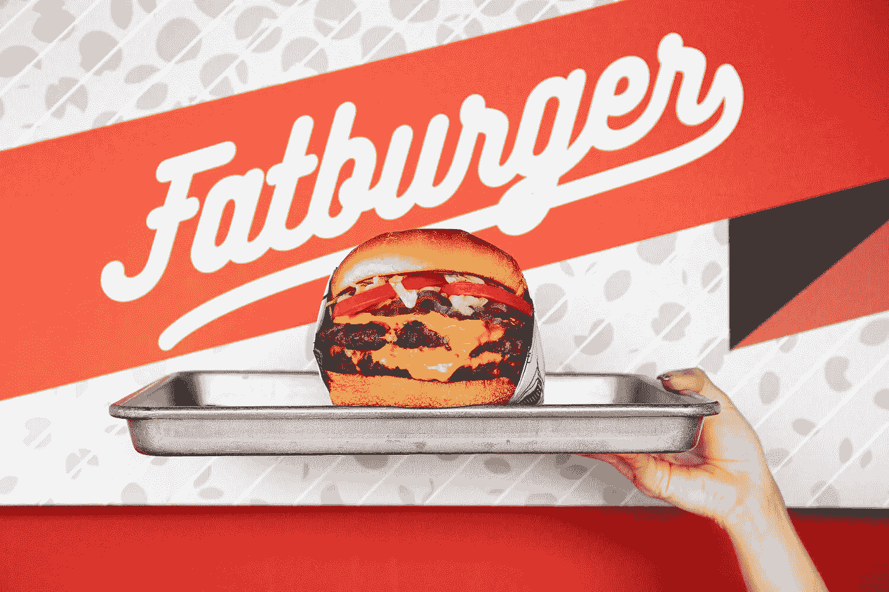
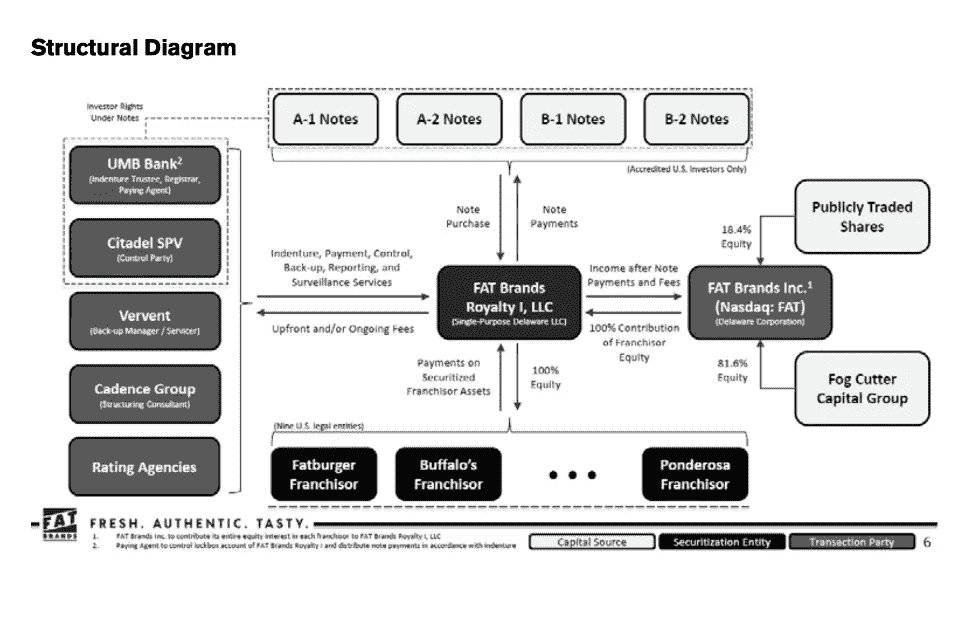

# 霍尼韦尔(Honeywell)追踪价值 10 亿美元的区块链部件/晨星(Morningstar)与 Fatburger / A16z 和比特币基地风险投资公司(Bernstein Ventures)联手打造第一只以太坊证券

> 原文：<https://medium.com/coinmonks/honeywell-tracking-1bn-parts-on-blockchain-morningstar-rates-first-ethereum-security-with-f4d5f3c72cd7?source=collection_archive---------4----------------------->

Image Source: [Fatburger & Fat Brands](https://www.fatbrands.com/fatburger)

*2020 年 3 月 11 日*

*直接进入本周的版本，再一次，一些大动作在风景中出现。在过去的一周里，随着更多细节来自* ***【微软】*******【EY】****和****ConsenSys****宣布他们的* ***基线协议*** *倡议，局面再次变得平静。* ***霍尼韦尔*** *让我们知道他们现在正在追踪价值 10 亿美元的* ***波音*** *区块链上的零部件。* ***晨星*** *费率第一以太坊证券与 4000 万美元的 Fatburger 交易。* ***勇敢的浏览器*** *现在可以在优步、亚马逊、苹果用 BAT 兑换奖励。IBTimes 发布了* [*区块链*](https://blog.coincodecap.com/tag/blockchain/) *项目&* ***公司看点*** *今年 2020 年。* ***韩国*** *通过世界上第一部全面的加密货币法律。以太坊的 ProgPoW 辩论在采矿之外升温。****A16z*******比特币基地创投*** *加入联盟在****Celo****之上打造金融 app。加更新自****token data*******HyperLedger*******地平线游戏*******CryptoKitties****【迪特尔雪莉上* [*以太坊为了了解更多信息，让你跟上时代的步伐，这里有一张本周业内热门新闻的快照。*](https://blog.coincodecap.com/tag/ethereum/)*****

*****奖金*** *:我最近发布了最新的 Q1 2020 版 my* [*区块链版图*](https://www.linkedin.com/posts/kyleellicott_q12020-blockchain-landscapekyleellicotttopionetworks-activity-6638879840634310656-UNtB) *(包含在下面供下载)，它提供了一个行业概述，突出了 900 多家全球公司、风险基金和工作组。如果这是你看到的第一个版本，就把它当作你在这个行业中进一步导航的路线图。在这里获得高分辨率的免费！***

## **📈[霍尼韦尔现在正在区块链上追踪价值 10 亿美元的波音零件](https://www.forbes.com/sites/michaeldelcastillo/2020/03/07/honeywell-is-now-tracking-1-billion-in-boeing-parts-on-a-blockchain/#6d8ba5b178bf)**

**跨国航空航天集团霍尼韦尔已经决定使用波音公司的 GoDirect 平台，这是一个区块链平台，将使用区块链技术跟踪和销售价值 10 亿美元的多余飞机部件。每个航空部件都有纸质的“出生证明”，在网上销售时，需要相当长的文件记录过程才能转让给另一个部件。有了这个新平台，供应链的各个层次被连接到一个单一的、共享的交易分类账中，该分类账透明而高效地跟踪它们的移动……[阅读更多信息](https://www.forbes.com/sites/michaeldelcastillo/2020/03/07/honeywell-is-now-tracking-1-billion-in-boeing-parts-on-a-blockchain/#6d8ba5b178bf)**

## **📖[2020 年你需要关注的区块链项目和公司](https://www.ibtimes.com/blockchain-projects-companies-you-need-watch-2020-2932457)**

**《国际商业时报》公布了 2020 年值得关注的区块链项目和公司名单。今年的名单包括 TRON、Skrill、Waves、Simplex、FortuneJack、ILCoin、普路托斯、Matic、Sinovate、Kapilendo、Wirex 和 BitHolla。每个项目都有望在 2020 年取得突破……[阅读更多](https://www.ibtimes.com/blockchain-projects-companies-you-need-watch-2020-2932457)**

## **📈晨星公司在价值 4000 万美元的 Fatburger 交易中获得第一笔以太坊证券**

****

**Source: [Forbes](https://www.forbes.com/sites/michaeldelcastillo/2020/03/08/morningstar-rates-first-ethereum-debt-security-in-40-million-fatburger-deal/#5cdd72d12abd)**

**由于向 Fatburger 注资 4000 万美元，投资评级巨头 DBRS 晨星首次对区块链(以太坊)发行的证券进行评级。虽然评级本身是基于上周五结束的传统纸质债务证券，但晨星称，由于在其评级文件中使用[以太坊](https://blog.coincodecap.com/tag/ethereum/)提高了透明度，可以更快地获得有关证券的数据，这为区块链本地更纯粹的加密资产类别铺平了道路……[阅读更多信息](https://www.forbes.com/sites/michaeldelcastillo/2020/03/08/morningstar-rates-first-ethereum-debt-security-in-40-million-fatburger-deal/#12d056492abd)**

## **📈[微软、EY 和 ConsenSys 让公共以太坊区块链对企业安全](https://www.forbes.com/sites/biserdimitrov/2020/03/04/microsoft-ey-and-consensys-to-make-the-public-ethereum-blockchain-safe-for-enterprises/#20b8d23515c9)**

**一切都将很快改变，因为区块链空间中的一些最大的参与者，如[微软](https://twitter.com/MSFTBlockchain)、 [EY](https://twitter.com/EY_US) 和 [ConsenSys](https://medium.com/u/6c7078bf7b01?source=post_page-----f004d02251e7----------------------) 正在以他们称为[基线协议](https://consensys.net/blog/press-release/ey-and-consensys-announce-formation-of-baseline-protocol-initiative-to-make-ethereum-mainnet-safe-and-effective-for-enterprises/)的倡议与区块链公共以太坊展开较量。这是该领域的一个重大发展，因为该倡议采取了与以前完全不同的方法。过去，企业大多将区块链网络视为一个结算层，一个存储其交易最终状态的地方……[阅读更多](https://www.forbes.com/sites/biserdimitrov/2020/03/04/microsoft-ey-and-consensys-to-make-the-public-ethereum-blockchain-safe-for-enterprises/#20b8d23515c9) &查看更多作者 [Biser Dimitrov](https://medium.com/u/f91a4cb3fbb7?source=post_page-----f004d02251e7----------------------)**

## **📈[勇敢浏览器现在可以在优步、亚马逊和苹果兑换 BAT 的奖励](https://cryptoslate.com/brave-browser-can-now-redeem-bat-for-rewards-at-uber-amazon-and-apple/)**

**由于该公司与 TAP 网络的合作，Brave 桌面浏览器的用户很快就可以将他们的 BAT 兑换成现实世界的奖励。根据 CryptoSlate 分享的一份公告，通过 Brave 的奖励计划获得的所有 BAT 都可以兑换成数百个国家品牌的礼品卡，包括美国航空公司、Hotels.com、优步、星巴克、亚马逊、苹果和沃尔玛。… [阅读更多](https://cryptoslate.com/brave-browser-can-now-redeem-bat-for-rewards-at-uber-amazon-and-apple/)**

## **📈 [Arweave 的 permaweb 停止冠状病毒审查，募集 800 万美元](https://techcrunch.com/2020/03/05/coronavirus-censorship-arweave/)**

**Arweave 的 perma web([Arweave 项目](https://medium.com/u/6dc77d82a3ce?source=post_page-----f4d5f3c72cd7--------------------------------))停止了对来自微博等应用的冠状病毒的审查，并从安德森·霍洛维茨(Andreessen Horowitz)、联合广场风险投资公司(Union Square Ventures)、比特币基地风险投资公司获得了 830 万美元的资金。该公司向投资者出售其区块链代币，而不是提供传统的股权来换取现金。此外，该公司还推出了 Arweave Boost，为试图建立在 permaweb 上的初创公司和项目提供价值 5 万美元的免费存储空间……[阅读更多信息](https://cointelegraph.com/news/privacy-study-brave-browser-smacks-down-chrome-firefox-safari)**

## **📖[福布斯区块链 50 大数据深潜](/blockdata/forbes-blockchain-50-data-deep-dive-117fc230822f)**

**团队 [BLOCKDATA](https://medium.com/u/279c07ad0b4d?source=post_page-----f4d5f3c72cd7--------------------------------) 花时间为我们提供了福布斯最新区块链 50 强的完整细分，以获取今年榜单上最受欢迎的用例和开发平台的所有见解。与去年的榜单相比，24 家公司加入了去年的榜单，包括通用电气(General Electric)、路威酩轩集团(LVMH)、怡安集团(Aon)，以及中国科技巨头百度和腾讯。未列入今年榜单的著名公司，甲骨文、大都会人寿、Visa、马士基和许多其他公司……[阅读更多](/blockdata/forbes-blockchain-50-data-deep-dive-117fc230822f)**

> **下周，也就是 3 月 18 日星期三，🎙️将和我一起主持一个 AMA 会议，我将和 [Provable Things](https://medium.com/u/a41c4fa08481?source=post_page-----f4d5f3c72cd7--------------------------------) 的 [Thomas Bertani](https://medium.com/u/702eafcd79eb?source=post_page-----f4d5f3c72cd7--------------------------------) 一起参加。[敬请期待](https://twitter.com/EOSDT/status/1237654430163578880)！**

## **📖[韩国通过了世界上第一部全面的加密货币法律](https://ncfacanada.org/south-korea-passes-one-of-the-worlds-first-comprehensive-crypto-laws/)**

**韩国国会通过了新的法规，将提供一个框架以及加密货币和交易所的合法化。新法将授权韩国金融监管机构有效监管这一新兴行业，并围绕反洗钱等程序制定规则。通过[加密货币](https://blog.coincodecap.com/tag/cryptocurrency/)立法是韩国创业生态系统的胜利……[阅读更多](https://ncfacanada.org/south-korea-passes-one-of-the-worlds-first-comprehensive-crypto-laws/)**

## **📖[英国初创公司将海地农民和他们的作物放在区块链上](https://cointelegraph.com/news/uk-startup-puts-haitian-farmers-and-their-crops-on-the-blockchain)**

**总部位于英国的区块链机构 Agriledger 宣布为海地农民建立区块链生态系统，在提升销售的同时，使供应链更加清晰。方法是为农民创造贸易和金融机会，确保他们从他们的作物中获得足够的报酬。该公司计划建立一个软件即服务(SaaS)平台，供应商和零售商可以在该平台上进行互动……[阅读更多信息](https://cointelegraph.com/news/uk-startup-puts-haitian-farmers-and-their-crops-on-the-blockchain)**

# **本周的更多内容:**

**📈 [9 位女性正在通过](/shapeshift-stories/8-women-who-are-redefining-crypto-blockchain-tech-38fccbce7a8e) [ShapeShift](https://medium.com/u/5ee4b8323e7a?source=post_page-----f4d5f3c72cd7--------------------------------) 重新定义密码&区块链技术**

**📈[区块链上的蛮战](https://research.tokendata.io/2019/11/24/barbarians-on-the-blockchain/) by [TokenData](https://medium.com/u/624e32513002?source=post_page-----f4d5f3c72cd7--------------------------------)**

**📈[老对手甲骨文和 IBM 希望他们的区块链互相对话](https://www.coindesk.com/old-rivals-oracle-and-ibm-want-their-blockchains-to-talk-to-each-other)**

**📖[多伦多医院的一项试验允许患者查看自己的医疗记录，并控制其他人是否也能看到这些记录](https://www.thestar.com/business/2020/03/04/toronto-hospital-trial-looks-at-allowing-patients-to-see-all-their-records-and-control-who-else-sees-them-too.html)**

**📖[三星瞄准欧盟支付行业，为银行提供基于区块链的解决方案——coin desk](https://www.coindesk.com/samsung-is-working-on-a-blockchain-based-payments-solution-for-banks-and-merchants)**

**📖[沃尔玛和其他 7 家公司加入合作区块链集团 Hyperledger](https://bitcoinexchangeguide.com/walmart-and-7-other-companies-join-collaborative-blockchain-group-hyperledger/)**

**📖[火币开源 DeFi 区块链现已上线公测](https://cointelegraph.com/news/huobi-open-source-defi-blockchain-now-live-for-public-beta-testing)**

**📖[范式实验室关闭，称 DeFi 热潮“为时过早”](https://www.coindesk.com/paradigm-labs-shuts-down-says-it-was-too-early-for-defi-boom)**

**📖 [DeFi 只在以太坊上？由](/defi-world/defi-only-on-ethereum-projects-on-other-blockchains-f6e2cfeea877) [DeFi.cx 人员](https://medium.com/u/2d63278ab31c?source=post_page-----f4d5f3c72cd7--------------------------------)在其他区块链上的项目**

**📖[2020 年的地平线](/horizongames/on-the-horizon-for-2020-bd76c7c3b8e0)作者[彼得·基尔蒂卡](https://medium.com/u/1e4a94b1ba96?source=post_page-----f4d5f3c72cd7--------------------------------)**

# **分散式应用程序手表**

## **📖以太坊的 ProgPoW 辩论不仅仅是关于采矿**

**当以太坊改进提案(EIP) 1057 向前推进时，以太坊上的渐进工作证明(ProgPoW)辩论在周五着火，这让大以太坊世界的许多人感到惊讶，以至于维塔利克·布特林自己称之为“忍者重新批准”当矿工之间没有就哪个链导致链中分裂达成共识时，就会发生分叉(再次)类似于 2016 年的 DAO hack，这导致了以太坊经典(ETC)的创建。如果开发者是以太坊不情愿的立法者，那么矿工就是它分布式的、分散的执行分支……[阅读更多](https://www.coindesk.com/ethereums-progpow-debate-is-about-much-more-than-mining)**

## **📖【CryptoKitties 背后的团队离离开以太坊又近了一步**

**CryptoKitties 背后的公司 Dapper Labs 正在几家初创公司中寻找建立协议，以取代以太坊作为各种应用程序选择的[区块链](https://blog.coincodecap.com/tag/blockchain/)。Dapper Labs 放弃使用以太坊的母语 Solidity 的原因不仅仅是规模限制；但也限制了您使用智能合约的能力。此外，该团队希望使用一个更加“面向消费者”的平台，能够在不堵塞网络的情况下处理游戏量……[阅读更多信息](https://www.coindesk.com/the-team-behind-cryptokitties-is-one-step-closer-to-leaving-ethereum)**

## **📖[超越共识的赌注:分散的数字劳动力市场](https://www.theblockcrypto.com/post/56263/staking-beyond-consensus-decentralized-digital-labor-markets)**

**赌注已经找到了自己的身份，即由一些区块链提供的近乎无风险的收益，这种收益吸引长期持有，并以比替代方案更具成本效益和能效的方式实现分布式共识。尽管将赌注理解为区块链式的突破，有可能显著降低甚至消除劳动力市场对信任的需求，但这已经成为规模扩大的最大限制因素之一。但是，通过消除这种对信任的需求，赌注可以实现前所未有的全球规模的去中心化数字劳动力市场……[阅读更多](https://www.theblockcrypto.com/post/56263/staking-beyond-consensus-decentralized-digital-labor-markets)**

**📖 [A16z，比特币基地风投加入联盟，在 Celo 区块链的基础上开发金融应用](https://www.theblockcrypto.com/post/58401/a16z-coinbase-ventures-join-an-alliance-to-build-financial-apps-on-top-of-celo-blockchain)**

**📖[首个阿拉伯 AI 和基于区块链的 eKYC 即服务“Meen。世界”和“AnaMeen”验证的数字身份应用程序在约旦推出](https://www.linkedin.com/pulse/first-arab-ai-blockchain-based-ekyc-as-a-service-anameen-al-karmi/?trackingId=6ZUfE%2FjN8DkDvG7lTGl3KQ%3D%3D)**

**📖 [CryptoKitties 的迪特·雪莉关于破解以太坊和 NFTs](https://cointelegraph.com/news/cryptokitties-dieter-shirley-on-breaking-ethereum-and-nfts)**

**📖[更快、更便宜、更安全的 Dapp 接入](/argenthq/faster-cheaper-and-safer-dapp-access-70057611ed46)作者[马修·赖特](https://medium.com/u/d2ca4399e666?source=post_page-----f4d5f3c72cd7--------------------------------)**

# **🚨区块链行业状况 Q1 2020:**

***现已上市，下载你的高清副本****Q1 2020****版* [*区块链景观图*](https://www.linkedin.com/posts/kyleellicott_q12020-blockchain-landscapekyleellicotttopionetworks-activity-6638879840634310656-UNtB) *。这是我发布的第五版景观，包括 747 家***公司(* ***900 多家独特公司*** *包括更广泛的关键生态系统参与者)和超过***220 亿美元的资金，从 2010 年到 2020 年在整个景观中筹集，自 2010 年以来投资超过 180 亿美元—出现明显的循环，并有完整的分解。*****

***一个完整的 60 分钟的景观概述视频现在可以在这里***免费获得。在视频中，我对 2020 年的前景进行了细分，提供了 2019 年的总结、2020 年的新兴趋势、DeFi、Libra、CDBCs、Stablecoins、DApps 等等！****

****

**Source: [Topio Networks](https://www.topionetworks.com/markets/blockchain-landscape-5bf43854b9abe4633c1f87da)**

> ***👉下载新的* [*区块链基础设施景观 Q1 2020*](https://s3.amazonaws.com/spoke-profiles-prod-assets/uploads/d21d960161f92e629f68bf78b3d148743e4b3f49/original/Blockchain_Landscape_Q1_Feb2020_KyleEllicott.pdf?utm_source=pdf&utm_medium=email&utm_campaign=kyle) *版，了解关于 DeFi、DApps、基础设施、数字货币等的见解！***
> 
> **[直接在您的收件箱中获得最佳软件交易](https://coincodecap.com/?utm_source=coinmonks)**

****

**不想等到下周，[现在就订阅](http://click1.m.readwritelabs.com/xsdqkbbrgsdtqkmntpjlstcnkytvpvphsnhsqlvbrhhd_yfqbfcmslnskglmckvqv.html?source=post_page---------------------------)📥有关区块链、DApps 等的实时行业见解！**