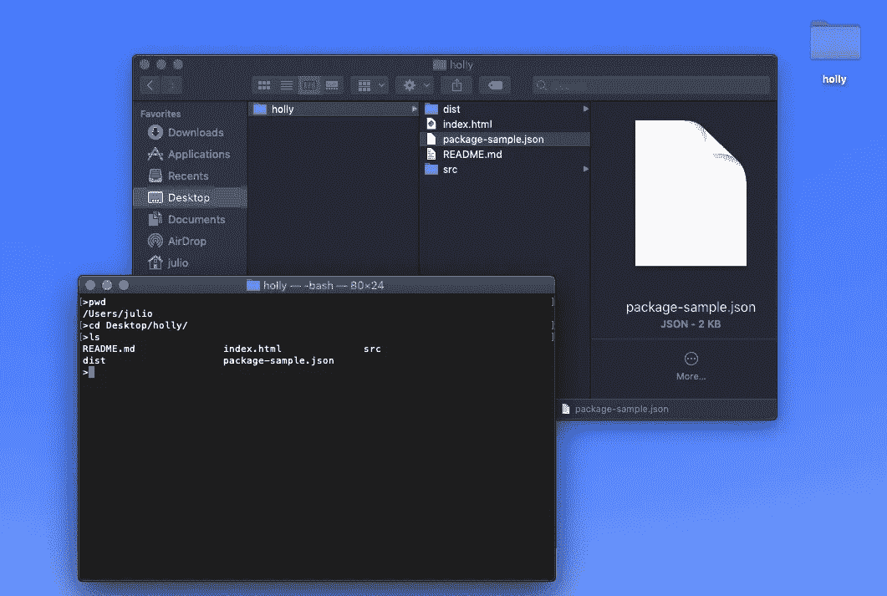
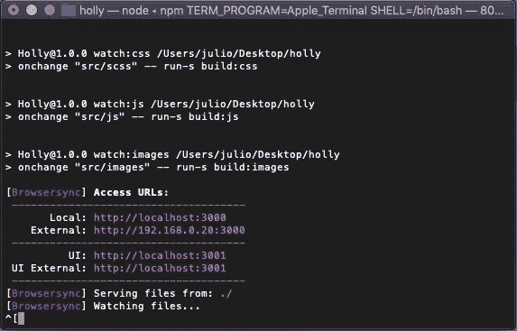
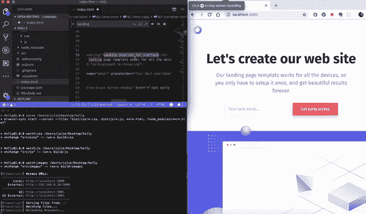
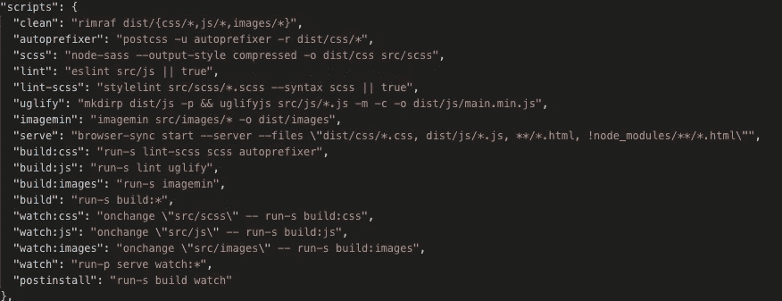
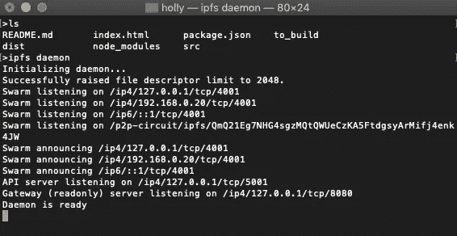
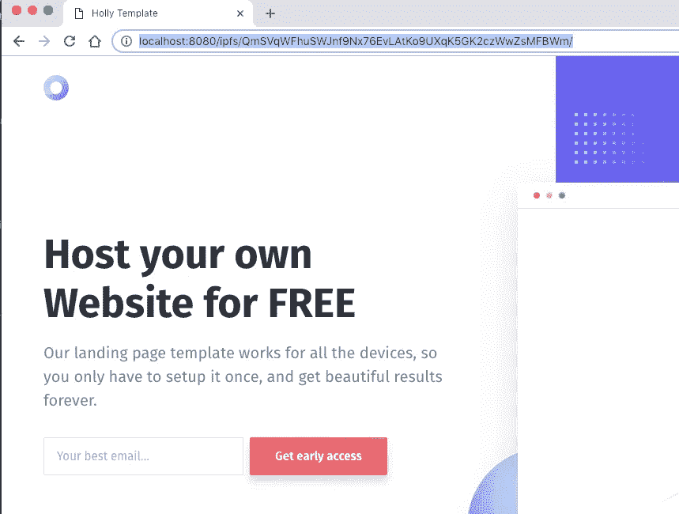

# 免费托管自己的网站

> 原文：<https://medium.com/coinmonks/host-your-own-website-for-free-bf7c10d61e56?source=collection_archive---------3----------------------->


Host your own Website for FREE

这是一个你如何将 [IPFS:星际文件系统](https://siminars.com/153565739127704226318098/summary.sv)用于网站的例子。*IPFS 网站托管指南，同时学习使用 node.js 和模板。*

你需要一些关于网页设计和网页编程的基本知识和理解，然而在阅读这篇文章的同时，我将帮助你在 IPFS 网络中部署你的解决方案，由**免费**。

## 网页代码

为了简单起见，我使用了一个简单的登陆页面模板，你可以在这里找到。我做了一些基本的定制，但总的来说是同一个页面。


Single Page Template

这个模板取自 cruip.com。Cruip 是一个为初创公司提供免费 HTML 登录页面的图库。他们的目标是用高质量的模板帮助制造商和早期创业公司提高他们下一个大项目的设计标准。

如果你正在寻找模板定制，或者如果你正在考虑一个全新的登陆页面，你可以联系他们在 hello@cruip.com，他们会很乐意帮助。

## 我还是想自己做，怎么用那些模板？

这些是节点项目，我们的想法是将其用作您的基础模板，您应该阅读并遵循 README.md 文件中的说明，我将在本文中记录并扩展该文件，因此首先，确保 **node.js & npm 都安装了****。如果没有，请从 [***本页***](https://nodejs.org/en/download/package-manager/)*中选择您的操作系统和安装方法，并按照说明进行操作。***

***接下来，使用命令行进入项目目录。***

******

***using command line to enter the project directory***

***该模板附带了一个名为' **package-sample.json** '的现成包文件。您只需要将其重命名为' **package.json** '，然后运行' ***npm install*** '将所有依赖项安装到您的项目中。***

> ***> mv package-sample . JSON package . JSON
> >NPM 安装***

******

***terminal running the project***

***你已经准备好了！安装脚本将运行` ***npm 运行观察*** `。它将启动一个新的服务器，打开一个浏览器，并在“src”目录中观察任何 SCSS 或 JS 的变化；一旦它编译了这些更改，浏览器将自动注入更改的文件！***

******

***Changed files being automatically injected on the browser***

***通过键入“npm run task ”(其中“task”是“scripts”对象中任务的名称)来运行任何任务。***

******

***scripts object***

> ***如果你在这里迷路了，我建议你去看看这个+15 分钟的[node . js](https://nodejs.org)from[Victor of oegbu](https://codeburst.io/@vick_onrails)
> [https://code burst . io/the-only-nodejs-introduction-youll-ever-need-d 969 a47e f 219](https://codeburst.io/the-only-nodejs-introduction-youll-ever-need-d969a47ef219)***

# *****准备在网上发布？*****

***取 ***dist/css/*。css*** ， ***dist/js/*js*T20**和 ***/*。html* 和**文件并复制到另一个准备部署的目录下。*****

```
***>ls** README.md index.html package.json
dist  node_modules src
**>mkdir to_build
>cp index.html to_build/
>cp -R dist to_build/
>ls to_build/** dist  index.html*
```

> ***提示:您可以通过更改 *package.json* 文件来直接定制部署位置***

***现在让我们把这个 ***添加到 _build*** 文件夹中，我们的站点在 IPFS。这个挺简单的！只需打开您的守护进程:***

```
***>ipfs daemon***
```

******

***ipfs daemon running***

> ***警告:你需要在你的电脑上安装 IPFS！你可以在这里上我的**免费**IPFS 安装和基础[课程。另外，你可以按照 https://docs.ipfs.io/introduction/install/ IPFS 安装页面上的安装说明进行操作:](https://siminars.com/153565739127704226318098/summary.sv)***

***并添加包含您的网站的目录:***

```
***>ls to_build/**
dist  index.html
**>ipfs add -r to_build**added QmdWEyh4V6XpiD42Gk4zJmjsjuzoGDYhpqmB4ww6dpLf5g to_build/dist/css/style.cssadded QmQT78zwo9iVVRHa4yAPhcT674ni4TLwZoWwn8GNnfx7J4 to_build/dist/js/main.min.jsadded QmeVLhqpN6XYf767Kkzwg51b4RvHi9AjcwQQWnCCDornf1 to_build/index.htmladded QmXHyR5AK9t74iTckEQP3kU2GCeN34f4D1g28PysD7WreQ to_build/dist/cssadded QmTTqN4iQ2EkqQbCyuWnxC1bEiZgRkNn7xTc2SanphsT31 to_build/dist/jsadded QmaqSpPkRcdPhuaAtxpSDR8pyU9bgn3AxGPtgQ7kDYbH7s to_build/distadded **QmSVqWFhuSWJnf9Nx76EvLAtKo9UXqK5GK2czWwZsMFBWm** to_build78.86 KiB / 79.29 KiB [===============================================]  99.45%>*
```

***文件夹名旁边的最后一个散列是您想要的，现在我们称它为`$SITE_HASH`。***

```
***$SITE_HASH =** **QmSVqWFhuSWJnf9Nx76EvLAtKo9UXqK5GK2czWwZsMFBWm***
```

***现在，您可以在 web 浏览器中打开`**http://localhost:8080/ipfs/$SITE_HASH**`进行本地测试！***

******

***[http://localhost:8080/ipfs/QmSVqWFhuSWJnf9Nx76EvLAtKo9UXqK5GK2czWwZsMFBWm/](http://localhost:8080/ipfs/QmSVqWFhuSWJnf9Nx76EvLAtKo9UXqK5GK2czWwZsMFBWm/)***

***接下来，要查看它来自另一个 ipfs 节点，您可以尝试`**http://gateway.ipfs.io/ipfs/$SITE_HASH**`。***

## ***所以现在你有了一个由 IPFS 网络免费托管的网站，一旦你对这个工具更加熟悉，你就会开始跳出框框思考，并把它包含在你自己的项目中。***

> ***注意:根据网络状态，`curl`可能需要一段时间。公共网关可能过载或很难联系到您。***

# ***摆脱 IPFS 的混乱***

***如果你读到这里，你现在已经在 IPFS 网络上免费发布了你的网站。很酷，对吧？但是 URL 上的那些散列是相当难看的。让我们来看看**一些**摆脱它们的方法。有很多解决方案可以解决这个问题，包括网址缩写和类似的东西。但是目前，最简单的解决方案之一是在你控制的域名上使用 DNS `TXT`记录。***

***所以，你可以做一个简单的 [DNS TXT](https://en.wikipedia.org/wiki/TXT_record) 记录，包含`dnslink=/ipfs/$SITE_HASH`。只需转到您的域名的 DNS 设置，并找到在哪里添加一个 TXT 记录。在内容中，你应该写`dnslink=/ipfs/<your hash here>`或`dnslink=/ipns/<your hash here>`，这取决于你用的是什么。***

***一旦记录传播，你应该可以在`http://localhost:8080/ipns/your.domain`看到你的网站。这就干净多了。您也可以在`[http://gateway.ipfs.io/ipns/your.domain](http://gateway.ipfs.io/ipns/your.domain)`的网关上尝试此功能***

## ***更新页面***

***接下来，你可能会问“如果我想改变我的网站，DNS 很慢！”好吧，让我告诉你这个叫做 IP **N** S(注意“N”)的小东西。IPNS 是*星际命名系统*，你可能已经注意到上面的链接有`/ipns/`而不是`/ipfs/`。Ipns 用于 ipfs 网络中的可变内容，它相对容易使用，并允许您更改您的网站，而无需每次更新 dns 记录！那么怎么用呢？***

***添加网页后，只需:***

```
***>ipfs name publish $SITE_HASH**
Published to <your peer id>: /ipfs/$SITE_HASH*
```

> ***(免责声明:当使用 IPNS 更新网站时，重要的是要考虑到在更新您的网站时，资产可能会从两个不同的解析散列中加载，除非说明原因，否则会导致资产过时/丢失)***

***现在，您可以通过查看:`http://localhost:8080/ipns/<your peer id>`来测试它是否工作。并在公共网关上尝试相同的链接。一旦你确信这是可行的，让我们再次隐藏散列。将您的 DNS TXT 记录改为`dnslink=/ipns/<your peer id>`，等待该记录传播，然后尝试访问`[http://localhost:8080/ipns/your.domain](http://localhost:8080/ipns/your.domain.)` [。](http://localhost:8080/ipns/your.domain.)***

***将网站当前版本发布到 IPNS 时:***

```
***>ipfs name publish QmSVqWFhuSWJnf9Nx76EvLAtKo9UXqK5GK2czWwZsMFBWm**Published to QmQ21Eg7NHG4sgzMQtQWUeCzKA5FtdgsyArMifj4enk4JW: /ipfs/QmSVqWFhuSWJnf9Nx76EvLAtKo9UXqK5GK2czWwZsMFBWm*
```

***这将返回您的 peerID(*qmq 21 eg nhg 4 sgzmqtqwueczka 5 ftdgsyarmifj 4 enk 4 jw*)和您要发布到 peerID 的散列。您可以通过运行以下命令进行确认***

```
*ipfs name resolve <peerID>*
```

***之后——你可以通过链接访问网站的发布版本:https://ipfs.io/**ipns**/<peerID>***

## ***使用您自己的域名***

***此时，您已经有了一个关于 ipfs/ipns 的网站，并且您可能想知道如何在`http://your.domain`公开它，以便今天的互联网用户也可以访问它，而不必知道这些。实际上**做**非常简单，你所需要的只是你之前创建的 TXT 记录，并把`your.domain`的 A 记录指向一个 ipfs 守护进程的 IP 地址，该守护进程监听端口 80 上的 HTTP 请求(比如`gateway.ipfs.io`)。用户的浏览器将在请求的主机头中发送`your.domain`，并且您有您的 dnslink TXT 记录，因此 ipfs 网关将把`your.domain`识别为 IPNS 名称，因此它将在`/ipns/your.domain/`下而不是`/`下提供服务。***

***因此，如果您将`your.domain`的记录指向`gateway.ipfs.io`的 IP，然后等待 DNS 传播，那么任何人都应该能够访问您的 ipfs 托管的站点，而不需要任何额外的配置，只需在`[http://your.domain](http://your.domain.)` [。](http://your.domain.)***

***或者，可以使用 CNAME 记录指向网关的 DNS 记录。这样，网关的 IP 地址会自动更新。然而，请注意，CNAME 记录不允许其他记录，例如引用 ipfs/ipns 记录的 TXT。因此，ipfs 允许使用`dnslink=/ipns/<yourpeer id>`为`_dnslink.your.domain`创建一个 DNS TXT 记录。***

***因此，通过为`your.domain`到`gateway.ipfs.io`创建一个 CNAME，并添加一个带有`dnslink=/ipns/<your peer id>`的`_dnslink.your.domain`记录，您就可以托管您的网站，而无需明确引用 ipfs 网关的 IP 地址。***

> ***[直接在您的收件箱中获得最佳软件交易](https://coincodecap.com/?utm_source=coinmonks)***

***[](https://coincodecap.com/?utm_source=coinmonks)***