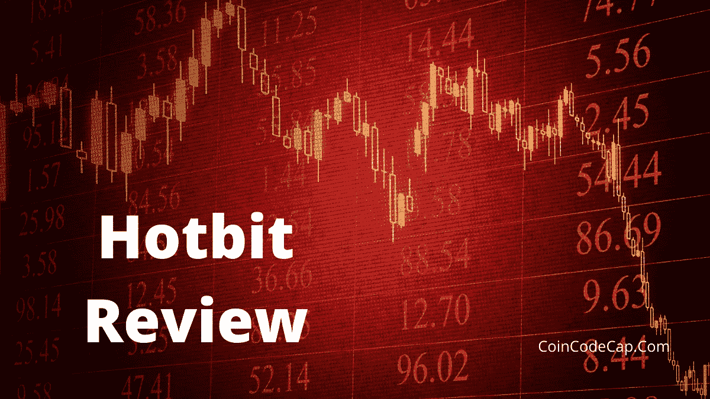
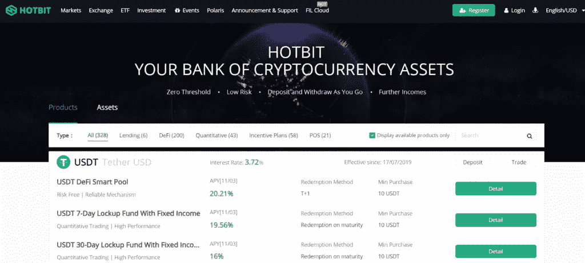

# Hotbit Review 2021 |在此交易所创建订单即可获得报酬

> 原文：<https://medium.com/coinmonks/hotbit-review-cd5bec41dafb?source=collection_archive---------1----------------------->

选择加密货币交易平台是一项具有挑战性的任务。你必须考虑许多因素，如交易对、易用性、安全性、图表功能、费用、客户支持、存款方式等等。[**Hotbit**](https://blog.coincodecap.com/go/hotbit) 解决了所有这些问题，因为它为来自世界各地的所有用户提供了一个最先进的交易平台。

在每篇评论中，我们都试图为您提供最新的信息，对于 [**Hotbit**](https://blog.coincodecap.com/go/hotbit) 评论文章也是如此。但是，我们强烈建议您访问 [Hotbit 网站](https://blog.coincodecap.com/go/hotbit)，了解未来可能发生的最新变化。

# 热点概述

[Hotbit](https://blog.coincodecap.com/go/hotbit) 是一个[加密货币交易所](https://blog.coincodecap.com/go/crypto-exchange)平台，于 2018 年 1 月上线。[**hot bit exchange**](https://blog.coincodecap.com/go/hotbit)在香港和爱沙尼亚注册。他们的核心成员来自中国、美国和台湾。

据 Hotbit 网站报道，他们与 Blockchainers、Wandarin 和 MyToken 有合作关系。美国投资者没有资格在这里交易，因为他们的国家政策。

总的来说， [Hotbit](https://blog.coincodecap.com/go/hotbit) 以其 4 个独特的卖点吸引用户。这些包括多币种支持、高流动性、24 小时客户支持和安全性。

# Hotbit 回顾:总结(TL；博士)

*   它是一个面向全球用户的平台，拥有超过 150 万用户。
*   Hotbit 的做市商费用为负(-0.05%)，这意味着你可以通过增加订单的流动性获得报酬。
*   你可以用大约 156 个密码对和各种各样的备用硬币进行交易。
*   它有先进的交易功能和图表工具。
*   该交易所平台的移动交易应用程序适用于 Android 和 iOS 设备。
*   根据上市的加密货币项目类型数量，它此前在所有交易所中排名第三。

# 如何入门 Hotbit？

以下是开始使用 [Hotbit](https://blog.coincodecap.com/go/hotbit) 的步骤。

## 第一步:注册你的账户

您需要访问 [Hotbit](https://www.hotbit.io/register) 的网站进行注册。在右上角，您会看到注册选项。点击它，你将进入注册过程。

## 步骤 2:电子邮件验证

输入您的电子邮件 id，然后点击发送按钮。点击后，您将在您的电子邮件 id 上收到一封确认邮件。复制您在电子邮件中获得的代码，并将其粘贴到下面的框中的验证码上。

现在，您必须输入密码并选中“我同意条款和政策”框填写详细信息后，单击注册选项。

## 第三步:登录你的账户

[**Hotbit 登录**](https://blog.coincodecap.com/go/hotbit) 流程简单。点击右上角的“登录”按钮。输入您的电子邮件 id 和密码，然后点击登录。

**注意:**如果你想用你的电话号码注册，你必须按照同样的步骤进行短信验证。代替电子邮件，你必须输入你的电话号码和你的国家代码。

# 热门费用

了解特定网站的交易、存款和取款费用是在[最佳加密交易平台](https://blog.coincodecap.com/crypto-exchange)中寻找的另一个因素。所以，下面是 Hotbit 的费用明细。

## 热门交易费

[**热门**](https://blog.coincodecap.com/go/hotbit) **买卖双方的交易费用**差别很大。接受者必须支付的费用是订单价值的 0.20%。接受者的交易费用大致符合行业标准的平均值。然而，你会很高兴地知道，如果你是一个制造商，那么你做交易是有报酬的。你没听错，做市商的交易费是 **-0.05%** ，这意味着你获得了为订单簿增加流动性的奖励。这将鼓励所有的交易者加入这个平台。

## 热门存款费用

存款仅适用于 22 种不同的加密货币。最棒的是， [**Hotbit**](https://blog.coincodecap.com/go/hotbit) 不向平台收取任何押金一分钱。但是，您仍然需要支付标准的区块链交易费。

## Hotbit 取款费

**Hotbit 取款**费用与加密货币的类型不同。USDT、BTC 和 ETH 等主要代币的取款费为 2 USDT、0.001 BTC 和 0.01 ETH。与行业标准相比，这个数量相对较高。但同时，与其他交易所相比，这一数额是合理的。你可以在这里访问他们的[网站](https://www.hotbit.io/rate)，了解详细的费用结构。

# 热门评论:存款和取款方法

这家交易所不存任何法定货币。这意味着新的密码投资者不能在这里交易，因为要购买你的密码，你需要一个入门级的交易所，你可以为此选择[币安](https://blog.coincodecap.com/go/binance)。该平台还向其用户提供以前的存款和取款记录。

# Hotbit 杠杆 ETF

Hotbit 的杠杆交易所交易基金是有价证券，它使用金融衍生品和债务来放大特定的象征性回报。而传统的交易所交易基金只是一对一地跟踪证券。因此，对于超过基础指数的显著收益，个人更喜欢它，因为他们的目标是 2:1 或 3:1 的比率。Hotbit 杠杆 ETF 提供了许多优势，如没有清算风险，因为价格不会接近零。还有，有了 [**Hotbit**](https://blog.coincodecap.com/go/hotbit) ，投资者可以随时买卖，没有任何保证金。

# 热门投资

[**Hotbit**](https://blog.coincodecap.com/go/hotbit) 定投于 2019 年 10 月 10 日上线，首批只有四个代币，分别是 BTC、ETH、ATOM、PCX。目前，许多其他令牌可供用户使用。这四种代币属于永久投资产品，没有投资时间和期限要求。 [**Hotbit**](https://blog.coincodecap.com/go/hotbit) 还在致力于推出更多其他有效期的此类产品。要进入定期投资界面，点击[此处](https://www.hotbit.io/invest)。

# 热点流动性

自 2018 年开始， [**Hotbit**](https://blog.coincodecap.com/go/hotbit) 一直在不断增长。根据 [Coinmarketcap](https://coinmarketcap.com/exchanges/hotbit/) 的数据，2018 年，Hotbit 的 24 小时交易量排名第 47 位。当时的交易量约为 2100 万美元。它并没有就此停止。

2019 年 11 月 26 日，与前一年相比，它的推动作用更大。2019 年 hot bit 24 小时交易额 10 亿美元，排名升至第 13 位。

不仅如此，即使在 2020 年疫情期间，交易量也持续上升至 23 亿美元，升至第 6 位。这个增量的进度非常可观，也证明了流动性不是这个交易所的问题。

# Hotbit 移动应用

Hotbit exchange 平台同时提供 [Android](https://play.google.com/store/apps/details?id=io.hotbit.shouyi) 和 iOS 应用。你可以直接从 Google play 商店下载 Android 手机应用程序。但是，对于 iOS 上的 **Hotbit app，你在 App store 上是找不到的。iOS 用户要从二维码下载安装，二维码链接的是 [**Hotbit 网站**](https://blog.coincodecap.com/go/hotbit) 。建议使用该网站，因为移动应用程序仍在开发中，评论是负面的，指出了取款和其他功能期间的问题。**

# 热点令牌(HTB)

这个 **Hotbit 币**是 [Hotbit 平台](https://blog.coincodecap.com/go/hotbit)的加密货币。在很多情况下，交换会奖励你 HTB，你必须使用它。根据来自 [Coinranking](https://coinranking.com/coin/uQJB8Ocu8lTb+hotbittoken-htb) 的最新信息，1 HTB 的现值为 0.01045 美元。比特币方面，其价值为 0.000000186 BTC，在其余加密货币中排名为 10295。

# 热点评论:安全性

如上所述，安全性是 [Hotbit 平台](https://blog.coincodecap.com/go/hotbit)出名的主要因素之一。它有一个内部安全审计团队，提供 24 小时实时在线审计服务。据 [Hotbit](https://blog.coincodecap.com/go/hotbit) 报道，他们已经与两家最有影响力的审计团队建立了战略合作关系。这两个团队包括 SlowMist 和 Beosin。他们不断进行测试和观察，以检测任何导致问题的威胁，并尽快解决它们。

为了保证用户账户和数据的安全，它提供了多种保护方式。以下是用户可以从安全设置中启用的功能:

**邮件验证:**在 **Hotbit 邮件验证**的这一功能下，您可以随时启用。我们将向您发送一封电子邮件，确认您的退出。

**短信验证:**用户可以对新的登录、取款、API 管理、密码修改进行短信验证。

**2FA:** 这是大多数[加密交易所](https://blog.coincodecap.com/go/crypto-exchange)更喜欢的一般账户保护。它涉及到使用单独的设备每隔几秒钟生成一个独特的代码。用户必须输入这个唯一的代码才能登录。

# 热门评论:客户支持

Hotbit 客户支持最大的好处之一就是用户可以通过多种方式与他们取得联系。然而，主要和常见的媒体是通过支持[票务系统](https://hotbit.zendesk.com/hc/en-us)。你也可以通过他们单独的微信群、官方[推特](https://twitter.com/Hotbit_news)账号、官方中英文[电报渠道](https://t.me/Hotbit_English)、官方[脸书账号](https://www.facebook.com/hotbitexchange)直接联系他们。这个事实说明 Hotbit 确实关心客户，愿意随时帮助客户。

# 热门评论:利弊

## 赞成的意见

*   这一交换平台在 170 个国家提供服务，拥有超过 150 万用户。
*   超过 150 个密码对可供您交易。
*   它还支持多种语言。
*   登录、取款或存款等任何活动都不需要 KYC。
*   **Hotbit exchange app** 也可供用户随时在线交易。

## 骗局

*   它不支持美国客户。
*   [保证金交易](https://blog.coincodecap.com/go/margin-trading)不可用。

# 热点评论:结论

[**Hotbit**](https://blog.coincodecap.com/go/hotbit) 还是一个新的[加密货币交易所](https://blog.coincodecap.com/go/crypto-exchange)平台，在过去三年以指数级的速度增长。这位热门人物从第 50 位升至第 4 位，成绩斐然。这表明该平台为增加满足当今客户需求的产品所做的努力是合理的。所以是一个安全性高，收费合理的体面平台。作为尾注，我们建议您启用 2FA 安全选项，您可以在这里开始交易。

# 常见问题

**hot bit 合法吗？**

Hotbit [加密货币交易所](https://blog.coincodecap.com/go/crypto-exchange)看起来确实是一个合法网站。它拥有来自大约 170 个国家的 150 万注册用户。不仅如此，就日交易量而言，Hotbit 已成为全球增长最快的交易所之一。这证明不是假的。

**Hotbit 需要 KYC 吗？**

不需要，**热位 KYC** 。您可以注册您的帐户，交易，存款，或提取资金，而不需要 KYC。

**什么时候需要提供 KYC？**

Hotbit 关注安全性，并对违反安全性的行为采取严厉措施。如果系统确认任何用户制造了高风险，它将要求该用户出于安全目的完成 KYC。

**什么样的钱包支持 HTB？**

HTB 或 Hotbit 令牌属于 ERC20 令牌。imToken wallet 和 MyEtherWallet 都支持该令牌。

*   [CoinDCX 评论 2021 |安全吗？【必读】](https://blog.coincodecap.com/coindcx-review)
*   [2021 年如何在币安购买比特币？](https://blog.coincodecap.com/buy-bitcoin-binance)
*   [如何在 WazirX 2021 上购买比特币？【也适用于手机】](https://blog.coincodecap.com/buy-bitcoin-on-wazirx)
*   [如何在印度购买以太坊？【手机和网站 2021 年】](https://blog.coincodecap.com/buy-ethereum-in-india)
*   [Pionex 评论—被动交易者的简单交易机器人](https://blog.coincodecap.com/pionex-review-exchange-with-crypto-trading-bot)

> 加入 Coinmonks [Telegram group](https://t.me/joinchat/EPmjKpNYwRMsBI4p) 并了解加密交易和投资

## 另外，阅读

*   最好的[密码交易机器人](/coinmonks/crypto-trading-bot-c2ffce8acb2a) | [网格交易](https://blog.coincodecap.com/grid-trading)
*   [3 商业评论](/coinmonks/3commas-review-an-excellent-crypto-trading-bot-2020-1313a58bec92) | [Pionex 评论](/coinmonks/pionex-review-exchange-with-crypto-trading-bot-1e459d0191ea) | [Coinrule 评论](/coinmonks/coinrule-review-2021-a-beginner-friendly-crypto-trading-bot-daf0504848ba)
*   [AAX 交易所评论](/coinmonks/aax-exchange-review-2021-67c5ea09330c) | [德里比特评论](/coinmonks/deribit-review-options-fees-apis-and-testnet-2ca16c4bbdb2) | [FTX 交易所评论](/coinmonks/ftx-crypto-exchange-review-53664ac1198f)
*   [n ave 零点回顾](/coinmonks/ngrave-zero-review-c465cf8307fc) | [Phemex 回顾](/coinmonks/phemex-review-4cfba0b49e28) | [PrimeXBT 回顾](/coinmonks/primexbt-review-88e0815be858)
*   [Bybit Exchange 审查](/coinmonks/bybit-exchange-review-dbd570019b71) | [Bityard 审查](/coinmonks/bityard-review-7d104239be35) | [CoinSpot 审查](https://blog.coincodecap.com/coinspot-review)
*   [3 commas vs crypto hopper](/coinmonks/3commas-vs-pionex-vs-cryptohopper-best-crypto-bot-6a98d2baa203)|[赚取加密利息](/coinmonks/earn-crypto-interest-b10b810fdda3)
*   最好的比特币[硬件钱包](/coinmonks/the-best-cryptocurrency-hardware-wallets-of-2020-e28b1c124069?source=friends_link&sk=324dd9ff8556ab578d71e7ad7658ad7c) | [BitBox02 回顾](/coinmonks/bitbox02-review-your-swiss-bitcoin-hardware-wallet-c36c88fff29)
*   [总帐 vs n 平均](/coinmonks/ledger-vs-ngrave-zero-7e40f0c1d694) | [总帐 nano s vs x](/coinmonks/ledger-nano-s-vs-x-battery-hardware-price-storage-59a6663fe3b0)
*   [密码本交易平台](/coinmonks/top-10-crypto-copy-trading-platforms-for-beginners-d0c37c7d698c)
*   [沃德评论](/coinmonks/vauld-review-2021-lend-trade-and-buy-bitcoin-in-india-e37a96374961) | [尤霍德勒评论](/coinmonks/youhodler-4-easy-ways-to-make-money-98969b9689f2) | [区块链评论](/coinmonks/blockfi-review-53096053c097)
*   最好的[加密税务软件](/coinmonks/best-crypto-tax-tool-for-my-money-72d4b430816b) | [硬币追踪评论](/coinmonks/cointracking-review-a-reliable-cryptocurrency-tax-software-5114e3eb5737)
*   最佳[加密借贷平台](/coinmonks/top-5-crypto-lending-platforms-in-2020-that-you-need-to-know-a1b675cec3fa) | [杠杆令牌](/coinmonks/leveraged-token-3f5257808b22)
*   [block fi vs Celsius](/coinmonks/blockfi-vs-celsius-vs-hodlnaut-8a1cc8c26630)|[Hodlnaut 审查](/coinmonks/hodlnaut-review-best-way-to-hodl-is-to-earn-interest-on-your-bitcoin-6658a8c19edf)
*   [Bitsgap 审查](/coinmonks/bitsgap-review-a-crypto-trading-bot-that-makes-easy-money-a5d88a336df2) | [Quadency 审查](/coinmonks/quadency-review-a-crypto-trading-automation-platform-3068eaa374e1) | [Bitbns 审查](/coinmonks/bitbns-review-38256a07e161)
*   [埃利帕尔泰坦评论](/coinmonks/ellipal-titan-review-85e9071dd029) | [赛克斯斯通评论](/coinmonks/secux-stone-hardware-wallet-review-15-discount-coupon-2020-7577032faa6e)
*   [本地比特币评论](/coinmonks/localbitcoins-review-6cc001c6ed56)
*   最佳[区块链分析](https://bitquery.io/blog/best-blockchain-analysis-tools-and-software)工具| [赚比特币](/coinmonks/earn-bitcoin-6e8bd3c592d9)
*   [加密套利](/coinmonks/crypto-arbitrage-guide-how-to-make-money-as-a-beginner-62bfe5c868f6)指南| [如何做空比特币](/coinmonks/how-to-short-bitcoin-568a2d0b4ae5)
*   最佳[加密制图工具](/coinmonks/what-are-the-best-charting-platforms-for-cryptocurrency-trading-85aade584d80) | [最佳加密交易所](/coinmonks/crypto-exchange-dd2f9d6f3769)
*   [如何在印度购买比特币？](/coinmonks/buy-bitcoin-in-india-feb50ddfef94) | [WazirX 评论](/coinmonks/wazirx-review-5c811b074f5b)
*   [印度比特币交易所](/coinmonks/bitcoin-exchange-in-india-7f1fe79715c9) | [比特币储蓄账户](/coinmonks/bitcoin-savings-account-e65b13f92451)
*   [CoinDCX 评论](/coinmonks/coindcx-review-8444db3621a2)

> [直接在您的收件箱中获得最佳软件交易](/coinmonks/newsletters/coinmonks)

*原载于 2021 年 3 月 13 日 https://blog.coincodecap.com**的* [*。*](https://blog.coincodecap.com/hotbit-review)